+++
author = "Andrew Moa"
title = "Solver Verification Comparison - Laminar Flow Between Rotating and Static Concentric Cylinders"
date = "2021-08-14"
description = ""
tags = [
    "cfd",
    "cfx",
    "fluent",
    "openfoam",
    "star-ccm+",
    "su2",
]
categories = [
    "zhihu",
]
series = [""]
aliases = [""]
image = "/images/post-bg-tech.jpg"
+++

This paper uses different CFD solvers to verify the laminar flow problem. Verify the accuracy of each solver by listing the operating procedures and differences in the output results of different solvers.

---

## 1. Problem description

As shown in the figure below, a fixed-constant laminar flow model between two concentric cylinders is established. The flow is caused by the rotation of the inner cylinder at a constant angular velocity, while the outer cylinder remains stationary. Using periodic boundaries, only a portion of the basin needs to be modeled. The physical model and input data are shown in the following table.


| Source | Ansys Verification Study |
| ---- | ----------------------------------------------------------------------------------------------- |
| References | F. M. White. Viscous Fluid Flow. Section 3-2.3. McGraw-Hill Book Co., Inc.. New York, NY. 1991. |
| Physical Model | Laminar Flow, Rotating Wall |

The fluid physical parameters, geometric dimensions and boundary conditions are shown in the following table.

| Features | Units | Parameters |
|:----- | ------ | ------ |
| Fluid Density | kg/m^3 | 1.0 |
| Fluid Viscosity | kg/m-s | 0.0002 |
| Inner Cylindrical Radius | mm | 17.8 |
| External Cylindrical Radius | mm | 46.28 |
| Inner Cylindrical Speed ​​| rad/s | 1.0 |

The solver and input model used in this article are as follows.

| Solver | Input Model |
| ---------------------------------------- | ---------------------------- |
| Ansys Fluent 2020R2 | VMFL001_rot_conc_cyl_2D.msh |
| Ansys CFX 2020R2 | VMFL001_rot_conc_cyl_3D.msh |
| Siemens STAR-CCM+ 2020.2.1(15.04.010-R8) | VMFL001_rot_conc_cyl_2D.msh |
| OpenFOAM v2006 | VMFL001_rot_conc_cyl_2D.msh |
| SU2 v7.1.1 | VMFL001_rot_conc_cyl_2D.cgns |

## 2. Fluent verification

### 2.1 Solver Settings

Open Fluent and select the 2D solver. The number of grids is small and only one processor core is running.


Import the mesh model VMFL001_rot_conc_cyl_2D.msh as shown below.


Change the physical model and select Laminar flow.


Change fluid parameters. Rename "air" to "vmfl001", with a density of 1kg/m3, and a viscosity of 0.0002kg/m-s.


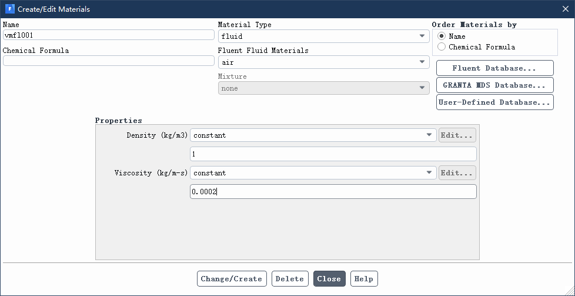

You can see that the imported periodic (id=10) and shadow_periodic (id=13) boundaries are not periodic boundaries, and you need to enter them in the command line window.`/mesh/modify-zones/make-periodic`Command, establish periodic boundaries.

```
> /mesh/modify-zones/make-periodic
Periodic zone [()] 10
Shadow zone [()] 13
Rotationally periodic? (if no, translationally) [yes] yes
Create periodic zones? [yes] yes
```

Change the innerwall (id=11) boundary to the rotating wall, and set it as follows.

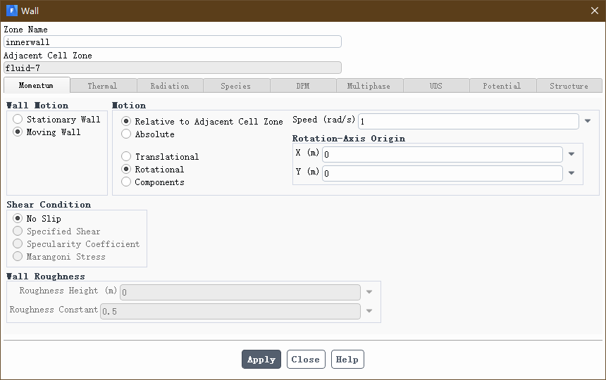

The solver selects SIMPLE as shown below.

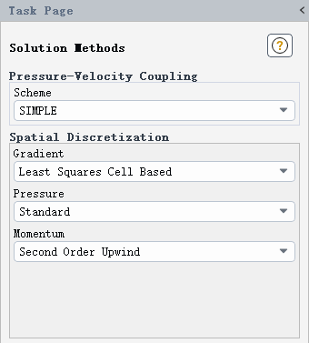

The convergence residual is changed to 1e-6 and initialized.


The number of iteration steps is 800, solve and save.

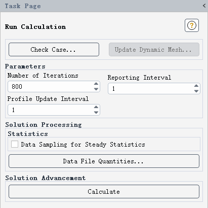

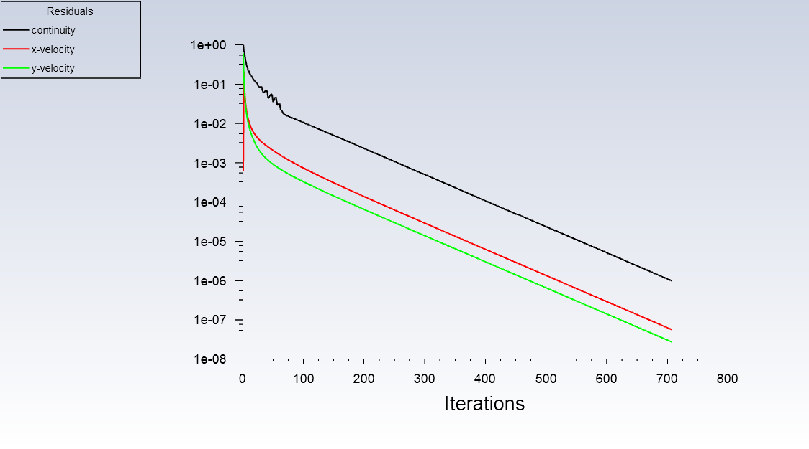

### 2.2 Post-processing

Establish 4 points at a radius of 20~35mm, and the coordinates are shown in the table below.

| Name | x (m) | y (m) |
| ------- | ----- | ----- |
| point-1 | 0.02 | 0 |
| point-2 | 0.025 | 0 |
| point-3 | 0.03 | 0 |
| point-4 | 0.035 | 0 |

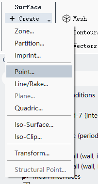

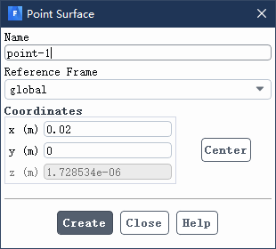

Outputs the tangential velocity of four points.

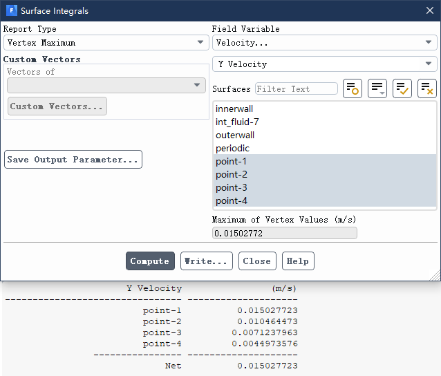

Create a new horizontal straight line and output the tangential velocity distribution curve under different radii.

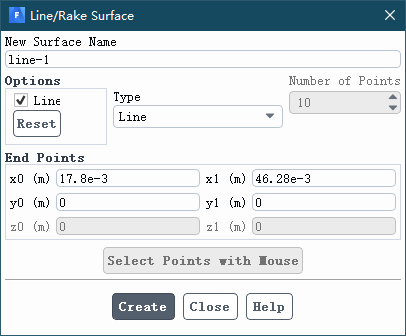

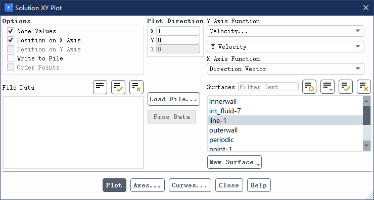


Output curve point data to the file for later use.

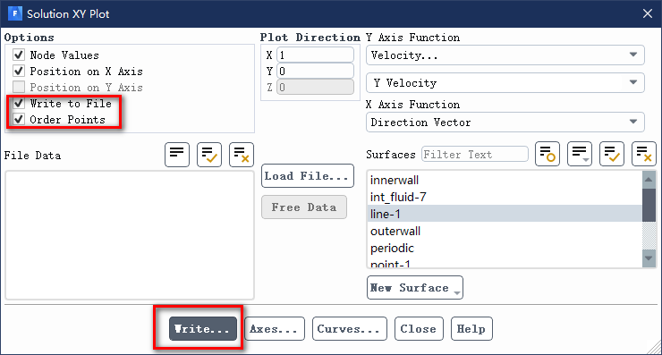

Comparison of the laminar flow equation and the error of Fluent calculation results.

| Radius [mm] | Tangential velocity (theoretical value) [m/s] | Tangential velocity (Fluent simulation result) [m/s] | Error [%] |
| ------- | --------------- | --------------------- | ------ |
| 20      | 0.0151          | 0.015027723           | 0.48   |
| 25      | 0.0105          | 0.010464473           | 0.34   |
| 30      | 0.0072          | 0.0071237963          | 1.06   |
| 35      | 0.0046          | 0.0044973576          | 2.23   |

## 3. CFX verification

### 3.1 Solver Settings

Start CFX-Pre, create a new study, and import the fluent grid file VMFL001_rot_conc_cyl_3D.msh.


New material, named "vmfl001". Density 1 [kg m^-3], dynamic viscosity 0.0002 [Pa s].


Create a new fluid domain (Domain), name it FLUID, and select FLUID in the mesh area (Location). Material Select the newly created vmfl001. Turn off the heat transfer equation, and select None(Laminar) for the turbulence equation.

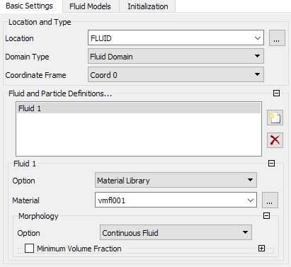

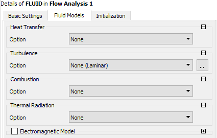

A new boundary is created in this fluid domain, and the corresponding grid boundary is shown in the following table.

| Fluid Boundaries | Grid Boundaries | Boundary Types |
| --------- | --------- | -------- |
| INNERWALL | INNERWALL | Wall |
| OUTERWALL | OUTERWALL | Wall |
| SYMM 1 | SYMM 1 | Symmetry |
| SYMM 2 | SYMM 2 | Symmetry |

Where INNERWALL is specified as the rotating wall, as shown in the figure below, the angular velocity is 1 [radian s^-1].


New interfaces (Interfaces) are named PERIODIC, as shown in the figure below.

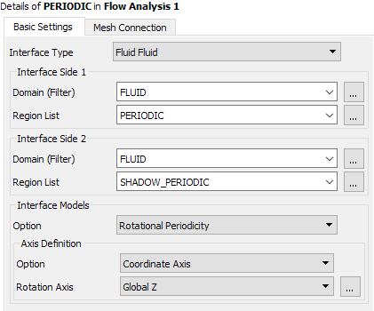

Create a new global initialization (Global Initialization), confirm directly, and use the default value.


Change Solver Control, change the maximum iteration steps to 1000, change the residual type to MAX, and change the convergence residual target to 1e-6.

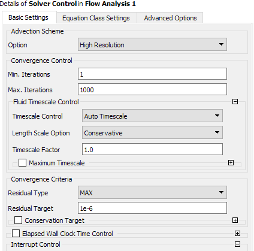

Save the study and output the .def file. Open CFS-Solver Manager to load the .def file, select double precision for solver type, and start solving.

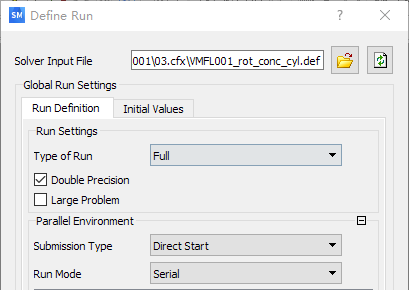

It was about 23 steps to converge.


### 3.2 Post-processing

Open CFD-Post and load the result file that was output after solving the solution. Create 4 points at a radius of 20~35mm, as shown in the following table.

| Name | x (m) | y (m) | z (m) |
| ------- | ----- | ----- | ----- |
| Point 1 | 0.02 | 0 | 0 |
| Point 2 | 0.025 | 0 | 0 |
| Point 3 | 0.03 | 0 | 0 |
| Point 4 | 0.035 | 0 | 0 |

Create the following 4 expressions (Expressions) and output the tangential velocity of 4 points.

| Expression name | Expression definition |
| ------------ | -------------------------- |
| VelYOnPoint1 | maxVal(Velocity v)@Point 1 |
| VelYOnPoint2 | maxVal(Velocity v)@Point 2 |
| VelYOnPoint3 | maxVal(Velocity v)@Point 3 |
| VelYOnPoint4 | maxVal(Velocity v)@Point 4 |

Create a new Table and list the radius and speed of the 4 points.


Create a straight line "Line 1", as shown in the figure below.

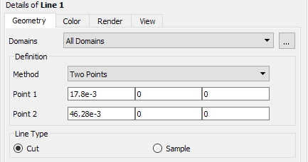

Create a chart (Chart), select the "Location" in "Data Series" and select the "Line 1" you just created, select "X" in "X Axis" and select "Variable" in "Y Axis" and select "Velocity v". The output curve is shown in the figure below. Export curve data to a .csv file for later use.


Comparison of laminar flow equation with the error of CFX calculation results.

| Radius [mm] | Tangential velocity (theoretical value) [m/s] | Tangential velocity (CFX simulation result) [m/s] | Error [%] |
| ------- | --------------- | ------------------ | ------ |
| 20      | 0.0151          | 0.0150925          | 0.05   |
| 25      | 0.0105          | 0.0105287          | 0.27   |
| 30      | 0.0072          | 0.00718282         | 0.24   |
| 35      | 0.0046          | 0.00454726         | 1.15   |

## 4. STAR-CCM+ Verification

### 4.1 Solver Settings

Turn on STAR-CCM+. Since the number of meshes is small, the process option can be selected for serialization, and only one processor core is used for solving. Import the fluent grid file VMFL001_rot_conc_cyl_2D.msh.

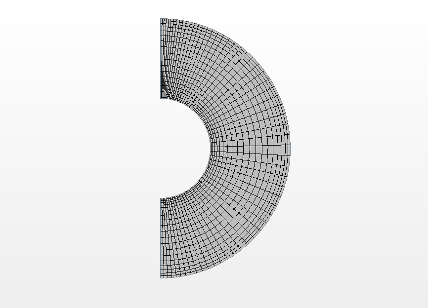

Select the solver physical model, as shown in the figure below.


The gas material "Air" was renamed to "vmfl001", the density was modified to 1.0 kg/m^3, and the dynamic viscosity was modified to 2.0E-4 Pa-s.

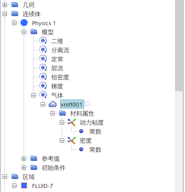

Expand "FLUID-7" in the fluid area, select the boundaries of "PERIODIC" and "SHADOW_PERIODIC" and right-click to create the interface. The newly created interface topology is changed to "period", the period conversion is selected as "rotate" and the rotation axis is specified as "specified axis", and the axis direction is "[0.0, 0.0, 1.0]".


Create a new rotational motion in "Tools" and "Movement", with rotation axis direction [0.0, 0.0, 1.0], and rotation rate of 1.0 radian/s.

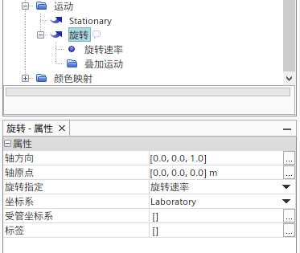

Change the reference coordinate system specification option for INNERWALL boundary to "Local reference coordinate system", and the boundary reference coordinate system specifies the coordinate system to select the newly created rotational motion.


The maximum number of iteration steps in the stop standard is 1000 by default, run the solution and save the study.


### 4.2 Post-processing

Create 4 new probe points in the derivative components, as shown in the table below.

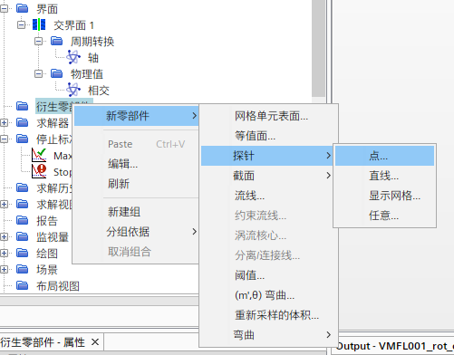

| Name | x (m) | y (m) | z (m) |
| --- | ----- | ----- | ----- |
| p1 | 0.02 | 0 | 0 |
| p2 | 0.025 | 0 | 0 |
| p3 | 0.03 | 0 | 0 |
| p4 | 0.035 | 0 | 0 |

Similarly, a new isosurface "y=0" is created in the derivative components, as shown in the figure below.


Create a new "XYZ internal table" in "Tools" and "Table", select "[Velocity[j]]" in the scalar, select the newly created four points of p1~p4 in the component, extract the email and then tabulate it, displaying the tangential velocity of the 4 points.


Create a new "XY drawing" in "Drawing", select the newly created isosurface "y=0" for the component, and select the field function in "Y type" and "Y Type 1". The curve diagram is as follows. Export curve data to a .csv file for later use.


Comparison of the laminar flow equation with the error of STAR-CCM+ calculation results.

| Radius [mm] | Tangential velocity (theoretical value) [m/s] | Tangential velocity (STAR-CCM+simulation result) [m/s] | Error [%] |
| ------- | --------------- | ------------------------ | ------ |
| 20      | 0.0151          | 0.0153266630659337       | 1.50   |
| 25      | 0.0105          | 0.0106689558311781       | 1.61   |
| 30      | 0.0072          | 0.00671828465572254      | 6.69   |
| 35      | 0.0046          | 0.004432094526565        | 3.65   |

## 5. OpenFOAM Verification

### 5.1 Solver Settings

First, copy the simpleCar from the official case to the current directory and rename it to vmfl001. Here, MSYS2 is used as the command line interactive interface and execute the following commands.

```bash
 cp -r $FOAM_TUTORIALS/incompressible/simpleFoam/simpleCar .
 mv simpleCar vmfl001
 cd vmfl001
```

Copy the VMFL001_rot_conc_cyl_2D.msh file into the vmfl001 folder and execute the following command to convert the fluent grid to an OpenFOAM grid.

```bash
fluentMeshToFoam VMFL001_rot_conc_cyl_2D.msh
```

Open the constant/polyMesh/boundary file, modify it as follows, change the boundaries of "PERIODIC" and "SHADOW_PERIODIC" from the wall to the periodic boundary.

```c++
FoamFile
{
    version     2.0;
    format      ascii;
    class       polyBoundaryMesh;
    location    "constant/polyMesh";
    object      boundary;
}
5
(
    PERIODIC
    {
        type            cyclicAMI;
        inGroups        1(wall);
        nFaces          20;
        startFace       2320;
        matchTolerance  0.0001;
        transform       rotational;
        rotationAxis    (0 0 1);
        rotationCentre  (0 0 0);
        neighbourPatch  SHADOW_PERIODIC;
    }
    INNERWALL
    {
        type            wall;
        inGroups        1(wall);
        nFaces          60;
        startFace       2340;
    }
    OUTERWALL
    {
        type            wall;
        inGroups        1(wall);
        nFaces          60;
        startFace       2400;
    }
    SHADOW_PERIODIC
    {
        type            cyclicAMI;
        inGroups        1(wall);
        nFaces          20;
        startFace       2460;
        matchTolerance  0.0001;
        transform       rotational;
        rotationAxis    (0 0 1);
        rotationCentre  (0 0 0);
        neighbourPatch  PERIODIC;
    }
    frontAndBackPlanes
    {
        type            empty;
        inGroups        1(empty);
        nFaces          2400;
        startFace       2480;
    }
)
```

Delete the "Allrun" file in the vmfl001 directory. Delete "epsilon", "k" and "nut" in the vmfl001/0 directory, and only "p" and "U" are retained.

Modify the "p" file as follows.

```c++
FoamFile
{
    version     2.0;
    format      ascii;
    class       volScalarField;
    object      p;
}
dimensions      [0 2 -2 0 0 0 0];
internalField   uniform 0;
boundaryField
{
    "(INNERWALL|OUTERWALL)"
    {
        type            zeroGradient;
    }
    frontAndBackPlanes
    {
        type            empty;
    }
    "(PERIODIC|SHADOW_PERIODIC)"
    {
        type            cyclicAMI;
        value           $internalField;
    }
}
```

Modify the "U" file as follows.

```c++
FoamFile
{
    version     2.0;
    format      ascii;
    class       volVectorField;
    object      U;
}
dimensions      [0 1 -1 0 0 0 0];
internalField   uniform (0 0 0);
boundaryField
{
    INNERWALL
    {
        type            rotatingWallVelocity;
        axis            (0 0 1);
        origin          (0 0 0);
        omega           constant 1.0;
        value           uniform (0 0 0);
    }
    OUTERWALL
    {
        type            noSlip;
    }
    frontAndBackPlanes
    {
        type            empty;
    }
    "(PERIODIC|SHADOW_PERIODIC)"
    {
        type            cyclicAMI;
        value           $internalField;
    }
}
```

Execute the following command to check the grid boundary condition settings.

```bash
checkMesh
```

Modify the "transportProperties" file in the constant directory and change the nu value to 0.0002.

```c++
FoamFile
{
    version     2.0;
    format      ascii;
    class       dictionary;
    location    "constant";
    object      transportProperties;
}
transportModel  Newtonian;
nu              0.0002;
```

Modify the "turbulenceProperties" file in the constant directory and adopt the laminar flow model.

```c++
FoamFile
{
    version     2.0;
    format      ascii;
    class       dictionary;
    object      turbulenceProperties;
}
simulationType laminar;
```

In the system directory, only the three files "controlDict", "fvSchemes" and "fvSolution" are retained, and all the others are deleted.

Modify the "controlDict" file as follows, solve the simpleFoam program, start the solution from the last step of saving, the iteration steps are 1,000, and the solution result is written every 100 steps.

```c++
FoamFile
{
    version     2.0;
    format      ascii;
    class       dictionary;
    location    "system";
    object      controlDict;
}
application     simpleFoam;
startFrom       latestTime;
startTime       0;
stopAt          endTime;
endTime         1000;
deltaT          1;
writeControl    timeStep;
writeInterval   100;
purgeWrite      1;
writeFormat     ascii;
writePrecision  8;
writeCompression off;
timeFormat      general;
timePrecision   8;
runTimeModifiable true;
```

Modify the "fvSolution" file as follows.

```c++
FoamFile
{
    version     2.0;
    format      ascii;
    class       dictionary;
    location    "system";
    object      fvSolution;
}
solvers
{
    p
    {
        solver          GAMG;
        smoother        GaussSeidel;
        tolerance       1e-08;
        relTol          0.01;
    }
    U
    {
        solver          smoothSolver;
        smoother        symGaussSeidel;
        tolerance       1e-08;
        relTol          0.01;
    }
}
SIMPLE
{
    nNonOrthogonalCorrectors 0;
    residualControl
    {
        p               1e-8;
        U               1e-8;
    }
    pRefCell 0;
    pRefValue 0;
}
relaxationFactors
{
    fields
    {
        p               0.3;
    }
    equations
    {
        U               0.7;
    }
}
```

Return to the vmfl001 directory, execute the following command (if the tee command is used in Windows, it can be executed in Powershell), run the solution and record the output of the solution process.

```bash
simpleFoam | tee simpleFoam.log
```

### 5.2 Post-processing

It can be used directly under Linux`paraFoam`Start ParaView for post-processing. Run the following command in Windows to generate a .foam file in the vmfl001 directory, and use ParaView to open the .foam file to load the solution result of OpenFOAM.

```bash
echo . > vmfl001.foam
```


Based on vmfl001.foam, 4 new "Probe Locations" are created to extract the tangential speed at 20~35mm.


| Name | Center | Radius |
| -------------- | ----------- | ------ |
| ProbeLocation1 | (0.020,0,0) | 0 |
| ProbeLocation2 | (0.025,0,0) | 0 |
| ProbeLocation3 | (0.030,0,0) | 0 |
| ProbeLocation4 | (0.035,0,0) | 0 |

Create a new GroupDatasets, including the above 4 ProbeLocations.


Select the GroupDatasets to see the tangential velocity values ​​of the 4 point positions in the "SpreadSheetView" window on the right.


Based on vmfl001.foam, create a "PlotOnIntersectionCurves" drawing.


Select the Y-axis forward direction in the plane direction, as shown in the figure.


Select "Points_X" for the X-axis display variable, and select "U_Y" for the Y-axis display variable, as shown in the figure.

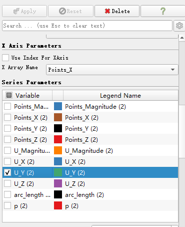

The resulting curve can be viewed in the "LineChartView" window on the right.

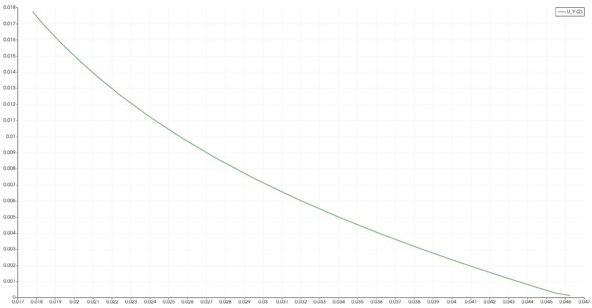

Select "File" and "Export Scene" to export curve data to the csv file.

Comparison of the laminar flow equation and the error of OpenFOAM calculation results.

| Radius [mm] | Tangential velocity (theoretical value) [m/s] | Tangential velocity (OpenFOAM simulation result) [m/s] | Error [%] |
| ------- | --------------- | ----------------------- | ------ |
| 20      | 0.0151          | 0.0150                  | 0.66   |
| 25      | 0.0105          | 0.0104366               | 0.60   |
| 30      | 0.0072          | 0.00712633              | 1.02   |
| 35      | 0.0046          | 0.00452779              | 1.57   |

## 6. SU2 Verification

### 6.1 Solver Settings

The content of the SU2 solver configuration file vmfl001.cfg is as follows:

```ini
% ------------- DIRECT, ADJOINT, AND LINEARIZED PROBLEM DEFINITION ------------%
%
% Physical governing equations (EULER, NAVIER_STOKES,
%                               WAVE_EQUATION, HEAT_EQUATION, FEM_ELASTICITY,
%                               POISSON_EQUATION)
SOLVER= INC_NAVIER_STOKES
%
% Specify turbulence model (NONE, SA)
KIND_TURB_MODEL= NONE
%
% Mathematical problem (DIRECT, CONTINUOUS_ADJOINT)
MATH_PROBLEM= DIRECT
%
% Restart solution (NO, YES)
RESTART_SOL= NO

% ---------------- INCOMPRESSIBLE FLOW CONDITION DEFINITION -------------------%
%
% Density model within the incompressible flow solver.
% Options are CONSTANT (default), BOUSSINESQ, or VARIABLE. If VARIABLE,
% an appropriate fluid model must be selected.
INC_DENSITY_MODEL= CONSTANT
%
% Solve the energy equation in the incompressible flow solver
INC_ENERGY_EQUATION = YES
%
% Initial density for incompressible flows (1.2886 kg/m^3 by default)
INC_DENSITY_INIT= 1.0
%
% Initial temperature for incompressible flows that include the
% energy equation (288.15 K by default). Value is ignored if
% INC_ENERGY_EQUATION is false.
INC_TEMPERATURE_INIT= 293.15
%
% Initial velocity for incompressible flows (1.0,0,0 m/s by default)
INC_VELOCITY_INIT= ( 1.0, 0.0, 0.0 )
%

% ---- IDEAL GAS, POLYTROPIC, VAN DER WAALS AND PENG ROBINSON CONSTANTS -------%
%
% Fluid model (STANDARD_AIR, IDEAL_GAS, VW_GAS, PR_GAS, 
%              CONSTANT_DENSITY, INC_IDEAL_GAS)
FLUID_MODEL= CONSTANT_DENSITY
%
% Specific heat at constant pressure, Cp (1004.703 J/kg*K (air)).
% Incompressible fluids with energy eqn. only (CONSTANT_DENSITY, INC_IDEAL_GAS).
SPECIFIC_HEAT_CP= 1004.703

% --------------------------- VISCOSITY MODEL ---------------------------------%
%
% Viscosity model (SUTHERLAND, CONSTANT_VISCOSITY).
VISCOSITY_MODEL= CONSTANT_VISCOSITY
%
% Molecular Viscosity that would be constant (1.716E-5 by default)
MU_CONSTANT= 0.0002

% --------------------------- THERMAL CONDUCTIVITY MODEL ----------------------%
%
% Conductivity model (CONSTANT_CONDUCTIVITY, CONSTANT_PRANDTL).
CONDUCTIVITY_MODEL= CONSTANT_PRANDTL
%
% Laminar Prandtl number (0.72 (air), only for CONSTANT_PRANDTL)
PRANDTL_LAM= 0.72
%
% Turbulent Prandtl number (0.9 (air), only for CONSTANT_PRANDTL)
PRANDTL_TURB= 0.90

% ---------------------- REFERENCE VALUE DEFINITION ---------------------------%
%
% Reference origin for moment computation
REF_ORIGIN_MOMENT_X = 0.25
REF_ORIGIN_MOMENT_Y = 0.00
REF_ORIGIN_MOMENT_Z = 0.00
%
% Reference length for pitching, rolling, and yawing non-dimensional moment
REF_LENGTH= 1.0
%
% Reference area for force coefficients (0 implies automatic calculation)
REF_AREA= 1.0

% ----------------------- DYNAMIC MESH DEFINITION -----------------------------%
%
% Type of dynamic surface movement (NONE, DEFORMING,
%                       MOVING_WALL, FLUID_STRUCTURE, FLUID_STRUCTURE_STATIC,
%                       AEROELASTIC, EXTERNAL, EXTERNAL_ROTATION,
%                       AEROELASTIC_RIGID_MOTION)
SURFACE_MOVEMENT= MOVING_WALL
%
% Moving wall boundary marker(s) (NONE = no marker, ignored for RIGID_MOTION)
MARKER_MOVING= ( INNERWALL )
%
% Coordinates of the motion origin
SURFACE_MOTION_ORIGIN= 0.0 0.0 0.0
%
% Angular velocity vector (rad/s) about the motion origin
SURFACE_ROTATION_RATE = 0.0 0.0 1.0
%

% -------------------- BOUNDARY CONDITION DEFINITION --------------------------%
%
% Navier-Stokes (no-slip), constant heat flux wall  marker(s) (NONE = no marker)
% Format: ( marker name, constant heat flux (J/m^2), ... )
MARKER_HEATFLUX= ( OUTERWALL, 0.0 )
%
% Navier-Stokes (no-slip), isothermal wall marker(s) (NONE = no marker)
% Format: ( marker name, constant wall temperature (K), ... )
MARKER_ISOTHERMAL= ( INNERWALL, 313.15 )
%
% Periodic boundary marker(s) (NONE = no marker)
% Format: ( periodic marker, donor marker, rotation_center_x, rotation_center_y,
% rotation_center_z, rotation_angle_x-axis, rotation_angle_y-axis,
% rotation_angle_z-axis, translation_x, translation_y, translation_z, ... )
% MARKER_PERIODIC= ( PERIODIC, SHADOW_PERIODIC, 0, 0, 0, 0, 0, 180, 0, 0, 0 )

%
% Marker(s) of the surface to be plotted or designed
MARKER_PLOTTING= ( INNERWALL, OUTERWALL )
%
% Marker(s) of the surface where the functional (Cd, Cl, etc.) will be evaluated
MARKER_MONITORING= ( NONE )

% ------------- COMMON PARAMETERS DEFINING THE NUMERICAL METHOD ---------------%
%
% Numerical method for spatial gradients (GREEN_GAUSS, WEIGHTED_LEAST_SQUARES)
NUM_METHOD_GRAD= WEIGHTED_LEAST_SQUARES
%
% Courant-Friedrichs-Lewy condition of the finest grid
CFL_NUMBER= 15.0
%
% Adaptive CFL number (NO, YES)
CFL_ADAPT= YES
%
% Parameters of the adaptive CFL number (factor down, factor up, CFL min value,
%                                        CFL max value )
CFL_ADAPT_PARAM= ( 0.1, 2.0, 1.0, 1e10 )
%
% Number of total iterations
ITER= 10000

% ------------------------ LINEAR SOLVER DEFINITION ---------------------------%
%
% Linear solver for the implicit (or discrete adjoint) formulation (BCGSTAB, FGMRES)
LINEAR_SOLVER= FGMRES
%
% Preconditioner of the Krylov linear solver (JACOBI, LINELET, LU_SGS)
LINEAR_SOLVER_PREC= ILU
%
% Linael solver ILU preconditioner fill-in level (0 by default)
LINEAR_SOLVER_ILU_FILL_IN= 0
%
% Min error of the linear solver for the implicit formulation
LINEAR_SOLVER_ERROR= 1E-14
%
% Max number of iterations of the linear solver for the implicit formulation
LINEAR_SOLVER_ITER= 25

% -------------------------- MULTIGRID PARAMETERS -----------------------------%
%
% Multi-Grid Levels (0 = no multi-grid)
MGLEVEL= 0
%
% Multi-grid cycle (V_CYCLE, W_CYCLE, FULLMG_CYCLE)
MGCYCLE= W_CYCLE
%
% Multi-grid pre-smoothing level
MG_PRE_SMOOTH= ( 1, 2, 3, 3 )
%
% Multi-grid post-smoothing level
MG_POST_SMOOTH= ( 0, 0, 0, 0 )
%
% Jacobi implicit smoothing of the correction
MG_CORRECTION_SMOOTH= ( 0, 0, 0, 0 )
%
% Damping factor for the residual restriction
MG_DAMP_RESTRICTION= 0.8
%
% Damping factor for the correction prolongation
MG_DAMP_PROLONGATION= 0.8

% -------------------- FLOW NUMERICAL METHOD DEFINITION -----------------------%
%
% Convective numerical method (JST, LAX-FRIEDRICH, CUSP, ROE, AUSM, HLLC,
%                              TURKEL_PREC, MSW)
CONV_NUM_METHOD_FLOW= FDS
%
% Monotonic Upwind Scheme for Conservation Laws (TVD) in the flow equations.
%           Required for 2nd order upwind schemes (NO, YES)
MUSCL_FLOW= YES
%
% Slope limiter (NONE, VENKATAKRISHNAN, VENKATAKRISHNAN_WANG,
%                BARTH_JESPERSEN, VAN_ALBADA_EDGE)
SLOPE_LIMITER_FLOW= NONE
%
% Coefficient for the Venkat's limiter (upwind scheme). A larger values decrease
%             the extent of limiting, values approaching zero cause
%             lower-order approximation to the solution (0.05 by default)
VENKAT_LIMITER_COEFF= 0.05
%
% Time discretization (RUNGE-KUTTA_EXPLICIT, EULER_IMPLICIT, EULER_EXPLICIT)
TIME_DISCRE_FLOW= EULER_IMPLICIT

% --------------------------- CONVERGENCE PARAMETERS --------------------------%
%
% Convergence criteria (CAUCHY, RESIDUAL)
CONV_CRITERIA= RESIDUAL
%
% Min value of the residual (log10 of the residual)
CONV_RESIDUAL_MINVAL= -14
%
% Start convergence criteria at iteration number
CONV_STARTITER= 10
%
% Number of elements to apply the criteria
CONV_CAUCHY_ELEMS= 100
%
% Epsilon to control the series convergence
CONV_CAUCHY_EPS= 1E-14

% ------------------------- INPUT/OUTPUT INFORMATION --------------------------%
%
% Mesh input file
MESH_FILENAME= VMFL001_rot_conc_cyl_2D.cgns
%
% Mesh input file format (SU2, CGNS, NETCDF_ASCII)
MESH_FORMAT= CGNS
%
% Mesh output file
MESH_OUT_FILENAME= mesh_out.cgns
%
% Restart flow input file
SOLUTION_FILENAME= solution_flow.dat
%
% Restart adjoint input file
SOLUTION_ADJ_FILENAME= solution_adj.dat
%
% Output file format (PARAVIEW, TECPLOT, STL)
TABULAR_FORMAT= CSV
%
% Output file convergence history (w/o extension) 
CONV_FILENAME= history
%
% Output file restart flow
RESTART_FILENAME= restart_flow.dat
%
% Output file restart adjoint
RESTART_ADJ_FILENAME= restart_adj.dat
%
% Output file flow (w/o extension) variables
VOLUME_FILENAME= flow
%
% Output file adjoint (w/o extension) variables
VOLUME_ADJ_FILENAME= adjoint
%
% Output objective function gradient (using continuous adjoint)
GRAD_OBJFUNC_FILENAME= of_grad.dat
%
% Output file surface flow coefficient (w/o extension)
SURFACE_FILENAME= surface_flow
%
% Output file surface adjoint coefficient (w/o extension)
SURFACE_ADJ_FILENAME= surface_adjoint
%
% Writing solution file frequency
OUTPUT_WRT_FREQ= 250
%
% Writing convergence history frequency
SCREEN_WRT_FREQ_INNER= 1
%
% Screen output
SCREEN_OUTPUT= (INNER_ITER, WALL_TIME,  RMS_PRESSURE, RMS_VELOCITY-X, RMS_VELOCITY-Y)
```

Make sure vmfl001.cfg and grid file VMFL001_rot_conc_cyl_2D.cgns are in the same directory, execute the following command (if the tee command is used in Windows, it can be executed in Powershell), run the solution and record the output of the solution process.

```bash
SU2_CFD vmfl001.cfg | tee vmfl001.log
```

### 6.2 Post-processing

Use ParaView to open the flow.vtu file that solves the output, and the processing process is the same as 5.2.

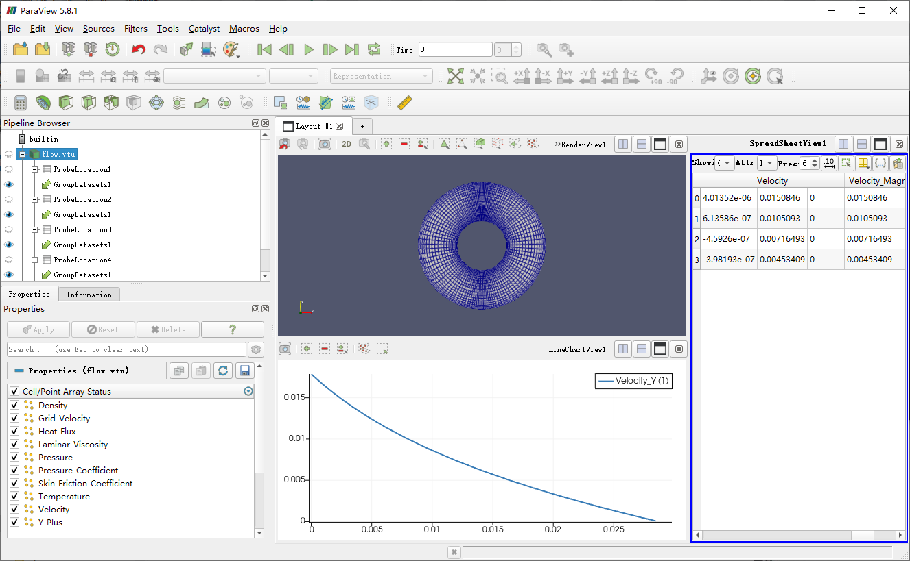

Comparison of the laminar flow equation with the error of SU2 calculation results.

| Radius [mm] | Tangential velocity (theoretical value) [m/s] | Tangential velocity (SU2 simulation result) [m/s] | Error [%] |
| --------- | ------------------------ | ---------------------------- | -------- |
| 20        | 0.0151                   | 0.0150846                    | 0.10     |
| 25        | 0.0105                   | 0.0105093                    | 0.09     |
| 30        | 0.0072                   | 0.00716493                   | 0.49     |
| 35        | 0.0046                   | 0.00453409                   | 1.43     |

## 7. Summary

In terms of horizontal comparison, CFX has the highest resolution accuracy; followed by SU2; then Fluent; OpenFOAM accuracy is almost the same as Fluent, but the solution speed is faster; STAR-CCM+ accuracy is the worst.

| Radius [mm] | Fluent solution error [%] | CFX solution error [%] | STAR-CCM+ solution error [%] | OpenFOAM solution error [%] | SU2 solution error [%] |
| --------- | ------------------ | --------------- | --------------------- | -------------------- | --------------- |
| 20        | 0.48               | 0.05            | 1.50                  | 0.66                 | 0.10            |
| 25        | 0.34               | 0.27            | 1.61                  | 0.60                 | 0.09            |
| 30        | 1.06               | 0.24            | 6.69                  | 1.02                 | 0.49            |
| 35        | 2.23               | 1.15            | 3.65                  | 1.57                 | 1.43            |


