+++
author = "Andrew Moa"
title = "求解器验证对比——旋转和静止同心圆柱之间的层流"
date = "2021-08-14"
description = ""
tags = [
    "cfd",
    "cfx",
    "fluent",
    "openfoam",
    "star-ccm+",
    "su2",
]
categories = [
    "zhihu",
]
series = [""]
aliases = [""]
image = "/images/post-bg-tech.jpg"
+++

本文采用不同CFD求解器，对层流流动问题进行验证。通过列举不同求解器的操作过程和输出结果的差异，验证各个求解器的精度。

---

## 1. 问题描述

如下图，建立两个同心圆柱间的定常层流模型。流动由内筒以恒定角速度旋转而引起，而外筒保持静止。使用周期性边界，只需要对流域的一部分进行建模。物理模型和输入数据如下表所示。

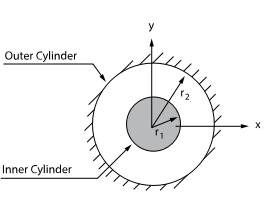

| 来源   | Ansys验证算例                                                                                       |
| ---- | ----------------------------------------------------------------------------------------------- |
| 参考文献 | F. M. White. Viscous Fluid Flow. Section 3-2.3. McGraw-Hill Book Co., Inc.. New York, NY. 1991. |
| 物理模型 | 层流，旋转壁面                                                                                         |

流体物性参数、几何尺寸和边界条件如下表所示。

| 特征    | 单位     | 参数     |
|:----- | ------ | ------ |
| 流体密度  | kg/m^3 | 1.0    |
| 流体粘度  | kg/m-s | 0.0002 |
| 内圆柱半径 | mm     | 17.8   |
| 外圆柱半径 | mm     | 46.28  |
| 内圆柱转速 | rad/s  | 1.0    |

本文所用求解器和输入模型如下。

| 求解器                                   | 输入模型                     |
| ---------------------------------------- | ---------------------------- |
| Ansys Fluent 2020R2                      | VMFL001_rot_conc_cyl_2D.msh  |
| Ansys CFX 2020R2                         | VMFL001_rot_conc_cyl_3D.msh  |
| Siemens STAR-CCM+ 2020.2.1(15.04.010-R8) | VMFL001_rot_conc_cyl_2D.msh  |
| OpenFOAM v2006                           | VMFL001_rot_conc_cyl_2D.msh  |
| SU2 v7.1.1                               | VMFL001_rot_conc_cyl_2D.cgns |

## 2. Fluent验证

### 2.1 求解器设置

打开Fluent，选择2D求解器。网格数量较少，只用1个处理器核心运行。

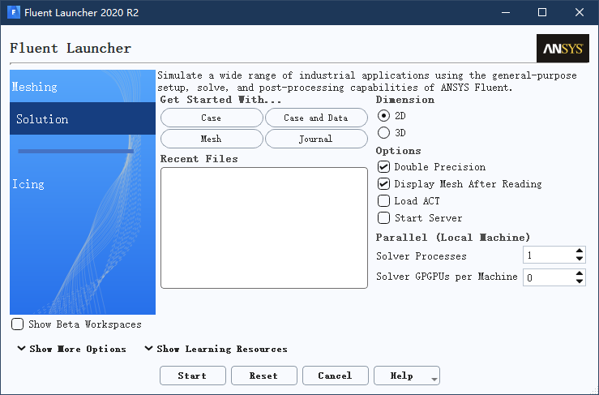

导入网格模型VMFL001_rot_conc_cyl_2D.msh，如下所示。

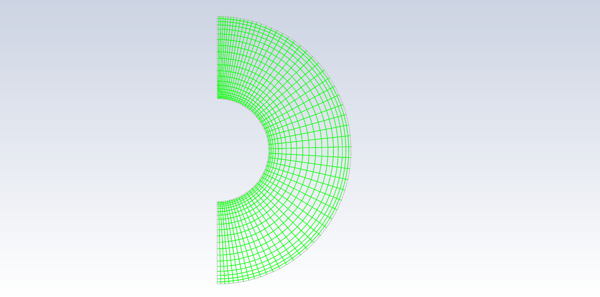

更改物理模型，选择层流。

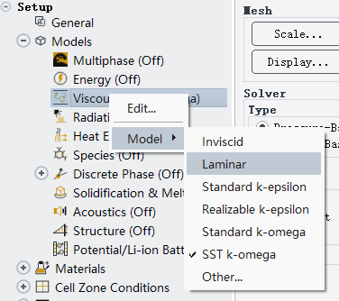

更改流体参数。将"air"重命名为"vmfl001"，密度1kg/m3，粘度0.0002kg/m-s。

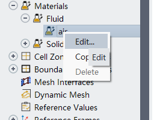

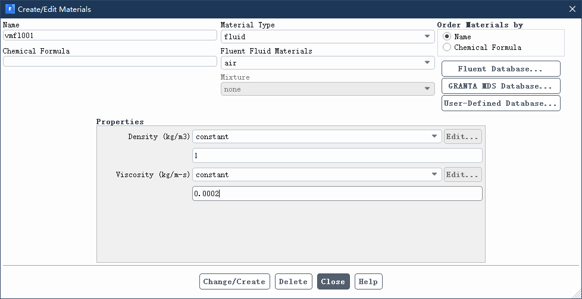

可以看到导入的periodic（id=10）和shadow_periodic（id=13）边界不是周期边界，需要在命令行窗口中输入`/mesh/modify-zones/make-periodic`命令，建立周期边界。

```
> /mesh/modify-zones/make-periodic
Periodic zone [()] 10
Shadow zone [()] 13
Rotationally periodic? (if no, translationally) [yes] yes
Create periodic zones? [yes] yes
```

更改innerwall（id=11）边界为旋转壁面，设置如下。

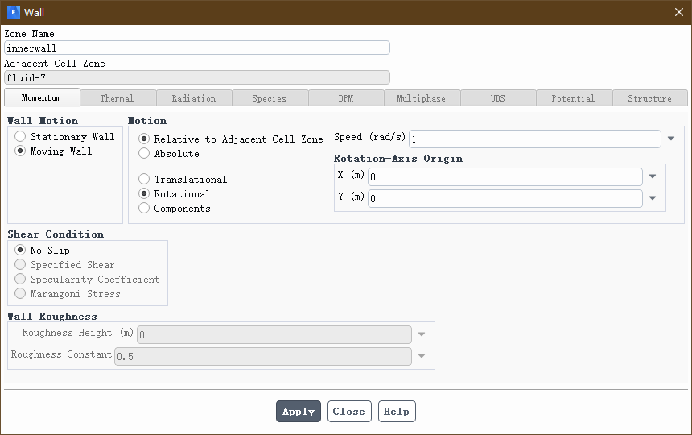

求解器选择SIMPLE，如下所示。

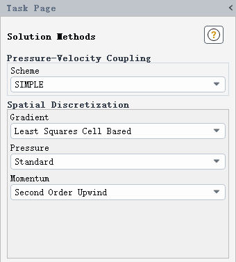

收敛残差更改为1e-6，初始化。

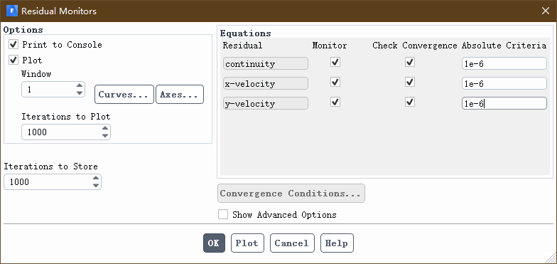

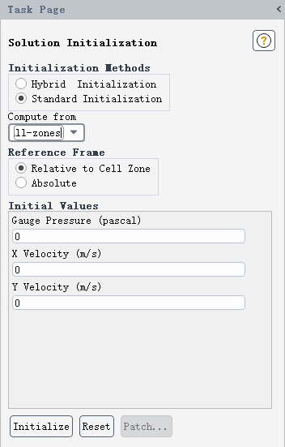

迭代步数800，求解并保存。

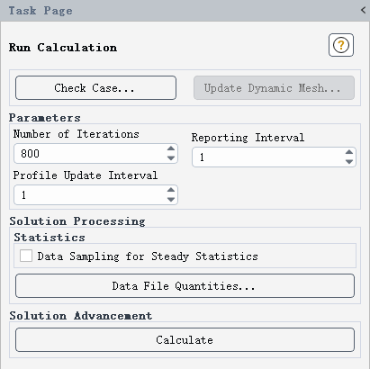

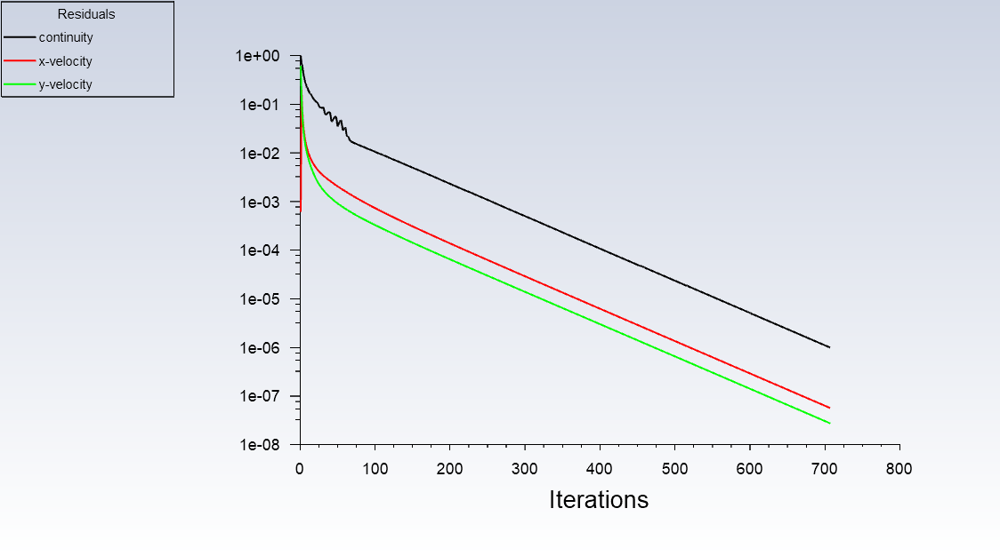

### 2.2 后处理

在半径20~35mm处建立4个点，坐标如下表所示。

| 名称      | x (m) | y (m) |
| ------- | ----- | ----- |
| point-1 | 0.02  | 0     |
| point-2 | 0.025 | 0     |
| point-3 | 0.03  | 0     |
| point-4 | 0.035 | 0     |

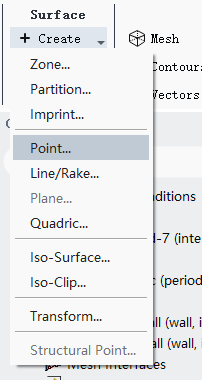

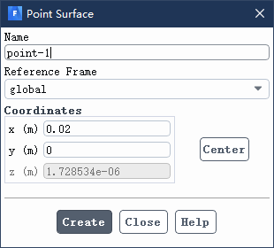

输出四个点的切向速度。

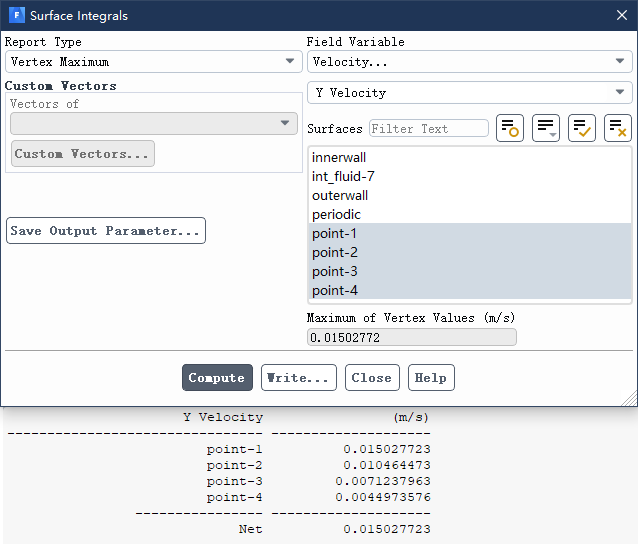

新建一条水平方向的直线，输出不同半径下的切向速度分布曲线。

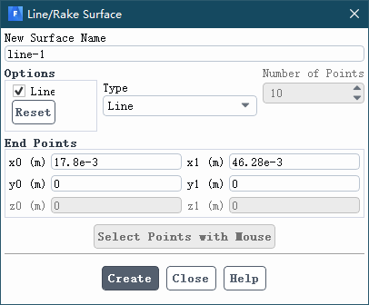

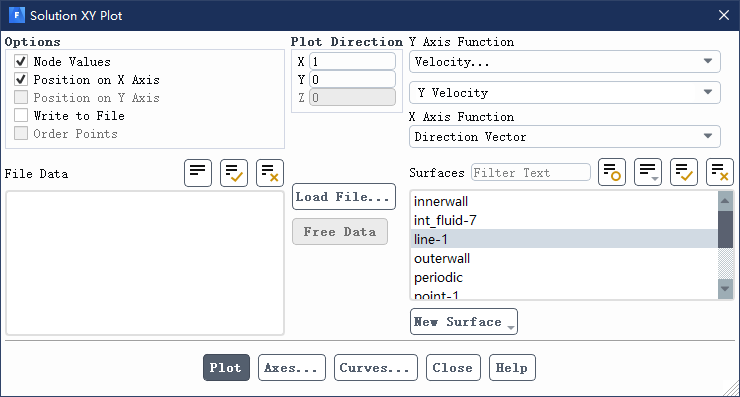

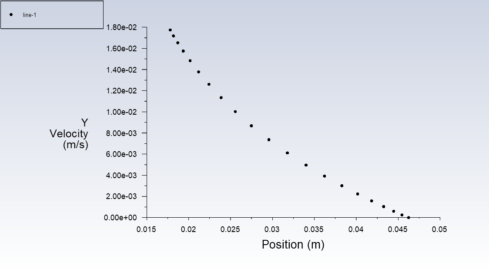

将曲线点数据输出到文件中备用。

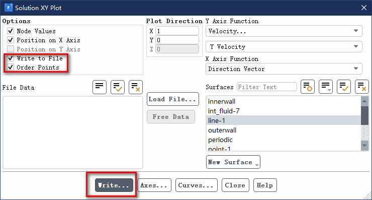

层流方程与Fluent计算结果误差对比。

| 半径 [mm] | 切向速度（理论值） [m/s] | 切向速度（Fluent仿真结果）[m/s] | 误差 [%] |
| ------- | --------------- | --------------------- | ------ |
| 20      | 0.0151          | 0.015027723           | 0.48   |
| 25      | 0.0105          | 0.010464473           | 0.34   |
| 30      | 0.0072          | 0.0071237963          | 1.06   |
| 35      | 0.0046          | 0.0044973576          | 2.23   |

## 3. CFX验证

### 3.1 求解器设置

启动CFX-Pre，新建算例，导入fluent网格文件VMFL001_rot_conc_cyl_3D.msh。

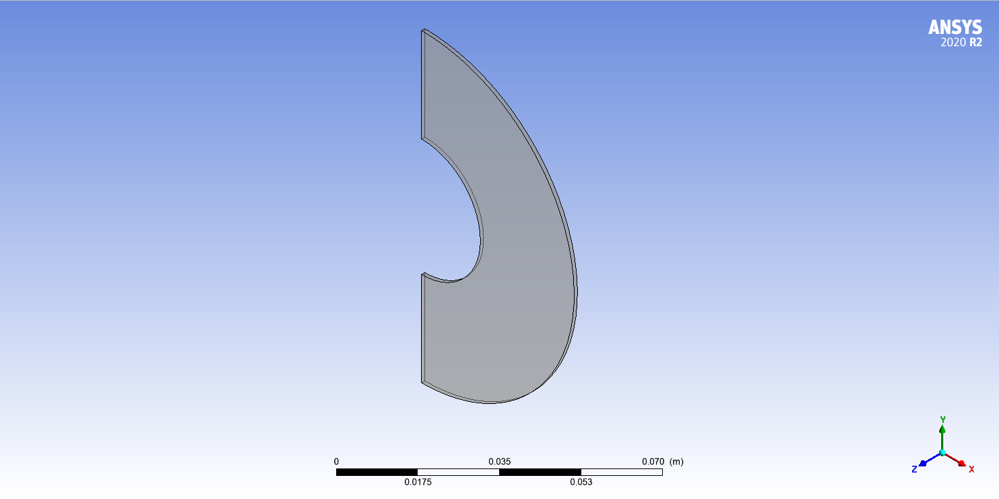

新建材料，命名为"vmfl001"。密度1 [kg m^-3]，动力粘度0.0002 [Pa s]。

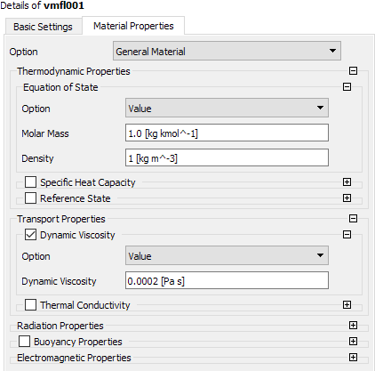

新建流体域（Domain），命名为FLUID，网格区域（Location）选择FLUID。材料选择刚刚新建的vmfl001。关闭传换热方程，湍流方程选择None(Laminar)。

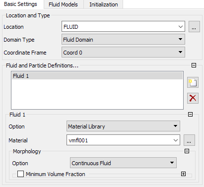

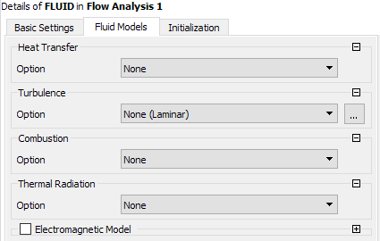

在此流体域中新建边界，所对应的网格边界如下表所示。

| 流体边界      | 网格边界      | 边界类型     |
| --------- | --------- | -------- |
| INNERWALL | INNERWALL | Wall     |
| OUTERWALL | OUTERWALL | Wall     |
| SYMM 1    | SYMM 1    | Symmetry |
| SYMM 2    | SYMM 2    | Symmetry |

其中，INNERWALL指定为旋转壁面，如下图所示，角速度 1 [radian s^-1]。

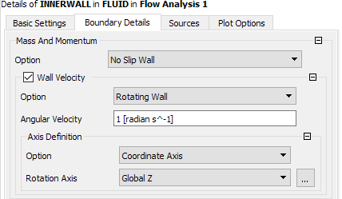

新建交界面（Interfaces），命名为PERIODIC，如下图所示。

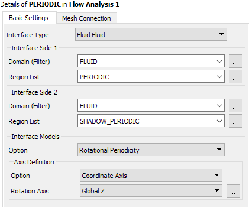

新建全局初始化（Global Initialization），直接确认，采用默认值即可。

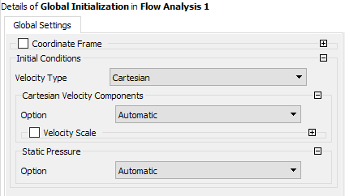

更改求解器控制（Solver Control），最大迭代步数改为1000，残差类型改为MAX，收敛残差目标改为1e-6。

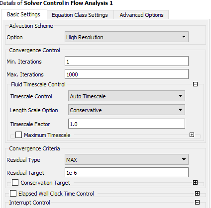

保存算例，输出.def文件。打开CFS-Solver Manager载入.def文件，求解器类型选择双精度，开始求解。

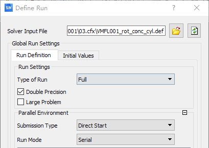

大概23步左右就收敛了。

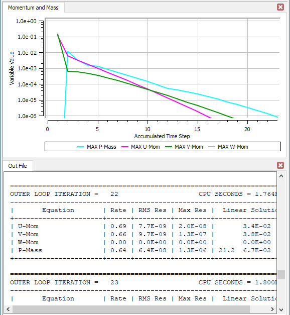

### 3.2 后处理

打开CFD-Post，载入求解完毕输出的结果文件。在半径20~35mm处建立4个点，如下表。

| 名称      | x (m) | y (m) | z (m) |
| ------- | ----- | ----- | ----- |
| Point 1 | 0.02  | 0     | 0     |
| Point 2 | 0.025 | 0     | 0     |
| Point 3 | 0.03  | 0     | 0     |
| Point 4 | 0.035 | 0     | 0     |

建立如下4个表达式（Expressions），输出4个点的切向速度。

| 表达式名称        | 表达式定义                      |
| ------------ | -------------------------- |
| VelYOnPoint1 | maxVal(Velocity v)@Point 1 |
| VelYOnPoint2 | maxVal(Velocity v)@Point 2 |
| VelYOnPoint3 | maxVal(Velocity v)@Point 3 |
| VelYOnPoint4 | maxVal(Velocity v)@Point 4 |

新建Table，将4个点的半径和速度列出。

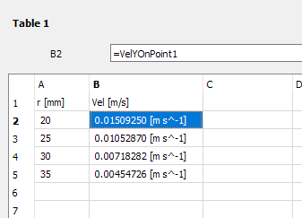

建立直线"Line 1"，如下图所示。

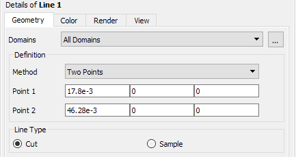

建立曲线图（Chart），“Data Series"中的"Location"选择刚刚建立的"Line 1"，”X Axis"中的“Variable"选择"X"，”Y Axis"中的“Variable"选择"Velocity v"，输出曲线如下图所示。将曲线数据导出到.csv文件中备用。

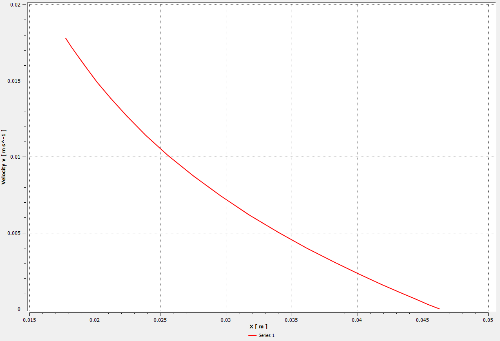

层流方程与CFX计算结果误差对比。

| 半径 [mm] | 切向速度（理论值） [m/s] | 切向速度（CFX仿真结果）[m/s] | 误差 [%] |
| ------- | --------------- | ------------------ | ------ |
| 20      | 0.0151          | 0.0150925          | 0.05   |
| 25      | 0.0105          | 0.0105287          | 0.27   |
| 30      | 0.0072          | 0.00718282         | 0.24   |
| 35      | 0.0046          | 0.00454726         | 1.15   |

## 4. STAR-CCM+验证

### 4.1 求解器设置

打开STAR-CCM+，由于网格数较少，进程选项可以选择串行，只用1个处理器核心进行求解。导入fluent网格文件VMFL001_rot_conc_cyl_2D.msh。

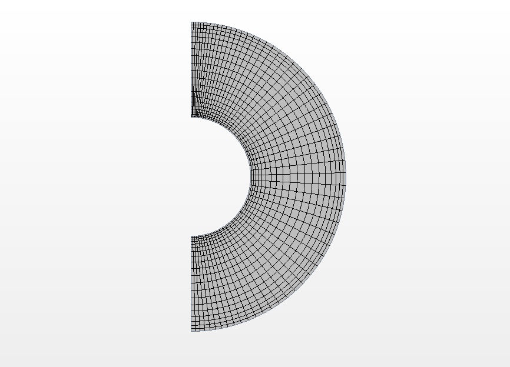

选择求解器物理模型，如下图所示。

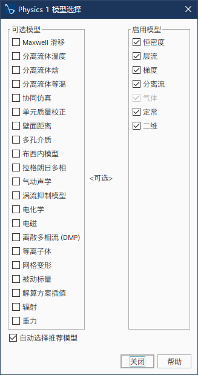

将气体材料"Air"重命名为"vmfl001"，密度修改为1.0 kg/m^3，动力粘度修改为2.0E-4 Pa-s。

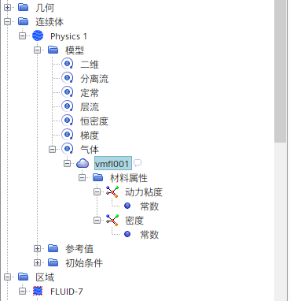

展开流体区域中的"FLUID-7"，同时选中"PERIODIC"和"SHADOW_PERIODIC"边界，右键创建界面。新建的交界面拓扑改为"周期"，周期转换选择"旋转"，旋转轴指定改为"指定轴"，轴的方向为"[0.0, 0.0, 1.0]"。

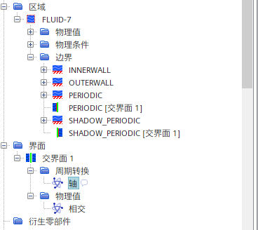

在"工具"、"运动"中新建旋转运动，旋转轴方向[0.0, 0.0, 1.0]，旋转速率1.0 radian/s。

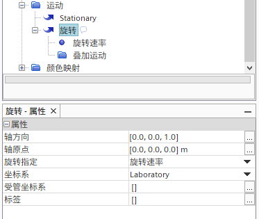

将INNERWALL边界的参考坐标系指定选项更改为"局部参考坐标系"，边界参考坐标系指定选择刚刚新建的旋转运动的坐标系。

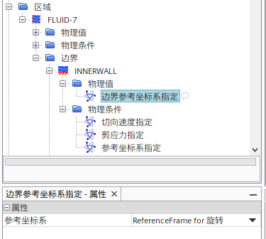

停止标准中的最大迭代步数默认为1000，运行求解并保存算例。

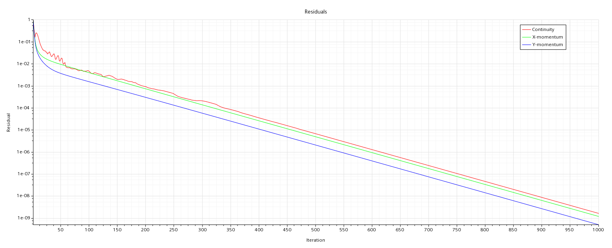

### 4.2 后处理

在衍生零部件中新建4个探针点，如下表。

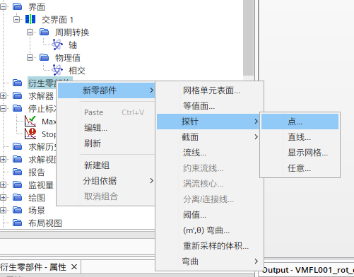

| 名称  | x (m) | y (m) | z (m) |
| --- | ----- | ----- | ----- |
| p1  | 0.02  | 0     | 0     |
| p2  | 0.025 | 0     | 0     |
| p3  | 0.03  | 0     | 0     |
| p4  | 0.035 | 0     | 0     |

同样地，在衍生零部件中新建等值面"y=0"，如下图。

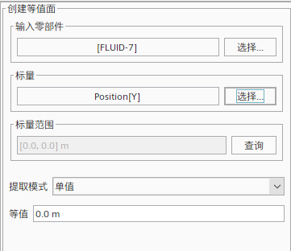

在"工具"、"表"中新建"XYZ内部表"，标量选择"[Velocity[j]]"，零部件选择新建的p1~p4四个点，邮件提取然后制表，显示4个点的切向速度。

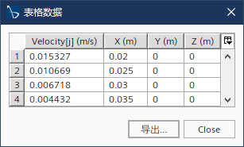

在"绘图"中新建"XY绘图"，零部件选择新建的等值面"y=0"，"Y类型"、"Y Type 1"中的场函数选择"[Velocity[j]]"，曲线图如下。将曲线数据导出到.csv文件中备用。

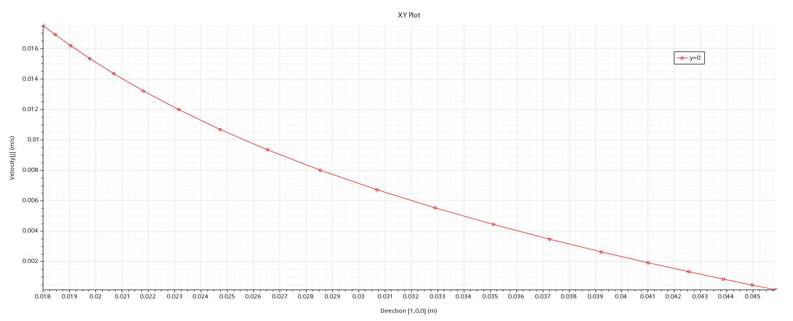

层流方程与STAR-CCM+计算结果误差对比。

| 半径 [mm] | 切向速度（理论值） [m/s] | 切向速度（STAR-CCM+仿真结果）[m/s] | 误差 [%] |
| ------- | --------------- | ------------------------ | ------ |
| 20      | 0.0151          | 0.0153266630659337       | 1.50   |
| 25      | 0.0105          | 0.0106689558311781       | 1.61   |
| 30      | 0.0072          | 0.00671828465572254      | 6.69   |
| 35      | 0.0046          | 0.004432094526565        | 3.65   |

## 5. OpenFOAM验证

### 5.1 求解器设置

首先将官方自带案例中的simpleCar复制到当前目录下并重命名为vmfl001，这里用的是MSYS2作为命令行交互界面，执行以下命令。

```bash
 cp -r $FOAM_TUTORIALS/incompressible/simpleFoam/simpleCar .
 mv simpleCar vmfl001
 cd vmfl001
```

将VMFL001_rot_conc_cyl_2D.msh文件复制到vmfl001文件夹中，执行以下命令，将fluent网格转换为OpenFOAM网格。

```bash
fluentMeshToFoam VMFL001_rot_conc_cyl_2D.msh
```

打开constant/polyMesh/boundary文件，修改如下，将"PERIODIC"和"SHADOW_PERIODIC"边界由壁面改为周期边界。

```c++
FoamFile
{
    version     2.0;
    format      ascii;
    class       polyBoundaryMesh;
    location    "constant/polyMesh";
    object      boundary;
}
5
(
    PERIODIC
    {
        type            cyclicAMI;
        inGroups        1(wall);
        nFaces          20;
        startFace       2320;
        matchTolerance  0.0001;
        transform       rotational;
        rotationAxis    (0 0 1);
        rotationCentre  (0 0 0);
        neighbourPatch  SHADOW_PERIODIC;
    }
    INNERWALL
    {
        type            wall;
        inGroups        1(wall);
        nFaces          60;
        startFace       2340;
    }
    OUTERWALL
    {
        type            wall;
        inGroups        1(wall);
        nFaces          60;
        startFace       2400;
    }
    SHADOW_PERIODIC
    {
        type            cyclicAMI;
        inGroups        1(wall);
        nFaces          20;
        startFace       2460;
        matchTolerance  0.0001;
        transform       rotational;
        rotationAxis    (0 0 1);
        rotationCentre  (0 0 0);
        neighbourPatch  PERIODIC;
    }
    frontAndBackPlanes
    {
        type            empty;
        inGroups        1(empty);
        nFaces          2400;
        startFace       2480;
    }
)
```

删除vmfl001目录下的"Allrun"文件。删除vmfl001/0目录下的"epsilon"、"k"和"nut"，只保留"p"和"U"。

修改"p"文件如下。

```c++
FoamFile
{
    version     2.0;
    format      ascii;
    class       volScalarField;
    object      p;
}
dimensions      [0 2 -2 0 0 0 0];
internalField   uniform 0;
boundaryField
{
    "(INNERWALL|OUTERWALL)"
    {
        type            zeroGradient;
    }
    frontAndBackPlanes
    {
        type            empty;
    }
    "(PERIODIC|SHADOW_PERIODIC)"
    {
        type            cyclicAMI;
        value           $internalField;
    }
}
```

修改"U"文件如下。

```c++
FoamFile
{
    version     2.0;
    format      ascii;
    class       volVectorField;
    object      U;
}
dimensions      [0 1 -1 0 0 0 0];
internalField   uniform (0 0 0);
boundaryField
{
    INNERWALL
    {
        type            rotatingWallVelocity;
        axis            (0 0 1);
        origin          (0 0 0);
        omega           constant 1.0;
        value           uniform (0 0 0);
    }
    OUTERWALL
    {
        type            noSlip;
    }
    frontAndBackPlanes
    {
        type            empty;
    }
    "(PERIODIC|SHADOW_PERIODIC)"
    {
        type            cyclicAMI;
        value           $internalField;
    }
}
```

执行以下命令，检查网格边界条件设置。

```bash
checkMesh
```

修改constant目录下的"transportProperties"文件，将nu值改为0.0002。

```c++
FoamFile
{
    version     2.0;
    format      ascii;
    class       dictionary;
    location    "constant";
    object      transportProperties;
}
transportModel  Newtonian;
nu              0.0002;
```

修改constant目录下的"turbulenceProperties"文件，采用层流模型。

```c++
FoamFile
{
    version     2.0;
    format      ascii;
    class       dictionary;
    object      turbulenceProperties;
}
simulationType laminar;
```

system目录下，只保留"controlDict"、"fvSchemes"和"fvSolution"三个文件，其他的全部删除。

修改"controlDict"文件如下，求解程序simpleFoam，从保存的最后一步开始求解，迭代步数1000步，每隔100步写入求解结果。

```c++
FoamFile
{
    version     2.0;
    format      ascii;
    class       dictionary;
    location    "system";
    object      controlDict;
}
application     simpleFoam;
startFrom       latestTime;
startTime       0;
stopAt          endTime;
endTime         1000;
deltaT          1;
writeControl    timeStep;
writeInterval   100;
purgeWrite      1;
writeFormat     ascii;
writePrecision  8;
writeCompression off;
timeFormat      general;
timePrecision   8;
runTimeModifiable true;
```

修改"fvSolution"文件如下。

```c++
FoamFile
{
    version     2.0;
    format      ascii;
    class       dictionary;
    location    "system";
    object      fvSolution;
}
solvers
{
    p
    {
        solver          GAMG;
        smoother        GaussSeidel;
        tolerance       1e-08;
        relTol          0.01;
    }
    U
    {
        solver          smoothSolver;
        smoother        symGaussSeidel;
        tolerance       1e-08;
        relTol          0.01;
    }
}
SIMPLE
{
    nNonOrthogonalCorrectors 0;
    residualControl
    {
        p               1e-8;
        U               1e-8;
    }
    pRefCell 0;
    pRefValue 0;
}
relaxationFactors
{
    fields
    {
        p               0.3;
    }
    equations
    {
        U               0.7;
    }
}
```

回到vmfl001目录，执行以下命令（Windows下若用到tee命令，可以在Powershell里执行），运行求解并记录求解过程输出。

```bash
simpleFoam | tee simpleFoam.log
```

### 5.2 后处理

Linux下可以直接使用`paraFoam`启动ParaView进行后处理。在Windows下执行以下命令，在vmfl001目录中生成.foam文件，用ParaView打开.foam文件方能载入OpenFOAM的求解结果。

```bash
echo . > vmfl001.foam
```

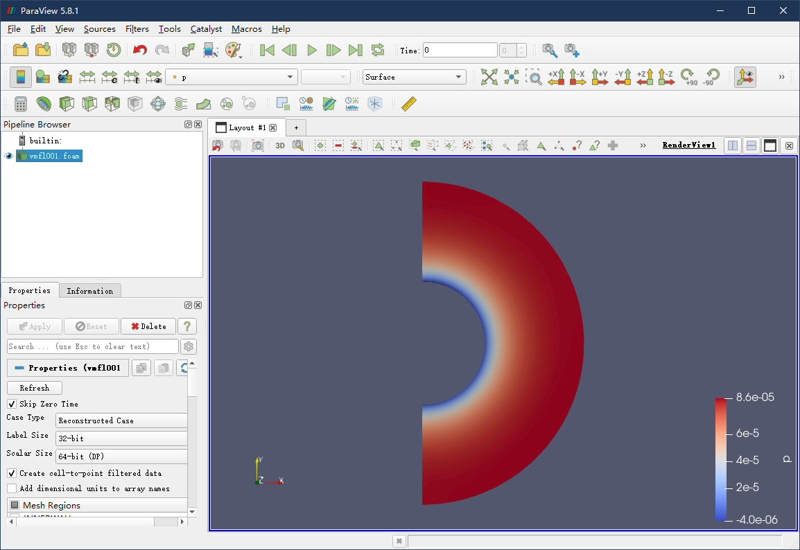

以vmfl001.foam为基础，新建4个"Probe Location"，用于提取20~35mm处的切向速度。

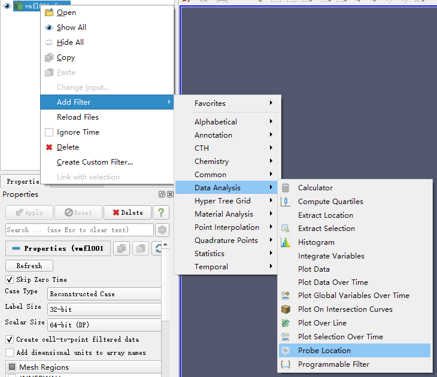

| 名称             | Center      | Radius |
| -------------- | ----------- | ------ |
| ProbeLocation1 | (0.020,0,0) | 0      |
| ProbeLocation2 | (0.025,0,0) | 0      |
| ProbeLocation3 | (0.030,0,0) | 0      |
| ProbeLocation4 | (0.035,0,0) | 0      |

新建GroupDatasets，包含上述4个ProbeLocation。

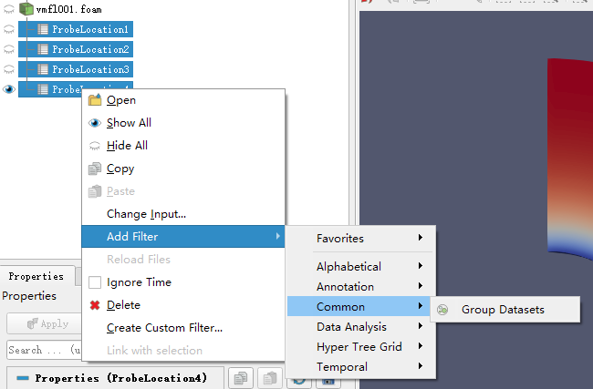

选中该GroupDatasets，可在右侧"SpreadSheetView"窗口中看到4个点位置的切向速度值。

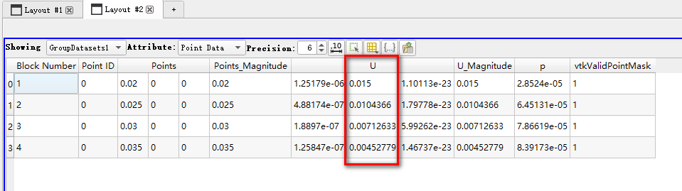

以vmfl001.foam为基础，建立"PlotOnIntersectionCurves"绘图。

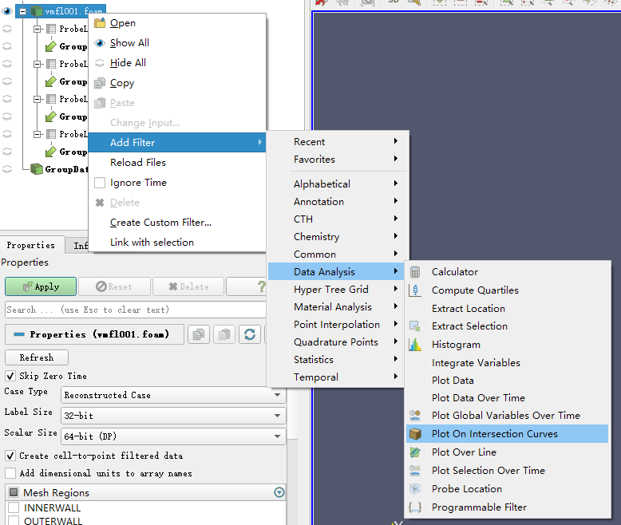

平面方向选择Y轴正向，如图所示。

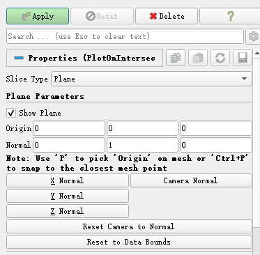

X轴显示变量选择"Points_X"，Y轴显示变量选择"U_Y"，如图所示。

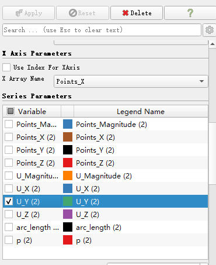

右侧"LineChartView"窗口可以查看生成的曲线。

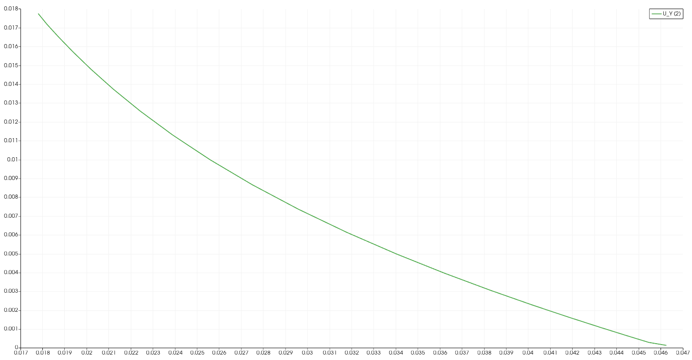

选择"File"、"Export Scene"，可以将曲线数据导出到csv文件中。

层流方程与OpenFOAM计算结果误差对比。

| 半径 [mm] | 切向速度（理论值） [m/s] | 切向速度（OpenFOAM仿真结果）[m/s] | 误差 [%] |
| ------- | --------------- | ----------------------- | ------ |
| 20      | 0.0151          | 0.0150                  | 0.66   |
| 25      | 0.0105          | 0.0104366               | 0.60   |
| 30      | 0.0072          | 0.00712633              | 1.02   |
| 35      | 0.0046          | 0.00452779              | 1.57   |

## 6. SU2验证

### 6.1 求解器设置

SU2求解器配置文件vmfl001.cfg内容如下：

```ini
% ------------- DIRECT, ADJOINT, AND LINEARIZED PROBLEM DEFINITION ------------%
%
% Physical governing equations (EULER, NAVIER_STOKES,
%                               WAVE_EQUATION, HEAT_EQUATION, FEM_ELASTICITY,
%                               POISSON_EQUATION)
SOLVER= INC_NAVIER_STOKES
%
% Specify turbulence model (NONE, SA)
KIND_TURB_MODEL= NONE
%
% Mathematical problem (DIRECT, CONTINUOUS_ADJOINT)
MATH_PROBLEM= DIRECT
%
% Restart solution (NO, YES)
RESTART_SOL= NO

% ---------------- INCOMPRESSIBLE FLOW CONDITION DEFINITION -------------------%
%
% Density model within the incompressible flow solver.
% Options are CONSTANT (default), BOUSSINESQ, or VARIABLE. If VARIABLE,
% an appropriate fluid model must be selected.
INC_DENSITY_MODEL= CONSTANT
%
% Solve the energy equation in the incompressible flow solver
INC_ENERGY_EQUATION = YES
%
% Initial density for incompressible flows (1.2886 kg/m^3 by default)
INC_DENSITY_INIT= 1.0
%
% Initial temperature for incompressible flows that include the
% energy equation (288.15 K by default). Value is ignored if
% INC_ENERGY_EQUATION is false.
INC_TEMPERATURE_INIT= 293.15
%
% Initial velocity for incompressible flows (1.0,0,0 m/s by default)
INC_VELOCITY_INIT= ( 1.0, 0.0, 0.0 )
%

% ---- IDEAL GAS, POLYTROPIC, VAN DER WAALS AND PENG ROBINSON CONSTANTS -------%
%
% Fluid model (STANDARD_AIR, IDEAL_GAS, VW_GAS, PR_GAS, 
%              CONSTANT_DENSITY, INC_IDEAL_GAS)
FLUID_MODEL= CONSTANT_DENSITY
%
% Specific heat at constant pressure, Cp (1004.703 J/kg*K (air)).
% Incompressible fluids with energy eqn. only (CONSTANT_DENSITY, INC_IDEAL_GAS).
SPECIFIC_HEAT_CP= 1004.703

% --------------------------- VISCOSITY MODEL ---------------------------------%
%
% Viscosity model (SUTHERLAND, CONSTANT_VISCOSITY).
VISCOSITY_MODEL= CONSTANT_VISCOSITY
%
% Molecular Viscosity that would be constant (1.716E-5 by default)
MU_CONSTANT= 0.0002

% --------------------------- THERMAL CONDUCTIVITY MODEL ----------------------%
%
% Conductivity model (CONSTANT_CONDUCTIVITY, CONSTANT_PRANDTL).
CONDUCTIVITY_MODEL= CONSTANT_PRANDTL
%
% Laminar Prandtl number (0.72 (air), only for CONSTANT_PRANDTL)
PRANDTL_LAM= 0.72
%
% Turbulent Prandtl number (0.9 (air), only for CONSTANT_PRANDTL)
PRANDTL_TURB= 0.90

% ---------------------- REFERENCE VALUE DEFINITION ---------------------------%
%
% Reference origin for moment computation
REF_ORIGIN_MOMENT_X = 0.25
REF_ORIGIN_MOMENT_Y = 0.00
REF_ORIGIN_MOMENT_Z = 0.00
%
% Reference length for pitching, rolling, and yawing non-dimensional moment
REF_LENGTH= 1.0
%
% Reference area for force coefficients (0 implies automatic calculation)
REF_AREA= 1.0

% ----------------------- DYNAMIC MESH DEFINITION -----------------------------%
%
% Type of dynamic surface movement (NONE, DEFORMING,
%                       MOVING_WALL, FLUID_STRUCTURE, FLUID_STRUCTURE_STATIC,
%                       AEROELASTIC, EXTERNAL, EXTERNAL_ROTATION,
%                       AEROELASTIC_RIGID_MOTION)
SURFACE_MOVEMENT= MOVING_WALL
%
% Moving wall boundary marker(s) (NONE = no marker, ignored for RIGID_MOTION)
MARKER_MOVING= ( INNERWALL )
%
% Coordinates of the motion origin
SURFACE_MOTION_ORIGIN= 0.0 0.0 0.0
%
% Angular velocity vector (rad/s) about the motion origin
SURFACE_ROTATION_RATE = 0.0 0.0 1.0
%

% -------------------- BOUNDARY CONDITION DEFINITION --------------------------%
%
% Navier-Stokes (no-slip), constant heat flux wall  marker(s) (NONE = no marker)
% Format: ( marker name, constant heat flux (J/m^2), ... )
MARKER_HEATFLUX= ( OUTERWALL, 0.0 )
%
% Navier-Stokes (no-slip), isothermal wall marker(s) (NONE = no marker)
% Format: ( marker name, constant wall temperature (K), ... )
MARKER_ISOTHERMAL= ( INNERWALL, 313.15 )
%
% Periodic boundary marker(s) (NONE = no marker)
% Format: ( periodic marker, donor marker, rotation_center_x, rotation_center_y,
% rotation_center_z, rotation_angle_x-axis, rotation_angle_y-axis,
% rotation_angle_z-axis, translation_x, translation_y, translation_z, ... )
% MARKER_PERIODIC= ( PERIODIC, SHADOW_PERIODIC, 0, 0, 0, 0, 0, 180, 0, 0, 0 )

%
% Marker(s) of the surface to be plotted or designed
MARKER_PLOTTING= ( INNERWALL, OUTERWALL )
%
% Marker(s) of the surface where the functional (Cd, Cl, etc.) will be evaluated
MARKER_MONITORING= ( NONE )

% ------------- COMMON PARAMETERS DEFINING THE NUMERICAL METHOD ---------------%
%
% Numerical method for spatial gradients (GREEN_GAUSS, WEIGHTED_LEAST_SQUARES)
NUM_METHOD_GRAD= WEIGHTED_LEAST_SQUARES
%
% Courant-Friedrichs-Lewy condition of the finest grid
CFL_NUMBER= 15.0
%
% Adaptive CFL number (NO, YES)
CFL_ADAPT= YES
%
% Parameters of the adaptive CFL number (factor down, factor up, CFL min value,
%                                        CFL max value )
CFL_ADAPT_PARAM= ( 0.1, 2.0, 1.0, 1e10 )
%
% Number of total iterations
ITER= 10000

% ------------------------ LINEAR SOLVER DEFINITION ---------------------------%
%
% Linear solver for the implicit (or discrete adjoint) formulation (BCGSTAB, FGMRES)
LINEAR_SOLVER= FGMRES
%
% Preconditioner of the Krylov linear solver (JACOBI, LINELET, LU_SGS)
LINEAR_SOLVER_PREC= ILU
%
% Linael solver ILU preconditioner fill-in level (0 by default)
LINEAR_SOLVER_ILU_FILL_IN= 0
%
% Min error of the linear solver for the implicit formulation
LINEAR_SOLVER_ERROR= 1E-14
%
% Max number of iterations of the linear solver for the implicit formulation
LINEAR_SOLVER_ITER= 25

% -------------------------- MULTIGRID PARAMETERS -----------------------------%
%
% Multi-Grid Levels (0 = no multi-grid)
MGLEVEL= 0
%
% Multi-grid cycle (V_CYCLE, W_CYCLE, FULLMG_CYCLE)
MGCYCLE= W_CYCLE
%
% Multi-grid pre-smoothing level
MG_PRE_SMOOTH= ( 1, 2, 3, 3 )
%
% Multi-grid post-smoothing level
MG_POST_SMOOTH= ( 0, 0, 0, 0 )
%
% Jacobi implicit smoothing of the correction
MG_CORRECTION_SMOOTH= ( 0, 0, 0, 0 )
%
% Damping factor for the residual restriction
MG_DAMP_RESTRICTION= 0.8
%
% Damping factor for the correction prolongation
MG_DAMP_PROLONGATION= 0.8

% -------------------- FLOW NUMERICAL METHOD DEFINITION -----------------------%
%
% Convective numerical method (JST, LAX-FRIEDRICH, CUSP, ROE, AUSM, HLLC,
%                              TURKEL_PREC, MSW)
CONV_NUM_METHOD_FLOW= FDS
%
% Monotonic Upwind Scheme for Conservation Laws (TVD) in the flow equations.
%           Required for 2nd order upwind schemes (NO, YES)
MUSCL_FLOW= YES
%
% Slope limiter (NONE, VENKATAKRISHNAN, VENKATAKRISHNAN_WANG,
%                BARTH_JESPERSEN, VAN_ALBADA_EDGE)
SLOPE_LIMITER_FLOW= NONE
%
% Coefficient for the Venkat's limiter (upwind scheme). A larger values decrease
%             the extent of limiting, values approaching zero cause
%             lower-order approximation to the solution (0.05 by default)
VENKAT_LIMITER_COEFF= 0.05
%
% Time discretization (RUNGE-KUTTA_EXPLICIT, EULER_IMPLICIT, EULER_EXPLICIT)
TIME_DISCRE_FLOW= EULER_IMPLICIT

% --------------------------- CONVERGENCE PARAMETERS --------------------------%
%
% Convergence criteria (CAUCHY, RESIDUAL)
CONV_CRITERIA= RESIDUAL
%
% Min value of the residual (log10 of the residual)
CONV_RESIDUAL_MINVAL= -14
%
% Start convergence criteria at iteration number
CONV_STARTITER= 10
%
% Number of elements to apply the criteria
CONV_CAUCHY_ELEMS= 100
%
% Epsilon to control the series convergence
CONV_CAUCHY_EPS= 1E-14

% ------------------------- INPUT/OUTPUT INFORMATION --------------------------%
%
% Mesh input file
MESH_FILENAME= VMFL001_rot_conc_cyl_2D.cgns
%
% Mesh input file format (SU2, CGNS, NETCDF_ASCII)
MESH_FORMAT= CGNS
%
% Mesh output file
MESH_OUT_FILENAME= mesh_out.cgns
%
% Restart flow input file
SOLUTION_FILENAME= solution_flow.dat
%
% Restart adjoint input file
SOLUTION_ADJ_FILENAME= solution_adj.dat
%
% Output file format (PARAVIEW, TECPLOT, STL)
TABULAR_FORMAT= CSV
%
% Output file convergence history (w/o extension) 
CONV_FILENAME= history
%
% Output file restart flow
RESTART_FILENAME= restart_flow.dat
%
% Output file restart adjoint
RESTART_ADJ_FILENAME= restart_adj.dat
%
% Output file flow (w/o extension) variables
VOLUME_FILENAME= flow
%
% Output file adjoint (w/o extension) variables
VOLUME_ADJ_FILENAME= adjoint
%
% Output objective function gradient (using continuous adjoint)
GRAD_OBJFUNC_FILENAME= of_grad.dat
%
% Output file surface flow coefficient (w/o extension)
SURFACE_FILENAME= surface_flow
%
% Output file surface adjoint coefficient (w/o extension)
SURFACE_ADJ_FILENAME= surface_adjoint
%
% Writing solution file frequency
OUTPUT_WRT_FREQ= 250
%
% Writing convergence history frequency
SCREEN_WRT_FREQ_INNER= 1
%
% Screen output
SCREEN_OUTPUT= (INNER_ITER, WALL_TIME,  RMS_PRESSURE, RMS_VELOCITY-X, RMS_VELOCITY-Y)
```

确保vmfl001.cfg和网格文件VMFL001_rot_conc_cyl_2D.cgns在同一目录，执行以下命令（Windows下若用到tee命令，可以在Powershell里执行），运行求解并记录求解过程输出。

```bash
SU2_CFD vmfl001.cfg | tee vmfl001.log
```

### 6.2 后处理

用ParaView打开求解输出的flow.vtu文件，处理过程同5.2。

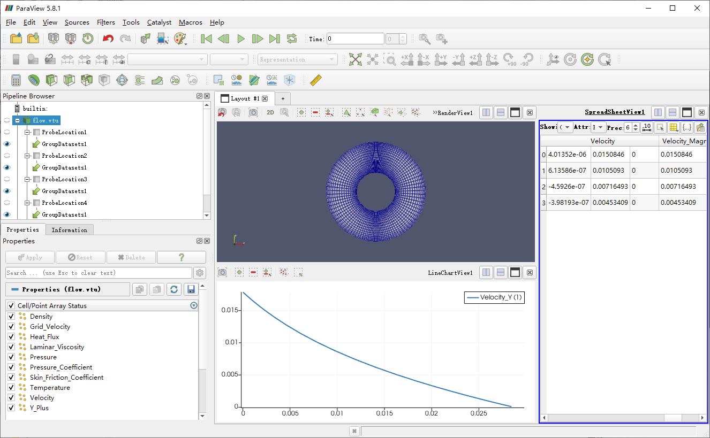

层流方程与SU2计算结果误差对比。

| 半径 [mm] | 切向速度（理论值） [m/s] | 切向速度（SU2仿真结果）[m/s] | 误差 [%] |
| --------- | ------------------------ | ---------------------------- | -------- |
| 20        | 0.0151                   | 0.0150846                    | 0.10     |
| 25        | 0.0105                   | 0.0105093                    | 0.09     |
| 30        | 0.0072                   | 0.00716493                   | 0.49     |
| 35        | 0.0046                   | 0.00453409                   | 1.43     |

## 7. 总结

横向对比来看，CFX求解精度最高；其次是SU2；然后是Fluent；OpenFOAM精度和Fluent相差无几，但求解速度更快；STAR-CCM+精度最差。

| 半径 [mm] | Fluent求解误差 [%] | CFX求解误差 [%] | STAR-CCM+求解误差 [%] | OpenFOAM求解误差 [%] | SU2求解误差 [%] |
| --------- | ------------------ | --------------- | --------------------- | -------------------- | --------------- |
| 20        | 0.48               | 0.05            | 1.50                  | 0.66                 | 0.10            |
| 25        | 0.34               | 0.27            | 1.61                  | 0.60                 | 0.09            |
| 30        | 1.06               | 0.24            | 6.69                  | 1.02                 | 0.49            |
| 35        | 2.23               | 1.15            | 3.65                  | 1.57                 | 1.43            |


