+++
author = "Andrew Moa"
title = "Unveiling TenFong Tech's Domestic CFD Software—QFlux and QMesh"
date = "2021-09-08"
description = ""
tags = [
    "cfd",
]
categories = [
    "zhihu",
]
series = [""]
aliases = [""]
image = "/images/post-bg-tea.jpg"
+++

Conclusion first: TenFong Tech’s products QFlux and QMesh do not align with their marketing claims. QMesh is not an "independently developed advanced computational fluid dynamics (CFD) core software," and QFlux is far from feature-complete. There is strong evidence to suggest that QFlux’s solver may have been "borrowed" from OpenFOAM.

## 1. Software Overview and Download

Let’s skip the preamble. TenFong Tech’s marketing claims can be seen on their official websites（http://www.tenfong.cn/、http://www.qfx-tech.com/）.

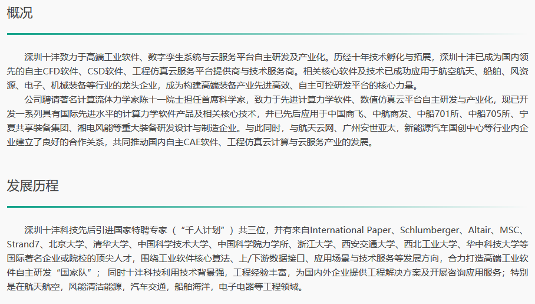

The company lists two products: QFlux (a CFD solver) and QMesh (a pre-processing mesh tool). Interested users can register and download them from the website.

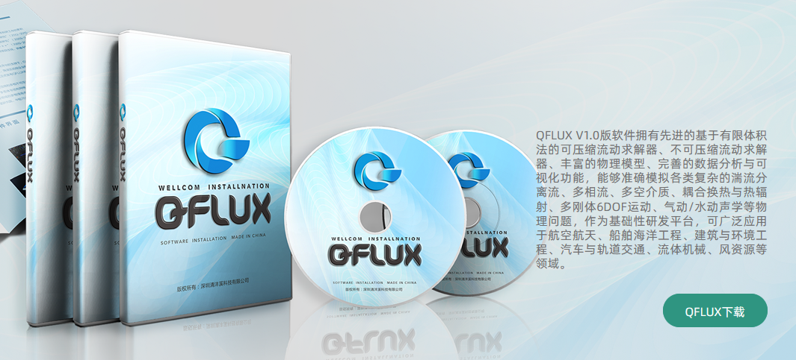


Due to browser settings (or perhaps intentional design), clicking the download button does not prompt a confirmation dialog. Instead, the installer is silently downloaded to the system’s temporary folder (Windows: C:\Users\[Username]\AppData\Local\Temp). Finding the downloaded files requires some effort.

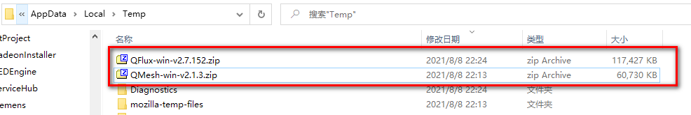

After extraction, you’ll get two installers: `QFlux_x64.exe` and `QMesh_x64.exe`. The installation process is straightforward and won’t be detailed here.

## 2. Pre-processing QMesh

Let’s start with QMesh.

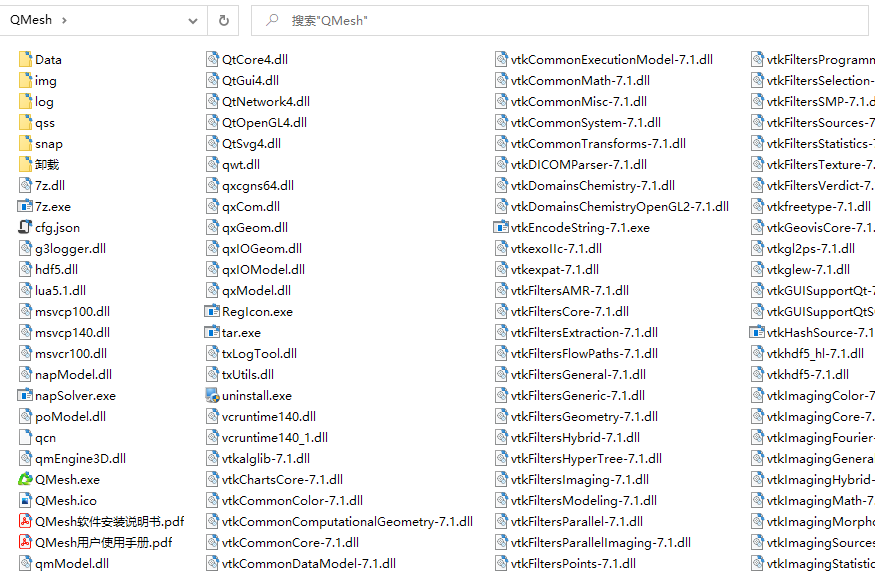

QMesh uses the VTK library for mesh visualization and Qt for its GUI. However, there is no mention of Qt’s licensing (GPL, LGPL, or commercial). Did TenFong Tech properly license Qt?


QMesh’s core mesh generator is `snappyHexMesh`, a tool bundled with OpenFOAM.

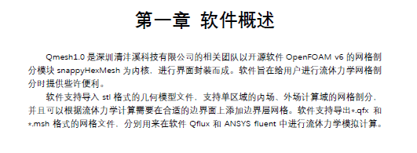

The help file openly acknowledges this. But TenFong’s website claims QMesh is "independently developed." If the core tool is borrowed, how is this "independent"? Did they only develop a GUI wrapper?

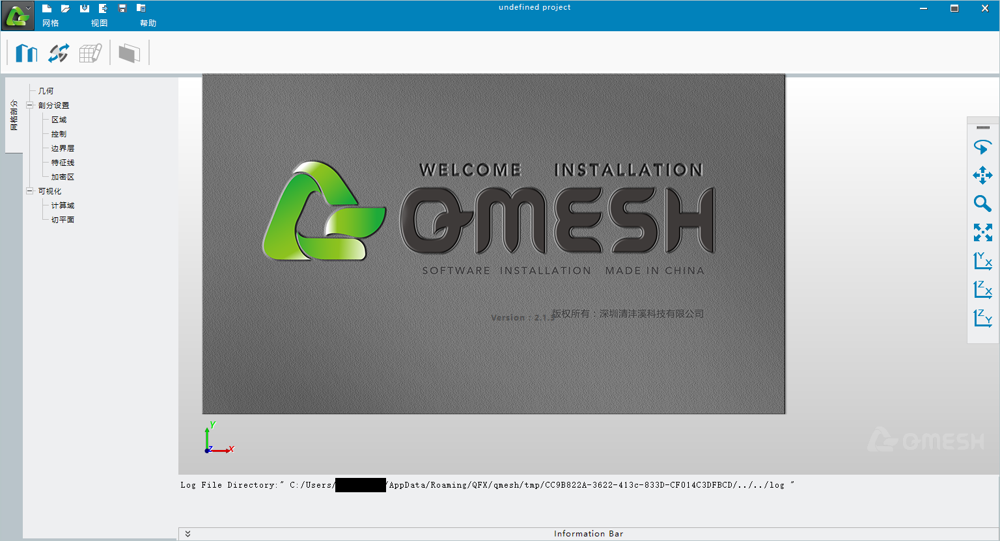

Upon launching, QMesh displays a 180-day trial period. The version is 2.1.3, copyrighted by "Shenzhen Qingfengxi Co., Ltd."

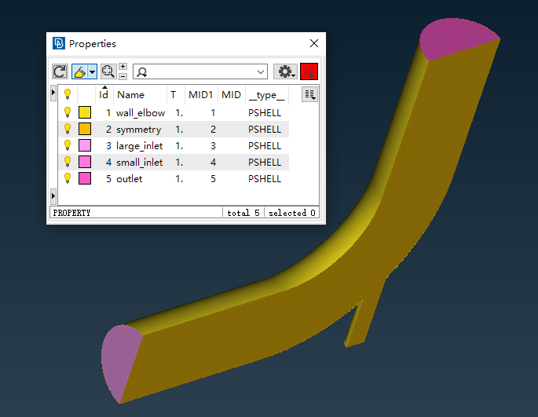

Using Fluent’s classic elbow case, we exported an STL file from ANSA.


QMesh imports STL files but fails to recognize pre-partitioned surfaces or allow re-partitioning.

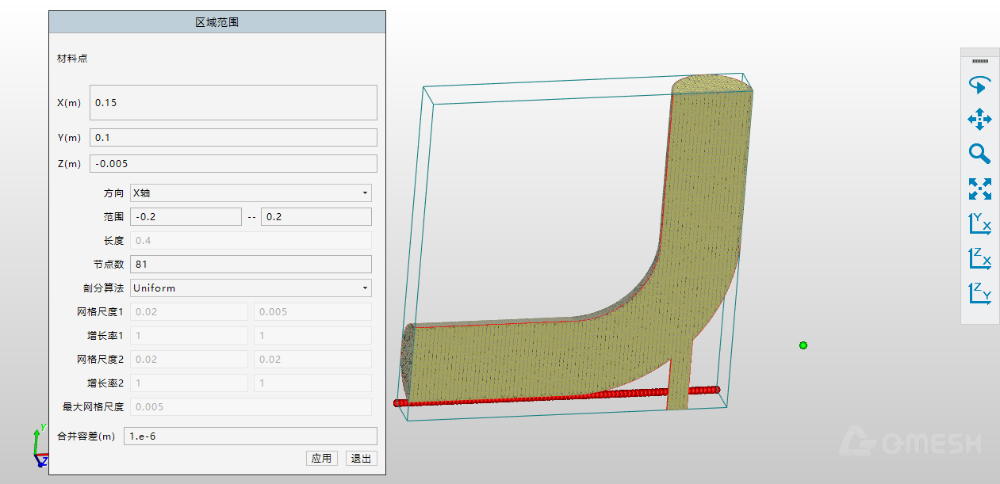

Background mesh settings resemble OpenFOAM’s `blockMesh`, but users cannot adjust grid sizes. The "locationInMesh" parameter (familiar to OpenFOAM users) is set via the "Region" tab.


Mesh refinement and boundary layer controls mirror OpenFOAM’s `snappyHexMeshDict` parameters.


Click "Grid". In the pop-up dialog box, you can choose to set related parameters in parallel and select the grid and boundary layer.

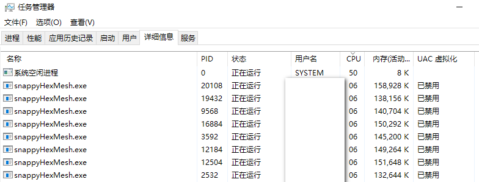

Through the task manager, you can see that QMesh actually performs mesh generation operations by calling snappyHexMesh.


Since snappyHexMesh is used for mesh generation, some inherent defects of snappyHexMesh are inevitably introduced. It can be seen that the local mesh is deformed, which is actually caused by the defects of snappyHexMesh. There is still no good solution. Since the background mesh size cannot be adjusted, when the local mesh and the background mesh overlap, a new boundary area may be generated, just like the `y-minus` area in the figure above.


Export the mesh generated by QMesh to elbow.msh (Fluent Mesh format) and elbow.cgns (CGNS general format). The QMesh project file is saved in .qmh format. You can see that the size of elbow.cgns is only 4kB, and it is obvious that the CGNS format is not saved successfully. 

## 3. CFD Solver QFlux

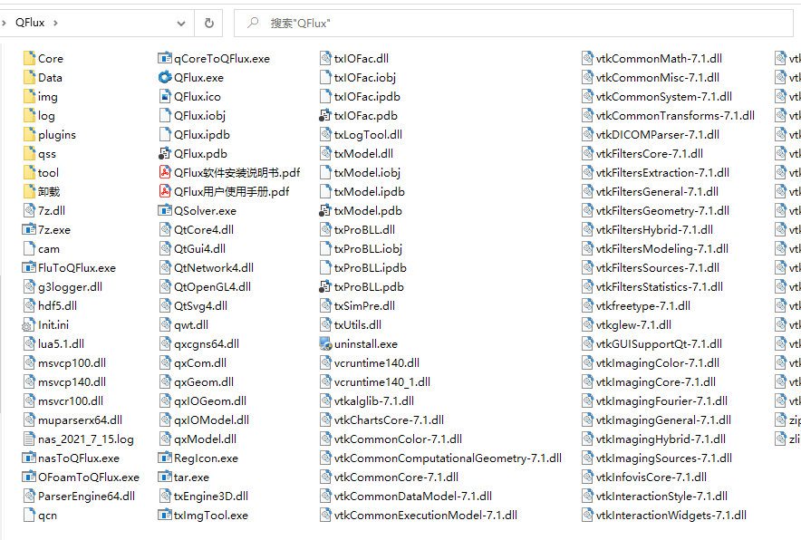

QFlux also relies on Qt and VTK, again without proper licensing notices.

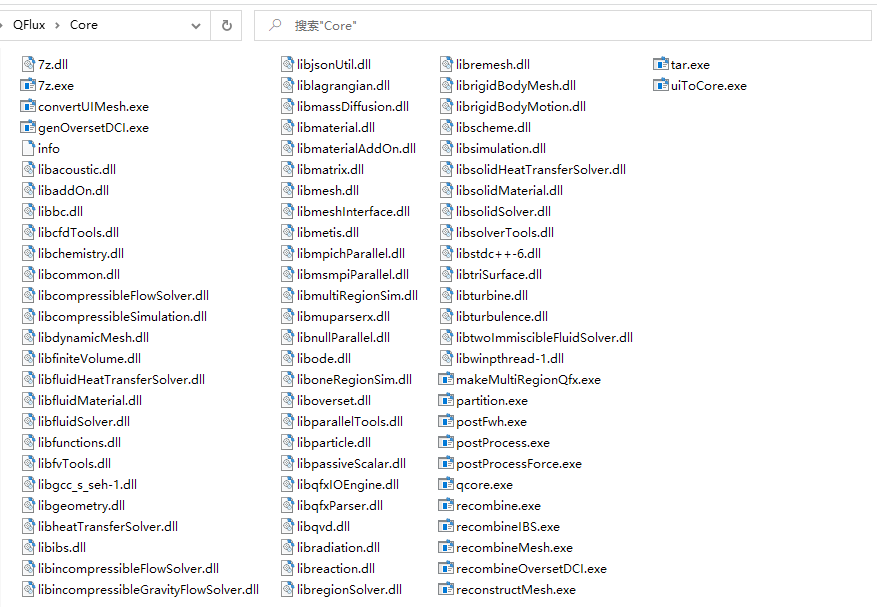

The core solver is `qcore`. Let’s talk about later.


QFlux’s interface (version 2.7.152.0) is copyrighted by "Shenzhen TenFong Technology Co., Ltd."


Attempting to import the QMesh-generated .msh file fails—ironic, given both tools are from TenFong.

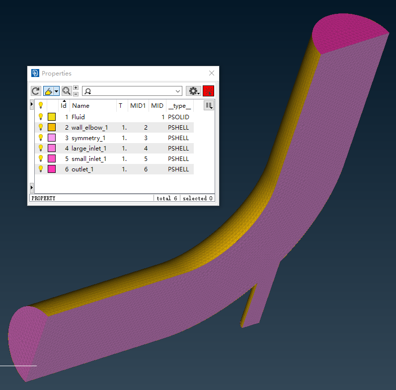

Importing an ANSA-generated CGNS file also fails to recognize boundaries.


Using `OFoamToQFlux` (a bundled tool), we converted an OpenFOAM mesh to QFlux format.

```cmd
cd /d D:\opt\tenfong\QFlux #[QFlux Installion]
set path=%cd%;%path%
cd /d F:\tenfong\solve #[OpenFOAM Case Dir]
OFoamToQFlux %cd%\[OpenFOAM Case Dir]\constant\polyMesh out.qfx
```

This will generate a QFlux grid file and save it in QFlux format (.qfx). You can directly open the out.qfx file.


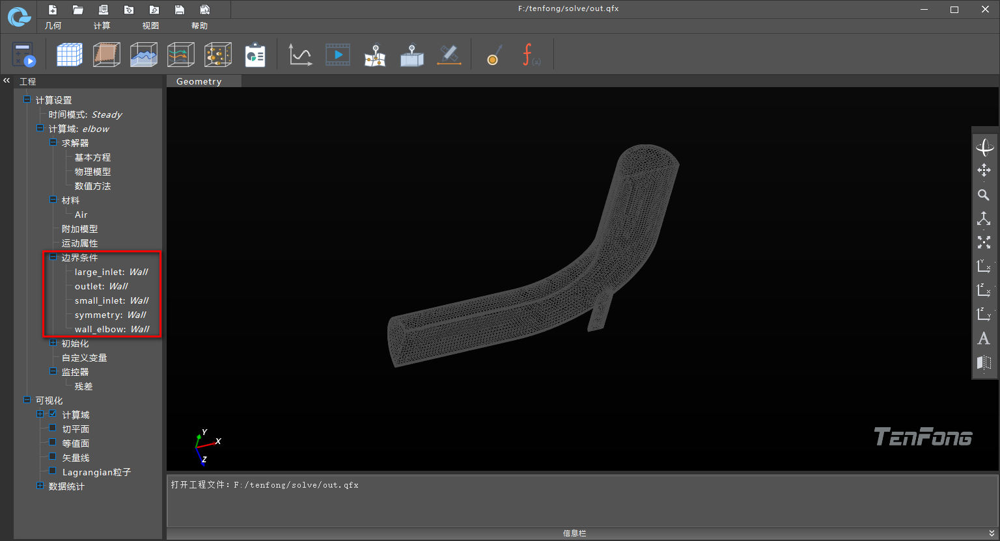

This successfully displays the boundary information, and the boundary conditions can be modified later.

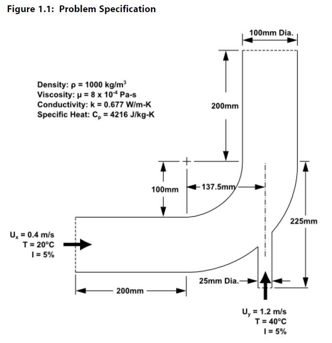

The calculation case is taken from the classic case elbow of Ansys Fluent, and the fluid and boundary parameter settings are shown in the figure above.

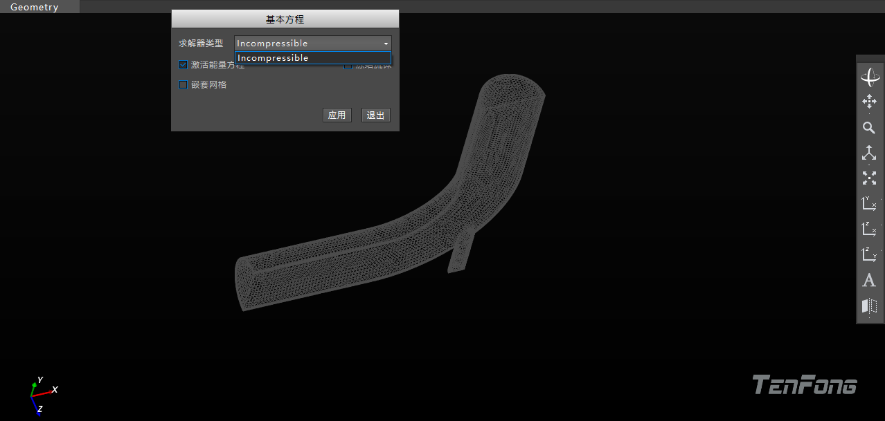

For the basic equations of QFlux, it seems that you can only choose the incompressible flow solver Incompressible (hey, where is the compressible flow solver in the propaganda?) and activate the energy equation.

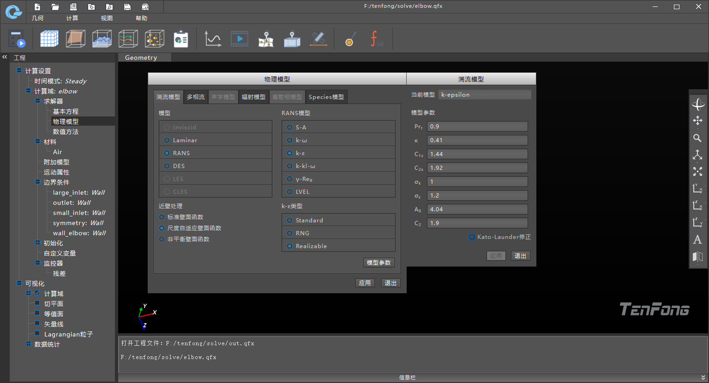

Turbulence model, nothing special to say. The turbulence parameters on the right can also be modified in the turbulenceProperties file of OpenFOAM. The only bright spot may be the near-wall processing of the turbulence model, which is better than debugging the wall functions in the k-file and nut-file one by one in OpenFOAM. (PS: It's just a GUI. I can also achieve the same function by wrapping it with Qt.)

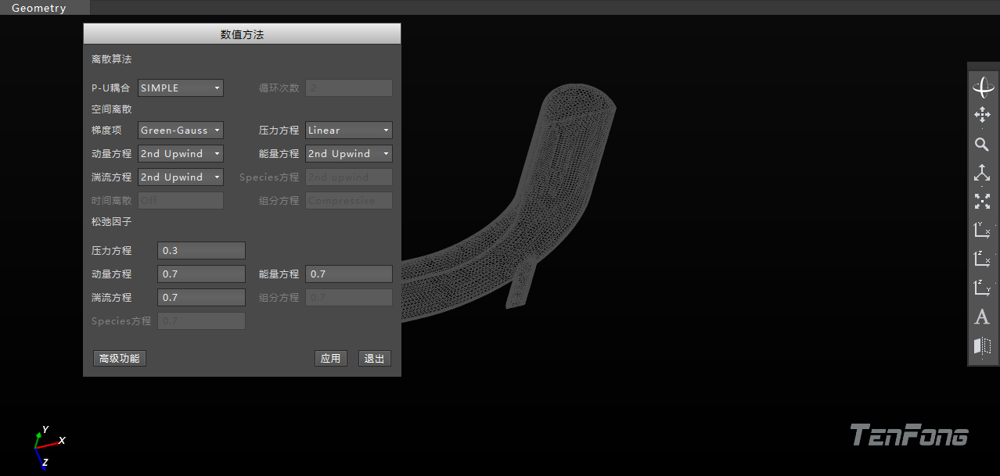

The numerical method is the choice of solver, discretization format and relaxation factor, which is basically equivalent to the controlDict, fvSchemes and fvSolution files of OpenFOAM, except that you don't have to debug them one by one. It seems that the only solver you can choose is the SIMPLE algorithm.

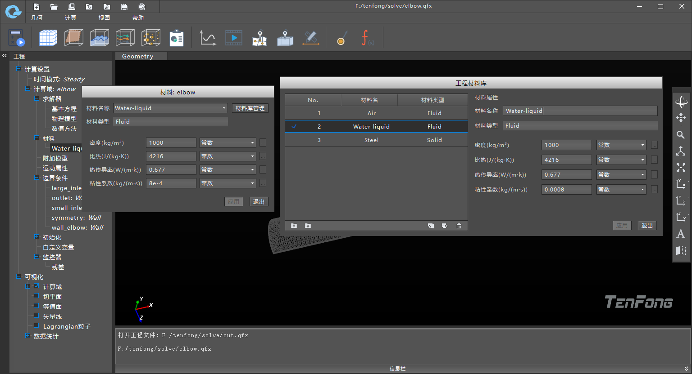

There are only three materials in the material library: air, water and structural steel.

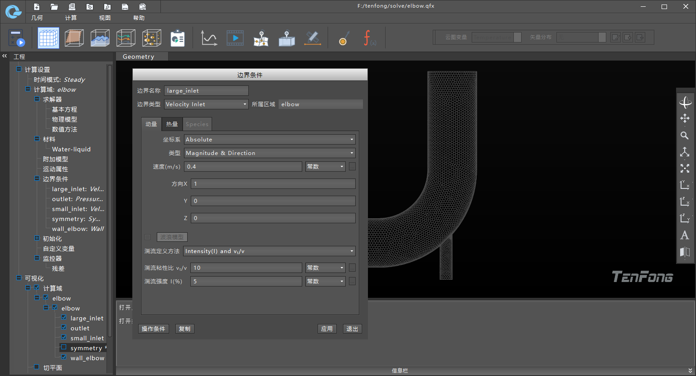

For the inlet and outlet boundary conditions, the flow direction cannot be specified as the surface normal, and the flow direction coordinates can only be entered manually. However, its turbulence parameter definition method is similar to other commercial CFD software, which is much more convenient than calculating one by one in OpenFOAM and then manually defining the k file, epsilon file, and nut file. It seems that the units of velocity and temperature cannot be changed, so if the user uses the ℃ unit, then the temperature scale must be converted by himself.


Set the convergence conditions, and set the convergence judgment tolerances of the momentum equation, energy equation, continuity equation, and turbulent viscosity equation to `1.0e-6`.

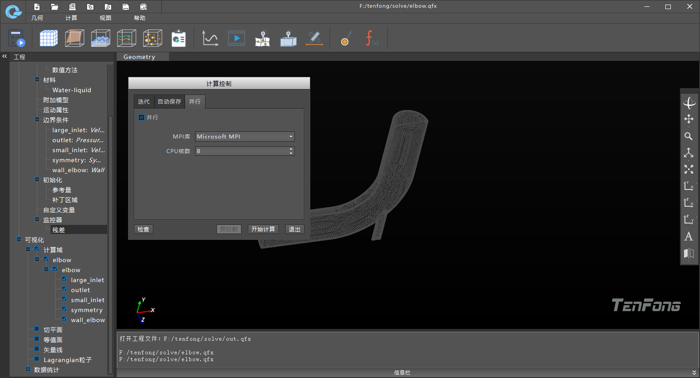

Set the calculation conditions, the maximum number of calculation steps is 1000, and the number of parallel cores can be set. It can be seen that the MPI library used in the Windows version of QFlux is the Microsoft MPI library, which is surprisingly consistent with the Windows version of OpenFOAM. The calculation calls the qcore.exe program.


It can be seen that the calculation converges at about 385 steps, but when the mouse stays on the convergence curve, the label number can only be displayed to four digits after the decimal point, and the label number cannot be displayed in scientific notation.

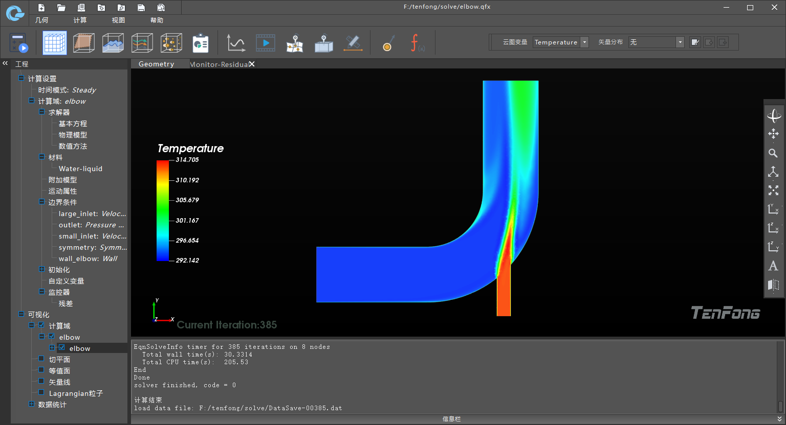

The above figure is the temperature cloud map output by QFlux calculation results.


The above figure is the temperature cloud map of the same case calculated by OpenFOAM. The same case can be achieved by `simpleFoam`+`scalarTransportFoam` or `buoyantSimpleFoam`. It can be seen that the calculation results of the two are similar.

## 4. QFlux vs. OpenFOAM

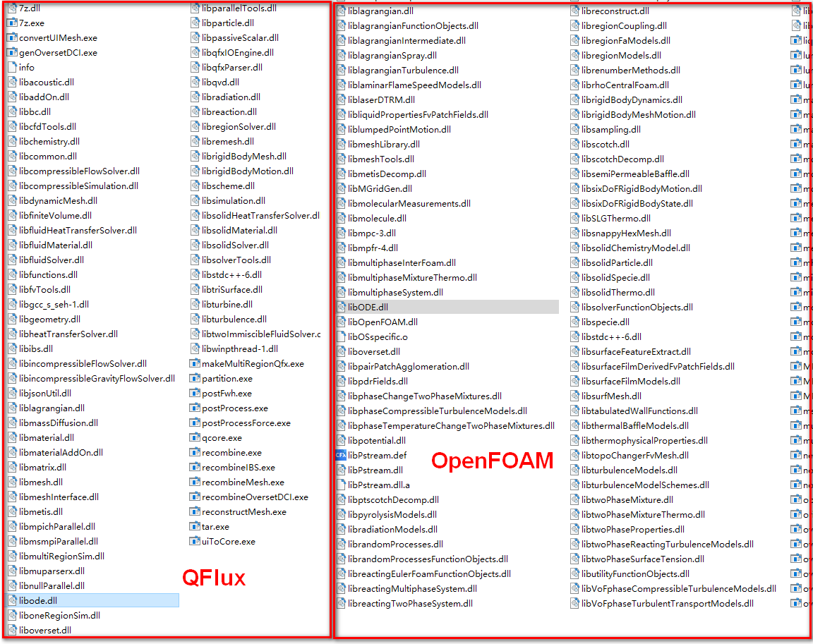

Comparing QFlux and OpenFOAM (v2012) DLLs reveals striking similarities in structure and function names.

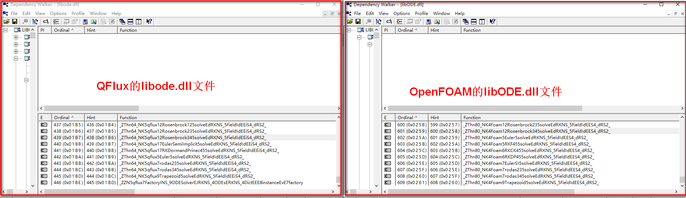

Using "Dependency Walker" to view the function names of the dynamic link library files referenced by the two, it can be found that in some key link libraries, the internal function naming methods cannot be said to be exactly the same, but can only be said to be highly similar.

Since OpenFOAM is open source software and its source code can be downloaded online, it is hard to say that QFlux did not "borrow" from OpenFOAM source code. As for how much content was "borrowed", it is hard to say.

In view of the extremely weak status of domestic CFD and other industrial software, it seems that compared with independent development, it is easier to be welcomed by software developers and investors to quickly package easy-to-use software platforms on open source platforms. Comparing the differences in function implementation, development level and code volume between OpenFOAM and QFlux, the size, code volume and maturity of OpenFOAM programs are far higher than those of QFlux. In fact, developing relevant interfaces and introducing process control on the OpenFOAM platform have always been the focus of industry research. Many companies at home and abroad are conducting related applications and secondary development around OpenFOAM. However, it is possible that only domestic Internet companies can "borrow" from open source programs while claiming to be completely "independently developed". Of course, "Tenfong Technology" is one of them.

In fact, for open source platforms such as OpenFOAM, communication and innovation are the most important. The realization of new methods is far more important than industrial packaging and ease of use. This is one of the reasons why OpenFOAM has insisted on text and command line parameter control for so many years. What is more terrible than "borrowing" itself is numbness and inertia. When we are used to open source platforms, we only know how to take without giving back, and we only know how to reconstruct other people's codes without building and improving them from the bottom up. We know what it is but not why it is... When we lose the open source platform one day, will we still be able to insist on the so-called "independent development"?


