+++
author = "Andrew Moa"
title = "Deploy STAR-CCM+ on supercomputing platform"
date = "2022-04-08"
description = ""
tags = [
    "cfd",
    "slurm",
    "star-ccm+",
]
categories = [
    "zhihu",
]
series = [""]
aliases = [""]
image = "/images/post-bg-tech.jpg"
+++

Recently, there are many platforms that provide supercomputing trials, and many platforms have free trial applications. Due to work needs, I applied for an account on a supercomputing platform and conducted related trials. I made a simple record of the process of deploying STAR-CCM+ software and applications on the supercomputing platform, which also provides a reference for subsequent related applications.

## 1. Supercomputer platform information

You can log in to the supercomputer remotely through SSH connection. Some platforms also provide webSSH and webVNC connections, which support connecting to the command line or graphical interface through a browser. For specific login methods, please refer to the relevant documents provided by the platform.

Before logging in for the first time to install and deploy software, you should first understand the configuration of the supercomputer platform and determine whether the platform supports the software to be installed. Use the following command to understand the distribution information of the supercomputer platform.

```bash
lsb_release -a
```

It can be see that the platform distribution version is CentOS, version 7.9.2009.

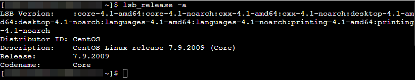

The parallel job scheduling system used by this supercomputing platform is open source Slurm, and you can view the computing resources available for call through the following commands.

```bash
sinfo -a
```

The output is relatively long, only a part of it is cut off here. In the picture below `amd_256` It indicates the partition where the computing node is located. Remember it, and you will use it after writing scripts.

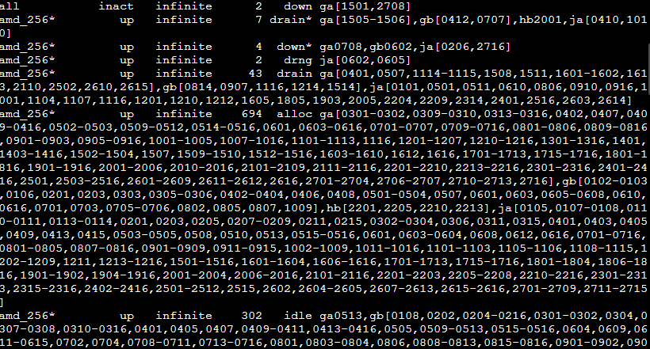

## 2. Software installation

Please refer to the relevant documents provided by the platform for software upload and storage.

This article is installed with the 16.06.010 double precision Linux version. Decompression `tar.gz` package by following the following command.

```bash
tar xvzf [file-name].tar.gz
```

The installation file is unzipped `starccm+_16.06.010` In the directory, enter the directory to run `.sh` The file starts to be installed. Note that root user permission is not required here (in most cases, the platform will not provide a root account, but it does not affect the software installation).

```bash
./STAR-CCM+16.06.010_01_linux-x86_64-2.17_gnu9.2-r8.sh
```

If you connect with VNC, you can install it through the graphical interface. If you do not want to install it through the graphical interface, you can force it through the console with the following command.

```bash
./STAR-CCM+16.06.010_01_linux-x86_64-2.17_gnu9.2-r8.sh -i console
```

This article is installed using the console method. First, prompt LICENSE, as shown in the figure below, press `ENTER` continue.

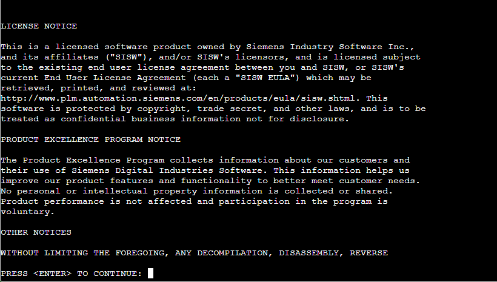

Whether to accept the user agreement, enter `Y` ，`ENTER` Confirm to continue.

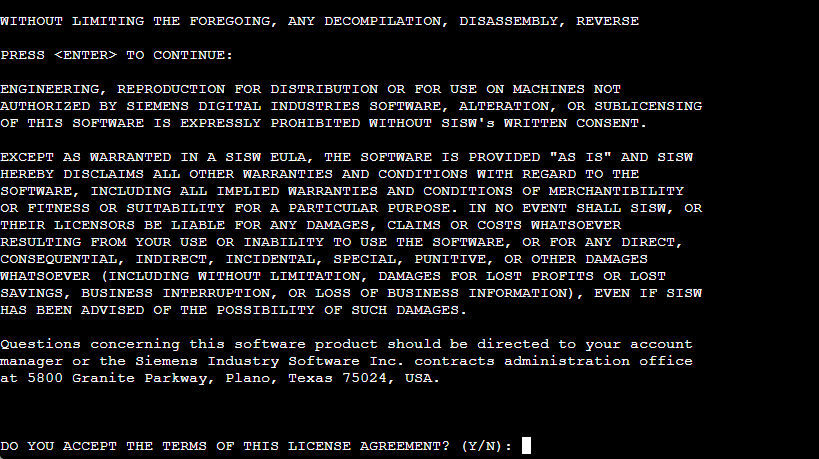

User experience plan, choose whether to accept (Y/N) according to your needs, and will not affect subsequent use.

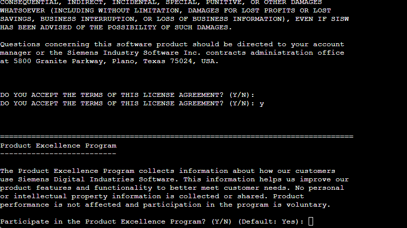

Installation location, this article selects installation in `${HOME}/opt/Siemens` In the directory, enter the absolute path as prompted. `Y` confirm.

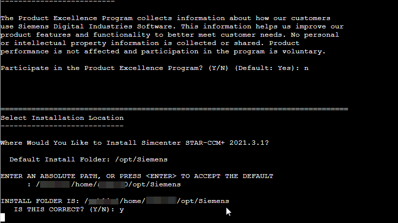

Installation information,`ENTER`Confirm and start copying the file.

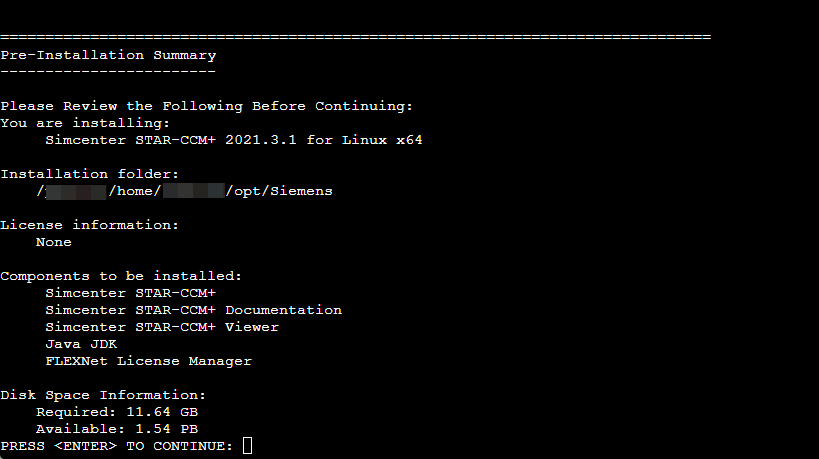

Installation is complete, `ENTER` Confirm to exit. Remember the installation path:

`${HOME}/opt/Siemens/16.06.010-R8/STAR-CCM+16.06.010-R8`

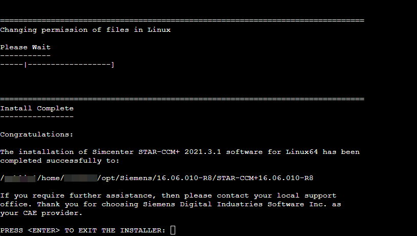

The harmonious process is gone, please refer to the document yourself. Support genuine versions and combat piracy.

## 3. Prepare SLURM scripts

Let’s write a SLURM script below and submit a study to test it briefly.

```bash
#!/bin/bash 

#SBATCH --job-name=carbin_tcm 
#SBATCH --partition=amd_256 
#SBATCH --output=%j.out 
#SBATCH --error=%j.err 
#SBATCH -N 2 
#SBATCH --ntasks-per-node=64 

export MPI_TYPE=openmpi # intel platform openmpi 
export DIR=/***/home/***/opt/Siemens/16.06.010-R8/STAR-CCM+16.06.010-R8/star/bin 
export CDLMD_LICENSE_FILE=/***/home/***/opt/Siemens/license.dat 
export SIM_FILE=carbin_tcm.sim 
#export JAVA_FILE=carbin_tcm.java 
export MACHINEFILE=$SLURM_JOBID.node 
scontrol show hostnames $SLURM_JOB_NODELIST > $MACHINEFILE 
$DIR/starccm+ $SIM_FILE -batch $JAVA_FILE -np $SLURM_NPROCS -machinefile $MACHINEFILE -mpi $MPI_TYPE -rsh ssh -power 
```

`--job-name` The specified name is the case, which can be `squeue` The name displayed in the command.

`--partition` The specified is the partition where the compute node is located, and the call here is `amd_256` Compute nodes in partition.

`--output` Specify the output file name, `%j` or `$SLURM_JOBID` Indicates the current job ID, specified by the platform itself.

`--error` Specifies the output error file name.

`-N` Specify the number of nodes called in this case, and 2 compute nodes are called here.

`--ntasks-per-node` Specify the number of processes per node, where 64 threads are called per node are specified.

variable `$SLURM_NPROCS` It represents the total number of calculation processes, which can be automatically calculated based on the above two parameters, and the total calculation process is 128.

parameter `MPI_TYPE` Specify the call type of mpi, recommended `intel` or `openmpi` ，`platform` Higher versions are no longer supported.

parameter `DIR` Specify the STAR-CCM+ installation path, that is `starccm` + The path to which the file is located.

parameter `CDLMD_LICENSE_FILE` Specify the access path of LICENSE, which can be the file path ** or the port number@host address** .

parameter `SIM_FILE` Specify the test case file name.

parameter `JAVA_FILE` Specify the macro file name. If a macro is used, you can remove the comments on this line and change the file name to the called macro file name.

parameter `MACHINEFILE` Specify the node file.

Order `scontrol show hostnames SLURM_JOB_NODELIST > MACHINEFILE` Used to output hostname to node file.

Save the study script file as `carbin_tcm.slurm` , the test case file is `carbin_tcm.sim` , a total of 2 files, uploaded. Calculate the time step, the number of iterations, etc. `.sim` First define it in the file, generate a grid, configure boundary conditions and then upload and calculate it.

If the study file is relatively large, you can compress and upload it and then decompress it. You can also clear the grid and upload it, and regenerate the grid, define boundary conditions, and calculate by playing the macro.

## 4. Submit calculation tasks

pass `sbatch` Command submits calculation tasks.

```bash
sbatch carbin_tcm.slurm
```

After submission, the ID is automatically generated and queued. The ID number of this study is 899634.

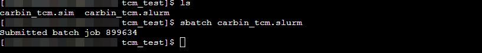

pass `squeue` Command to view the compute task queue.

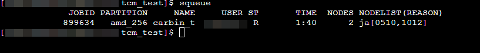

After the calculation is completed, just package and download the output file.

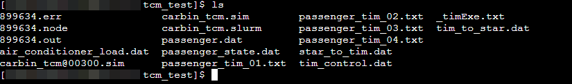

