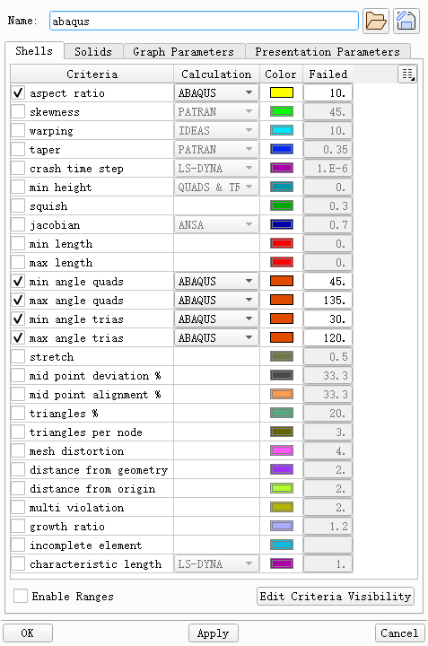
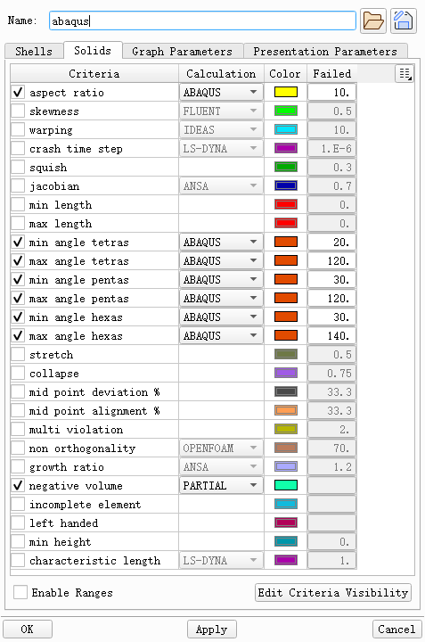

+++
author = "Andrew Moa"
title = "Ansa Mesh Quality Settings"
date = "2025-02-27"
description = ""
tags = [
    "ansa",
    "cae",
]
categories = [
    "ansa",
]
series = [""]
aliases = [""]
image = "/images/grid-bg.jpg"
+++

Use the shortcut key F11 or the button below to define the Ansa grid quality.

Surface mesh quality（Abaqus）

Volume Mesh Quality（Abaqus）

It is best to save the configuration file locally and reopen it next time to overwrite it.

---