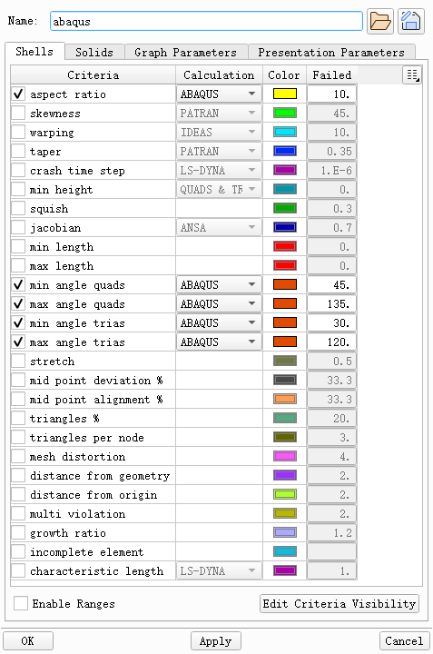

+++
author = "Andrew Moa"
title = "Ansa网格质量设置"
date = "2025-02-27"
description = ""
tags = [
    "ansa",
    "cae",
]
categories = [
    "ansa",
]
series = [""]
aliases = [""]
image = "/images/grid-bg.jpg"
+++

快捷键F11，或者下面这个按钮，定义Ansa网格质量

面网格质量（Abaqus）

体网格质量（Abaqus）

最好把配置文件另存为到本地，下次重新打开配置文件覆盖即可。

---