+++
author = "Andrew Moa"
title = "Extracting mid-face using Ansa"
date = "2025-02-27"
description = ""
tags = [
    "ansa",
    "cae",
]
categories = [
    "ansa",
]
series = [""]
aliases = [""]
image = "/images/grid-bg.jpg"
+++

ANSA has several different treatment methods for the extraction of sheet metal parts.

## 1. `Skin` method

`TOPO` → `Mid.Surfa.` → `Skin` , select the entire geometry and then press the middle mouse button without brain to automatically draw the middle face.
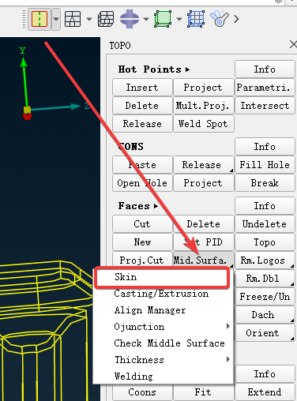

It is suitable for some sheet metal structural parts with relatively uniform thickness, without characteristics such as ribs, bosses, and pits.
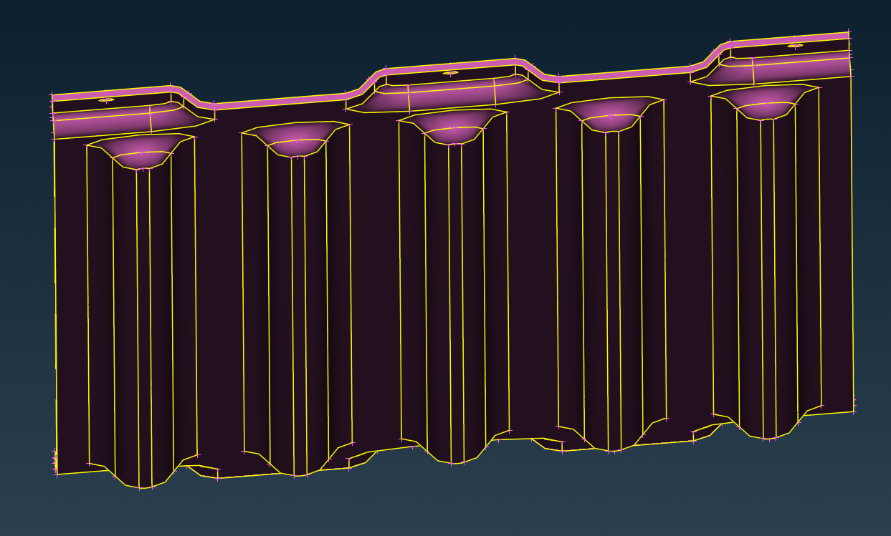

The extracted middle surface is a geometry without a grid. It requires manual animation of the grid, which will automatically delete the original geometry and add thickness.
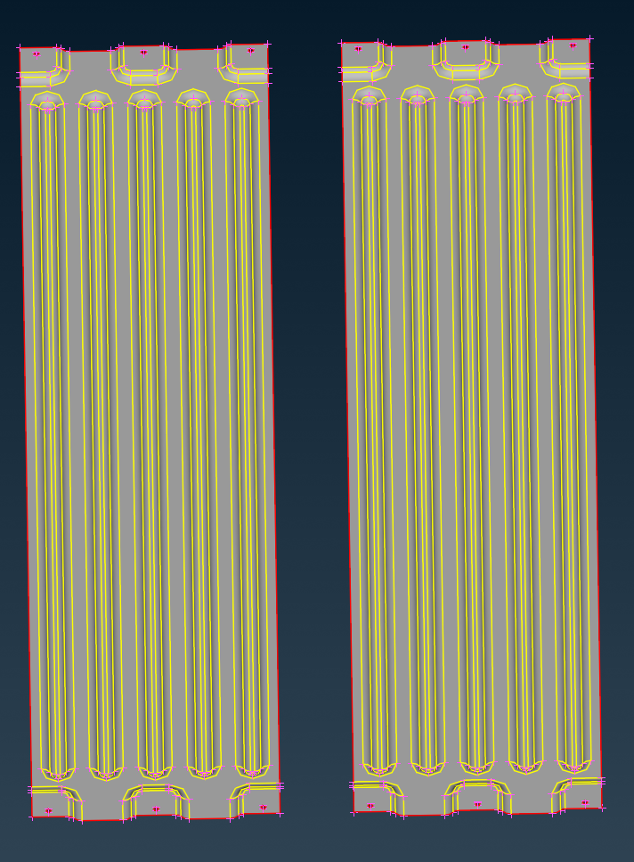

Some extruded parts such as extruded aluminum profiles are also supported, but if there are rounded corners, you must first deal with them, otherwise the mid-side rounded corners will be retained and enlarged.

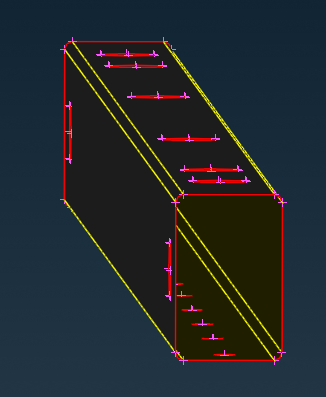

## 2. `Casting/Extrusion` method

There is also a method for pulling the surface for casting and extrusions, `TOPO` → `Mid.Surfa.` → `Casting/Extrusion` 
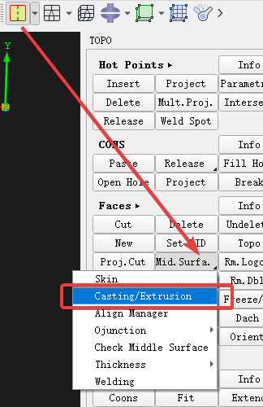

First, make sure that the geometry is closed and there are no wrong faces and edges.
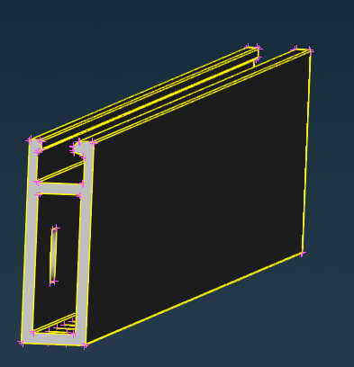

On the pop-up tab, select whether the parts to be drawn on the center surface are cast or extruded, and define the minimum thickness and surface grid size. It is best to define feature hole parameters in the grid parameters before drawing the surface, which is used to generate a washer grid, because after drawing the surface, it is directly a surface grid.
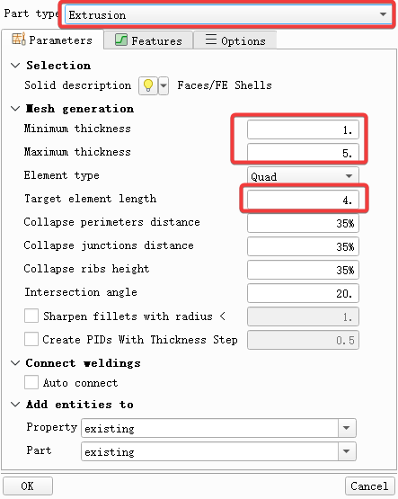

The thickness of the final generated mesh is automatically calculated based on the geometry, and there is no need to set the thickness in the PID.
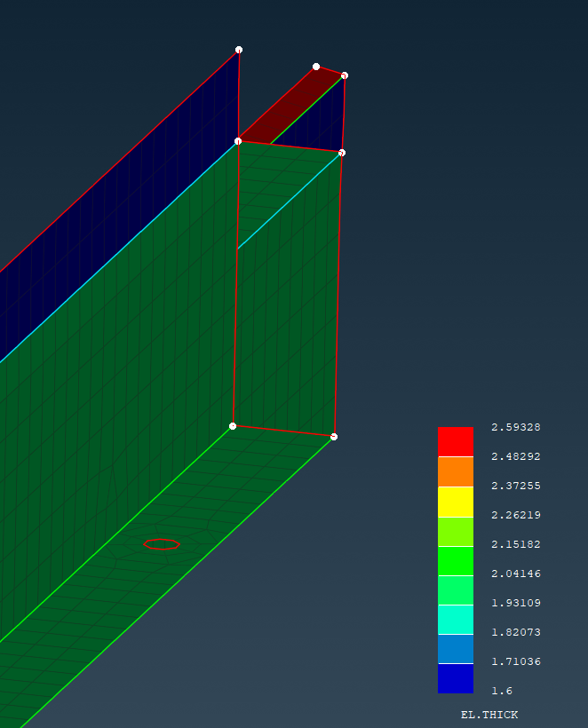

## 3. `Middle Multi.` Hand-processed

Very troublesome, not recommended. However, this method can only be used for some complex structural parts, such as injection molded parts.
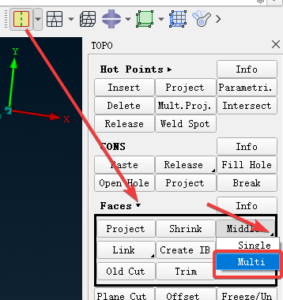

First, some surfaces coplanar with features such as ribs should be divided according to topology to facilitate subsequent processing.
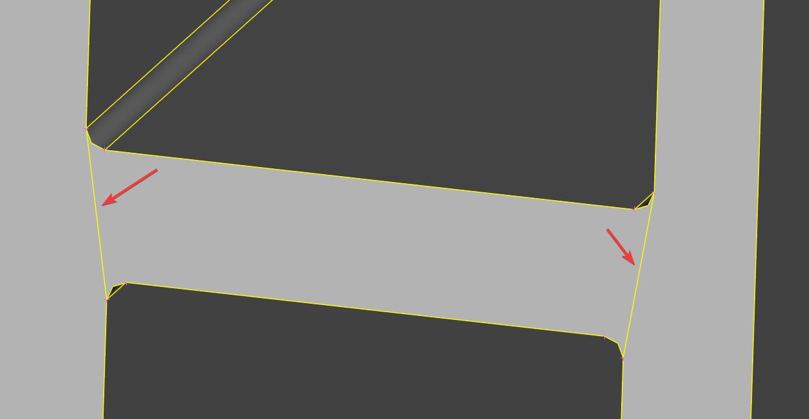

Mark the front and back of the middle face with red and green, and the blue face is the side.
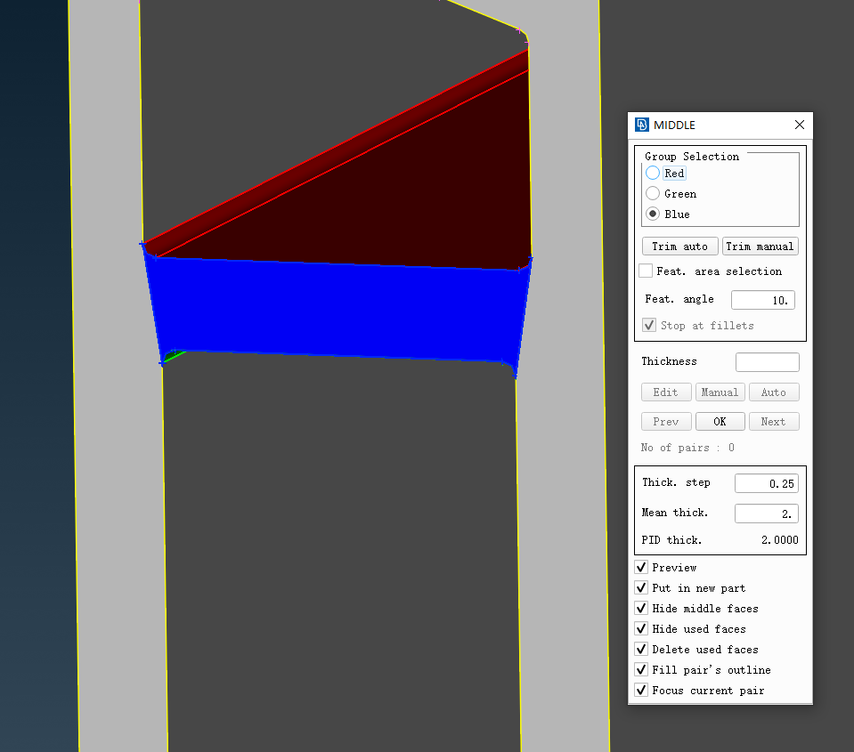

The mid-side drawn will be automatically hidden to facilitate processing of the remaining models.
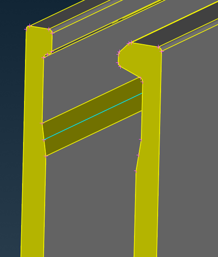

## 4. Summary

- `Skin` Method: Simple, suitable for sheet metal parts, generate geometric data, good accuracy
- `Casting/Extrusion` Method: Simple, suitable for casting and extrusion parts, generate grid data, slightly poor accuracy
- `Middle Multi.` Manual processing: cumbersome, but suitable for complex structural parts such as injection molded parts, etc., to generate geometric data, the accuracy varies from person to person

---

