+++
author = "Andrew Moa"
title = "Ansa抽中面功能"
date = "2025-02-27"
description = ""
tags = [
    "ansa",
    "cae",
]
categories = [
    "ansa",
]
series = [""]
aliases = [""]
image = "/images/grid-bg.jpg"
+++

ANSA针对钣金件抽中面有几种不同处理方式。

## 1. `Skin`方法

`TOPO`→`Mid.Surfa.`→`Skin`，选中整个几何体然后无脑按鼠标中键就可以自动抽中面。
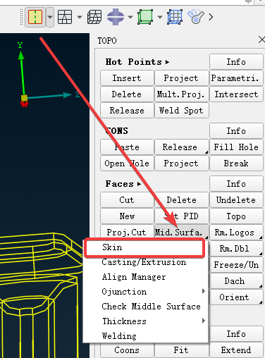

适合一些厚度比较均匀的钣金结构件，没有筋条、凸台、凹坑等特征。
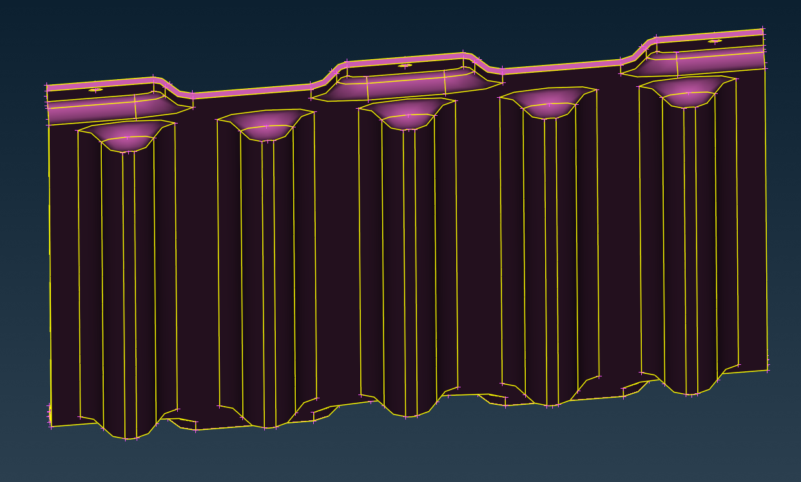

抽出来的中面是几何不带网格，需要手动画网格，会自动删除原来的几何并添加厚度。
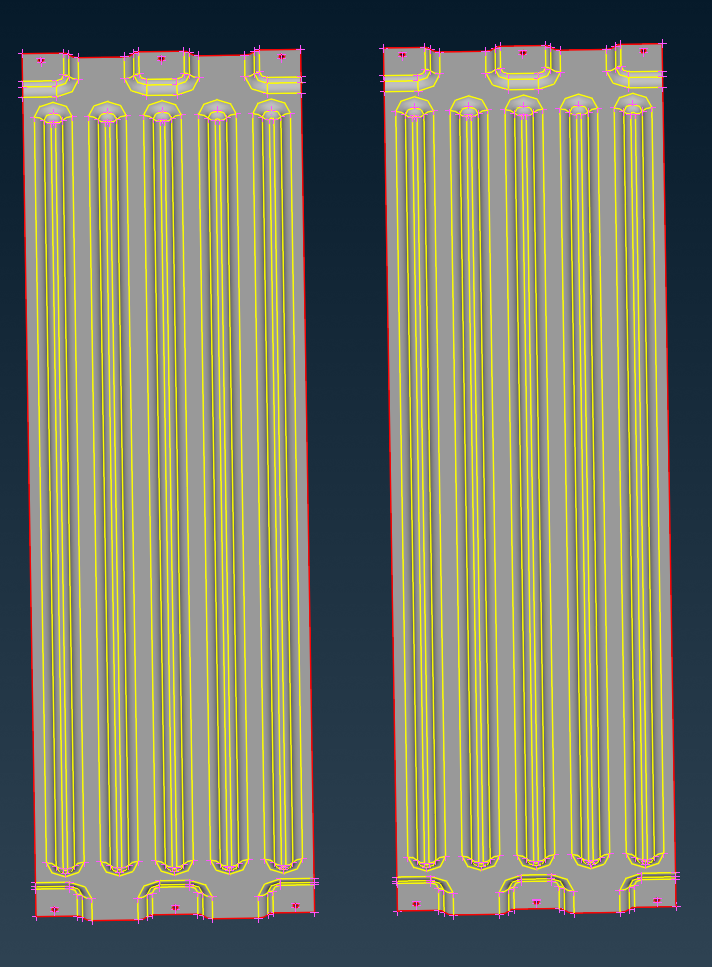

对一些挤压件像挤压铝型材也支持，但是有圆角的话要先处理掉，不然抽出来的中面圆角会保留并放大。
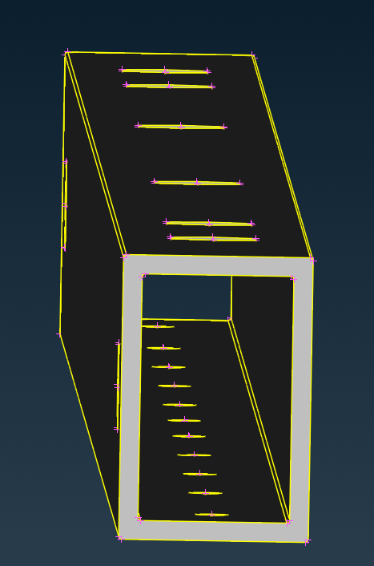
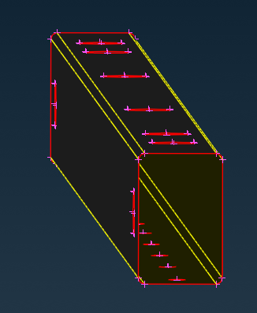

## 2. `Casting/Extrusion`方法

还有一种针对铸造和挤压件的抽中面方法，`TOPO`→`Mid.Surfa.`→`Casting/Extrusion`
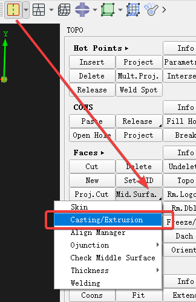

首先要确保几何是封闭的，没有错误面和边。
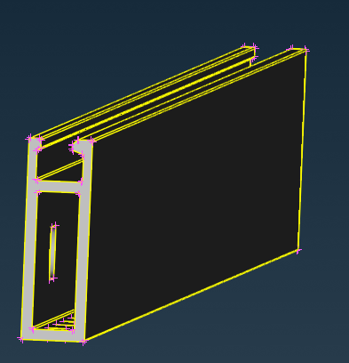

在弹出选项卡选好要抽中面的零部件是铸造件还是挤压件，定义好最小厚度和面网格尺寸。抽中面之前最好先在网格参数中定义好特征孔参数，用于生成washer网格，因为抽完面之后就直接是面网格。
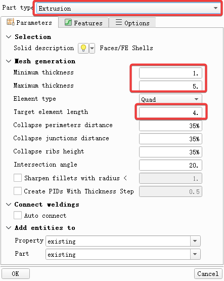

最后生成的网格，厚度根据几何形状自动计算，不需要在PID里再设置厚度。
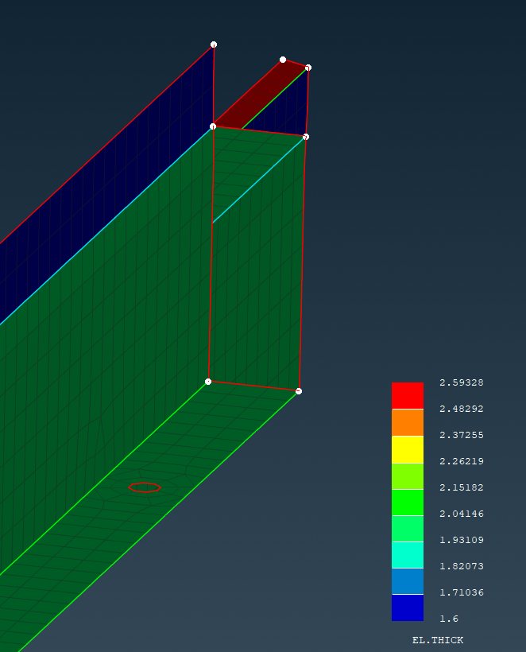

## 3. `Middle Multi.`手工处理

很麻烦，不推荐。但是对于一些复杂结构件，比如注塑件等，只能用这种办法。
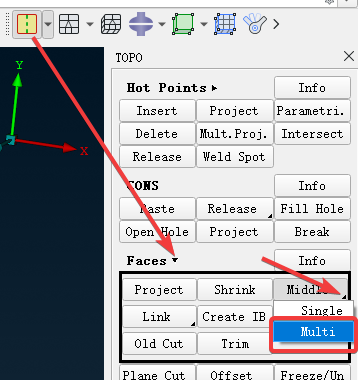

首先要把一些和筋条等特征共面的曲面按拓扑分割，方便后面处理。
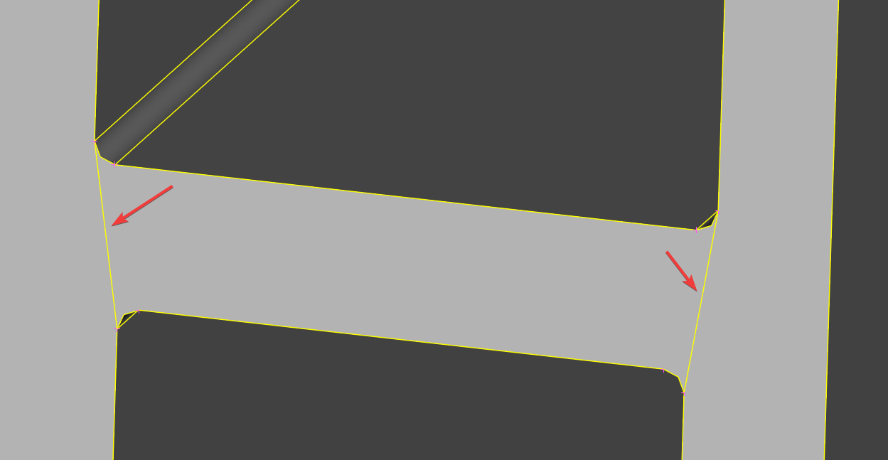

用红色和绿色标注中面的正反面，蓝色是侧面。
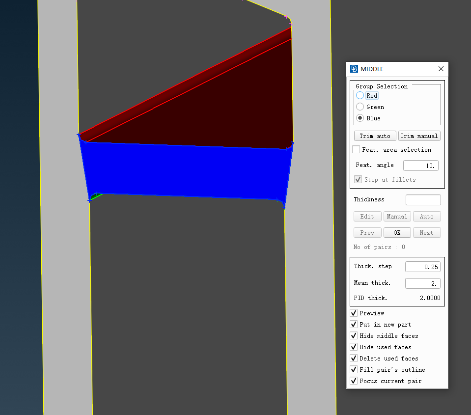

抽完的中面会自动隐藏，方便处理剩下的模型。
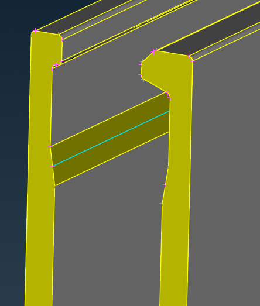

## 4. 总结

- `Skin`方法：简单，适合钣金件，生成几何数据，精度好
- `Casting/Extrusion`方法：简单，适合铸造和挤压件，生成网格数据，精度稍差
- `Middle Multi.`手工处理：繁琐，但适合复杂结构件如注塑件等，生成几何数据，精度因人而异

---

