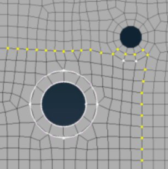
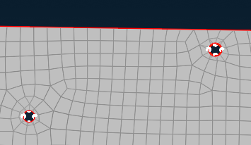
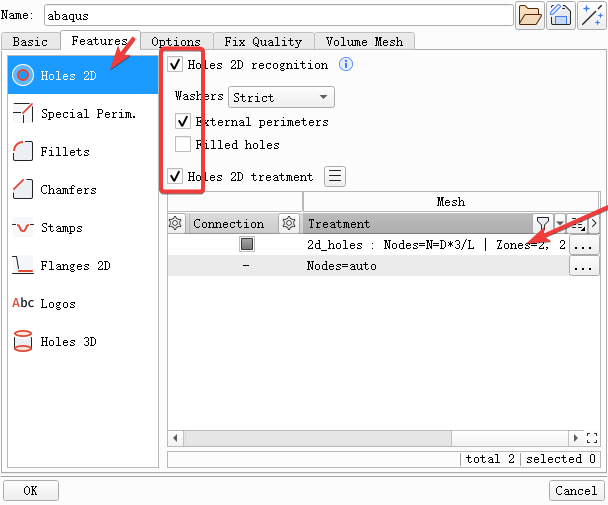
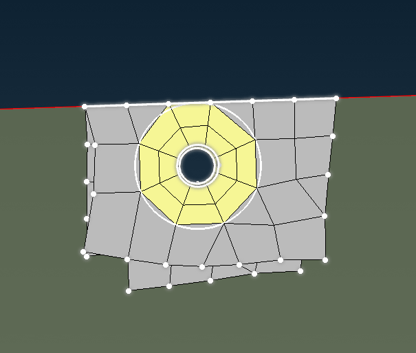

+++
author = "Andrew Moa"
title = "Ansa螺钉孔washer网格"
date = "2025-02-28"
description = ""
tags = [
    "ansa",
    "cae",
]
categories = [
    "ansa",
]
series = [""]
aliases = [""]
image = "/images/grid-bg.jpg"
+++

使用Ansa建面网格的时候我们都希望螺钉孔能处理成washer网格的形式，方便后面加约束。

但默认设置生成的网格螺钉孔貌似都没有按washer处理。

有几种方法，其一是通过几何处理手动添加`Zone Cut`的方式，这种方法手工处理工作量太大，不推荐

另一种方法需要手动`Reconstruct`网格，首先在网格参数设置里设置孔的特征参数。

返回`Mesh`里，`Reconstrust`就有了。

---

