+++
author = "Andrew Moa"
title = "Ansa Quick Connection"
date = "2025-03-05"
description = ""
tags = [
    "ansa",
    "cae",
]
categories = [
    "ansa",
]
series = [""]
aliases = [""]
image = "/images/grid-bg.jpg"
+++

Ansa can quickly set up connections through the Connection function.

Take screw connection as an example here, first display all bolts separately.
use `TOPO` → `Curves` → `Tubes2Curve` Convert bolt geometry to curves.
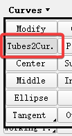

Keep the curve and delete the bolt geometric surface.
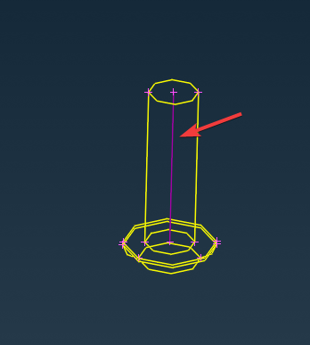

Then use `Topo` → `Points` → `Edges` to convert the curve into 3D points and delete the curve.
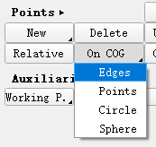
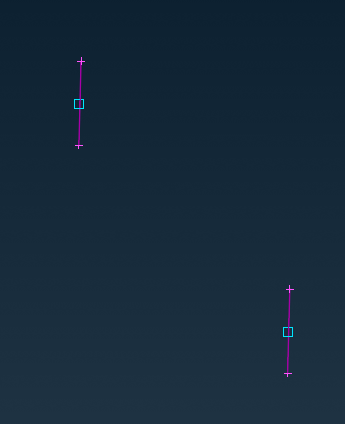

Generate bolt connection points based on 3D points, and select the 3D points generated in the previous step. In addition to defining connection points accidents based on curves, connection points can also be generated based on points and faces. However, different geometric forms correspond to different connection types, and attention should be paid to selecting the corresponding geometry according to the required connection type. Here are some commonly used connection types and geometric correspondences:

- 3D points: screw connection, riveting, welding points
- Line segments: adhesive, weld, edge wrapping, screw connection (linear segments)
- Surface: Adhesive

Bolt connection points can be generated based on 3D points or straight line segments, here you choose to generate them with 3D points.
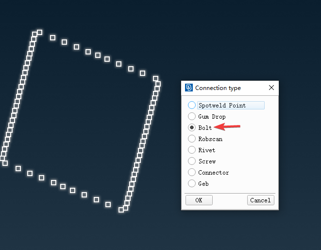

You can see in the model tree that the generated connection type is bolt.
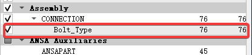

Throw all bolt connection points into a Part and the Part is displayed as the connection type.
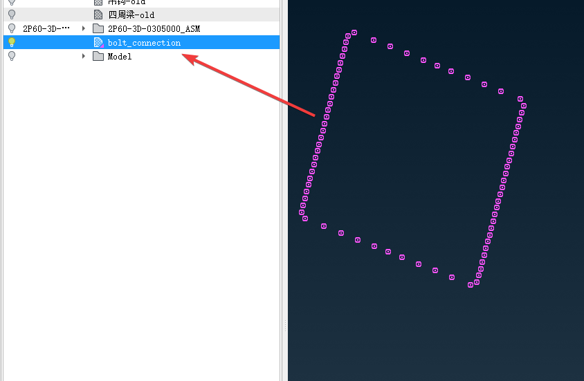

Select Connection Manager Connection Manager, select the connection point to be defined in the box and then use the middle mouse button to enter the connection definition dialog box.
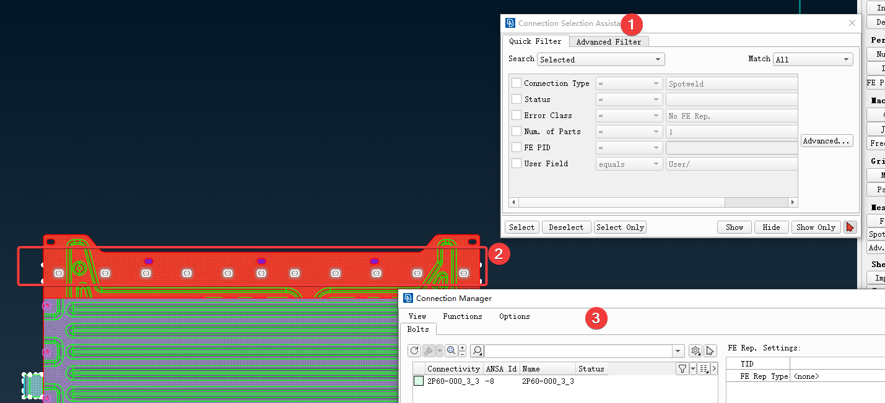

Select the connection method as `BOLT`, and fill in the search distance according to the geometric dimensions. Select the PID to be connected by selecting the part, double-click to enter the edit, and then enter the English half-width symbol `?` to open the selection dialog box, which supports up to 4 PID connections. Here, the default connection method of ANSA is to search by Part, which needs to be manually changed to PID. Supplement the bolt radius and other connection information, and press `Realize` to generate the connection.
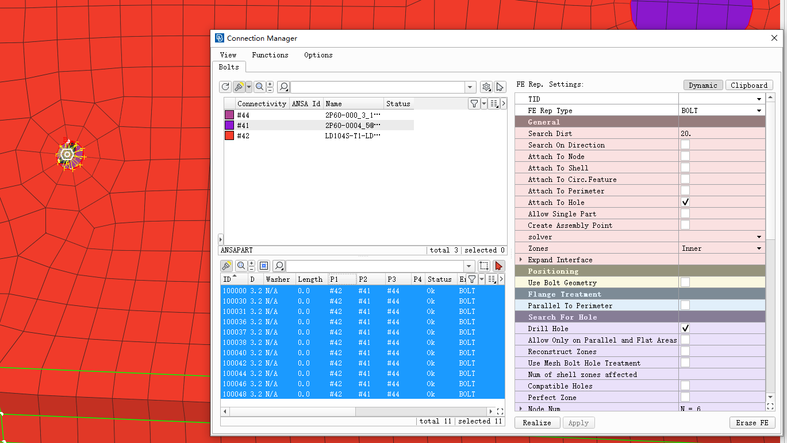

BEAM needs to set the material and cross-sectional dimensions, and set them in the pop-up PID dialog box.
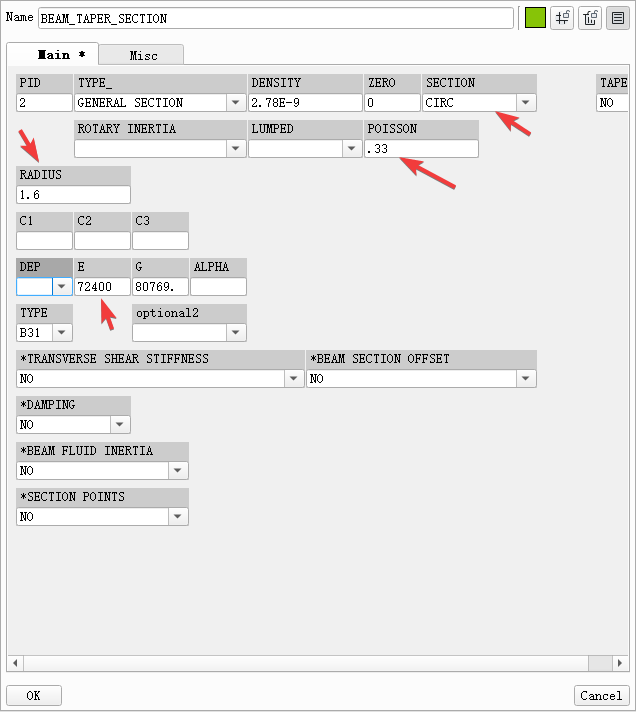

The connection effect is as follows.
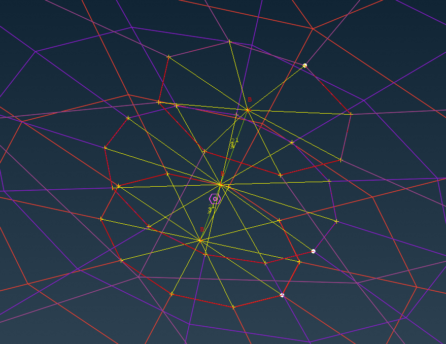

PS: If it is a shell mesh, you can generate a bolted mesh by using the bolt connection points generated by the 3D points above (as shown above). But if it is a solid mesh, you must connect the bolt holes with bolt connection points generated by straight line segments to generate connection points with directions, and the connection type must also select `BOLT ON SOLID`.
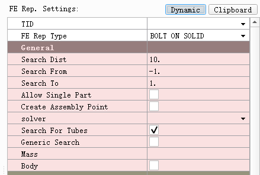
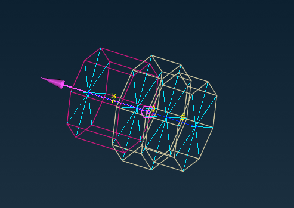

---