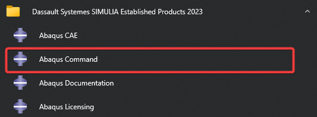

+++
author = "Andrew Moa"
title = "Abaqus Submit Command"
date = "2025-03-06"
description = ""
tags = [
    "abaqus",
    "cae",
]
categories = [
    "ansa",
]
series = [""]
aliases = [""]
image = "/images/abaqus-bg.jpg"
+++

After using Ansa to output the inp file, you can submit the inp file for calculation through the Abaqus CAE window interface, or you can submit the calculation through the command line. You need to add the Path when submitting using the command line. In Windows, it is usually the path `[Abaqus installation directory]\Commands`.

In fact, after installing Abaqus in Windows, the `Abaqus Command` shortcut will appear in the start menu. Clicking this shortcut can submit the abaqus calculation file through the command line without adding the Path.


Use the following command to submit the inp calculation file.
```Bash
abaqus job=[file-name]  cpus=[number-of-cores] double=both output_precision=full int ask=off
```


Generally speaking, you can start the calculation by specifying the file name through `job`. Some other command switches are not necessary options. Their meanings are as follows:
- `help` → View help
- `double={ explicit | both | off | constraint }` → Calculation accuracy
- `output_precision={ single | full }` → Output accuracy
- `int / interactive` → Print the solution process
- `ask=off` → Direct coverage without asking
- `memory=5gb` → Specify a maximum running memory of 5GB
- `scratch=D:\Temp` → Specify where to store temporary files

References: https://abaqus-docs.mit.edu/2017/English/SIMACAEEXCRefMap/simaexc-c-analysisproc.htm

---

