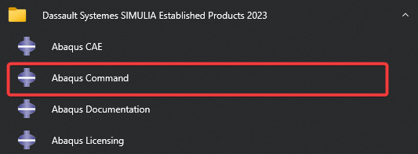
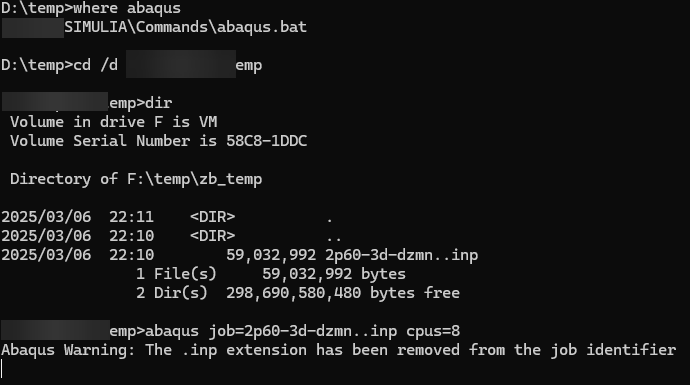

+++
author = "Andrew Moa"
title = "Abaqus提交命令"
date = "2025-03-06"
description = ""
tags = [
    "abaqus",
    "cae",
]
categories = [
    "ansa",
]
series = [""]
aliases = [""]
image = "/images/abaqus-bg.jpg"
+++

用Ansa输出inp文件之后，可以通过Abaqus CAE窗口界面提交inp文件进行计算，也可以通过命令行方式提交计算。使用命令行提交需要添加Path，Windows下通常是`[Abaqus安装目录]\Commands`路径。

其实Windows下装完Abaqus后，开始菜单会出现`Abaqus Command`快捷方式，点击该快捷方式可以通过命令行提交abaqus计算文件，不需要添加Path。


使用以下命令行提交inp计算文件。
```Bash
abaqus job=[文件名]  cpus=[核心数] double=both output_precision=full int ask=off
```


通常来说通过`job`指定文件名就可以开始计算了，其他一些命令开关不是必要选项，它们的含义如下：
- `help` →查看帮助
- `double={ explicit | both | off | constraint }` → 计算精度
- `output_precision={ single | full }` → 输出结果精度
- `int / interactive` → 打印求解过程
- `ask=off` → 不询问直接覆盖
- `memory=5gb` → 指定最大运行内存5GB
- `scratch=D:\Temp` → 指定计算临时文件存储地

参考资料：https://abaqus-docs.mit.edu/2017/English/SIMACAEEXCRefMap/simaexc-c-analysisproc.htm

---

