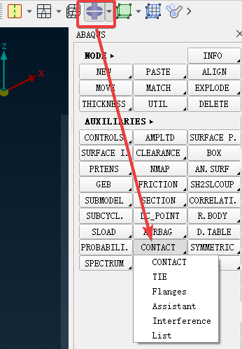
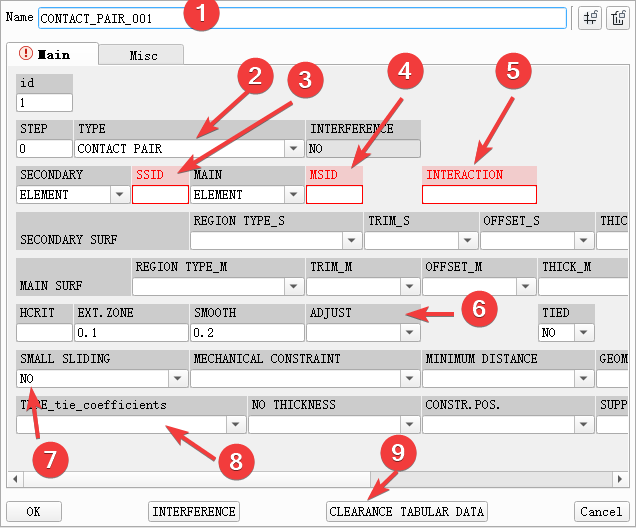
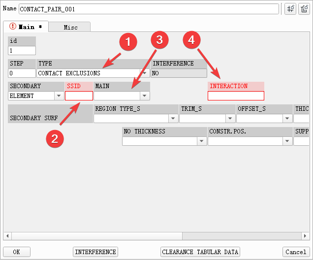
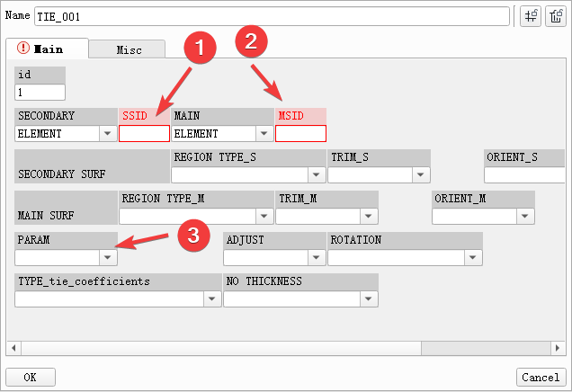
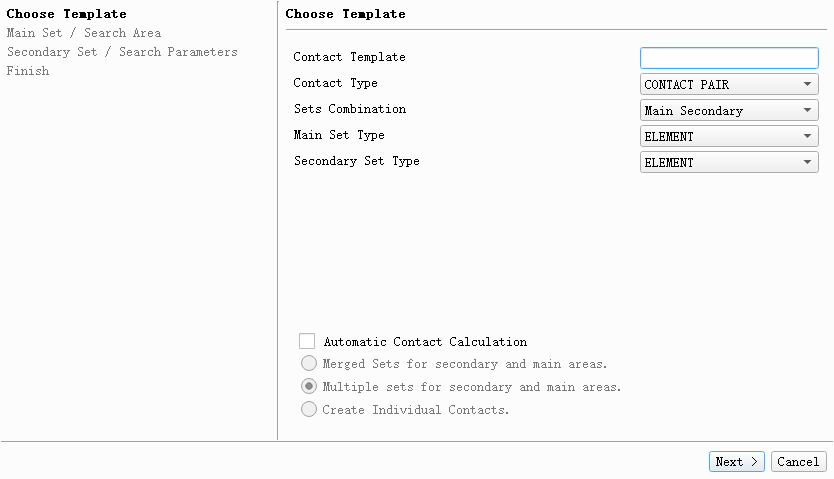
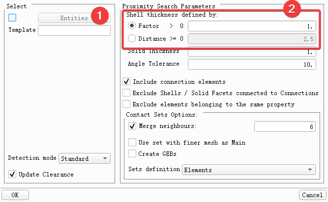
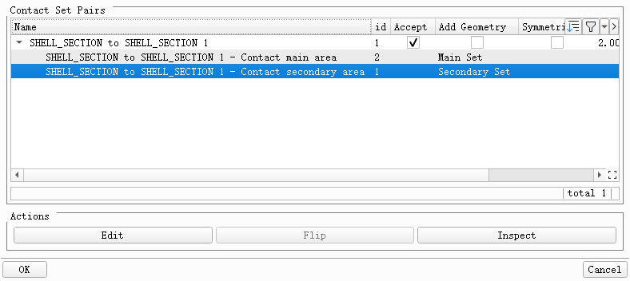
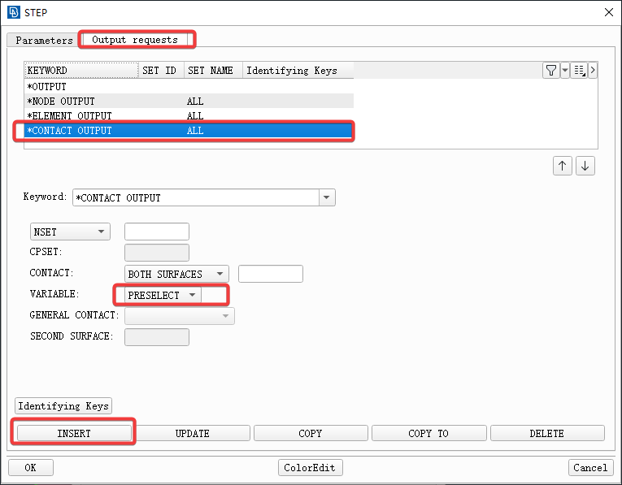

+++
author = "Andrew Moa"
title = "Abaqus Contact Settings"
date = "2025-03-10"
description = ""
tags = [
    "abaqus",
    "ansa",
    "cae",
]
categories = [
    "ansa",
]
series = [""]
aliases = [""]
image = "/images/abaqus-bg.jpg"
+++

## 1. Related commands
In Ansa, the following commands are commonly used to set contact for Abaqus:

## 2. Contact pair
The most commonly used contact pairs are generally created by calling up the creation dialog box through `AUXILIARIES` → `CONTACT` → `CONTACT` .

Common settings are generally as follows:
1. Define the contact name for easy retrieval
2. Define the contact type as `contact pair` (`CONTACT PAIR`) or `general contact` (`CONTACT INCLUSIONS` or `CONTACT EXCLUSIONS`)
3. For the contact slave surface, the unit set needs to be set in `SET` in advance
4. For the contact master surface, the unit set needs to be set in `SET` in advance
5. Contact behavior, define friction coefficient, etc.
6. Contact surface adjustment behavior, select `YES` to define the tolerance value in the subsequent `POS_TOLER`
7. Whether the contact surface produces small slip, the default is `NO`
8. Contact type, the default is `surface-to-surface`, or `node-to-surface`
9. Contact gap, define the interference or gap value of the contact

## 3. General Contact
It shares the same command and dialog box as creating contact pairs. You only need to change the contact type to `CONTACT INCLUSIONS` or `CONTACT EXCLUSIONS`.

1. Define contact type
2. Contact slave surface, select the unit set set in `SET`
3. Contact master surface, select the unit set set in `SET` (usually not required, can be left blank)
4. Contact behavior

## 4. Tie Contact
Call up the dialog via `AUXILIARIES` → `CONTACT` → `TIE`.

1. Contact the slave surface, select the unit set set in `SET`
2. Contact the master surface, select the unit set set in `SET`
3. When the two contact surfaces do not overlap, you can set the contact tolerance here

## 5.Contact Assistant
Ansa built-in function that can guide the establishment of contact. Called through the command `AUXILIARIES` → `CONTACT` → `Assistant`.

## 6. Automatically create contact pairs
Called up via `AUXILIARIES` → `CONTACT` → `Flanges`.

1. Select the object to search
2. Define the search distance tolerance

Check and define contact parameters in the pop-up dialog box.

## 7. Contact-related output settings
It is usually defined in the `OUTPUT` tab of `STEP`. If there are no special requirements, just select `PRESELECT` as the output parameter.

---

