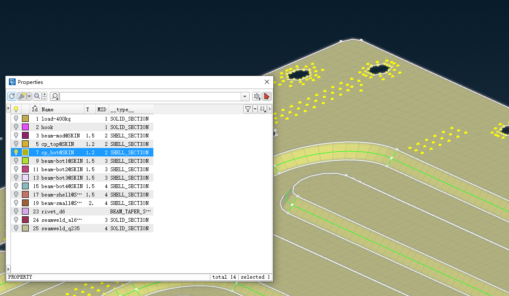
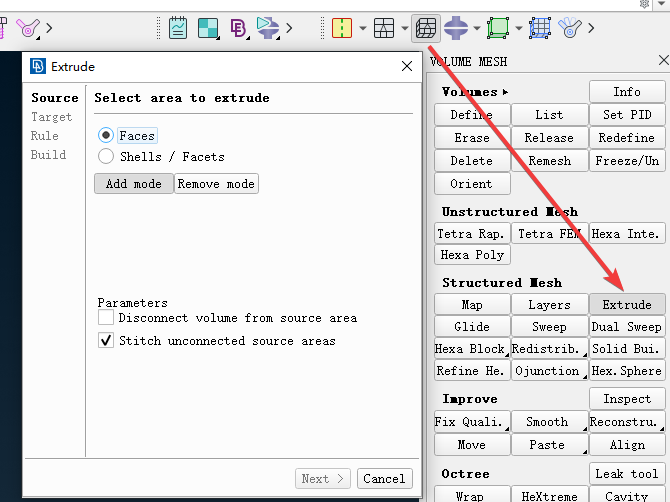
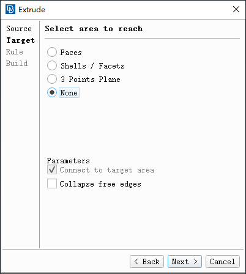
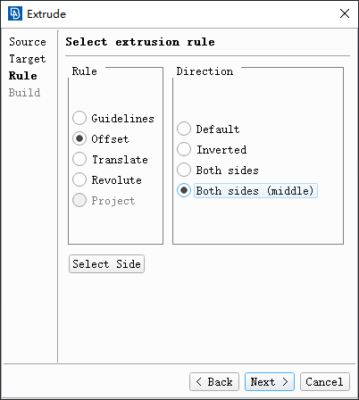
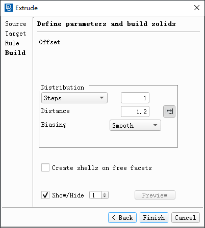
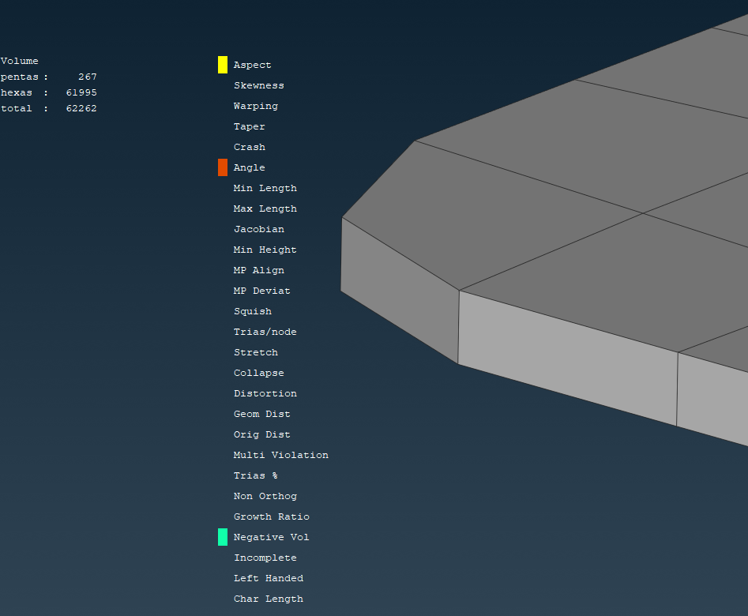
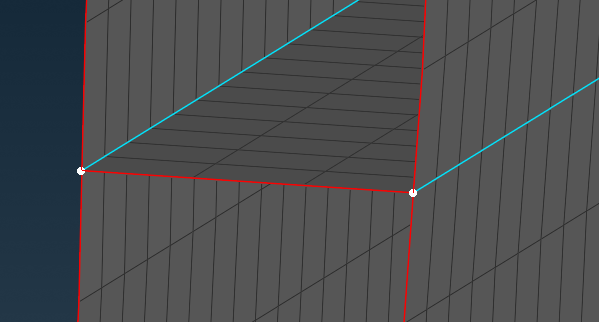

+++
author = "Andrew Moa"
title = "Ansa薄板网格建模"
date = "2025-03-18"
description = ""
tags = [
    "ansa",
    "cae",
]
categories = [
    "ansa",
]
series = [""]
aliases = [""]
image = "/images/grid-bg.jpg"
+++

Recently, I often do some cold plate structural analysis, involving thin plate modeling. Although I have tried to use Shell units for analysis, the stress and displacement results of Shell units are larger than those of Solid units, and it is more likely that the calculation will not converge when it comes to contact problems. Fortunately, Ansa provides a way to generate a body mesh by stretching Shell units, which can quickly generate a Solid mesh through Shell units, greatly saving modeling time.

The modeling steps are as follows:
1. Simplify the thin plate entity into a shell and divide the mesh. You can refer to [Extracting mid-face using Ansa](../2025-02-27-ansa-midsurf/).

2. `Volume Mesh` → `Extrude` to bring up the `Extrude` window and select the Shell unit to be stretched.

3. Select `None` for the target surface.

4. Select `Offset` for the stretch method and `Both sides (middle)` for the direction.

5. Select the number of layers in `Steps`, input the thickness of the thin plate in `Distance`, it is recommended to select `Smooth` in `Biasing`, and complete it in `Finish`.

6. Check the quality of the generated mesh and repair poor mesh.

Summary: This method is more suitable for generating volume meshes for thin plates with uniform thickness. However, it is not applicable when the thickness of the thin plate is uneven or there are T-type connections (such as plastic parts, ribs, etc., as shown in the figure below).

---

