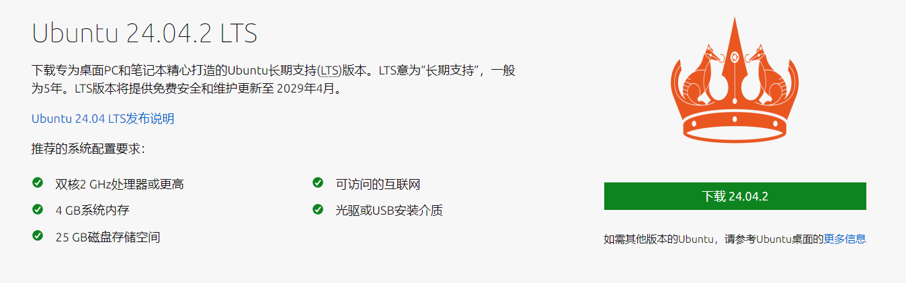
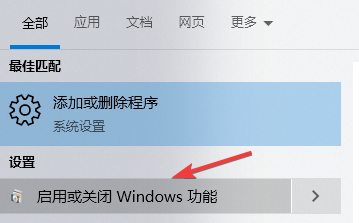
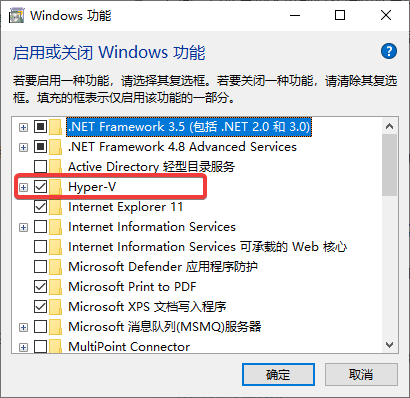
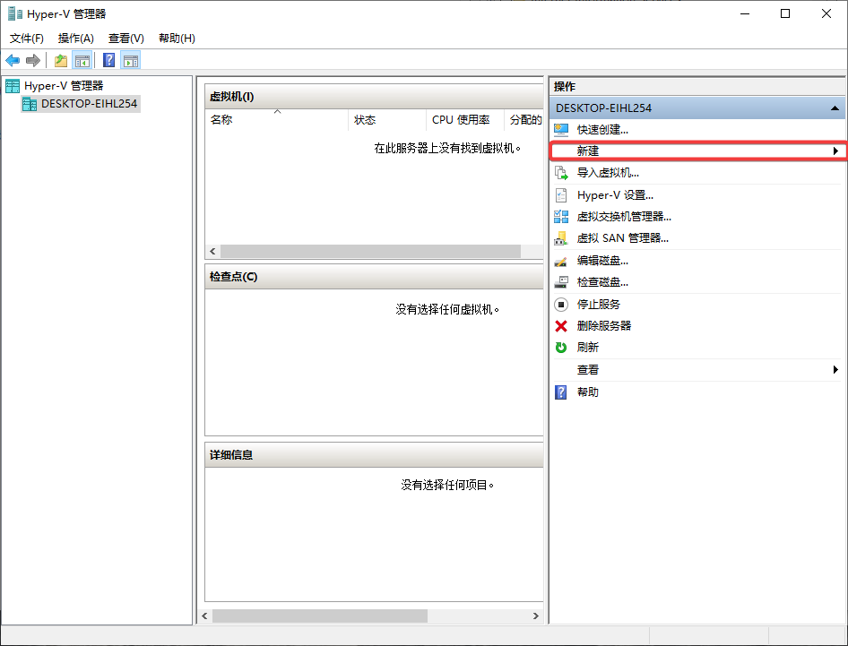
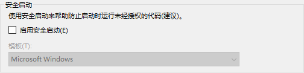
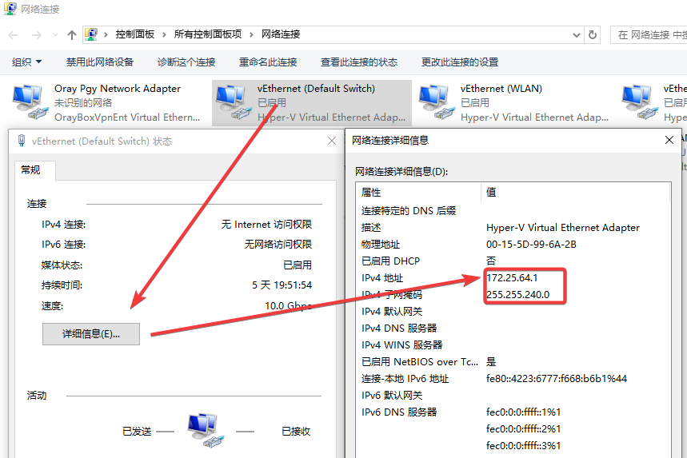
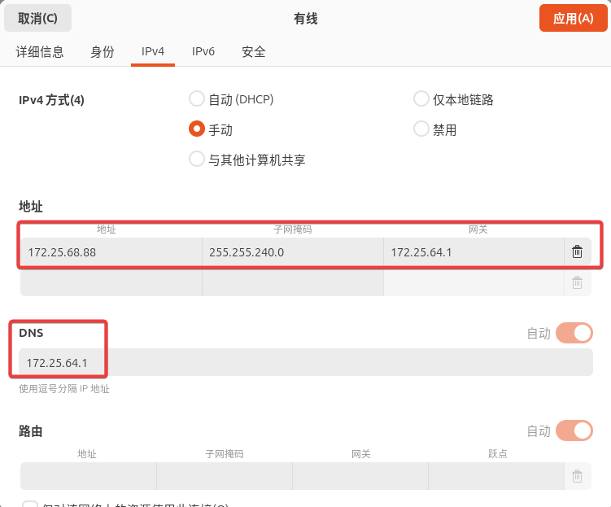
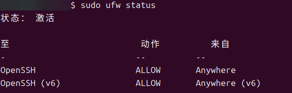
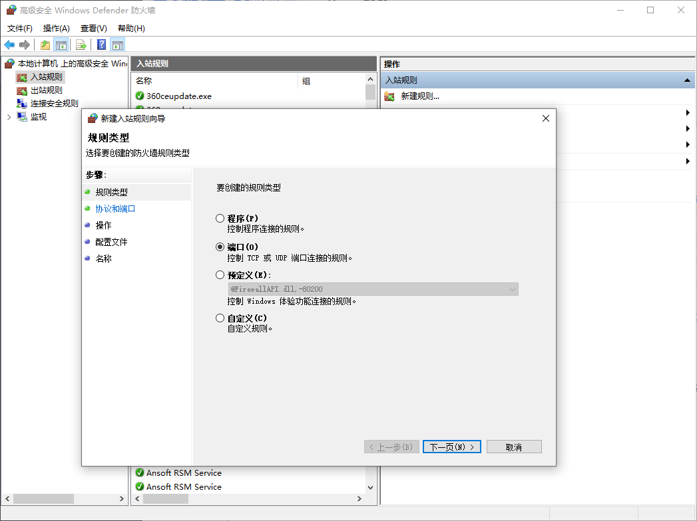

+++
author = "Andrew Moa"
title = "Hyper-V Installation Ubuntu24.04"
date = "2025-03-19"
description = ""
tags = [
    "linux",
    "ubuntu",
    "virtual-machine",
]
categories = [
    "linux",
]
series = [""]
aliases = [""]
image = "/images/hyperv-bg.png"
+++

## 1. Requirements

Consider installing Linux on a new computer, not a dual system, because it also needs to meet daily office work. If you don’t like to mess around, you can use WSL, which is implemented using Hyper-V, and at the same time, you can access the virtual machine through port mapping.

## 2. Preparation
### 2.1 Download Ubuntu

I am a CFD, so I naturally cannot do without Fluent. This thing is a distribution version. Confirm which distribution is supported from the official website information, and install which one is supported, so as not to reinstall the system later.

[Ansys Computing Platform Support 2024R1](https://www.ansys.com/content/dam/it-solutions/platform-support/2024-r1/ansys-platform-support-strategy-plans-january-2024.pdf)

Choose Ubuntu here and go to the official website to download the latest release.



### 2.2 Turn on Hyper-V support

Search "Enable or Turn off Windows Features" in the Start Menu to enable virtualization support.



Just hook Hyper-V, install and restart.



## 3. Install the virtual machine system

To start the Hyper-V interface, follow the wizard to create a new virtual machine step by step.



A few points to note:
- It is best to specify virtual machines and virtual disks on other partitions with more spare space. Frequent reading and writing are performed later, which will greatly swell the virtual disk files.
- The maximum memory allocation is smaller before the first startup, otherwise it will take a lot of time to start. It is recommended to adjust the memory size to the desired memory after installing and configuring the virtual machine system.
- Virtual machine settings can turn on TPM, but turn off Secure Boot (unless enabled `Microsoft UEFI Certification Authority` ), otherwise the installation disk cannot be loaded.



The Ubuntu installation process will not be explained carefully, just follow the wizard interface to install it step by step.

## 4. Configure the virtual machine grid

### 4.1 Virtual machine assigns IP address
We need to access the virtual machine through port mapping, so we need to assign a fixed IP address to the virtual machine. Since the virtual machine uses the default `Default Switch` For bridge settings, you need to view the IP address assigned by the host to the adapter. You can view it in the network connection options:


The address shown in the figure above is the IP address of the virtual machine accessing the host. Then assign a fixed address to the virtual machine, and fill in the IP address of the gateway and DNS on the host. The subnet mask remains the same. It is recommended to use the IP address assigned now.


After the setup is complete, ping Google's DNS to see if it can be connected to the Internet normally:
```Bash
ping 8.8.8.8
```

### 4.2 Turn on the remote desktop on the virtual machine
Ubuntu provides a graphical interface to configure the remote desktop, which will not be introduced here. The following is the content of configuring the RPD remote desktop through the command line.
Install third-party software:
```Bash
sudo apt install xrdp
```

Enable XRDP service:
```Bash
sudo systemctl enable xrdp
sudo systemctl start xrdp
```

Check service status:
Enable XRDP service:
```Bash
sudo systemctl sattus xrdp
```

### 4.3 Check the virtual machine firewall status
Ubuntu is usually ufw(Uncomplicated Firewall), the following command checks whether the firewall on the system is enabled and displays its current configuration.
```Bash
sudo ufw status
```
 
If the firewall is not enabled, the following command enables the firewall:
```Bash
sudo ufw enable
```

The following command opens port 3389 in the firewall:
```Bash
sudo ufw allow from any to any port 3389 proto tcp
```

At this time, we can connect to the Ubuntu virtual machine through the remote desktop instead of the virtual machine's small window.
Tip: Ubuntu needs to log out of the user in the virtual machine window before using the remote connection, otherwise there will be problems such as black screen and flashback. I don't know when this bug will be fixed.

## 5. Turn on virtual machine-related services

### 5.1 Turn on SSH service on the virtual machine
Install OpenSSH:
```Bash
sudo apt install openssh-server
```

Check SSH server status:
```Base
sudo systemctl status ssh
```
If the output displays `Active: active (running)` , indicating that the SSH server is running.

If the ssh service shows `Active: inactive (dead)` , enable the ssh service through the following command:
```Base
sudo systemctl enable ssh
sudo systemctl start ssh
```

The configuration file of the OpenSSH server is located in the default `/etc/ssh/sshd_config` . Users can repair this configuration file as needed to change the relevant configuration, such as listening to ports, allowing or prohibiting password login, restricting logged in users, etc.

### 5.2 Add firewall rules for virtual machines
The following command adds SSH rules to the firewall:
```Bash
sudo ufw allow OpenSSH
```

The following status indicates that the firewall configuration is successful:


### 5.3 Testing SSH connection

The IP address of the Ubuntu virtual machine can be viewed in the Hyper-V manager window, or can be obtained in the virtual machine through the following command:
```Bash
ip addr show | grep inet
ip a | grep inet    # Same effect
```

Using bash or powershell client, connect to the server via the following command, `username` and `ip_address` Replace the username and IP address of the virtual machine respectively, and you will be prompted to enter your password:
```Bash
ssh username@ip_address
```

### 5.4 Testing SFTP connection
After enabling ssh, sftp will be enabled by default. The port number is 22 like ssh. Connect sftp through the following command, enter your password according to the prompts to log in:
```Bash
sftp username@ip_address
```

Upload file `put` : Put the local server `D:\temp\test` The following directory`test.txt`Upload files to remote server `/home/username/test` In the directory.
```sftp
sftp> lcd D:/temp/test
sftp> cd /home/username/test
sftp> put test.txt 
```

Upload folder `put` : Put the local server `D:\temp\test` The following directory `logs` Upload folder to remote server `/home/username/test` In the directory.
```sftp
sftp> lcd D:/temp/test
sftp> cd /home/username/test
sftp> put -r logs
```

Download command: `get` , usage is similar to put.
Common sftp commands can be passed `help` Check. It is recommended to use third-party tools, such as `FileZilla` Go to log in.

## 6. Port Mapping

### 6.1 Host port mapping
First, check the port occupancy of the host. exist `PowerShell` or `CMD` Check it through the following command:

```PowerShell
netstat -ano # View all ports
netstat -ano | findstr 8022 # 8022 is the query port number
tasklist | findstr 5748 # 5748 refers to the pid corresponding to port 8022, which is used to check the program occupying the port.
```

Open it in the host using administrator privileges `PowerShell` or `CMD` Window, query, add, and delete port mappings through the following commands.

```PowerShell
# Query port mapping
netsh interface portproxy show v4tov4
 
# Query the specified IP port mapping
netsh interface portproxy show v4tov4|findstr "192.168.100.135"
 
<# Add a port mapping
netsh interface portproxy add v4tov4 listenport=[Host port] listenaddress=[Host IP] connectaddress=[Virtual machine IP] connectport=[Virtual machine port]
#>
 
# Access SSH by mapping the host machine's port 8022 to the virtual machine's port 22
netsh interface portproxy add v4tov4 listenport=8022 listenaddress=192.168.100.135 connectaddress=172.25.68.88 connectport=22
# Access the remote desktop by mapping the host machine's ports 63389 and 63390 to the virtual machine's ports 3389 and 3390
# Port number range: 1-65535, cannot exceed this range
netsh interface portproxy add v4tov4 listenport=63389 listenaddress=192.168.100.135 connectaddress=172.25.68.88 connectport=3389
netsh interface portproxy add v4tov4 listenport=63390 listenaddress=192.168.100.135 connectaddress=172.25.68.88 connectport=3390
 
<# Delete a port mapping
netsh interface portproxy delete v4tov4 listenaddress=[Host IP] listenport=[Host port]
#>
 
# Delete the port mapping defined above
netsh interface portproxy delete v4tov4  listenaddress=192.168.100.135 listenport=8022
netsh interface portproxy delete v4tov4  listenaddress=192.168.100.135 listenport=63389
netsh interface portproxy delete v4tov4  listenaddress=192.168.100.135 listenport=63390
```

After configuring the port mapping, you can access it in the remote desktop `IP address:Port number` The form of the virtual machine desktop is connected to the form of the virtual machine desktop.

### 6.2 Host firewall settings

The host firewall must open the port so that it can be accessed through the external network. Open first `Windows Defender Firewall` ,exist `Advanced` Create new inbound rules in it.

Select the port for the rule type, enter the port number to enter the port number (separated by English half-width commas), and then confirm all of it later.

Until now, it was finally realized that the external network user accessed the virtual machine through the host's IP address + port number.

---