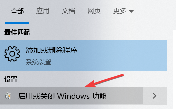
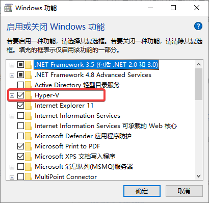
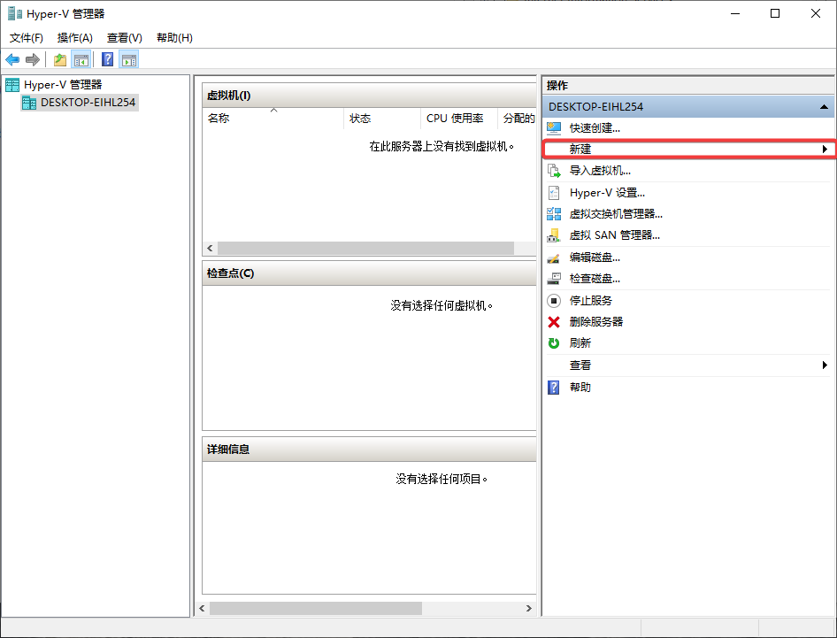
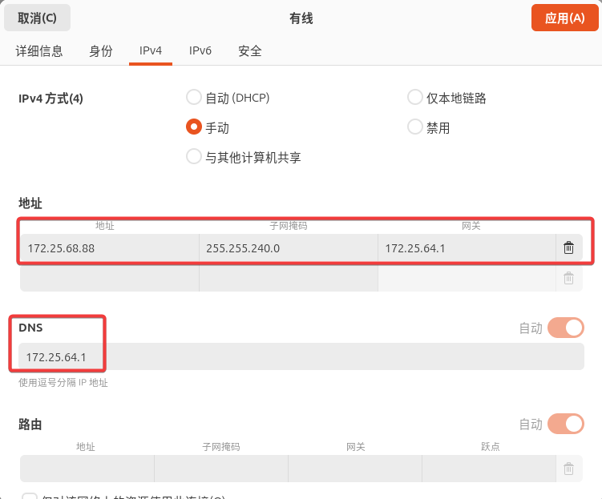
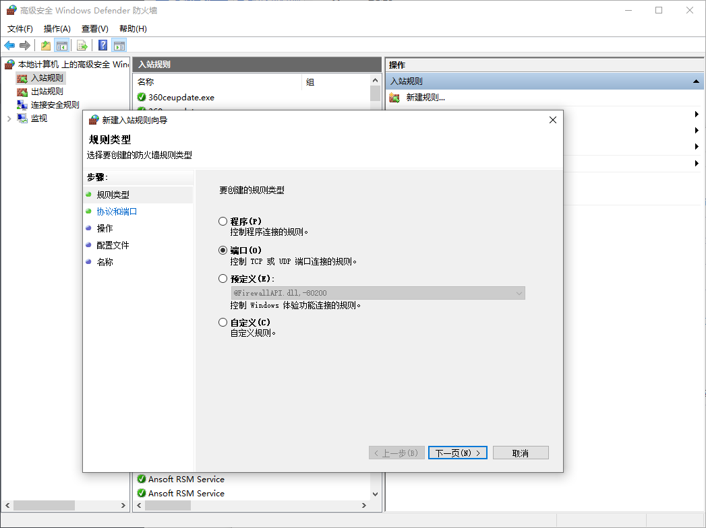

+++
author = "Andrew Moa"
title = "Hyper-V安装Ubuntu24.04"
date = "2025-03-19"
description = ""
tags = [
    "linux",
    "ubuntu",
    "virtual-machine",
]
categories = [
    "linux",
]
series = [""]
aliases = [""]
image = "/images/hyperv-bg.png"
+++

## 1. 需求

考虑在新电脑上安装Linux，不是双系统，因为还要满足日常办公。不喜欢折腾的可以用WSL，这里用Hyper-V实现，同时通过端口映射实现外网访问虚拟机。

## 2. 准备工作
### 2.1 下载Ubuntu

笔者是做CFD的，自然离不开Fluent，这玩意儿挑发行版的。从官网资料确认支持哪个发行版，支持哪个就装哪个，免得后面倒腾回来重装系统。

[Ansys Computing Platform Support 2024R1](https://www.ansys.com/content/dam/it-solutions/platform-support/2024-r1/ansys-platform-support-strategy-plans-january-2024.pdf)

这里选择Ubuntu，前往官网下载最新的发行版。


### 2.2 开启Hyper-V支持

在开始菜单搜索“启用或关闭Windows功能”，开启虚拟化支持。



把Hyper-V勾上，安装并重启就行了。



## 3. 安装虚拟机系统

Hyper-V启动界面，跟着向导一步步新建虚拟机即可。



需要注意几点：
- 虚拟机和虚拟磁盘最好指定在其他空余空间比较多的分区上，后面运行频繁读写会使虚拟磁盘文件膨胀的很大。
- 第一次启动前最大内存分配小一点，不然启动很花时间，建议安装并配置完虚拟机系统后再调整到想要的内存大小。
- 虚拟机设置可以打开TPM，但是要关掉安全启动（除非启用`Microsoft UEFI证书颁发机构`），否则无法载入安装盘。


Ubuntu安装过程不仔细说明了，跟着向导界面一步步安装即可。

## 4. 配置虚拟机网格

### 4.1 虚拟机分配IP地址
我们需要通过端口映射访问虚拟机，因此需要给虚拟机指派一个固定的IP地址。由于虚拟机用的是默认的`Default Switch`桥接设置，需要查看宿主机给改适配器指派的IP地址，在网络连接选项中可以查看：


上图显示的地址就是虚拟机访问宿主机的IP地址。接着在虚拟机中指派一个固定地址，网关和DNS填上面宿主机的IP地址，子网掩码保持一致，IP地址建议就用现在指派的IP地址。


设置完成后ping一下google的DNS看看是否能正常联网：
```Bash
ping 8.8.8.8
```

### 4.2 虚拟机开启远程桌面
Ubuntu提供了图形界面配置远程桌面，这里不作介绍了。下面是通过命令行配置RPD远程桌面的内容。
安装第三方软件：
```Bash
sudo apt install xrdp
```

启用 XRDP 服务：
```Bash
sudo systemctl enable xrdp
sudo systemctl start xrdp
```

检查服务状态：
启用 XRDP 服务：
```Bash
sudo systemctl sattus xrdp
```

### 4.3 检查虚拟机防火墙状态
 Ubuntu 通常是 ufw(Uncomplicated Firewall)，以下命令检查系统上的防火墙是否已启用并显示其当前配置。
```Bash
sudo ufw status
```
 
如果防火墙尚未启用，以下命令启用防火墙：
```Bash
sudo ufw enable
```

以下命令在防火墙中打开3389端口：
```Bash
sudo ufw allow from any to any port 3389 proto tcp
```

这时候我们就可以通过远程桌面，而不是虚拟机的小窗口连接Ubuntu虚拟机了。
提示：Ubuntu需要先在虚拟机窗口中注销用户，才能使用远程连接，否则会出现黑屏、闪退的问题。不知道这个bug何时能修复。

## 5. 开启虚拟机相关服务

### 5.1 虚拟机开启SSH服务
安装 OpenSSH ：
```Bash
sudo apt install openssh-server
```

检查 SSH 服务器状态：
```Base
sudo systemctl status ssh
```
如果输出显示`Active: active (running)`，表示 SSH 服务器正在运行。

如果ssh服务显示`Active: inactive (dead)`，通过以下命令开启ssh服务：
```Base
sudo systemctl enable ssh
sudo systemctl start ssh
```

OpenSSH服务器的配置文件默认位于`/etc/ssh/sshd_config`。用户可以根据需要修此配置文件来更改相关配置，例如监听端口、允许或禁止密码登录、限制登录用户等。

### 5.2 虚拟机添加防火墙规则
以下命令在防火墙中添加 SSH 规则：
```Bash
sudo ufw allow OpenSSH
```

以下状态显示防火墙配置成功：


### 5.3 测试SSH连接

Ubuntu虚拟机的IP地址可以在Hyper-V管理器的窗口中查看，也可以在虚拟机中通过以下命令获取：
```Bash
ip addr show | grep inet
ip a | grep inet	#这两条命令效果一样
```

使用bash或powershell客户端，通过以下命令连接到服务器，将`username`和`ip_address`分别替换为虚拟机的用户名和IP地址即可，会提示输入密码：
```Bash
ssh username@ip_address
```

### 5.4 测试SFTP连接
启用ssh之后会默认开通sftp，端口号和ssh一样都是22，通过以下命令连接sftp，根据提示输入密码即可登录：
```Bash
sftp username@ip_address
```

上传文件`put`：  把本地服务器的`D:\temp\test`目录下面的`test.txt`文件上传到远程服务器的`/home/username/test`目录下。
```sftp
sftp> lcd D:/temp/test
sftp> cd /home/username/test
sftp> put test.txt 
```

上传文件夹`put`：把本地服务器的`D:\temp\test`目录下面的`logs`文件夹上传到远程服务器的`/home/username/test`目录下。
```sftp
sftp> lcd D:/temp/test
sftp> cd /home/username/test
sftp> put -r logs
```

下载命令：`get`，用法与put类似。
sftp常用命令可以通过`help`查看。建议通过第三方工具，比如`FileZilla`来登录操作。

## 6. 端口映射

### 6.1 宿主机端口映射
首先要查看宿主机的端口占用情况。在`PowerShell`或`CMD`中通过以下命令查看：

```PowerShell
netstat -ano #查看所有端口
netstat -ano | findstr 8022 #8022为查询的端口号
tasklist | findstr 5748 #5748指的是8022端口对应的pid，查看占用该端口的程序
```

宿主机中用管理员权限打开`PowerShell`或`CMD`窗口，通过以下命令查询、添加、删除端口映射。

```PowerShell
# 查询端口映射
netsh interface portproxy show v4tov4
 
# 查询指定IP端口映射
netsh interface portproxy show v4tov4|findstr "192.168.100.135"
 
<# 增加一个端口映射
netsh interface portproxy add v4tov4 listenport=宿主机端口 listenaddress=宿主机IP connectaddress=虚拟机IP connectport=虚拟机端口
#>
 
# 通过宿主机8022端口映射虚拟机22端口，访问SSH
netsh interface portproxy add v4tov4 listenport=8022 listenaddress=192.168.100.135 connectaddress=172.25.68.88 connectport=22
# 通过宿主机63389、63390端口映射虚拟机3389、3390端口，访问远程桌面
# 端口号范围：1-65535，不能超出该范围
netsh interface portproxy add v4tov4 listenport=63389 listenaddress=192.168.100.135 connectaddress=172.25.68.88 connectport=3389
netsh interface portproxy add v4tov4 listenport=63390 listenaddress=192.168.100.135 connectaddress=172.25.68.88 connectport=3390
 
<# 删除一个端口映射
netsh interface portproxy delete v4tov4 listenaddress=宿主机IP listenport=宿主机端口
#>
 
# 删除上面定义的端口映射
netsh interface portproxy delete v4tov4  listenaddress=192.168.100.135 listenport=8022
netsh interface portproxy delete v4tov4  listenaddress=192.168.100.135 listenport=63389
netsh interface portproxy delete v4tov4  listenaddress=192.168.100.135 listenport=63390
```

配置好端口映射后，就可以在远程桌面中通过访问`IP地址:端口号`的形式连接到虚拟机桌面了。

### 6.2 宿主机防火墙设置

宿主机防火墙要开放端口，这样才能通过外网访问。首先打开`Windows Defender防火墙`，在`高级设置`里面新建入站规则。

规则类型选择端口，端口号输入上面映射的端口(用英文半角逗号隔开)，后面全部确认即可。

到此为止，终于实现外网用户通过宿主机的IP地址+端口号的形式访问该虚拟机了。

---