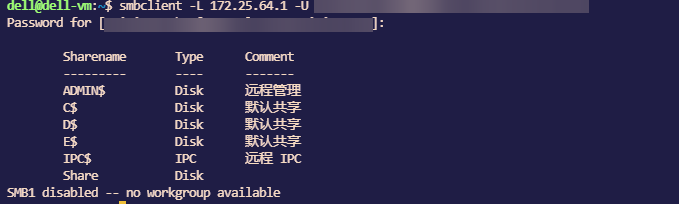
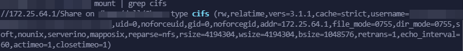
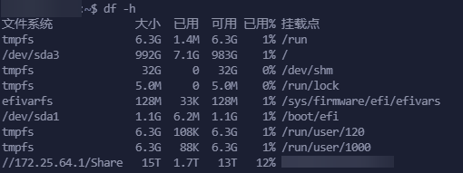
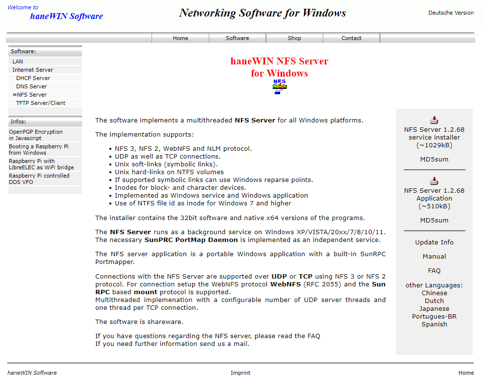

+++
author = "Andrew Moa"
title = "Ubuntu mounts Windows shared folder (cifs+nfs)"
date = "2025-03-20"
description = ""
tags = [
    "linux",
    "ubuntu",
]
categories = [
    "linux",
]
series = [""]
aliases = [""]
image = "/images/ubuntu-bg.jpg"
+++

Running calculation files in a virtual machine will cause the virtual disk to expand and take up too much disk space. At this time, you can transfer the calculation files to the host disk by mounting the host folder, avoiding the problem of virtual disk expansion.
Creating a shared folder in Windows is omitted here. You only need to ensure that the virtual machine can access the host through the IP address.

## 1. Check the resource path

The following command checks the resource path shared by the server and confirms the mount point:
```Bash
smbclient -L 172.25.64.1 -U ${username}
```


Mount point access path: `//172.25.64.1/Share`

## 2. Mounting method

To access Windows shared folders in Ubuntu, you must first install the cifs tool:
```Bash
sudo apt install cifs-utils
```

Then mount the shared folder using the `mount` command:
```Bash
sudo mount -t cifs //172.25.64.1/Share /mnt -o username=${username},password=${password}
```
Here, the IP address `172.25.64.1` is the gateway address of the host machine accessed in the virtual machine, `Share` is the folder shared by the host machine, and `/mnt` is the local access path of the virtual machine to be mounted. Replace `${username}` and `${password}` after the command with the access username and password.
It should be noted that the username of the local Windows user needs to be written in the form of `${computer name}\${username}`, connected with a backslash, for example: `xxx-desktop\administrator`. If it is an online account, you need to fill in the full email account name.
If the password contains special escape characters such as commas, the command line should not contain `,password=` and the following content, and then enter the password according to the prompts to log in.

If there is a problem with no read or write permissions, add `dir_mode=0777,file_mode=0777` to the mount command:
```Bash
sudo mount -t cifs //172.25.64.1/Share /mnt -o dir_mode=0777,file_mode=0777,username=${username},password=${password}
```

If you want to add read and write permissions only for certain users, specify the user and group by `uid` and `gid`:
```Bash
sudo mount -t cifs //172.25.64.1/Share /mnt -o uid=user,gid=group,username=${username},password=${password}
```

You can view the mount status through the `mount` command:
```Bash
mount | grep cifs
```


Unmount via the `umount` command:
```Bash
sudo umount /mnt
```

If you want to mount automatically when booting, you need to edit `/etc/fstab`, the content is as follows:
```text
//172.25.64.1/Share /mnt cifs auto,dir_mode=0777,file_mode=0777,username=${username},password=${password} 0 0
```

## 3. Special character passwords

If the password contains special escape characters, you can use the following methods to automatically mount Windows shared folders when Linux boots up[^1]:

1. Create a credential file: To keep the password secure, it is best to save the Windows shared username and password in a file that only root can access, such as: `/etc/cifs-credentials`, and make sure its permissions are set to be readable only by root.
   ```Bash
   sudo touch /etc/cifs-credentials
   sudo chmod 600 /etc/cifs-credentials
   ```

2. Use a text editor to edit the file. If the password contains special characters, enter them directly in the file (without escaping). Write the username (xxx-desktop\administrator) and password (123456,abcde):

   ```text
   username=xxx-desktop\administrator
   password=123456,abcde
   ```
3. Edit the `/etc/fstab` file: Open the `/etc/fstab` file and add the following content at the end of the file to include the mount information:
    ```text
   //172.25.64.1/Share /mnt cifs credentials=/etc/cifs-credentials,iocharset=utf8,file_mode=0777,dir_mode=0777 0 0
   ```
	Note that the encoding of the /etc/cifs-credentials file needs to be UTF-8.

The above completes the automatic mount setting at boot time. You can verify it through `df -h` after restart.


## 4. Permission issues

When using cifs to mount Windows shared folders, commands such as chmod and chown are invalid, and the permissions of the mounted files and folders cannot be adjusted. Here, NFS (Network File System) is used to mount shared folders to solve this problem.

By default, NFS does not provide any authentication mechanism, so there is no need to verify the username and password, which poses a certain security risk. NFSv3 completes authentication based on the client IP address[^2], and security can be improved by specifying the client IP address.

Windows 10 can create NFS shared folders through the third-party tool haneWIN[^3]. Download and install it and configure it through the graphical interface. I will not go into details here, but you can refer to other related articles[^4]. Note that after the configuration is completed, the relevant ports must be opened in the firewall.


Install NFS related tools on Ubuntu and enable related services:
```Bash
sudo apt install nfs-common rpcbind
sudo systemctl start rpcbind
sudo systemctl enable rpcbind
```

Use the `mount` command to mount the shared directory. Note the `-t nfs` at the end:
```Bash
sudo mount -t nfs 172.25.64.1:/Share /mnt 
```

The unmount command is the same as cifs. When the network status is suddenly interrupted, you can add the `-lf` switch:
```Bash
sudo umount -lf /mnt
```

Edit `/etc/fstab` and add automatic mount at boot:
```text
172.25.64.1:/Share	/mnt	nfs	defaults,_netdev 0 0
```

[^1]: [Linux开机自动挂载window密码有转义字符的共享文件夹](https://blog.csdn.net/qq_37959253/article/details/135715798)

[^2]: [NFS身份验证](https://developer.aliyun.com/article/1629577)

[^3]: [haneWIN](https://www.hanewin.net/nfs-e.htm)

[^4]: [Windows服务器使用haneWIN NFS Server快速搭建NFS服务并挂载到Linux服务器](https://cloud.tencent.com/developer/article/2404222)
