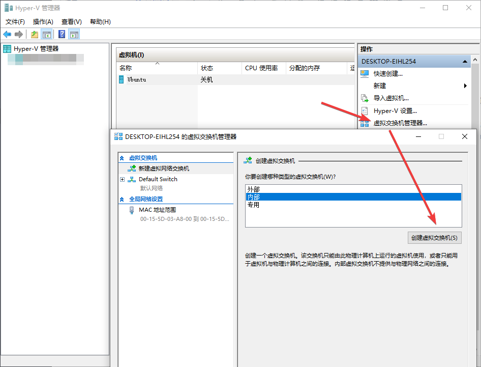
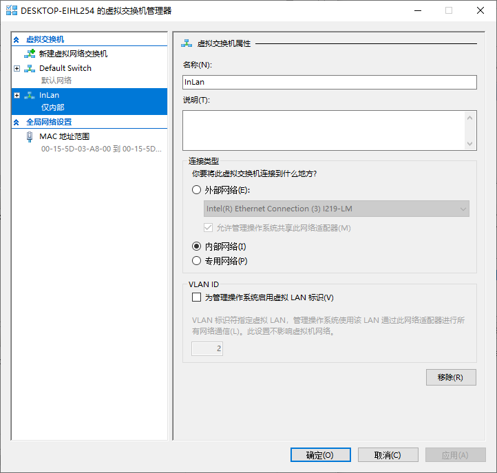
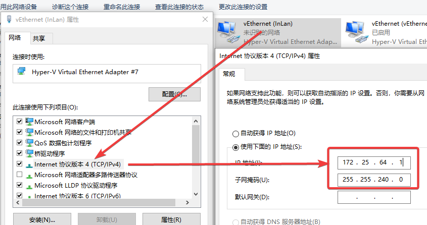
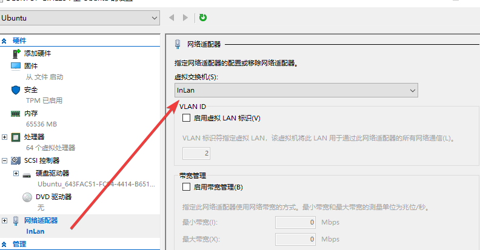
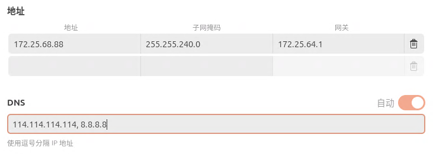

+++
author = "Andrew Moa"
title = "Hyper-V Virtual Switch NAT Setting Static IP"
date = "2025-03-21"
description = ""
tags = [
    "virtual-machine",
]
categories = [
    "linux",
]
series = [""]
aliases = [""]
image = "/images/hyperv-bg.png"
+++

I have mentioned before that you can use NAT+port mapping to access a virtual machine, but I found a problem during use: every time the host machine is restarted, the default `Default Switch` IP address will change, causing the virtual machine to be unable to access the gateway and thus unable to connect to the Internet.

In order to ensure that the virtual machine is connected to the Internet, you must manually set the IP address of the adapter corresponding to the `Default Switch` every time you restart the machine, which is very inconvenient. The following is a solution given in reference to the [Microsoft official document](https://learn.microsoft.com/zh-cn/virtualization/hyper-v-on-windows/user-guide/setup-nat-network).

The previous steps here can be implemented through the graphical user interface. First, create a new internal virtual switch:


Name the virtual switch and remember it for later use. Confirm the creation:


Find the newly created virtual machine adapter in the Windows network adapter, change the IP address to the gateway address set for the virtual machine, and change the subnet mask to be consistent with the virtual machine settings:


Next, open PowerShell with administrator privileges and use the following command line to check whether there is a NAT network:
```PowerShell
Get-NetNat
```

Because there can only be one NAT network on a machine, remove the existing NAT network first:
```PowerShell
Get-NetNat | Remove-NetNat
```

Setting up NAT network:
```PowerShell
# InLan is the NAT network name, 172.25.64.0 is the subnet gateway IP address, and /24 is the subnet prefix length.
New-NetNat -Name InLan -InternalIPInterfaceAddressPrefix 172.25.64.0/24
```
Regarding the subnet gateway, it can be in the same network segment as the IP address of the virtual machine adapter set above, that is, the gateway address of the virtual machine, and the end of it is set to 0; in this example, the gateway address of the virtual machine above is 172.25.64.1, so the subnet gateway address is generally set to 172.25.64.0. The subnet prefix is the subnet mask. Regarding the length of the subnet prefix, generally speaking, 2xx.2xx.2xx.0 is 24 bits, and 2xx.2xx.2xx.2xx is 32 bits.

After the settings are completed, use Get-NetNat to check whether there is NAT network information:
```PowerShell
Name                             : InLan
ExternalIPInterfaceAddressPrefix :
InternalIPInterfaceAddressPrefix : 172.25.64.0/24
IcmpQueryTimeout                 : 30
TcpEstablishedConnectionTimeout  : 1800
TcpTransientConnectionTimeout    : 120
TcpFilteringBehavior             : AddressDependentFiltering
UdpFilteringBehavior             : AddressDependentFiltering
UdpIdleSessionTimeout            : 120
UdpInboundRefresh                : False
Store                            : Local
Active                           : True
```

The new NAT network is now configured, and the newly set virtual switch is replaced in the virtual machine settings.


Log in to the virtual machine again and manually set the DNS (I don’t understand why the DNS cannot be automatically obtained through the gateway, maybe it’s a BUG...), otherwise the virtual machine will not be able to access the external network.


---