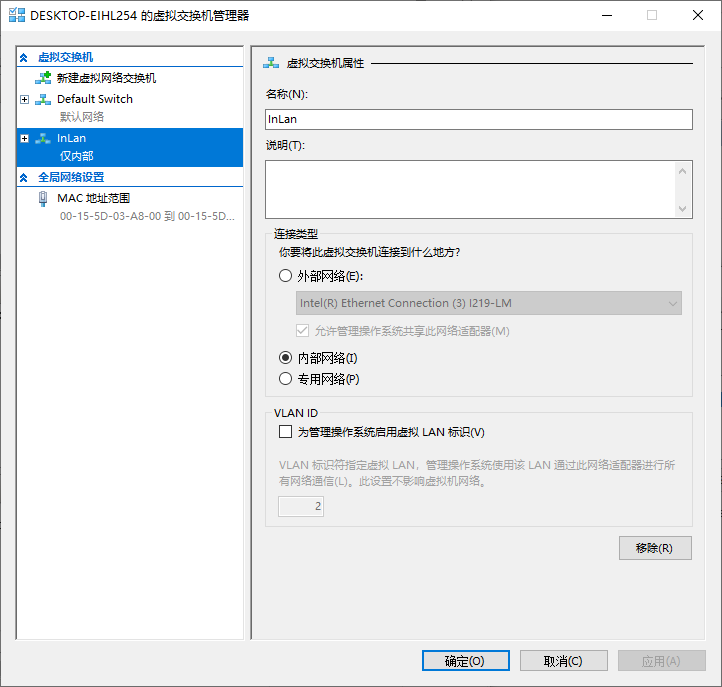
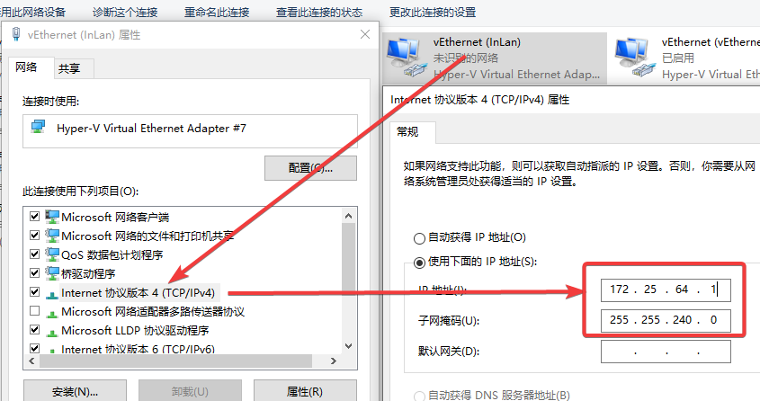
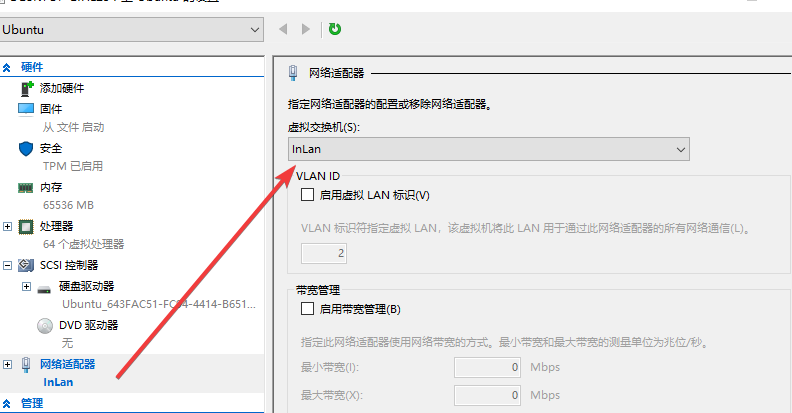

+++
author = "Andrew Moa"
title = "Hyper-V虚拟交换机NAT设置静态IP"
date = "2025-03-21"
description = ""
tags = [
    "virtual-machine",
]
categories = [
    "linux",
]
series = [""]
aliases = [""]
image = "/images/hyperv-bg.png"
+++

前面讲过用NAT+端口映射的方式访问虚拟机，但使用过程中发现一个问题：每次宿主机重启之后，默认的`Default Switch`IP地址都会变更，造成虚拟机无法访问网关进而无法联网。

为了保证虚拟机联网，每次重启开机都要手动设置`Default Switch`对应适配器的IP地址，非常不便。下面是参考[微软官方文档](https://learn.microsoft.com/zh-cn/virtualization/hyper-v-on-windows/user-guide/setup-nat-network)给出的解决方案。

这里前面的步骤可以通过图形用户界面去实现，首先新建一个内部的虚拟交换机：


命名虚拟交换机，记住它，后面会用到。确定新建：


在Windows网络适配器中找到新建的虚拟机适配器，将IP地址改成虚拟机设置的网关地址，子网掩码也改成和虚拟机设置的一致：


下面用管理员权限打开PowerShell，通过以下命令行查看是否已有NAT网络：
```PowerShell
Get-NetNat
```

因为一个机器上只能有一个NAT网络，因此要先移除现有的NAT网络：
```PowerShell
Get-NetNat | Remove-NetNat
```

设置NAT网络：
```PowerShell
# InLan为NAT网络名称，172.25.64.0为子网网关IP地址，/24为子网前缀长度
New-NetNat -Name InLan -InternalIPInterfaceAddressPrefix 172.25.64.0/24
```
关于子网网关，和上面设置的虚拟机适配器的IP地址即虚拟机的网关地址处在同一个网段即可，末尾设置为0；本例上面虚拟机的网关地址为172.25.64.1，那子网网关地址一般设置为172.25.64.0。子网前缀即子网掩码，关于子网前缀长度，通俗来讲，像2xx.2xx.2xx.0这种都是24位，2xx.2xx.2xx.2xx这种为32位。

设置完成后通过Get-NetNat查看是否有NAT网络信息：
```PowerShell
Name                             : InLan
ExternalIPInterfaceAddressPrefix :
InternalIPInterfaceAddressPrefix : 172.25.64.0/24
IcmpQueryTimeout                 : 30
TcpEstablishedConnectionTimeout  : 1800
TcpTransientConnectionTimeout    : 120
TcpFilteringBehavior             : AddressDependentFiltering
UdpFilteringBehavior             : AddressDependentFiltering
UdpIdleSessionTimeout            : 120
UdpInboundRefresh                : False
Store                            : Local
Active                           : True
```

这样新的NAT网络就配置好了，在虚拟机设置中更换成新设置的虚拟交换机。


再登录虚拟机，手动设置DNS即可（不理解为什么不能通过网关自动获取DNS，也许是BUG……），否则虚拟机无法访问外网。


---