+++
author = "Andrew Moa"
title = "Ubuntu Install SIMULIA2024"
date = "2025-03-21"
description = ""
tags = [
    "abaqus",
    "cae",
    "linux",
    "slurm",
    "ubuntu",
]
categories = [
    "linux",
]
series = [""]
aliases = [""]
image = "/images/ubuntu-bg.jpg"
+++

Why did you choose SIMULIA? First, Abaqus is powerful and can solve most structural problems. Second, fluid-structure coupling is convenient. STAR-CCM+ comes with a case that shows you how to couple with Abaqus bidirectionally. Third, it is the inertia of past experience. After all, automobile companies use Abaqus a lot, and there are a lot of cases and resources.

## 1. Preparation

First install the development environment and some necessary software:
```Bash
sudo apt update # Update software sources
sudo apt upgrade # Update locally installed software
sudo apt install build-essential # Installing the Development Environment
sudo apt install csh tcsh ksh gcc g++ gfortran libstdc++5 build-essential make libjpeg62 libmotif-dev
```

解压安装包：
```Bash
mkdir iso # Create a new iso folder to store the decompressed files
tar xvzf DS.SIMULIA.SUITE.2024.LINX64.tar.gz -C ./iso # Unzip to the iso folder
```

## 2. Installation process

### 2.1 Start the installation program

First, define the environment variables, otherwise the installation program cannot be started:
```Bash
# You can add the following content to ${HOME}/.bashrc and restart the terminal
export DSYAuthOS_`lsb_release -si`=1
export DSY_Force_OS=linux_a64
export NOLICENSECHECK=true
```

Enter the `/iso/1` folder and run the installer. Start the graphical interface and run `./StartGUI.sh` in the terminal. It is similar to the installation method under Windows. Just follow the wizard step by step.

Select the text interface here:
```Bash
./StartTUI.sh # Start the text interface installation wizard
```

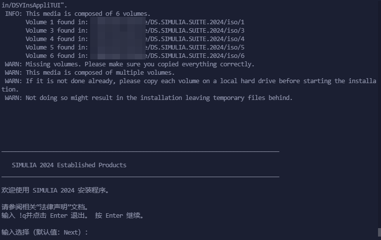
`Enter` to next step.

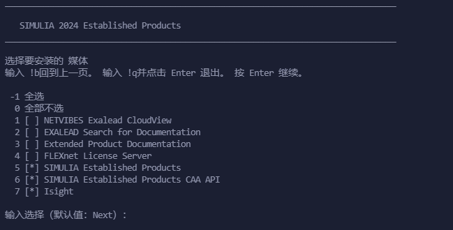
Remember to select `4`, which means `FLEXnet License Server`. Type `4` and then `Enter` to continue.

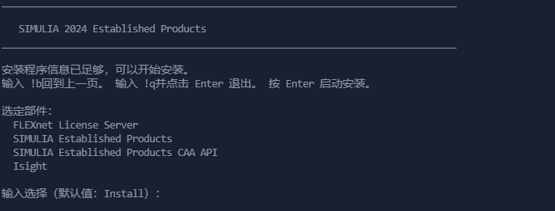
Confirm the installation content and press `Enter` to start the relevant installation program.

### 2.2 Installing the License Server

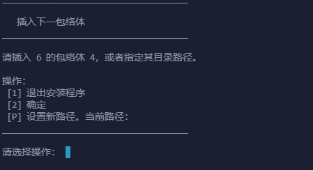
Select `P` and enter the absolute path to the `/iso/4` folder.

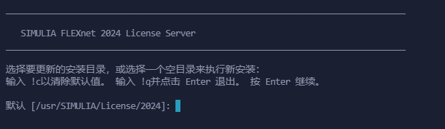
Select the installation path of the license server. Here, choose to install it in the path `${HOME}/opt/SIMULIA/License/2024`. Enter the absolute path.


Select the default here and start the license server after installation.

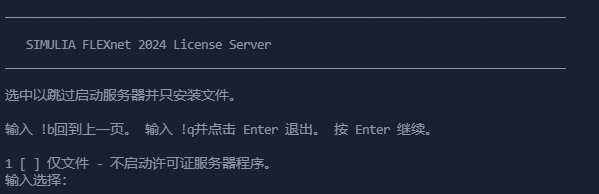
Select License File Path and enter the absolute path.


After entering the license file, a message appears stating that retrieval of the host ID failed. Ignore it and enter `2` to continue.

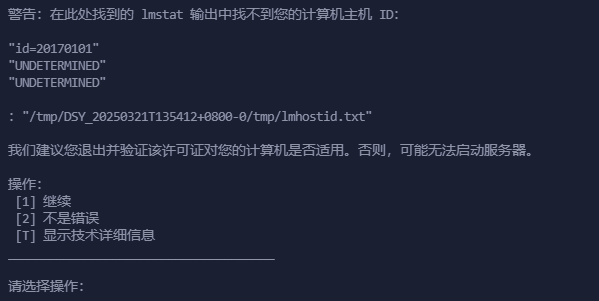
Continue to select `2`.

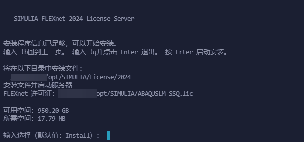
Confirm the installation information.

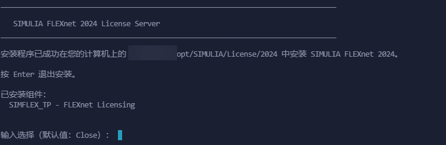
The installation is complete, press `Enter` to continue the next program installation.

### 2.3 Install the solver


Select `P` and enter the absolute path to the `/iso/5` folder.

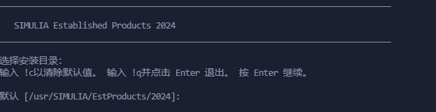
Select the installation path. Here, choose to install it in the path `${HOME}/opt/SIMULIA/EstProducts/2024`.

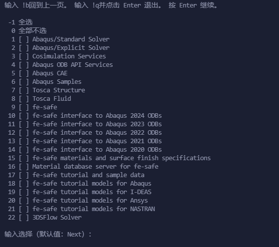
Select the content to be installed, select all and enter `-1`.

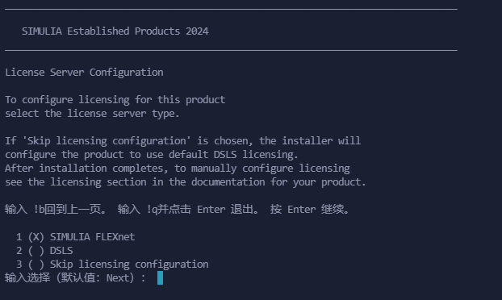
Select the license type, the default is `1`.

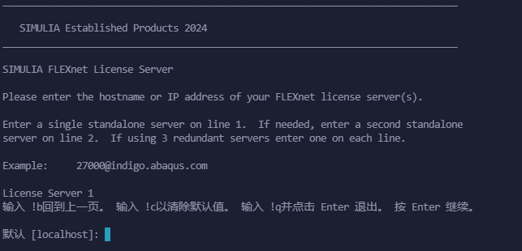
Enter the access address and port of the license server, enter `29100@localhost` to define `License Server 1`, and skip the rest by pressing `Enter`.

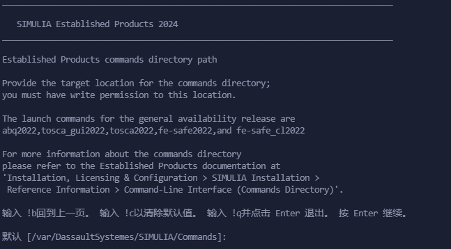
Select the path of the command line program. Here, choose to install it to `${HOME}/opt/SIMULIA/var/DassaultSystemes/SIMULIA/Commands`.

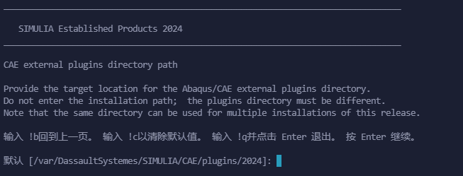
Select the path of the external plug-in. Here, choose to install it to `${HOME}/opt/SIMULIA/var/DassaultSystemes/SIMULIA/CAE/plugins/2024`.

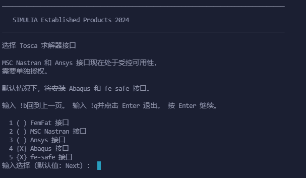
Select the `Tosca` interface according to actual needs.

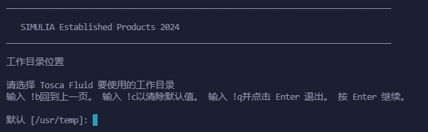
Select the `Tosca Fluid` working directory, which is assigned to `${HOME}/temp`.

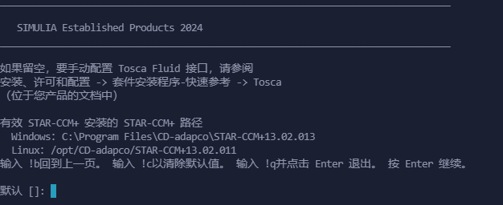
Select the STAR-CCM+ installation path, set it according to actual needs, and leave it blank by default.

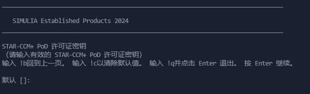
Select STAR-CCM+ license, set according to actual situation, leave blank by default.

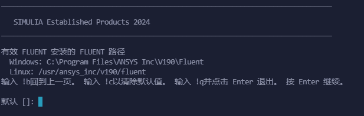
Select Fluent installation path, set according to actual situation, leave blank by default.

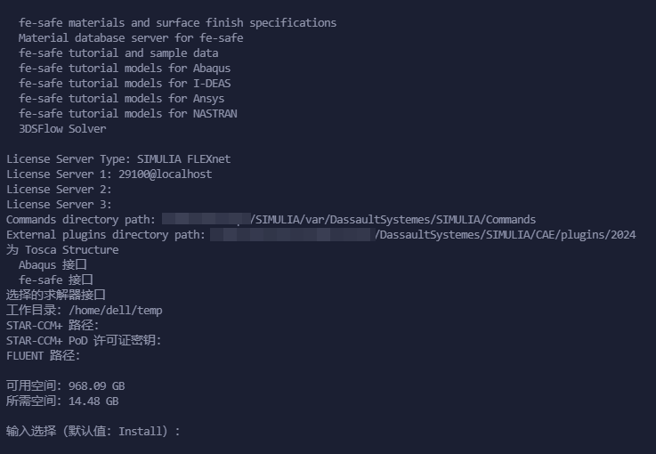
Confirm the installation information and press `Enter` to start copying files.

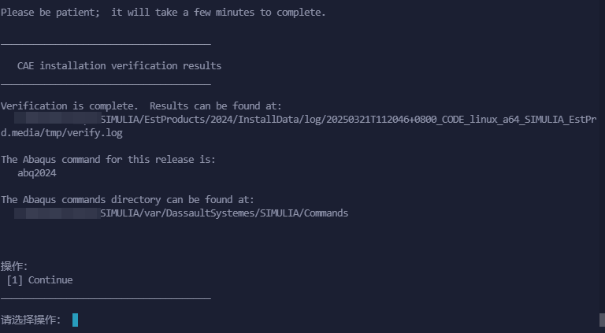
The verification program will be started during the installation process, and the verification results can be viewed. `Enter` to continue.

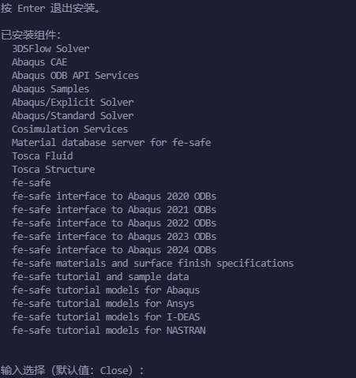
The solver installation is complete, `Enter` to exit and enter the next installation program.

### 2.4 Install CAA API

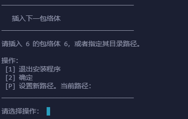
Select `P` and enter the absolute path of the `/iso/6` folder.

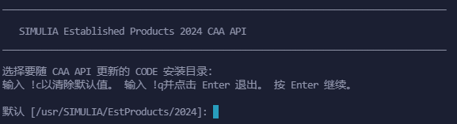
Select the installation path. Here, choose to install to `${HOME}/opt/SIMULIA/EstProducts/2024`.

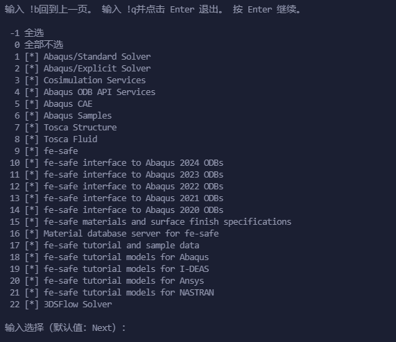
Confirm the content to be installed, and press `Enter` to continue.

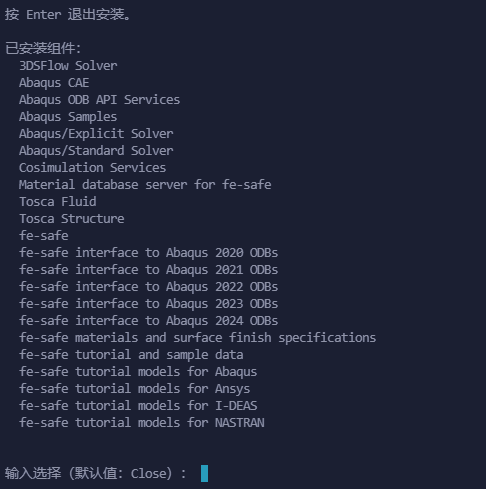
The installation is complete, and press `Enter` to exit.

### 2.5 Install Isight

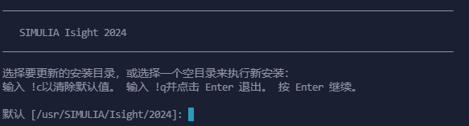
Select the installation path. Here, choose to install to `${HOME}/opt/SIMULIA/Isight/2024`.

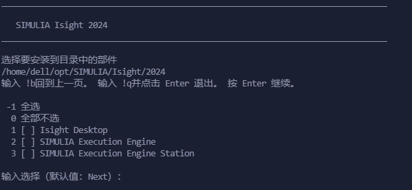
Select the content to be installed. `-1` selects all.

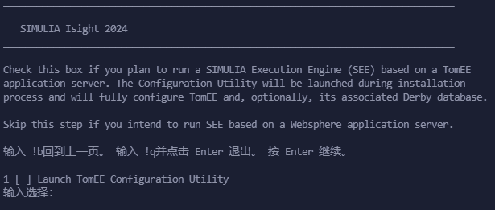
Whether to start the `TomEE` configuration tool, skip by default.

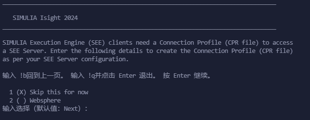
This step is also skipped by default.

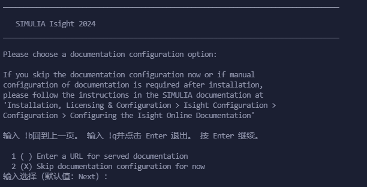
There is no installation document, choose to skip it.

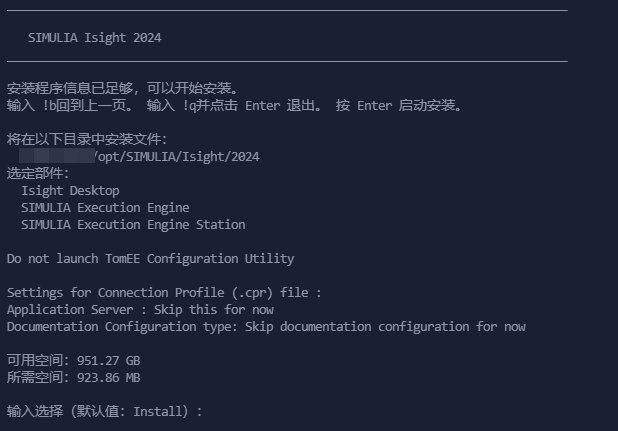
Confirm the installation content and press `Enter` to start copying files.

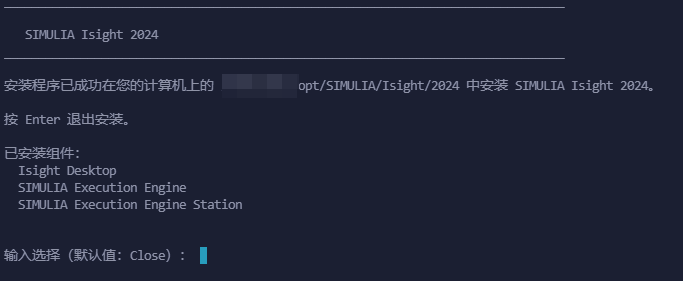
The installation is complete. Press `Enter` to exit.

### 2.6 Installation completed

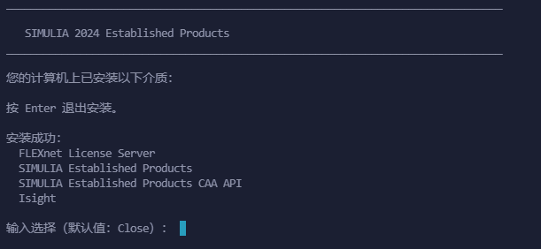
Confirm the installation result and press `Enter` to exit the SIMULIA installation program.

## 3. Post-installation configuration

### 3.1 Startup configuration

Before starting, modify the configuration file:
```Bash
vim ${HOME}/opt/SIMULIA/EstProducts/2024/linux_a64/SMA/site/custom_v6.env
```

Add two lines at the end, save and exit:
```Bash
license_server_type=FLEXNET
abaquslm_license_file="29100@localhost"
```

Create a new environment variable configuration file:
```Bash
touch ${HOME}/opt/SIMULIA/simulia24.env
chmod +x ${HOME}/opt/SIMULIA/simulia24.env
vim ${HOME}/opt/SIMULIA/simulia24.env
```

Edit the content as follows. It is best to use absolute paths, save and exit:
```Bash
export LICENSE_PREFIX_DIR=${HOME}/opt/SIMULIA/License/2024/linux_a64/code/bin
export SIMULIA_COMMAND_DIR=${HOME}/opt/SIMULIA/var/DassaultSystemes/SIMULIA/Commands
export PATH=$SIMULIA_COMMAND_DIR:$LICENSE_PREFIX_DIR:$PATH
export LM_LICENSE_FILE=29100@localhost
```

Run the following command to load the environment variables:
```Bash
source ${HOME}/opt/SIMULIA/simulia24.env
```

Start the Abaqus graphical interface by using the following command[^1]:
```Bash
abaqus cae -mesa
abaqus view -mesa
```

### 3.2 License installation problem

If Abaqus can be started normally in [3.1](#31-Startup configuration), then this step can be skipped.

Verify whether the license server is running:
```Bash
ps -eaf | grep ABAQUSLM
```

If the license server is not running, start the license server with the following command:
```Bash
${HOME}/opt/SIMULIA/License/2024/linux_a64/code/bin/licenseStartup.sh
```

The startup failed, and the error message is as follows:
```Bash
/home/***/opt/SIMULIA/License/2024/linux_a64/code/bin/licenseStartup.sh: 2: /home/***/opt/SIMULIA/License/2024/linux_a64/code/bin/lmgrd: not found
```

There is no solution. Either there is a problem with the installation package or this distribution lacks some runtime libraries. Let's wait for the experts to help.

Fortunately, the Windows version license can be installed normally. You only need to assign the license path to the Windows machine. First, open port 29100 in Windows Firewall and create a new firewall inbound rule:
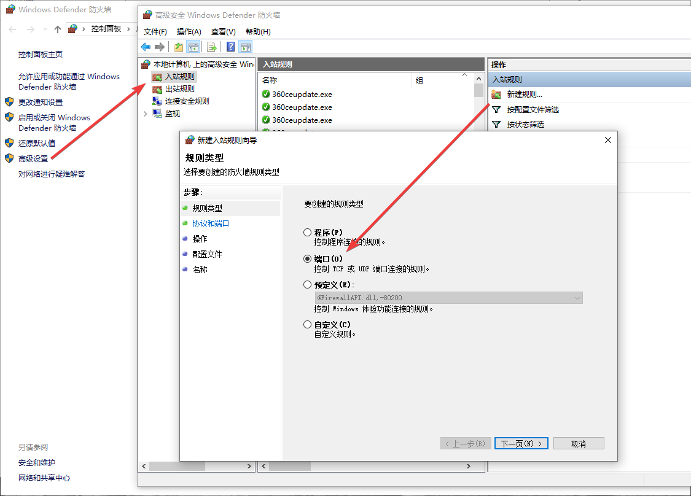

Then modify the license address of the `custom_v6.env` file in [3.1](#31-Startup Configuration) as follows:
```Bash
license_server_type=FLEXNET
# abaquslm_license_file="29100@localhost"
abaquslm_license_file="29100@172.25.64.1" # 172.25.64.1 is the IP address of the Windows host
```

Modify the environment variable file `${HOME}/opt/SIMULIA/simulia24.env`:
```Bash
# export LM_LICENSE_FILE=29100@localhost
export LM_LICENSE_FILE=29100@172.25.64.1
```

After loading the environment variables, the `abaqus cae` command can be started normally, and the license issue will no longer be prompted.
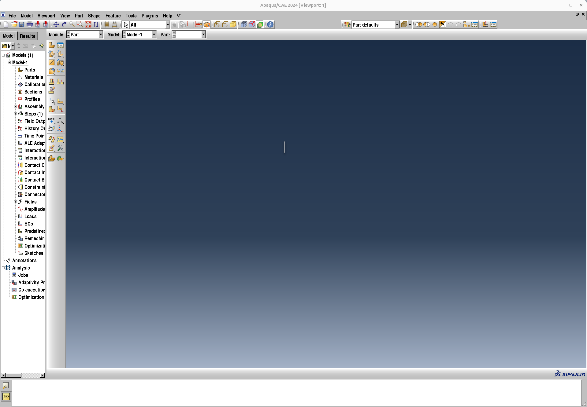

I have to admit that the Linux graphical interface is really not easy to use, but who cares? Anyway, I don't need to process models or grids under Linux, and I just submit calculations.

### 3.3 Submit cluster calculation

The Slurm script of Abaqus[^2] is as follows:
```Bash
#!/bin/bash 

#SBATCH --job-name=abaqus_test
#SBATCH --partition=debug 
#SBATCH --output=%j.out 
#SBATCH --error=%j.err 
#SBATCH -N 1 
#SBATCH --ntasks-per-node=32 

cd $SLURM_SUBMIT_DIR

source /home/***/opt/SIMULIA/simulia24.env # Fill in the absolute path
export INPFILE=`find . -name "*.inp"`
export ENVFILE=/home/***/opt/SIMULIA/EstProducts/2024/linux_a64/SMA/site/abaqus_v6.env # Fill in the absolute path

# Generate abaqus_6.env file and specify hosts
rm -rf $PWD/abaqus_v6.env
cp $ENVFILE $PWD/abaqus_v6.env
node_list=$(scontrol show hostname ${SLURM_NODELIST} | sort -u)
mp_host_list="["
for host in ${node_list}; do
    mp_host_list="${mp_host_list}['$host', ${SLURM_NTASKS_PER_NODE}],"
done
mp_host_list=$(echo ${mp_host_list} | sed -e "s/,$/]/")
echo "mp_host_list=${mp_host_list}"  >> $PWD/abaqus_v6.env

# Create a Scratch Directory
mkdir scratch.$SLURM_JOB_ID

abaqus job=$SLURM_JOB_NAME input=$INPFILE cpus=$SLURM_NPROCS scratch=scratch.$SLURM_JOB_ID mp_mode=mpi double=both output_precision=full resultsformat=odb int ask=off > $SLURM_JOB_NAME.log
rm -rf $PWD/abaqus_v6.env scratch.$SLURM_JOB_ID

```

Put the `inp` file and the script in the same folder and submit the script using the `sbatch` command. After the calculation is completed, download the results to your local computer and view the results using `Abaqus Viewer` or `Meta`.

[^1]: [franaudo/abaqus-ubuntu ](https://github.com/franaudo/abaqus-ubuntu)

[^2]: [abhpc/ABHPC-Guide ](https://github.com/abhpc/ABHPC-Guide/tree/master)

