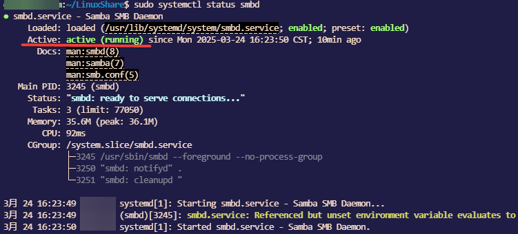

+++
author = "Andrew Moa"
title = "Ubuntu24.04搭建Samba服务器"
date = "2025-03-24"
description = ""
tags = [
    "linux",
    "ubuntu",
]
categories = [
    "linux",
]
series = [""]
aliases = [""]
image = "/images/ubuntu-bg.jpg"
+++

由于Ubuntu运行在虚拟机中，通过Ubuntu挂载Windows共享文件夹，在挂载点中运行某些CAE软件会出现计算报错。考虑将Ubuntu文件夹共享给Windows，因此需要在Ubuntu系统上搭建Samba服务器。

首先在Ubuntu上安装samba软件包：
```Bash
sudo apt install samba -y
```

创建共享文件夹：
```Bash
mkdir ${HOME}/LinuxShare
```

编辑Samba配置文件`/etc/samba/smb.conf`：
```Bash
sudo vim /etc/samba/smb.conf
```

在文件末尾增加以下内容，保存退出：
```Text
[Ubuntu_Share] # 在客户端上显示的共享文件夹的名称
    comment = Samba	# 注释，展示给用户看的
    path = /home/***/LinuxShare	# 共享文件夹的本地路径，填写绝对路径
    public = yes	# 是否允许匿名用户访问
    writable = yes	# 是否允许用户编辑
    available = yes	# 是否可用
    browseable = yes	# 是否可以在网络上浏览
    valid users = user	# 填写Ubuntu登录用户名	
```

给Samba用户设置密码：
```Bash
sudo smbpasswd -a user
```

启动Samba服务的守护进程：
```Bash
sudo systemctl enable smbd
sudo systemctl start smbd
```

查询Samba服务状态：
```Bash
sudo systemctl status smbd
```


服务状态：`Active: active (running)`，正常运行。

更新Samba配置文件`/etc/samba/smb.conf`之后通过以下命令刷新：
```Bash
sudo service smbd restart 
```

添加防火墙规则：
```Bash
sudo ufw allow samba
```

配置完成，可以在Windows端访问该共享文件夹，这部分就省略了。

---
