+++
author = "Andrew Moa"
title = "Install Ansys2025R1 on Ubuntu24.04"
date = "2025-03-25"
description = ""
tags = [
    "ansys",
    "cae",
    "linux",
    "ubuntu",
]
categories = [
    "linux",
]
series = [""]
aliases = [""]
image = "/images/ubuntu-bg.jpg"
+++

## 1. Preparation

161GB of disk space is required for the full installation. Please ensure that the remaining available disk space meets the requirements. You can choose the installation content according to your needs.
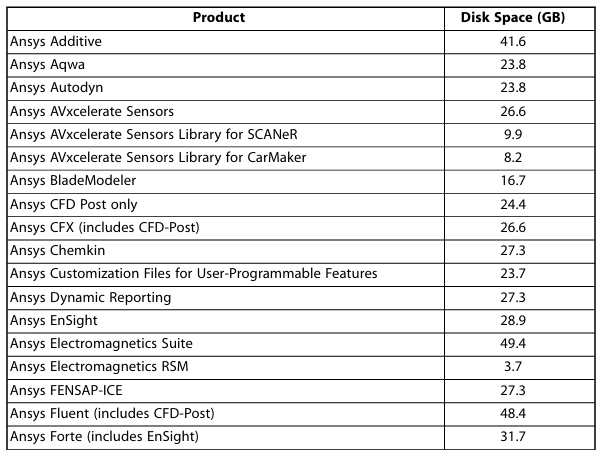
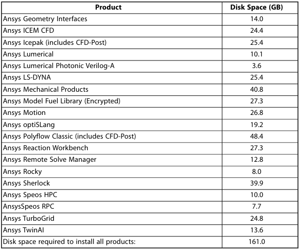
At least 8GB of memory is required during the installation process, and 16~32GB of memory is recommended.

Dependent tools during the installation process:
```Bash
sudo apt install libnsl2 libpcre3 lsb-* ldap-utils libunistring5 xfonts-100dpi xfonts-75dpi
```

For installation of other runtime dependent tools, please refer to the official documentation.

The Ansys2025R1 installation file contains 9 `.iso` installation files. Use the following command to mount the `.iso` file to the specified path:
```Bash
mkdir ${HOME}/ISO/1
sudo mount ${HOME}/Share/Ansys/ANSYS2025R1_LINX64_DISK1.iso ${HOME}/ISO/1 -o loop
```
In the same way, mount the remaining installation packages to other folders.

## 2. Install the license server

### 2.1 Install Ansys License Manager

Since Ansys installation requires a graphical interface, you need to first access the Ubuntu desktop system through a remote connection.

Enter the mount point of the first installation package and run the installer:
```Bash
cd ${HOME}/ISO/1
sudo ./INSTALL # Since it needs to be run as a service, it is recommended to run the installer with administrator user privileges
```

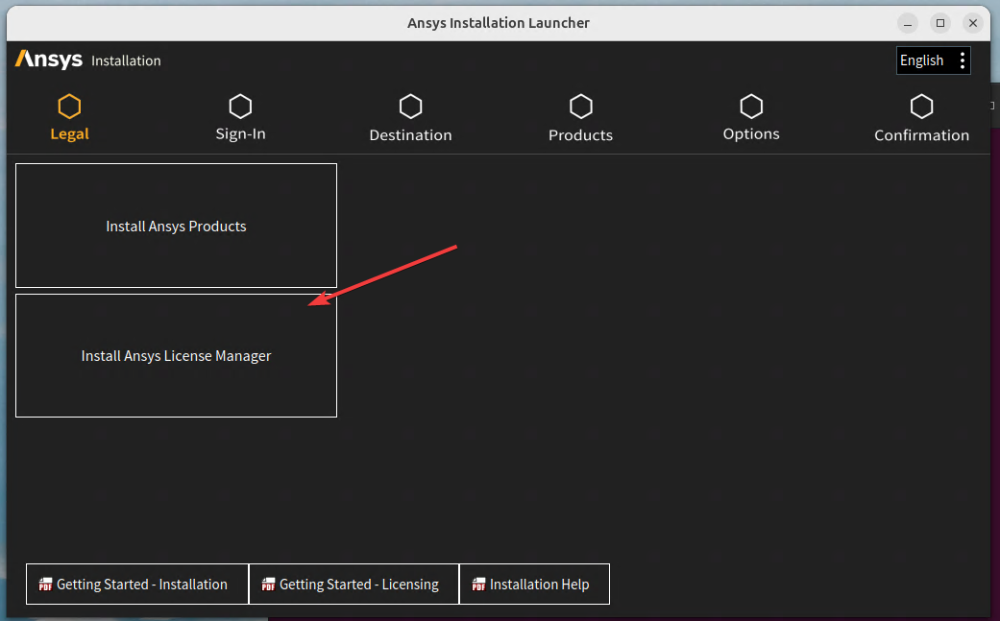

License installation path selection: `/opt/ansys_inc`:
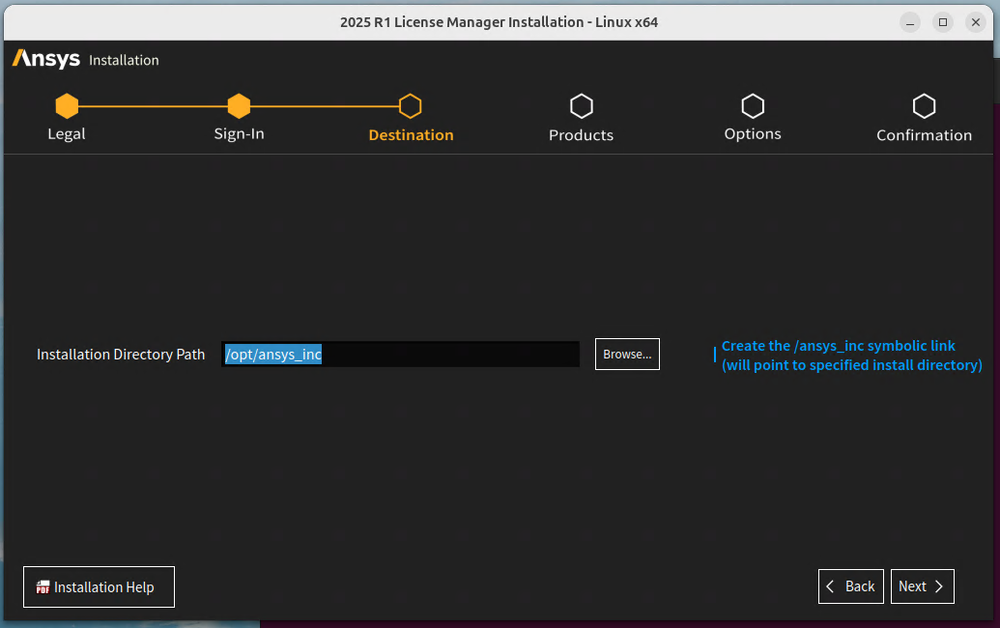
After the installation is complete, exit the installer.

Verify that the Ansys License Server daemon is running:
```Bash
ps -eaf | grep ansyslmd
```

If the ansyslmd process is running, kill it:
```Bash
kill -s 9 [PID] # [PID] Fill in the PID of the ansyslmd process
```

### 2.2 Configure the license server

We need to unzip the files in the `/shared_files` folder in the `ansys.2025r1.linx64-ssq.tar.gz` compressed package to the installation directory and overwrite:
```Bash
tar xvzf ansys.2025r1.linx64-ssq.tar.gz
sudo cp -r shared_files /opt/ansys_inc/
```

Next, configure the license service. The following command runs the license configuration program:
```Bash
sudo /opt/ansys_inc/shared_files/licensing/init_ansyslm_tomcat start
```

Then use the browser to open the address: `http://localhost:1084/ANSYSLMCenter.html`, locate the `Get System Hostid information` column, find `HOSTID`, copy it and use it later:
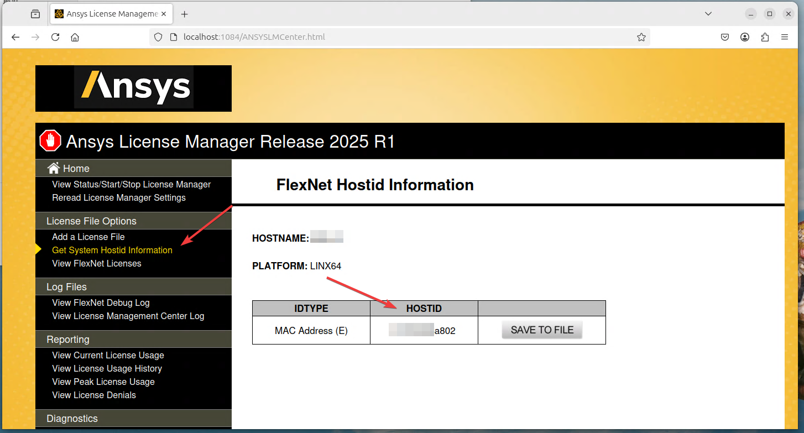

Open the `license_2024.12.15.txt` file, replace `XXXXXXXXXXXX` with the `HOSTID` copied above in the line `SERVER localhost XXXXXXXXXXXX 1055` at the beginning, and save the file.
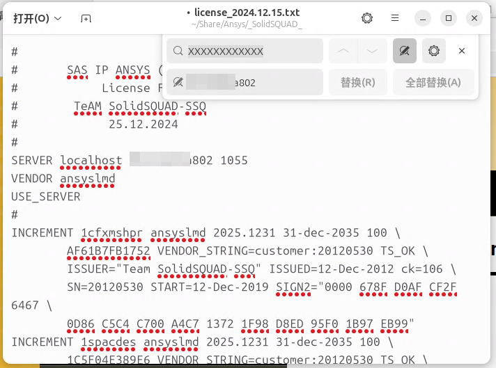

Locate the `Add a License File` column and load the `license_2024.12.15.txt` file that you just edited.
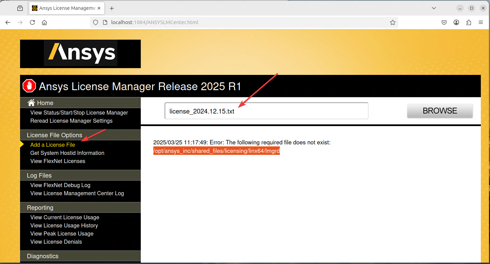

There is a problem here, prompting that `lmgrd` cannot be found and the server daemon cannot be started. Run the following command:
```Bash
sudo cp /opt/ansys_inc/shared_files/licensing/linx64/update/lmgrd /opt/ansys_inc/shared_files/licensing/linx64/lmgrd
```

Just load the file again:
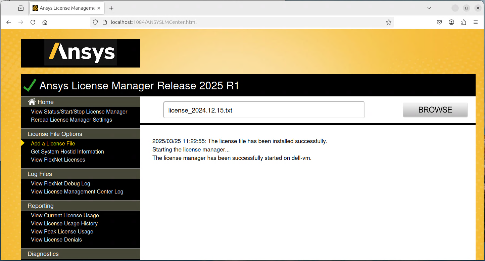

Locate the `View Status/Start/Stop License Manager` column and confirm the server running status:
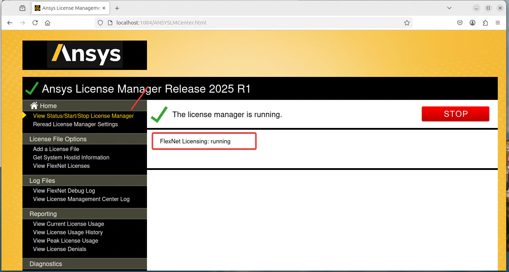

Exit the browser and close the license configuration program, and confirm whether the daemon is running:
```Bash
sudo /opt/ansys_inc/shared_files/licensing/init_ansyslm_tomcat stop
ps -eaf | grep ansyslmd
```
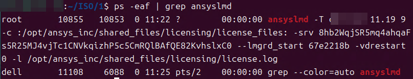

If the license server and the main program are installed on different machines, you need to open port 1055 of the license server in the firewall:
```Bash
sudo ufw allow from any to any port 1055 proto tcp
```

### 2.3 Add custom service

After completing the above settings, when the server is restarted, the system will not automatically start the daemon process. You need to start ansyslmd with the following command:
```Bash
sudo /opt/ansys_inc/shared_files/licensing/start_ansyslmd
```

In order to prevent the server from being unable to calculate due to license issues after power failure and restart, the following custom service is added through systemd to realize the automatic start of the daemon process at startup. The following command creates a new ansyslmd service:
```Bash
sudo touch /usr/lib/systemd/system/ansyslmd.service
sudo vim /usr/lib/systemd/system/ansyslmd.service
sudo chmod 754 /usr/lib/systemd/system/ansyslmd.service
```

Add the following content and save and exit:
```systemd
[Unit]
Description=Ansys License Deamon
After=ansyslmd.service
  
[Service]
Type=forking
User=root
Group=root
ExecStart=/opt/ansys_inc/shared_files/licensing/start_ansyslmd
ExecReload=
ExecStop=/opt/ansys_inc/shared_files/licensing/stop_ansyslmd
  
[Install]
WantedBy=multi-user.target
```

Start the service with the following command:
```Bash
sudo systemctl enable ansyslmd
sudo systemctl start ansyslmd
```

Check the service status:
```Bash
sudo systemctl status ansyslmd
```

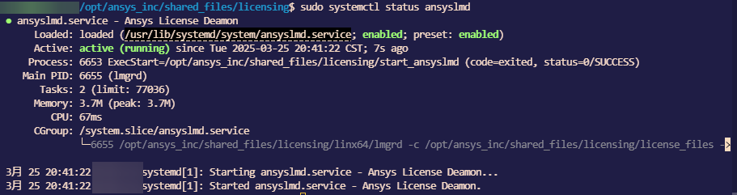
The service is started successfully. After the installation is complete, you can restart it to verify.

## 3. Install the main program

You also need to enter the Ubuntu desktop system to install the main program.

Enter the mount point of the first installation package and run the installation program:
```Bash
cd ${HOME}/ISO/1
sudo ./INSTALL # Install with root privileges
```

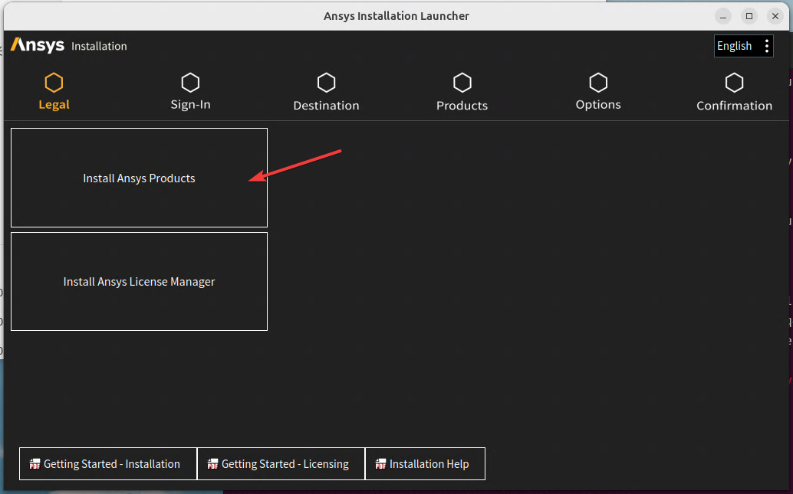

Solve the same choice to install in: `/opt/ansys_inc`
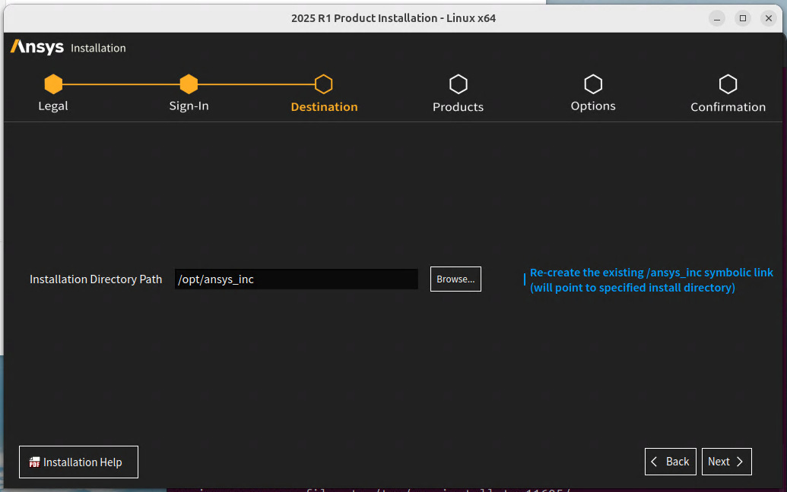

Choose what to install according to your needs:
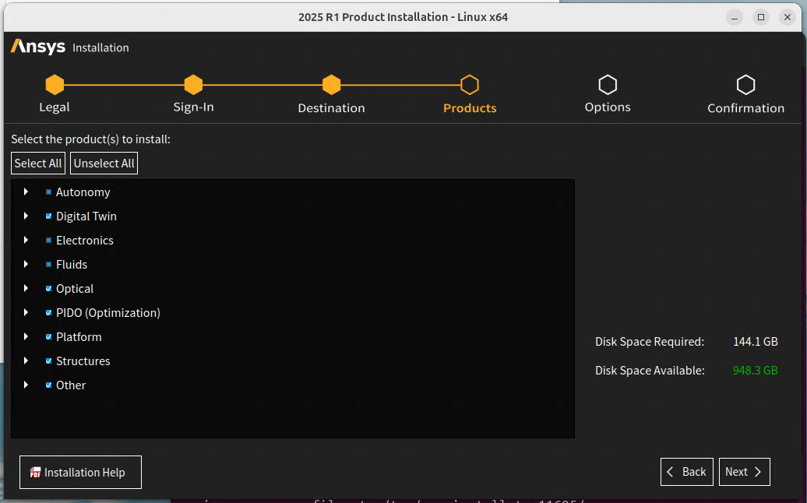

Configure CAD geometry interface. CAD software is not installed on this machine. Select Skip:
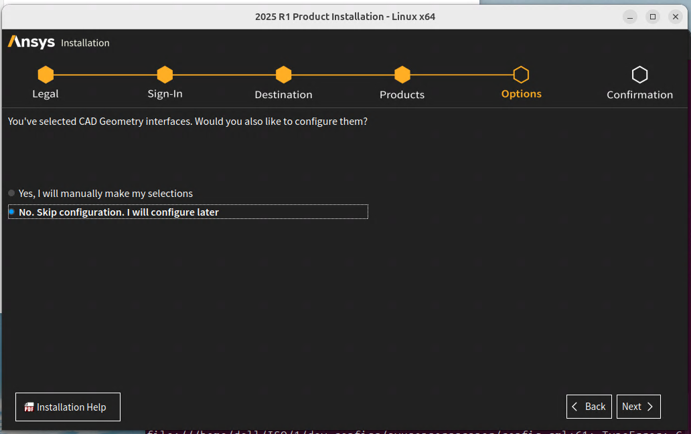

Depending on the installation content selected earlier, a bunch of configuration file paths will be asked later. Set them according to your needs. If there is no such a thing, just click Next.
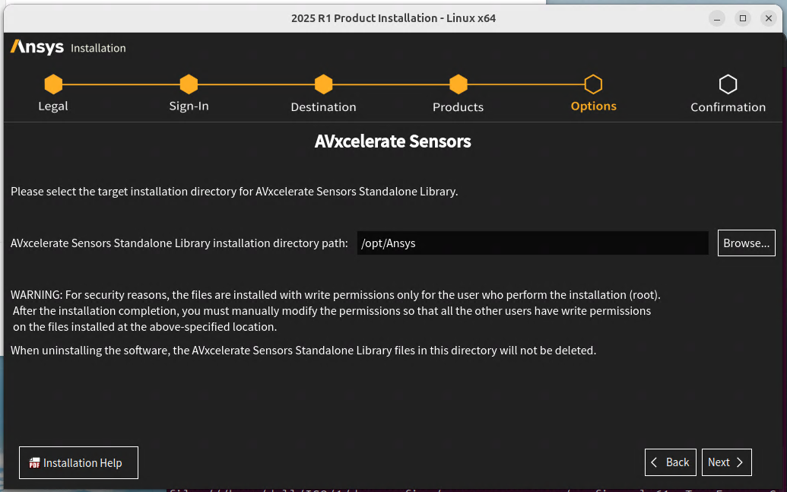

Choose whether to create a desktop shortcut. Select it. It may be useful.
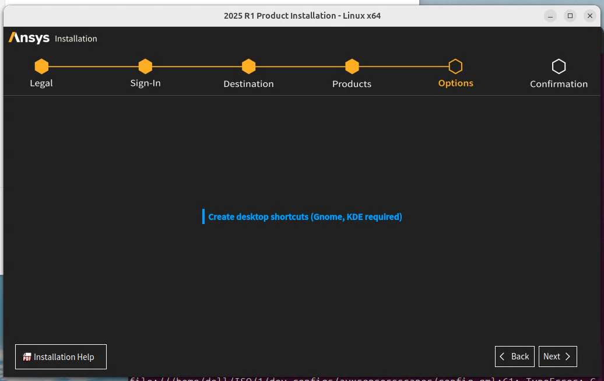

Confirm the installation content and click Next to start copying files:
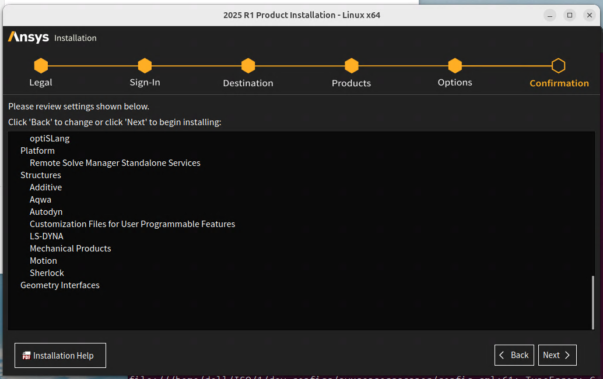

You can check the installation progress. During the installation, you will be asked to load other `.iso` file mount paths.
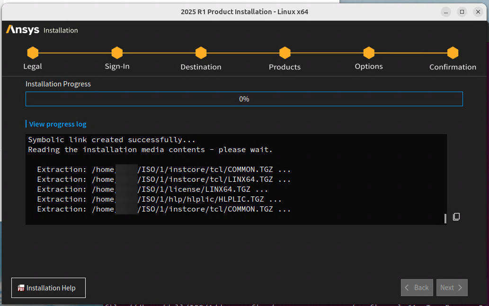

The installation is complete, and there are some errors. Ignore it and exit.
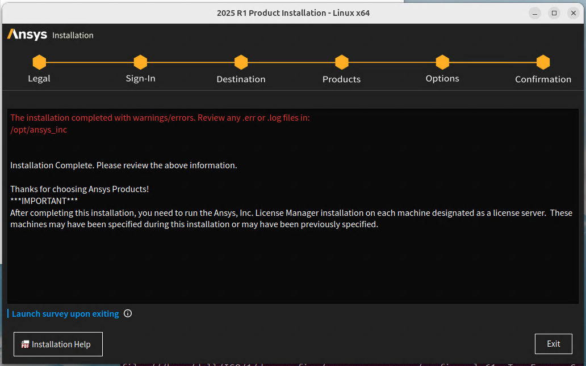

Next, unzip the files in the `v251` folder in the `ansys.2025r1.linx64-ssq.tar.gz` compressed package to the installation directory and overwrite:
```Bash
tar xvzf ansys.2025r1.linx64-ssq.tar.gz
sudo cp -r v251 /opt/ansys_inc/
```

After the main program is installed, unmount the mount point of the `.iso` file:
```Bash
sudo umount ${HOME}/ISO/1
```
Unmount the remaining mount points in the same way.

## 4. Configure the main program license

After installing the main program, you need to configure the license for the main program. There are two ways.

### 4.1 Method 1 → Configure environment variables

Create and edit the environment variable file in `${HOME}/opt/`:
```Bash
touch ${HOME}/opt/ansys2025r1.env
chmod +x ${HOME}/opt/ansys2025r1.env
vim ${HOME}/opt/ansys2025r1.env
```

Add the following content, save and exit:
```Bash
export ANSYSLMD_LICENSE_FILE=1055@localhost
```

You can load the environment variables with the following command later.
```Bash
source ${HOME}/opt/ansys2025r1.env
```
You can add the above command line to the `${HOME}/.bashrc` file, so that the environment variables will be automatically loaded every time you log in.

### 4.2 Method 2→Ansys Licensing Settings

Run the following command to start the `Licensing Settings` program:
```Bash
/ansys_inc/v251/licensingclient/linx64/LicensingSettings
```

Follow the steps to set the following:
 1. Change the configuration file level from Installion to User
 2. Set the status to Enable
 3. Fill in 1055 for the port number
 4. Fill in localhost for the Server1 address
 5. Click the Test button to test
 6. Click Save to save the configuration

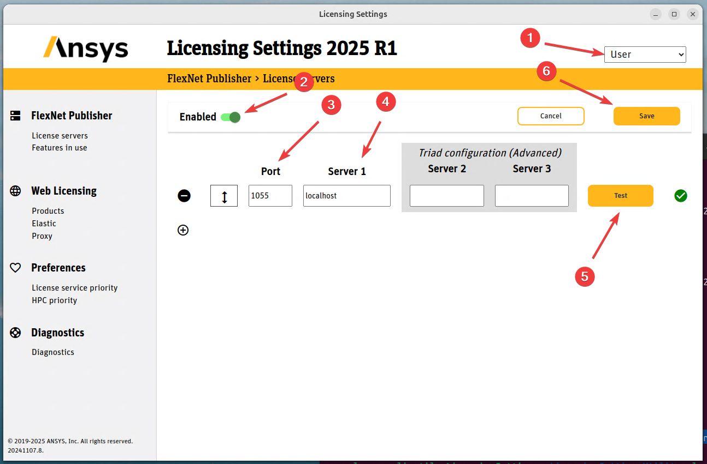
Save and exit to complete the license configuration.

## 5. Start the main program

After configuring the license, start `Workbench` with the following command:
```Bash
/ansys_inc/v251/Framework/bin/Linux64/runwb2
```

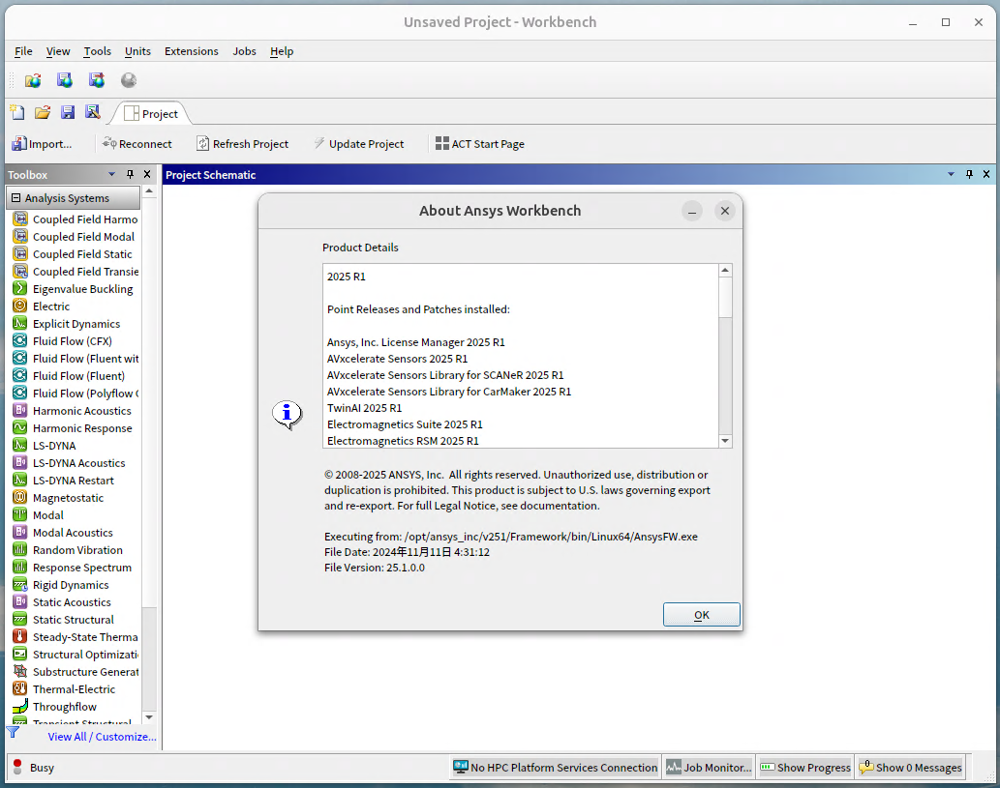

Similarly, the entry points of some key main programs are as follows:
| Application | How to Launch |
| ----- | ----- |
| ACP | /ansys_inc/v251/ACP/ACP.sh |
| CFD-Post | /ansys_inc/v251/cfdpost |
| CFX | /ansys_inc/v251/CFX/bin/cfx5<sup>(Note)  |
| FLUENT | /ansys_inc/v251/fluent/bin/fluent |
| ICEM CFD | /ansys_inc/v251/icemcfd/icemcfd |
| ICEPAK | /ansys_inc/v251/icepak/icepak |
| Motion | /ansys_inc/v251/Motion/solver/rundfs.sh |
| Polyflow Classic | /ansys_inc/v251/polyflow/bin/polyflow |
| TurboGrid | /ansys_inc/v251/TurboGrid/bin/cfxtg |
| Sherlock | /ansys_inc/v251/sherlock/runSherlock |
| Workbench | /ansys_inc/v251/Framework/bin/Linux64/runwb2 |
| Electronics | /ansys_inc/v251/AnsysEM/ansysedt |

<sup>(Note): cfx5 can be replaced by cfx5launch, cfx5pre, cfx5solve or cfx5post. They correspond to different functional modules.

At this point, Ansys is installed.

---
