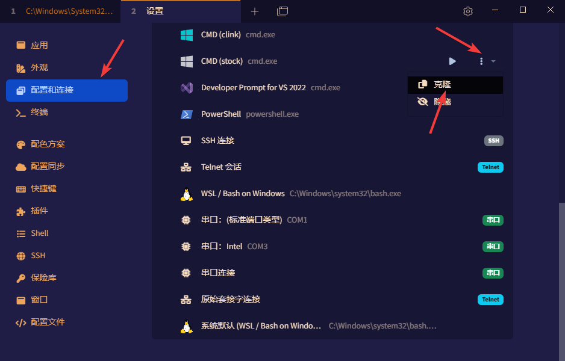

+++
author = "Andrew Moa"
title = "Tabby配置MSYS2"
date = "2025-03-26"
description = ""
categories = [
    "tech",
]
series = [""]
aliases = [""]
image = "/images/code-bg.jpg"
+++


[Tabby](https://tabby.sh/)是一款颜值很高的终端工具，最开始用它是为了替代本机终端，用着用着后来发现越来越多的优点。
首先它内置支持SSH连接方式，同时支持SFTP传输文件，设置操作简单，避免了在Windows终端中的繁琐设置。其次，可以用来替代MSYS2、Cygwin原有的Mintty界面，实现不同终端之间无缝切换。
关于Tabby终端中如何调用MSYS2，下面记录一下配置方法：

1. 首先在Tabby设置中克隆一个CMD配置：
	

2. 在名称中填写要调用的MSYS2工具链：
	
	注意，图标这里不能直接指派ico文件，Tabby无法识别，必须将ico图标转换成svg格式。
	这种ico2svg在线转换资源很多，网上一搜一大把：
	 - [ACCONVERT - ICO转SVG](https://www.aconvert.com/cn/image/ico-to-svg/)
	 - [CDKM - ICO转SVG](https://cdkm.com/cn/ico-to-svg)
	 - [FreeConvert - ICO到SVG转换器 ](https://www.freeconvert.com/zh/ico-to-svg)
	   
	转换完成后下载svg文件，用文本工具打开将svg源码复制粘贴到上面的图标栏里，Tabby就可以正常显示图标了。
	```svg
	<?xml version="1.0" encoding="UTF-8" standalone="no"?>
	<!DOCTYPE svg PUBLIC "-//W3C//DTD SVG 1.1//EN" "http://www.w3.org/Graphics/SVG/1.1/DTD/svg11.dtd">
	<svg version="1.1" id="Layer_1" xmlns="http://www.w3.org/2000/svg" xmlns:xlink="http://www.w3.org/1999/xlink" x="0px" y="0px" width="16px" height="16px" viewBox="0 0 16 16" enable-background="new 0 0 16 16" xml:space="preserve">  <image id="image0" width="16" height="16" x="0" y="0"
	    xlink:href="data:image/png;base64,iVBORw0KGgoAAAANSUhEUgAAABAAAAAQCAMAAAAoLQ9TAAAAIGNIUk0AAHomAACAhAAA+gAAAIDo
	AAB1MAAA6mAAADqYAAAXcJy6UTwAAADPUExURb5kPsBpRdWbgtSZgL9lQMBoQ8+McMyEZsJuS/36
	+P///9uplL5lP+3UyevOws2HafDc1NCPdOjHuejIur9mQO3TyeXCs8NxTv37+vv18sh7W8h8XP/+
	/uS+rt2umtOXfuXBsvfs6Pjv6+bDtMFqRvny7vHf1/36+dyrlvXn4e/a0dadhMBpRP79/f7+/fz4
	9sJuSvHe1vnw7PPi2+O9rNqmkN2tmeC2pP78+8Z3Vfft6L9mQfz59+fFt8JtSdKVe79nQsuDZcV0
	UtGSd8NvTFLhcR8AAAABYktHRApo0PRWAAAAB3RJTUUH6QMaAysVnHCKGgAAAJpJREFUGNONj1cS
	ggAUA2NBIdi7WAErYEFFBRXr/c8k7QC8n8zuRyYPSHWZbC4fhFAoJkKUKAOlMiuJqJI1oE42EtEk
	pRbaZCfmbq9PKoMhOYrFmDI5maoa9Yhn84VC6svVmkYkZJrWhtvd3qYkBmwdNAFH8hR2O4FweAYu
	vLowSc/CzbMtwL0/gqUGVR/+8xUWvT/h9u8vxaN/UKUNLao7WagAAAAldEVYdGRhdGU6Y3JlYXRl
	ADIwMjUtMDMtMjZUMDM6NDM6MjArMDA6MDDH702KAAAAJXRFWHRkYXRlOm1vZGlmeQAyMDI1LTAz
	LTI2VDAzOjQzOjIwKzAwOjAwtrL1NgAAACh0RVh0ZGF0ZTp0aW1lc3RhbXAAMjAyNS0wMy0yNlQw
	Mzo0MzoyMSswMDowMEfQ310AAAAASUVORK5CYII=" />
	</svg>
	```
	禁用动态标签页标题：根据自己需要设置，建议选上。
	分组：需要先新建配置文件组，然后再在这里选。

3. 程序、参数和环境变量如图所示。
	
	工作目录和HOME目录填写MSYS2的HOME目录，MSYSTEM填写要调用的工具链。

4. 上面第3步保存之后，就可以通过Tabby标题栏的图标快速调用MSYS2的Clang64终端了，其他工具链按同样的方法配置。
	

---
   
