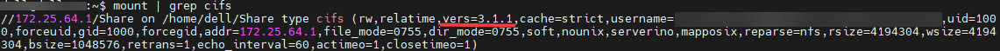
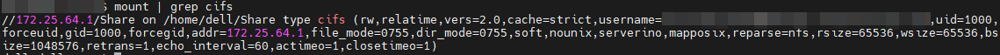
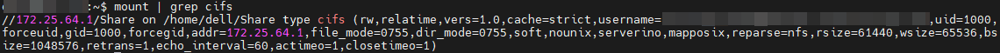

+++
author = "Andrew Moa"
title = "Abaqus and CFX solvers cannot be run in Linux mounts Windows shared folders"
date = "2025-04-15"
description = ""
tags = [
    "abaqus",
    "cfx",
    "ubuntu",
]
categories = [
    "linux",
]
series = [""]
aliases = [""]
image = "/images/ubuntu-bg.jpg"
+++

Recently, a problem was discovered that Abaqus and CFX cannot perform calculations on Windows shared folders mounted on Linux. Linux is deployed on a virtual machine. Although there will be no error when starting the calculation program on the local path of the virtual machine, it will cause the virtual disk to occupy more space and have a certain impact on the read and write efficiency.

## 1. SMB version problem

### 1.1 SMBv3

When using cifs to mount a shared folder before, I did not pay close attention to the version of the SMB protocol[^1]. The following command line does not specify the protocol version:
```bash
mount -t cifs //172.25.64.1/Share /home/dell/Share -o uid=xxx,gid=xxx,username=xxx
```

Use the `mount` command to check that the default connection protocol is version 3.1:


When running the Abaqus program in the mount directory of the 3.1 version protocol, the calculation fails and the following error is reported:
```text
mpirun: Warning one or more remote shell commands exited with non-zero status, which may indicate a remote access problem.
driverExceptions.AbaqusExecutionError: ('SIMULIA Job Layout Engine', 255, 'abaqus_test')
!!!
!!! SIM wrap utility command error:
!!!   System Error open: Invalid parameters
!!!
driverExceptions.AbaqusExecutionError: ('SIM Wrap-up', 1, 'abaqus_test')
```

When running the CFX solver in the mount directory of the 3.1 version protocol, the calculation fails and the following error is reported:
```text
An error has occurred in cfx5solve:

Error copying MMS input file mms for reading: Input/output error
```

### 1.2 SMBv2

Add the keyword `vers=2.0` to the mount command line to explicitly specify the protocol version as 2.0:
```bash
mount -t cifs //172.25.64.1/Share /home/dell/Share -o vers=2.0,uid=xxx,gid=xxx,username=xxx
```

Use the `mount` command to check and confirm that the protocol version is 2.0:


Running the Abaqus program in the mount directory of the 2.0 version protocol can complete the calculation, but there is an error:
```text
mpirun: Warning one or more remote shell commands exited with non-zero status, which may indicate a remote access problem.
driverExceptions.AbaqusExecutionError: ('SIMULIA Job Layout Engine', 255, 'abaqus_test')
```

Running the CFX solver in the mount directory of the 2.0 version protocol still fails to calculate, and the error message is the same as the SMBv3 version.

### 1.3 SMBv1

Specify the protocol version as 1.0:
```bash
mount -t cifs //172.25.64.1/Share /home/dell/Share -o vers=1.0,uid=xxx,gid=xxx,username=xxx
```

`mount` confirms:


Running the Abaqus program in the mount directory of the 1.0 version protocol, like the SMBv2 version, can complete the calculation but there is an error message.

Running the CFX solver in the mount directory of the 1.0 version protocol, the calculation cannot be completed, and the error message is as follows:
```text
An error has occurred in cfx5solve:

Error copying MMS input file mms for reading: Operation not supported
```

## 2. SMB symbolic link problem

### 2.1 CFX environment variables

According to the official Ansys instructions [^2], CFX errors are mostly symbolic link problems. Add the following environment variables to the slurm calculation script:
```bash
export CFX5_DISABLE_SYMLINKS=1
```
Tested in SMBv1~SMBv3 protocol versions, after adding this environment variable, CFX can complete the calculation, and the problem is solved.

### 2.2 Enable symbolic link function in SMBv3

Add the symbolic link option `mfsymlinks`[^3] to the mount command:
```bash
mount -t cifs //172.25.64.1/Share /home/dell/Share -o mfsymlinks,uid=xxx,gid=xxx,username=xxx
```
The measured effect is the same as adding CFX environment variables in [2.1] (#21-cfx environment variables), which can solve the problem that CFX cannot calculate. However, Abaqus still reports an error and cannot complete the calculation. It seems that the problem of Abaqus is not related to symbolic links.

## 3. Summary

If you need to run Abaqus and CFX solvers on a Windows shared folder mounted by Linux, it is recommended to use the following command to explicitly specify the SMBv2 version and enable the symbolic link function:
```bash
mount -t cifs //172.25.64.1/Share /home/dell/Share -o vers=2.0,mfsymlinks,uid=xxx,gid=xxx,username=xxx
```
The above command line can ensure the normal calculation of CFX and Abaqus.

[^1]: [在 Windows 中检测、启用和禁用 SMBv1、SMBv2 和 SMBv3](https://learn.microsoft.com/zh-cn/windows-server/storage/file-server/troubleshoot/detect-enable-and-disable-smbv1-v2-v3?tabs=server)

[^2]: [A local Linux machine is connected to a Windows machine through Samba. ...](https://innovationspace.ansys.com/knowledge/forums/topic/a-local-linux-machine-is-connected-to-a-windows-machine-through-samba-while-trying-to-run-cfx-solver-remotely-on-windows-through-samba-the-following-error-appears-error-copying-mms-input-file-mms/#:~:text=The%20workaround%20is%20to%20create%20the%20file%20.cfx5rc,the%20user%E2%80%99s%20home%20directory%20with%20the%20line%20CFX5_DISABLE_SYMLINKS%3D1.)

[^3]: [挂载SMB协议文件系统](https://help.aliyun.com/zh/nas/user-guide/mount-an-smb-file-system-on-a-linux-ecs-instance?spm=a2c4g.11186623.0.0.74564b9fxIojTZ#table-dgv-w7q-ff8)