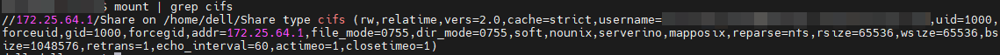

+++
author = "Andrew Moa"
title = "Linux挂载Windows共享文件夹无法运行Abaqus和CFX求解器的问题"
date = "2025-04-15"
description = ""
tags = [
    "abaqus",
    "cfx",
    "ubuntu",
]
categories = [
    "linux",
]
series = [""]
aliases = [""]
image = "/images/ubuntu-bg.jpg"
+++

近期发现一个问题，Abaqus和CFX无法在Linux挂载的Windows共享文件夹上进行计算。Linux是虚拟机部署的，在虚拟机本地路径上启动计算程序，虽然不会出现报错，但会导致虚拟磁盘占用空间增大，并且对读写效率也有一定的影响。

## 1. SMB版本问题

### 1.1 SMBv3

之前用cifs挂载共享文件夹的时候，没有仔细关注SMB协议的版本[^1]。以下命令行没有指定协议版本：
```bash
mount -t cifs //172.25.64.1/Share /home/dell/Share -o uid=xxx,gid=xxx,username=xxx
```

用`mount`命令查看，默认连接协议是3.1版本：


在3.1版本协议的挂载目录下运行Abaqus程序，无法计算，报错如下：
```text
mpirun: Warning one or more remote shell commands exited with non-zero status, which may indicate a remote access problem.
driverExceptions.AbaqusExecutionError: ('SIMULIA Job Layout Engine', 255, 'abaqus_test')
!!!
!!! SIM wrap utility command error:
!!!   System Error open: 无效的参数
!!!
driverExceptions.AbaqusExecutionError: ('SIM Wrap-up', 1, 'abaqus_test')
```

在3.1版本协议的挂载目录下运行CFX求解器，无法计算，报错如下：
```text
An error has occurred in cfx5solve:

Error copying MMS input file mms for reading: Input/output error
```

### 1.2 SMBv2

在挂载命令行中增加`vers=2.0`关键字，显式指定协议版本为2.0：
```bash
mount -t cifs //172.25.64.1/Share /home/dell/Share -o vers=2.0,uid=xxx,gid=xxx,username=xxx
```

用`mount`命令查看确认协议版本是2.0：


在2.0版本协议的挂载目录下运行Abaqus程序，可以完成计算，但存在报错：
```text
mpirun: Warning one or more remote shell commands exited with non-zero status, which may indicate a remote access problem.
driverExceptions.AbaqusExecutionError: ('SIMULIA Job Layout Engine', 255, 'abaqus_test')
```

在2.0版本协议的挂载目录下运行CFX求解器，还是无法计算，报错信息和SMBv3版本一样。

### 1.3 SMBv1

指定协议版本为1.0：
```bash
mount -t cifs //172.25.64.1/Share /home/dell/Share -o vers=1.0,uid=xxx,gid=xxx,username=xxx
```

`mount`确认：


在1.0版本协议的挂载目录下运行Abaqus程序，和SMBv2版本一样，可以完成计算但存在报错信息。

在1.0版本协议的挂载目录下运行CFX求解器，无法计算，报错信息如下：
```text
An error has occurred in cfx5solve:

Error copying MMS input file mms for reading: Operation not supported
```

## 2. SMB符号链接问题

### 2.1 CFX环境变量

查看Ansys官方说明[^2]，CFX报错多半是符号链接的问题，在slurm计算脚本中增加以下环境变量：
```bash
export CFX5_DISABLE_SYMLINKS=1
```
在SMBv1~SMBv3版本协议中测试，增加该环境变量后，CFX均可以完成计算，问题算是解决了。

### 2.2 SMBv3启用符号链接功能

在挂载命令中增加符号链接选项`mfsymlinks`[^3]：
```bash
mount -t cifs //172.25.64.1/Share /home/dell/Share -o mfsymlinks,uid=xxx,gid=xxx,username=xxx
```
实测效果跟[2.1](#21-cfx环境变量)增加CFX环境变量一样，可以解决CFX无法计算的问题。但Abaqus依旧报错且无法完成计算，看来Abaqus的问题和符号链接无关。

## 3. 总结

如果需要在Linux挂载的Windows共享文件夹上运行Abaqus和CFX求解器，建议使用以下命令显式指定SMBv2版本并启用符号链接功能：
```bash
mount -t cifs //172.25.64.1/Share /home/dell/Share -o vers=2.0,mfsymlinks,uid=xxx,gid=xxx,username=xxx
```
以上可以保证CFX、Abaqus正常计算。

[^1]: [在 Windows 中检测、启用和禁用 SMBv1、SMBv2 和 SMBv3](https://learn.microsoft.com/zh-cn/windows-server/storage/file-server/troubleshoot/detect-enable-and-disable-smbv1-v2-v3?tabs=server)

[^2]: [A local Linux machine is connected to a Windows machine through Samba. ...](https://innovationspace.ansys.com/knowledge/forums/topic/a-local-linux-machine-is-connected-to-a-windows-machine-through-samba-while-trying-to-run-cfx-solver-remotely-on-windows-through-samba-the-following-error-appears-error-copying-mms-input-file-mms/#:~:text=The%20workaround%20is%20to%20create%20the%20file%20.cfx5rc,the%20user%E2%80%99s%20home%20directory%20with%20the%20line%20CFX5_DISABLE_SYMLINKS%3D1.)

[^3]: [挂载SMB协议文件系统](https://help.aliyun.com/zh/nas/user-guide/mount-an-smb-file-system-on-a-linux-ecs-instance?spm=a2c4g.11186623.0.0.74564b9fxIojTZ#table-dgv-w7q-ff8)