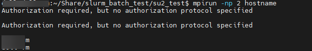

+++
author = "Andrew Moa"
title = "Solve the \"Authorization required, but no authorization protocol specified\" error message of OpenMPI"
date = "2025-04-16"
description = ""
tags = [
    "linux",
    "openfoam",
    "su2",
]
categories = [
    "linux",
]
series = [""]
aliases = [""]
image = "/images/ubuntu-bg.jpg"
+++

Recently, when submitting calculations with OpenFOAM and SU2, the error message "Authorization required, but no authorization protocol specified" repeatedly appeared. Although the calculation was eventually completed by ignoring it, the constant error message made me feel uneasy.

I suspected that it was a problem with OpenMPI, and verified it with the following command:
```Bash
mpirun -np 2 hostname
```

Sure enough, an error message appeared:


After looking through the information online, the more reliable solution is this [^1]: Add the following environment variables to the Slurm script:
```Bash
export HWLOC_COMPONENTS=-gl
```

Test it and the error problem is solved:


[^1]: [github issue](https://github.com/3dem/relion/issues/1211#issuecomment-2505284712)