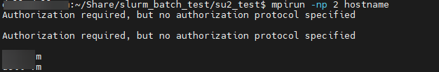

+++
author = "Andrew Moa"
title = "解决OpenMPI的\"Authorization required, but no authorization protocol specified\"错误提示"
date = "2025-04-16"
description = ""
tags = [
    "linux",
    "openfoam",
    "su2",
]
categories = [
    "linux",
]
series = [""]
aliases = [""]
image = "/images/ubuntu-bg.jpg"
+++

最近在用OpenFOAM和SU2提交计算时，反复出现"Authorization required, but no authorization protocol specified"报错信息。尽管不理会它最终还是能完成计算，但总是出现的报错信息让人心里不安。

怀疑是OpenMPI的问题，通过以下命令验证：
```Bash
mpirun -np 2 hostname
```

果然出现报错信息：


翻阅网上信息，比较靠谱的解决方案是这个[^1]：在Slurm脚本中增加以下环境变量：
```Bash
export HWLOC_COMPONENTS=-gl
```

测试一下，报错问题解决了：


[^1]: [github issue](https://github.com/3dem/relion/issues/1211#issuecomment-2505284712)