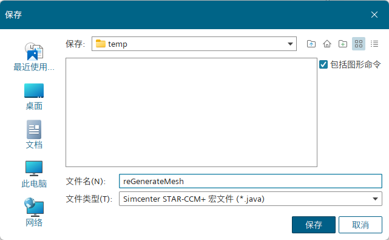
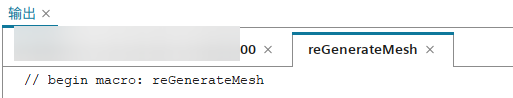
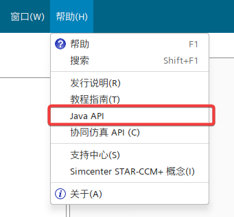
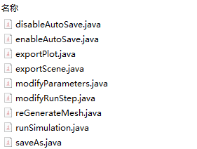

+++
author = "Andrew Moa"
title = "STAR-CCM+ macro file recording and writing"
date = "2025-04-17"
description = ""
tags = [
    "java",
    "star-ccm+",
]
categories = [
    "cfd",
]
series = [""]
aliases = [""]
image = "/images/starccm-bg.jpg"
+++

STAR-CCM+ macro is essentially a java file, and the syntax is no different from ordinary java. Using macros can help us simplify the processing process, especially some repetitive process operations. Completing some process operations by writing macro files can greatly liberate human resources, and even complete certain operations during the solution process.

## 1. Record macros

The essence of STAR-CCM+ macro is a collection of various operation commands in the analysis process. Instead of explaining the complex and cumbersome java syntax + API from scratch, it is better to start with engineering issues directly.

The entrance to the STAR-CCM+ macro operation is in the toolbar in the upper left corner. From left to right, the "Play Macro", "Start Recording", "Pause Recording" and "Stop Recording" buttons. The relevant operation options can also be found in the "File" menu.


Clicking "Start Recording" will bring up a dialog box that prompts the location of the macro to be saved. If some scene-based graphics operations are used during the process, you can check "Including Graphic Commands"; but it is not recommended to check it in general, especially when it involves supercomputer submissions.


Next, you can see the code for recording the java process in the output window. At this time, the analysis operations can be performed normally. STAR-CCM+ will convert the related operations into the corresponding java code and display them in the output window.


When the analysis operation is completed, click "Stop recording" and you can see the complete java code in the output window, and the code is also saved to the java file.

Below is a recorded macro code example, which is used to clear the original mesh and re-divid the body mesh.
```Java
// Simcenter STAR-CCM+ macro: reGenerateMesh.java
// Written by Simcenter STAR-CCM+ 19.06.009
// The two lines of comments above are generated during recording, recording the macro file name and STAR-CCM+ version information.
package macro;

import java.util.*;

import star.common.*;
import star.meshing.*;

// The class name and file name should be consistent
public class reGenerateMesh extends StarMacro {

  // This function is the entry point of the entire macro
  public void execute() {
    execute0();
  }

  // This function performs mesh clearing and meshing operations.
  private void execute0() {

    Simulation simulation_0 = 
      getActiveSimulation();

    MeshPipelineController meshPipelineController_0 = 
      simulation_0.get(MeshPipelineController.class);

  // Clear the original grid
    meshPipelineController_0.clearGeneratedMeshes();

  // Generate Volume Mesh
    meshPipelineController_0.generateVolumeMesh();
  }
}

```

For the specific code, you can check the help file of STAR-CCM+, but most API naming is more intuitive and can be inferred based on their naming.


If the operations to be performed are complicated, there are many processes. It is recommended to decompose the process, record different java files separately, and then combine them.


If the recording operation requires running the solver, you can change to a simple model for recording, or you can lower the parameters a little to save time and resources.

## 2. Write macros

With the Java file recorded above, the following writing is much easier.

Next, combine these modules and write a new Java macro file. The function is to automatically divide the grid after reading the sim file, set parameters and run the solution. After the solution is completed, the corresponding drawing and scene files are output, and the result file with the specified file name is saved.

It is recommended to use IDE tools here. With the help of syntax checking, code highlighting and automatic completion, it can reduce the chance of errors, which is very friendly to beginners. The official tutorial and help file of STAR-CCM+ demonstrates **NetBeans**. Some people also like to use **Eclipse** or **IntelliJ IDEA**. There is no big difference here, so choose according to your personal preferences.

```Java
// Simcenter STAR-CCM+ macro: meshAndRun.java
// Written by Simcenter STAR-CCM+ 19.06.009
package macro;

import java.util.*;
import star.common.*;
import star.meshing.*;
import star.base.neo.*;
import star.vis.*;

public class meshAndRun extends StarMacro {
  // Input parameters for analysis
  double env_temp = 25.0; // Unit: C
  double fan_speed = 2450.0; // Unit: rpm
  // Some parameters
  boolean autoSave = true;
  int maxStep = 10;
  int autoSaveStep = 1000;
  boolean saveAsResultsFile = true;
  // It is best to write the full path here, otherwise it will be saved to the ${HOME} directory by default under Windows
  String resultsFileName = "final_results.sim";

  // Macro operation entry
  public void execute() {

    // Perform analysis operations
    if (autoSave) {
      enableAutoSave();
    } else {
      disableAutoSave();
    }
    generateMesh();
    modifyParameters();
    modifyMaxStep();
    run();
    exportPlot();
    exportScene();
    if (saveAsResultsFile) {
      saveAs();
    }
  }

  // Generate Volume Mesh
  private void generateMesh() {
    Simulation simulation_0 = getActiveSimulation();
    MeshPipelineController meshPipelineController_0 = simulation_0.get(MeshPipelineController.class);
    // meshPipelineController_0.clearGeneratedMeshes();
    meshPipelineController_0.generateVolumeMesh();
  }

  // Set up autosave
  private void enableAutoSave() {
    Simulation simulation_0 = getActiveSimulation();
    AutoSave autoSave_0 = simulation_0.getSimulationIterator().getAutoSave();
    autoSave_0.setAutoSaveBatch(true);
    autoSave_0.setAutoSaveMesh(true);
    AutoSaveFileSet autoSaveFileSet_0 = ((AutoSaveFileSet) autoSave_0.getAutoSaveFileSetManager()
        .getObject("Auto Save File Set 1"));
    StarUpdate starUpdate_0 = autoSaveFileSet_0.getStarUpdate();
    IterationUpdateFrequency iterationUpdateFrequency_0 = starUpdate_0.getIterationUpdateFrequency();
    IntegerValue integerValue_0 = iterationUpdateFrequency_0.getIterationFrequencyQuantity();
    integerValue_0.getQuantity().setValue(autoSaveStep);
    starUpdate_0.setEnabled(true);
  }

  // Cancel autosave
  private void disableAutoSave() {
    Simulation simulation_0 = getActiveSimulation();
    AutoSave autoSave_0 = simulation_0.getSimulationIterator().getAutoSave();
    autoSave_0.setAutoSaveMesh(false);
    autoSave_0.setAutoSaveBatch(false);
  }

  // Setting the input parameters for the analysis
  private void modifyParameters() {
    Simulation simulation_0 = getActiveSimulation();
    ScalarGlobalParameter scalarGlobalParameter_0 = ((ScalarGlobalParameter) simulation_0
        .get(GlobalParameterManager.class).getObject("env_temp"));
    Units units_0 = ((Units) simulation_0.getUnitsManager().getObject("C"));
    scalarGlobalParameter_0.getQuantity().setValueAndUnits(env_temp, units_0);
    ScalarGlobalParameter scalarGlobalParameter_1 = ((ScalarGlobalParameter) simulation_0
        .get(GlobalParameterManager.class).getObject("fan_speed"));
    Units units_1 = ((Units) simulation_0.getUnitsManager().getObject("rpm"));
    scalarGlobalParameter_1.getQuantity().setValueAndUnits(fan_speed, units_1);
  }

  // Set the maximum number of steps
  private void modifyMaxStep() {
    Simulation simulation_0 = getActiveSimulation();
    StepStoppingCriterion stepStoppingCriterion_0 = ((StepStoppingCriterion) simulation_0
        .getSolverStoppingCriterionManager().getSolverStoppingCriterion("Maximum Steps"));
    IntegerValue integerValue_0 = stepStoppingCriterion_0.getMaximumNumberStepsObject();
    integerValue_0.getQuantity().setValue(maxStep);
  }

  // Run the solver
  private void run() {
    Simulation simulation_0 = getActiveSimulation();
    // ResidualPlot residualPlot_0 = ((ResidualPlot)
    // simulation_0.getPlotManager().getPlot("Residuals"));
    // residualPlot_0.openInteractive();
    simulation_0.getSimulationIterator().run();
  }

  // Output plot
  private void exportPlot() {
    Simulation simulation_0 = getActiveSimulation();
    MonitorPlot monitorPlot_0 = ((MonitorPlot) simulation_0.getPlotManager().getPlot("mass_flow"));
    // You can use relative paths or absolute paths here.
    monitorPlot_0.export(resolvePath("mass_flow.csv"), ",");
  }

  // Output scene
  private void exportScene() {
    Simulation simulation_0 = getActiveSimulation();
    Scene scene_0 = simulation_0.getSceneManager().getScene("Geometry");
    scene_0.export3DSceneFileAndWait(resolvePath("Geometry.sce"), "Geometry", "", false, SceneFileCompressionLevel.OFF);
  }

  // Save the results
  private void saveAs() {
    Simulation simulation_0 = getActiveSimulation();
    simulation_0.saveState(resultsFileName);
  }
}

```

## 3. Run the macro

After writing, you can try running the following to see if there are any errors reported.
If you try to run the solution, you can reduce the number of solutions to see if the output file is correct.
Change the conditions and parameters, test them several times, and after complete tests, there will be no errors reported before it can be used in the production environment.

If you want to submit an overcomputer operation, you should`-batch`Append the java macro file path [^1] to the switch.
```Bash
starccm+ [path-to-sim-file] -batch [path-to-java-file] -np [number-of-threads] ...
```

[^1]: [编制应用程序脚本](https://www.topcfd.cn/Ebook/STARCCMP/GUID-8A0803A8-C91B-4996-9C4B-FF6658C63985.html)