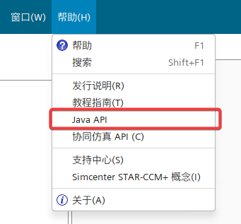

+++
author = "Andrew Moa"
title = "STAR-CCM+宏文件录制和编写"
date = "2025-04-17"
description = ""
tags = [
    "java",
    "star-ccm+",
]
categories = [
    "cfd",
]
series = [""]
aliases = [""]
image = "/images/starccm-bg.png"
+++

STAR-CCM+宏本质上就是一个java文件，语法和普通的java没有什么区别。使用宏可以帮助我们简化处理过程，尤其是一些重复的流程性的操作。通过编写宏文件完成一些流程操作可以极大地解放人力资源，甚至可以在求解过程中完成某些特定的操作。

## 1. 录制宏

STAR-CCM+宏本质就是分析过程中的各种操作命令的集合，与其从头开始讲解复杂繁琐的java语法+API，不如直接从工程问题上手。

STAR-CCM+宏操作的入口在左上角工具栏里，从左到右依次是“播放宏”、“开始录制”、“暂停录制”和“停止录制”按钮，相关操作选项也可以在“文件”菜单中找到。


点击“开始录制”会弹出对话框，提示宏的保存位置。如果过程中用到一些场景化的图形操作，可以勾选上“包括图形命令”；但一般情况下不建议勾选，尤其是涉及到超算提交的场合。


接下来就可以在输出窗口中看到录制java过程的代码，此时可以正常地执行分析操作，STAR-CCM+会把相关操作转换成对应的java代码，并显示在输出窗口中。


当分析操作完成后点击“停止录制”，可以在输出窗口中看到完整的java代码，同时该代码也被保存到java文件中。

下面是录制的宏代码示例，作用是将原有网格清除并重新划分体网格。
```Java
// Simcenter STAR-CCM+ macro: reGenerateMesh.java
// Written by Simcenter STAR-CCM+ 19.06.009
// 上面两行注释是录制时生成的，记录保存宏的文件名、STAR-CCM+版本信息
package macro;

import java.util.*;

import star.common.*;
import star.meshing.*;

// 类名和文件名要一致
public class reGenerateMesh extends StarMacro {

  //这个函数是整个宏的入口	
  public void execute() {
    execute0();
  }

  //这个函数执行网格清除和划分操作
  private void execute0() {

    Simulation simulation_0 = 
      getActiveSimulation();

    MeshPipelineController meshPipelineController_0 = 
      simulation_0.get(MeshPipelineController.class);

	//清除原来的网格
    meshPipelineController_0.clearGeneratedMeshes();

	//生成体网格
    meshPipelineController_0.generateVolumeMesh();
  }
}

```

具体代码的作用可以查看STAR-CCM+的帮助文件，不过大部分的API的命名都比较直观，根据其命名也能推测出来。


如果要执行的操作比较复杂，流程很多。建议将流程进行分解，分别录制不同java文件，再将其组合起来。


如果录制的操作需要运行求解器，可以换一个简单点的模型进行录制，也可以把参数调小一点，节省时间和资源。

## 2. 编写宏

有了上面录制的java文件，下面的编写就简单多了。

接下来将这些模块组合起来，编写一个新的java宏文件，作用是在读取sim文件之后自动划分网格，设置参数并运行求解，求解完成后输出相应的绘图和场景文件，并保存成指定文件名的结果文件。

这里建议使用IDE工具，借助语法检查、代码高亮提示和自动完成可以减少出错的几率，对初学者十分友好。STAR-CCM+官方教程和帮助文件里演示的是**NetBeans**，也有人喜欢用**Eclipse**或**IntelliJ IDEA**，在这里区别都不大，根据个人喜好选择吧。

```Java
// Simcenter STAR-CCM+ macro: meshAndRun.java
// Written by Simcenter STAR-CCM+ 19.06.009
package macro;

import java.util.*;
import star.common.*;
import star.meshing.*;
import star.base.neo.*;
import star.vis.*;

public class meshAndRun extends StarMacro {
  // 分析的输入参数
  double env_temp = 25.0; // Unit: C
  double fan_speed = 2450.0; // Unit: rpm
  // 一些设置参数
  boolean autoSave = true;
  int maxStep = 10;
  int autoSaveStep = 1000;
  boolean saveAsResultsFile = true;
  // 这里最好写完整路径，否则Windows下会默认保存到${HOME}目录
  String resultsFileName = "final_results.sim";

  // 宏操作入口
  public void execute() {

    // 执行分析操作
    if (autoSave) {
      enableAutoSave();
    } else {
      disableAutoSave();
    }
    generateMesh();
    modifyParameters();
    modifyMaxStep();
    run();
    exportPlot();
    exportScene();
    if (saveAsResultsFile) {
      saveAs();
    }
  }

  // 生成体网格
  private void generateMesh() {
    Simulation simulation_0 = getActiveSimulation();
    MeshPipelineController meshPipelineController_0 = simulation_0.get(MeshPipelineController.class);
    // meshPipelineController_0.clearGeneratedMeshes();
    meshPipelineController_0.generateVolumeMesh();
  }

  // 设置自动保存
  private void enableAutoSave() {
    Simulation simulation_0 = getActiveSimulation();
    AutoSave autoSave_0 = simulation_0.getSimulationIterator().getAutoSave();
    autoSave_0.setAutoSaveBatch(true);
    autoSave_0.setAutoSaveMesh(true);
    AutoSaveFileSet autoSaveFileSet_0 = ((AutoSaveFileSet) autoSave_0.getAutoSaveFileSetManager()
        .getObject("Auto Save File Set 1"));
    StarUpdate starUpdate_0 = autoSaveFileSet_0.getStarUpdate();
    IterationUpdateFrequency iterationUpdateFrequency_0 = starUpdate_0.getIterationUpdateFrequency();
    IntegerValue integerValue_0 = iterationUpdateFrequency_0.getIterationFrequencyQuantity();
    integerValue_0.getQuantity().setValue(autoSaveStep);
    starUpdate_0.setEnabled(true);
  }

  // 取消自动保存
  private void disableAutoSave() {
    Simulation simulation_0 = getActiveSimulation();
    AutoSave autoSave_0 = simulation_0.getSimulationIterator().getAutoSave();
    autoSave_0.setAutoSaveMesh(false);
    autoSave_0.setAutoSaveBatch(false);
  }

  // 设置分析的输入参数
  private void modifyParameters() {
    Simulation simulation_0 = getActiveSimulation();
    ScalarGlobalParameter scalarGlobalParameter_0 = ((ScalarGlobalParameter) simulation_0
        .get(GlobalParameterManager.class).getObject("env_temp"));
    Units units_0 = ((Units) simulation_0.getUnitsManager().getObject("C"));
    scalarGlobalParameter_0.getQuantity().setValueAndUnits(env_temp, units_0);
    ScalarGlobalParameter scalarGlobalParameter_1 = ((ScalarGlobalParameter) simulation_0
        .get(GlobalParameterManager.class).getObject("fan_speed"));
    Units units_1 = ((Units) simulation_0.getUnitsManager().getObject("rpm"));
    scalarGlobalParameter_1.getQuantity().setValueAndUnits(fan_speed, units_1);
  }

  // 设置最大步数
  private void modifyMaxStep() {
    Simulation simulation_0 = getActiveSimulation();
    StepStoppingCriterion stepStoppingCriterion_0 = ((StepStoppingCriterion) simulation_0
        .getSolverStoppingCriterionManager().getSolverStoppingCriterion("Maximum Steps"));
    IntegerValue integerValue_0 = stepStoppingCriterion_0.getMaximumNumberStepsObject();
    integerValue_0.getQuantity().setValue(maxStep);
  }

  // 运行求解器
  private void run() {
    Simulation simulation_0 = getActiveSimulation();
    // ResidualPlot residualPlot_0 = ((ResidualPlot)
    // simulation_0.getPlotManager().getPlot("Residuals"));
    // residualPlot_0.openInteractive();
    simulation_0.getSimulationIterator().run();
  }

  // 输出绘图
  private void exportPlot() {
    Simulation simulation_0 = getActiveSimulation();
    MonitorPlot monitorPlot_0 = ((MonitorPlot) simulation_0.getPlotManager().getPlot("mass_flow"));
    // 这里可以用相对路径，也可以用绝对路径
    monitorPlot_0.export(resolvePath("mass_flow.csv"), ",");
  }

  // 输出场景
  private void exportScene() {
    Simulation simulation_0 = getActiveSimulation();
    Scene scene_0 = simulation_0.getSceneManager().getScene("Geometry");
    scene_0.export3DSceneFileAndWait(resolvePath("Geometry.sce"), "Geometry", "", false, SceneFileCompressionLevel.OFF);
  }

  // 保存结果
  private void saveAs() {
    Simulation simulation_0 = getActiveSimulation();
    simulation_0.saveState(resultsFileName);
  }
}

```

## 3. 运行宏

编写完成后可以尝试运行以下，看看有没有报错。
尝试运行求解的话可以把求解步数调小一点，看输出的文件是否正确。
更改条件和参数，多测试几次，经过完整测试没有报错才可以用于生产环境。

如果要提交超算运行，应在`-batch`开关后附加java宏文件路径[^1]。
```Bash
starccm+ [path-to-sim-file] -batch [path-to-java-file] -np [number-of-threads] ...
```

[^1]: [编制应用程序脚本](https://www.topcfd.cn/Ebook/STARCCMP/GUID-8A0803A8-C91B-4996-9C4B-FF6658C63985.html)