+++
author = "Andrew Moa"
title = "Debug STAR-CCM+ macros with VSCode"
date = "2025-04-18"
description = ""
tags = [
    "java",
    "star-ccm+",
]
categories = [
    "cfd",
]
series = [""]
aliases = [""]
image = "/images/vortex-bg.jpg"
+++

As mentioned earlier, the recording and writing of STAR-CCM+ macro files are essentially Java files, so it can be developed and debugged using Java programming methods. If complex business scenarios are involved, additional functions need to be added. The program itself is relatively complex, and it is difficult to wait until the entire program is written before testing it. It is inevitable to debug during the development process. The development tool used by the official document is the old version of **NetBeans**. Many functions have changed. In addition, the official document description is too simple. Most people are still confused about the debugging process of STAR-CCM+ after reading it.[**VSCode**](https://code.visualstudio.com/) As a leader in emerging IDE, you can not only support Java programming through expansion, but also [**copilot**](https://copilot.microsoft.com/chats/Uz4t8yZbNmpyo1CVtqKWP) To expand the integrated powerful AI programming capabilities, this article uses **VSCode** to demonstrate the debugging process of STAR-CCM+ macro files.

## 1. VSCode configuration

First of all, you need to install the Java extension in VSCode, and at least the following must be installed:
 1. [Language Support for Java(TM) by Red Hat](https://marketplace.visualstudio.com/items?itemName=redhat.java)
 2. [Debugger for Java](https://marketplace.visualstudio.com/items?itemName=vscjava.vscode-java-debug)
 3. [Project Manager for Java](https://marketplace.visualstudio.com/items/?itemName=vscjava.vscode-java-dependency)

You can also install this expansion package directly and install all the Java expansions you need at one time:
[Extension Pack for Java](https://marketplace.visualstudio.com/items/?itemName=vscjava.vscode-java-pack)

Download a JDK and install it. If you don't want to download the JDK, you can also find the JDK that comes with the installation package in the STAR-CCM+ installation path and add it to the environment variables.
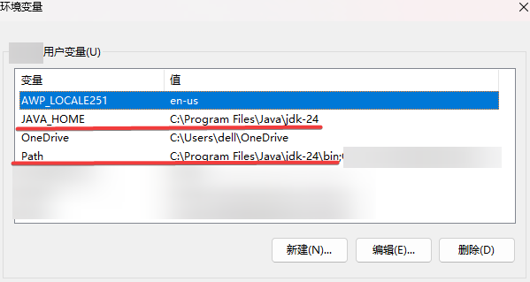

## 2. Create a Java project

Enter in the VSCode command panel (Ctrl+Shift+P) `Java: Create Java Project`, create a new java project.
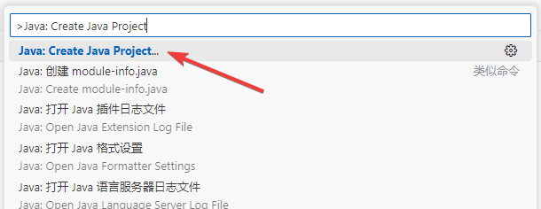

Project type selection `No build tools` .
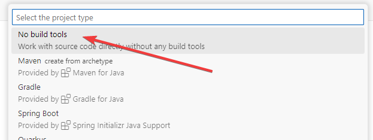

In the pop-up dialog box, select the project folder location, and then enter the project name (for example: starccm), and the new project is completed, you can see the structure of the java project.
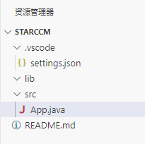

Copy the `[STAR-CCM+_Installation]/star/lib/java/platform/modules/ext` folder to the lib folder of the new project[^1].
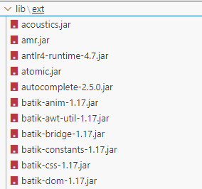

Copy the previously recorded or written java macros to the java file generated by the project. You can see that the syntax check and code highlighting prompts have taken effect. At this time, modifying the code can automatically complete the supplementary code snippet, or you can call `copilot` to automatically fill in and correct code errors through `Ctrl+I`.
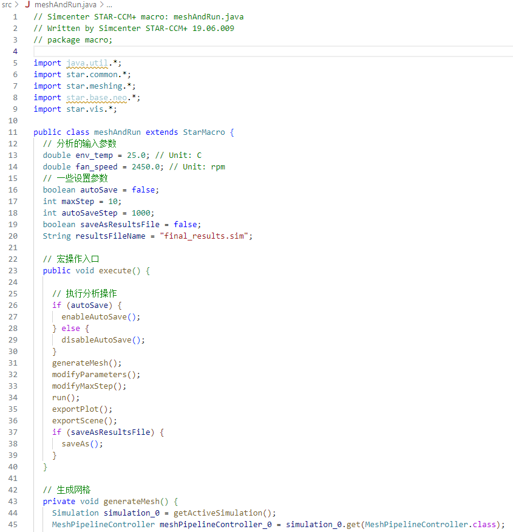

## 3. Configuration debugging

In the project folder `.vscode` Modify in the directory `launch.json` File, edit code as follows.
```json
{
    "version": "0.2.0",
    "configurations": [
        {
            "type": "java",
            "name": "Debug (Attach)",
            "projectName": "starccm",
            "request": "attach",
            "hostName": "localhost",
            "port": 8765
        }
    ]
}
```

if `.vscode` No below `launch.json` This file can be clicked on the left side of VSCode`运行与调试`button, generate the file according to the prompts, and edit it as above.
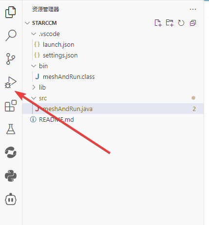

Start the STAR-CCM+ main program through the command line, be careful to `starccm+` The startup parameters are attached later. `address` The port number behind should be as above `launch.json` The port numbers filled in the file are the same.
```bash
<InstallationDirectory>/star/bin/starccm+ -jvmargs '-Xdebug -Xrunjdwp:transport=dt_socket,server=y,suspend=n,address=8765'
```
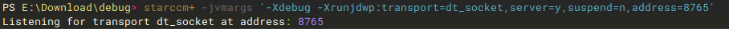

After the above configuration is completed, you can open or create a new sim file in STAR-CCM+ to test the java program we wrote.

Then click on the left side of VSCode `运行与调试` button to enter debug mode. After successfully entering debug mode, the call stack and breakpoint information will be displayed on the modulation page.
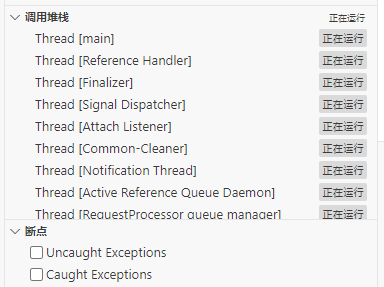

If you fail to enter debug mode, a dialog box will pop up. It is necessary to confirm whether STAR-CCM+ has normal startup, whether there are additional startup parameters, and `launch.json` Is there any error in writing the file?
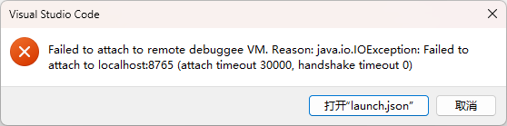

## 4. Debugging process

Below is a simple java file to demonstrate the debugging process.
```java
// The following line is automatically generated during recording. It has no effect and can be commented out.
// package macro;

import star.common.*;

public class testCCMDebug extends StarMacro {

  // Macro operation entry
  public void execute() {
    pringMsg();
  }

  // Demonstrates the function of printing messages
  private void pringMsg() {
    Simulation simulation_0 = getActiveSimulation();
    simulation_0.println("Hello, starccm+!");
    simulation_0.println("This is a macro example.");
    simulation_0.println("This macro is used to test STAR-CCM+ debug mode.");
    String fileName = simulation_0.getPresentationName() + ".sim";
    simulation_0.println("The simulation file name is: " + fileName);
  }

}

```

Then add breakpoints to it.
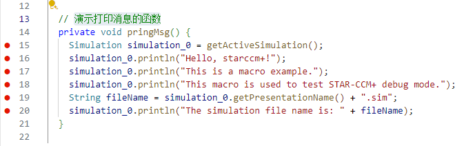
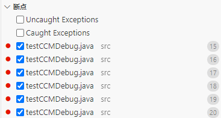

The key point is [^2], **Be sure to use "play macro" to load the java file in STAR-CCM+** . When the execution reaches a breakpoint, an interrupt will be prompted in VSCode, so that the debugging execution process can be controlled through VSCode.
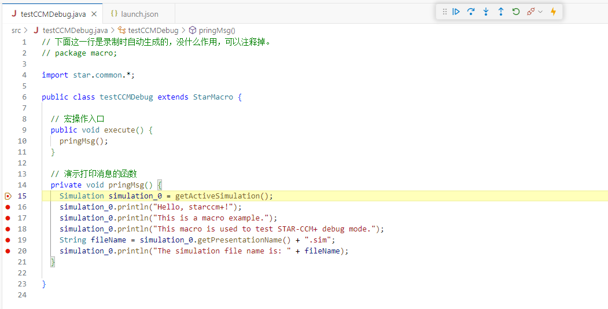

Final execution effect:
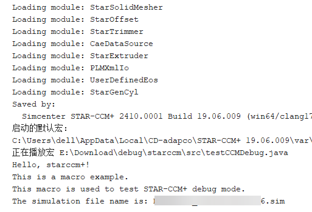

The debugging execution reaches a breakpoint, and STAR-CCM+ will enter a pause state during the process. At this time, clicking the Cancel button (the red X next to the progress bar) is useless.
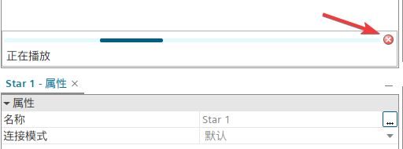

After the VSCode debugging is completed, if you want to enter debugging again, you need to use "play macro" in STAR-CCM+ to reload the java file.

[^1]: [使用 IDE 调试宏](https://www.topcfd.cn/Ebook/STARCCMP/GUID-C9B469BA-DE86-4824-9094-9207D72099D1.html)

[^2]: [学习STAR-CCM+编程语言：在Eclipse中进行二次开发调试](https://www.jishulink.com/post/1893585)

