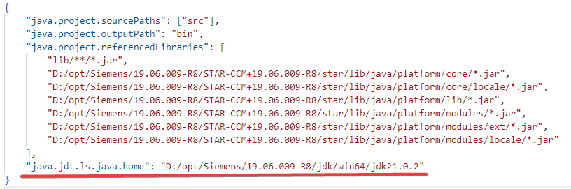
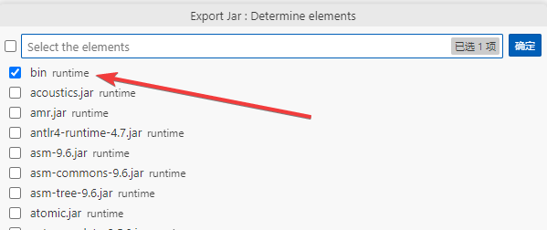
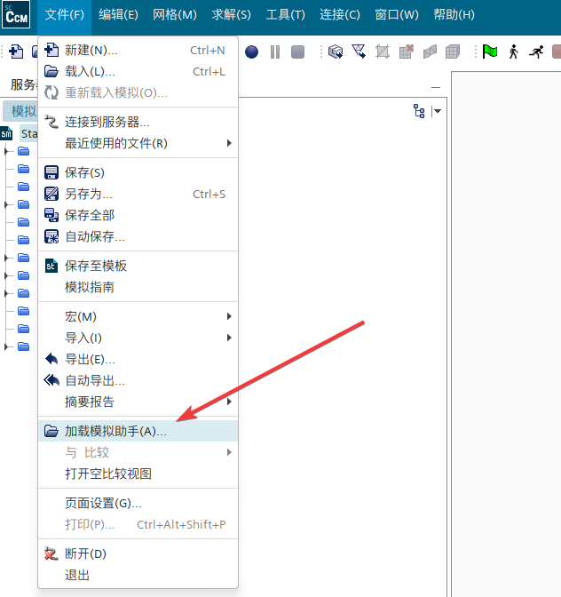
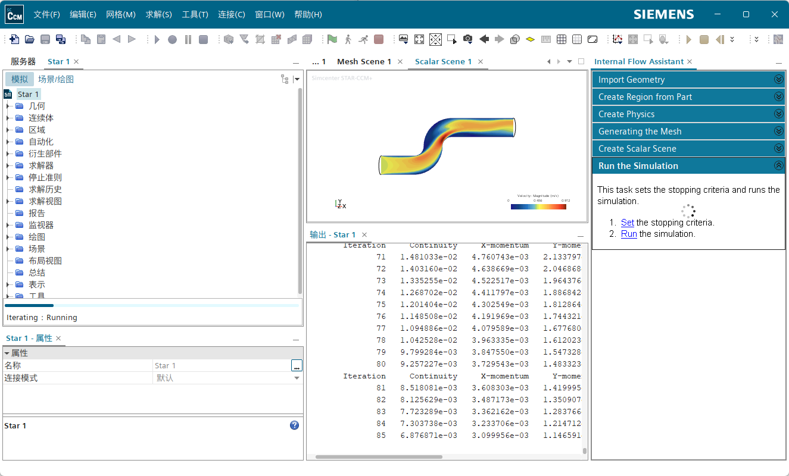

+++
author = "Andrew Moa"
title = "Coding STAR-CCM+ simulation assistant using VSCode"
date = "2025-04-22"
description = ""
tags = [
    "java",
    "star-ccm+",
]
categories = [
    "cfd",
]
series = [""]
aliases = [""]
image = "/images/starccm-bg.png"
+++

The STAR-CCM+ Simulation Assistant is equivalent to a plug-in that encapsulates Java macro commands. By calling macro commands, some procedural operations are performed. Compared with directly executing Java macro files, it can interact with users better and is obviously more friendly to users who are not familiar with Java. Because the simulation assistant is mostly used in pre- and post-processing, many consulting companies tend to adopt the same approach when developing customized plug-ins for this purpose.

The official document uses NetBeans to demonstrate the process of creating a simulation assistant project, but the NetBeans version demonstrated is very old. The official document is updated slowly and the description is too general. Here, VSCode is used to re-implement and demonstrate it again. For relevant configurations, please refer to [Debug STAR-CCM+ macros with VSCode](../2025-04-18-use-vscode-debug-starccm-marco/). The following demonstration materials are from the official STAR-CCM+ tutorial file.

## 1. Create a simulation assistant project

Refer to [Debug STAR-CCM+ macros with VSCode](../2025-04-18-use-vscode-debug-starccm-marco/) to create a Java project. Select `No build tools` as the project type and name it according to your needs.

After the project is created, edit the `settings.json` file under `[project folder]/.vscode` and add the following directories to the project dependencies[^1]:
 - `[STAR-CCM+_Installation]/star/lib/java/platform/core`
 - `[STAR-CCM+_Installation]/star/lib/java/platform/core/locale`
 - `[STAR-CCM+_Installation]/star/lib/java/platform/lib`
 - `[STAR-CCM+_Installation]/star/lib/java/platform/modules`
 - `[STAR-CCM+_Installation]/star/lib/java/platform/modules/ext`
 - `[STAR-CCM+_Installation]/star/lib/java/platform/modules/locale`


Because the simulation assistant needs to be loaded into STAR-CCM+, you need to ensure that the jdk versions of the two are consistent. Edit the `settings.json` file in `[project folder]/.vscode` and add a line of settings to specify the jdk version that comes with STAR-CCM+.
```json
"java.jdt.ls.java.home": "[STAR-CCM+_Installation]/jdk/[platform]/jdk[version]"
```


Confirm the jdk version in `JAVA PROJECTS` and make sure it is consistent with the version provided by STAR-CCM+.


## 2. Project Coding

Delete the automatically generated source files under `[project folder]/src`, create a folder `Assistant`, and copy and paste the Java source files in the official tutorial into it [^2].


Create a folder called `XHTML` under `[project folder]/src` and copy and paste the XHTML file from the official tutorial into it.


Next, follow the guidance of the official tutorial [^3] to complete the other parts.

The entire simulation assistant project is very simple, and the basic operation is divided into 6 steps:
1. Import geometry files
2. Establish analysis domain
3. Establish analysis physics
4. Generate volume mesh
5. Establish display scene
6. Set the number of solution steps and run the solution.

Each step of the operation corresponds to a java file, and each java file corresponds to an XHTML. The java file is similar to the macro mentioned above, and can be quickly edited by recording macros + copying and pasting. The XHTML file provides user interaction instructions and operation entrances, allowing users to call corresponding operation commands according to prompts.


When writing your own project file, it is recommended to modify it based on the official tutorial file, copy and paste the macro snippet you recorded into it and edit it, trying to meet the template requirements of the original file. For specific writing rules, please refer to the official document [^4].

## 3. Release and test

The simulation assistant can be released in the form of jar packaging, and use the VSCode `JAVA PROJECTS` function to package and output the jar file.


Just choose the `bin` directory and do not repeat packaging of other dependencies.


The packaged jar file is in the project folder.


After creating or loading a sim file in STAR-CCM+, load the Simulation Assistant through the File menu.


Run the full test.


Because the tutorial cases are old, many APIs have been deprecated in the new version, and there are some errors, so you need to adjust the code yourself.

## 4. Debugging the simulation assistant

The debugging of the simulation assistant is exactly the same as the debugging process of the Java macro in [Debug STAR-CCM+ macros with VSCode](../2025-04-18-use-vscode-debug-starccm-marco/). The only difference is that the loading method has changed from "playing macros" to "loading simulation assistant".

The code of the `launch.json` file in the `.vscode` directory of the project folder is as follows:
```json
{
    "version": "0.2.0",
    "configurations": [
        {
            "type": "java",
            "name": "Debug (Attach)",
            "projectName": "starccm",
            "request": "attach",
            "hostName": "localhost",
            "port": 8765
        }
    ]
}
```

Start the STAR-CCM+ main program through the command line:
```bash
<InstallationDirectory>/star/bin/starccm+ -jvmargs '-Xdebug -Xrunjdwp:transport=dt_socket,server=y,suspend=n,address=8765'
```

Before entering debugging and starting execution, add breakpoints in the source code. When the code reaches the breakpoint, VSCode will prompt a break, and you can check the variables at the breakpoint.


It should be noted that if the simulation assistant is released through jar packaging, make sure that the jar package version is consistent with the current source code before entering debugging.

[^1]: [创建 NetBeans 项目](https://www.topcfd.cn/Ebook/STARCCMP/GUID-844E0FD2-79DC-47B6-A182-3594ECC5E475.html)

[^2]: [将 Java 包、Java 类和 XHTML 文件添加到模拟助手项目](https://www.topcfd.cn/Ebook/STARCCMP/GUID-986F9B0E-E9AC-4999-B02A-3544DA63B8A0.html)

[^3]: [模拟助手：管道内流模拟辅助](https://www.topcfd.cn/Ebook/STARCCMP/GUID-439308B8-7E23-4AC1-8B3F-ED490F61C5AD.html)

[^4]: [开发模拟助手](https://www.topcfd.cn/Ebook/STARCCMP/GUID-65D3D6B0-CDCB-4D30-9404-8762C9FA904D.html)

