+++
author = "Andrew Moa"
title = "使用VSCode编写STAR-CCM+模拟助手"
date = "2025-04-22"
description = ""
tags = [
    "java",
    "star-ccm+",
]
categories = [
    "cfd",
]
series = [""]
aliases = [""]
image = "/images/starccm-bg.png"
+++

STAR-CCM+模拟助手(Simulation Assistant)相当于一个插件，在插件内部封装了java宏命令。使用的时候，通过调用宏命令，执行一些流程性的操作。相比于直接执行java宏文件，可以更好地与用户进行交互，对不熟悉java的用户来说明显更加友好。因为模拟助手大多应用于前后处理当中，许多咨询公司针对这方面开发的定制化插件也更倾向于采用相同的方式。

官方文档采用NetBeans演示了创建模拟助手项目的流程，但是演示的NetBeans版本已经很老旧了。官方文档更新缓慢，描述又过于笼统。这里采用VSCode重新实现并演示一遍，相关配置可以参考[使用VSCode调试STAR-CCM+宏](../2025-04-18-use-vscode-debug-starccm-marco/)，以下演示材料来自于STAR-CCM+官方的教程文件。

## 1. 建立模拟助手项目

参考[使用VSCode调试STAR-CCM+宏](../2025-04-18-use-vscode-debug-starccm-marco/)中的内容建立java项目，项目类型一样选择`No build tools`，名称根据自己需要起一个。

项目创建完成后，编辑`[项目文件夹]/.vscode`下的`settings.json`文件，将下面这些目录添加到项目依赖中[^1]：
 - `[STAR-CCM+_Installation]/star/lib/java/platform/core`
 - `[STAR-CCM+_Installation]/star/lib/java/platform/core/locale`
 - `[STAR-CCM+_Installation]/star/lib/java/platform/lib`
 - `[STAR-CCM+_Installation]/star/lib/java/platform/modules`
 - `[STAR-CCM+_Installation]/star/lib/java/platform/modules/ext`
 - `[STAR-CCM+_Installation]/star/lib/java/platform/modules/locale`
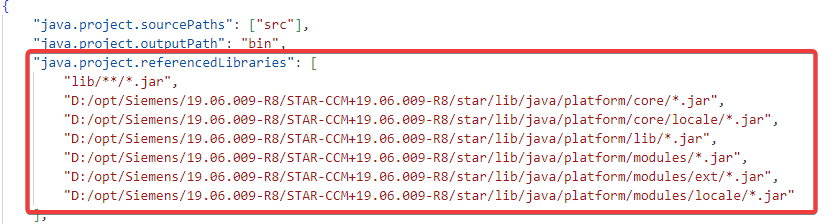

因为模拟助手需要加载到STAR-CCM+中，需要保证两者jdk版本一致。编辑`[项目文件夹]/.vscode`下的`settings.json`文件，增加一行设置，指定jdk为STAR-CCM+自带的版本。
```json
"java.jdt.ls.java.home": "[STAR-CCM+_Installation]/jdk/[platform]/jdk[version]"
```
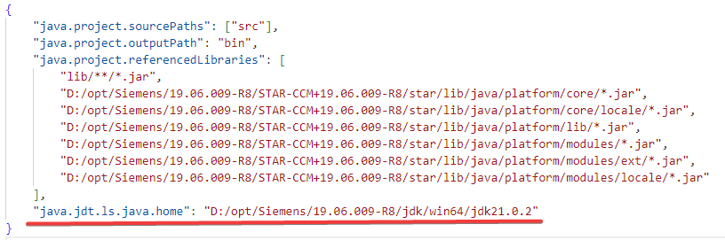

在`JAVA PROJECTS`里确认jdk版本，确保和STAR-CCM+自带的版本一致。
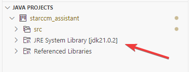

## 2. 项目编写

将自动生成的`[项目文件夹]/src`下面的源文件删除，创建文件夹`Assistant`，将官方教程中的java源文件复制粘贴到其中[^2]。
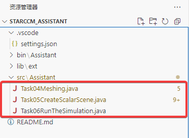

在`[项目文件夹]/src`下面创建文件夹`XHTML`文件夹，将官方教程中的XHTML文件复制粘贴到其中。
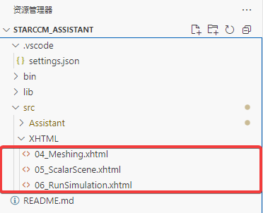

接下来按照官方教程[^3]的指导，补充完整其他部分。

整个模拟助手项目非常简单，基本操作就分为6步：
 1. 导入几何文件
 2. 建立分析域
 3. 建立分析物理
 4. 生成体网格
 5. 建立显示场景
 6. 设置求解步数并运行求解。

每一步的操作对应一个java文件，每一个java文件对应一个XHTML。java文件类似于前面说过的宏，可以采用录制宏+复制粘贴的方式快速编辑。XHTML文件则提供用户交互说明和操作入口，允许用户根据提示调用相应的操作命令。
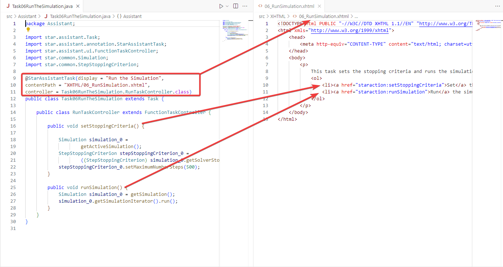

在编写自己的项目文件时，建议在官方提供的教程文件基础上进行修改，将自己录制的宏片段复制粘贴到其中并进行编辑，尽量符合原始文件的模板要求。具体的编写规则，可以参考官方文档[^4]。

## 3. 发布和测试

模拟助手可以通过jar打包的形式发布，使用VSCode `JAVA PROJECTS`的功能打包输出jar文件。
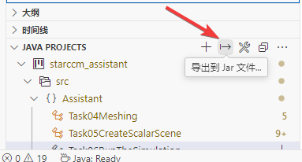

选择`bin`目录即可，不要重复打包其他依赖项。
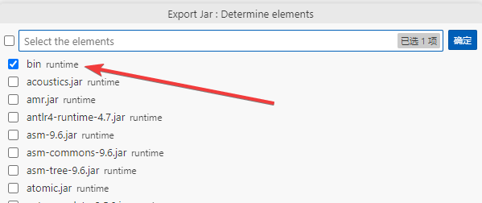

打包完成的jar文件在项目文件夹中。
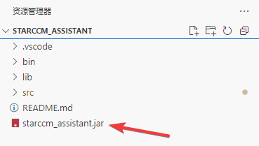

在STAR-CCM+中新建或加载sim文件之后，通过文件菜单加载模拟助手。
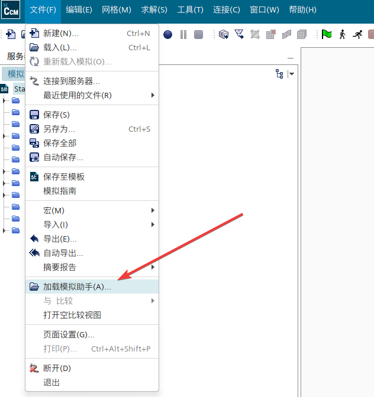

运行完整测试。
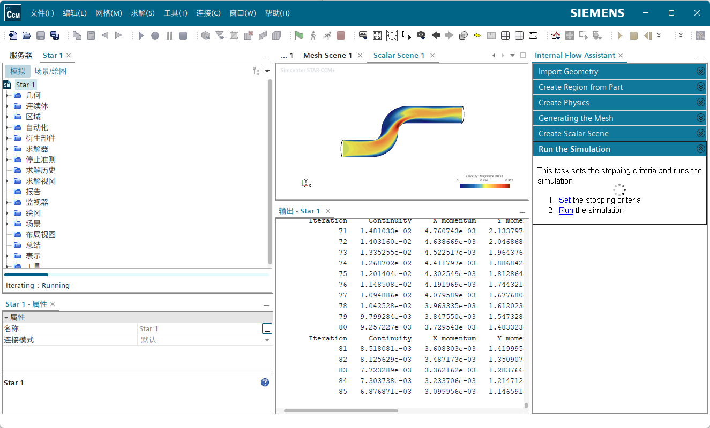

因为教程案例比较老了，很多API在新版本中已经弃用，存在一些报错，需要自己调整代码。

## 4. 调试模拟助手

模拟助手的调试和[使用VSCode调试STAR-CCM+宏](../2025-04-18-use-vscode-debug-starccm-marco/)中java宏的调试过程一摸一样，唯一不同的是加载方式从"播放宏"变成了"加载模拟助手"。

项目文件夹的`.vscode`目录下`launch.json`文件代码如下：
```json
{
    "version": "0.2.0",
    "configurations": [
        {
            "type": "java",
            "name": "Debug (Attach)",
            "projectName": "starccm",
            "request": "attach",
            "hostName": "localhost",
            "port": 8765
        }
    ]
}
```

通过命令行方式启动STAR-CCM+主程序：
```bash
<InstallationDirectory>/star/bin/starccm+ -jvmargs '-Xdebug -Xrunjdwp:transport=dt_socket,server=y,suspend=n,address=8765'
```

在进入调试、开始执行之前先在源码中增加断点。等代码执行到断点，VSCode中会提示中断，可以在中断处检查变量。
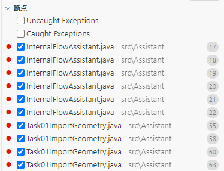

需要注意的是，如果是通过jar打包发布模拟助手，在进入调试之前要确保jar打包的版本和当前源码一致。

[^1]: [创建 NetBeans 项目](https://www.topcfd.cn/Ebook/STARCCMP/GUID-844E0FD2-79DC-47B6-A182-3594ECC5E475.html)

[^2]: [将 Java 包、Java 类和 XHTML 文件添加到模拟助手项目](https://www.topcfd.cn/Ebook/STARCCMP/GUID-986F9B0E-E9AC-4999-B02A-3544DA63B8A0.html)

[^3]: [模拟助手：管道内流模拟辅助](https://www.topcfd.cn/Ebook/STARCCMP/GUID-439308B8-7E23-4AC1-8B3F-ED490F61C5AD.html)

[^4]: [开发模拟助手](https://www.topcfd.cn/Ebook/STARCCMP/GUID-65D3D6B0-CDCB-4D30-9404-8762C9FA904D.html)

