+++
author = "Andrew Moa"
title = "Use VSCode to develop STAR-CCM+ user library: Calculate physical properties through CoolProp"
date = "2025-04-29"
description = ""
tags = [
    "c++",
    "star-ccm+",
]
categories = [
    "cfd",
]
series = [""]
aliases = [""]
image = "/images/starccm-bg.jpg"
+++

STAR-CCM+ user program (user library)[^1] is a dynamic link library compiled and constructed according to certain rules by an external compiler (usually C/C++, but also supports Fortran in Linux). By registering the constructed dynamic link library in the sim file, certain custom functions can be implemented. A user library usually contains one or more user-defined functions, which are generally used to implement special configuration or field functions.

Uer library need to register dynamic link libraries before they can be called, and the format of dynamic link libraries is often closely related to the operating system, hardware platform, etc. Therefore, user library are usually compiled for specific platforms and cannot run across platforms.

This article attempts to use VSCode to write the STAR-CCM+ dynamic link library, and use the open source thermodynamic library CoolProp to expand the physical properties calculation function for STAR-CCM+; build the user library through CMake to ensure that the dynamic link library file can be correctly generated on different platforms.

## 1. Introduction to CoolProp

[CoolProp](http://www.coolprop.org/) is an open source cross-platform thermodynamic library, similar to NIST's REFPROP. It contains various fluid physical propertiess and supports multiple programming languages. It also supports physical properties calculations through MATLAB, Excel and even javascript calls[^2].

On Windows, use the following commands to download, compile, and install CoolProp[^3]:
```powershell
# It is recommended to use PowerShell. You need to install cmake, git and clang-cl compiler first.
# Download CoolProp source code and its dependencies
git clone https://github.com/CoolProp/CoolProp --recursive
cd CoolProp
# Create a working directory
mkdir build && cd build
#Configure static library compilation file
cmake .. -DCOOLPROP_STATIC_LIBRARY=ON -G "Visual Studio 17 2022" -T ClangCL,host=x64 -A x64 
# Compile static library
cmake --build . --config Release
# Install static library
cmake --install . --prefix $PWD/../../CoolPropLib
```

Compile and install CoolProp on Linux platform using the following commands:
```bash
# You need to install cmake, git and gcc compiler first
# Download CoolProp source code and its dependencies
git clone https://github.com/CoolProp/CoolProp --recursive
cd CoolProp
# Create a working directory
mkdir -p build && cd build
# Configure static library compilation file, the default architecture is 64-bit
cmake .. -DCOOLPROP_STATIC_LIBRARY=ON -DCOOLPROP_FPIC=ON -G "Ninja"
# Compile static libraries and use 32 cores to speed up compilation
cmake --build . --config Release -- -j32
# Install static library
cmake --install . --prefix $PWD/../../CoolPropLib
```

Since the code is well encapsulated, calling CoolProp related functions is very simple. The following is the official sample code [^4]:
```cpp
#include "CoolProp.h"
#include <iostream>
#include <stdlib.h>
using namespace CoolProp;
int main() {
    // First type (slowest, due to most string processing, exposed in DLL)
    std::cout << PropsSI("Dmolar", "T", 298, "P", 1e5, "Propane[0.5]&Ethane[0.5]") << std::endl;  // Default backend is HEOS
    std::cout << PropsSI("Dmolar", "T", 298, "P", 1e5, "HEOS::Propane[0.5]&Ethane[0.5]") << std::endl;
    std::cout << PropsSI("Dmolar", "T", 298, "P", 1e5, "REFPROP::Propane[0.5]&Ethane[0.5]") << std::endl;
    // Vector example
    std::vector<double> z(2, 0.5);
    // Second type (C++ only, a bit faster, allows for vector inputs and outputs)
    std::vector<std::string> fluids;
    fluids.push_back("Propane");
    fluids.push_back("Ethane");
    std::vector<std::string> outputs;
    outputs.push_back("Dmolar");
    std::vector<double> T(1, 298), p(1, 1e5);
    std::cout << PropsSImulti(outputs, "T", T, "P", p, "", fluids, z)[0][0] << std::endl;  // Default backend is HEOS
    std::cout << PropsSImulti(outputs, "T", T, "P", p, "HEOS", fluids, z)[0][0] << std::endl;
    // Comment me out if REFPROP is not installed
    std::cout << PropsSImulti(outputs, "T", T, "P", p, "REFPROP", fluids, z)[0][0] << std::endl;
    // All done return
    return EXIT_SUCCESS;
}
```

In the correct case, the output of the above sample code is:
```bash
40.8269
40.8269
40.8269
40.8269
40.8269
40.8269
```

CoolProp also supports Python calls and can be used as a calculator to conveniently calculate various working fluid physical parameters:
```jupyter
In [1]: from CoolProp.CoolProp import PropsSI

In [2]: PropsSI('T','P',101325,'Q',0,'Water')
Out[2]: 373.1242958476844

In [3]: H_V = PropsSI('H','P',101325,'Q',1,'Water')

In [4]: H_L = PropsSI('H','P',101325,'Q',0,'Water')

In [5]: H_V - H_L
Out[5]: 2256471.5924066794
```

## 2. Develop STAR-CCM+ user library

First, create a new VSCode working directory with the following file structure:
```powershell
starccm_coolprop	# Working directory name
│   CMakeLists.txt	# CMake configuration file
│   README.md	# Description file, to help other users better understand the project, not required
├───.vscode	#VSCode configuration file directory
│      launch.json	# File automatically generated when starting debug mode, not required
│      settings.json	# Define CMake related variables
├───include	# Include directory
│      heos.h	# CoolProp implementation related header files
│      uclib.h	# STAR-CCM+ user library definition header file
└───src	# Source directory
        heos.cpp	# CoolProp implementation related source code
        uclib.cpp	# STAR-CCM+ user library link source code
```

In order to facilitate cross-platform, the build tool uses CMake. Edit the CMake configuration file `CMakeLists.txt` as follows:
```cmake
# Define the minimum CMake version required to build the project
cmake_minimum_required(VERSION 3.10)

# Project name and development language
project(upcp LANGUAGES CXX)

# The compiler must meet the C++17 specification
set(CMAKE_CXX_STANDARD 17)

# Check COOLPROP_SRC_DIR definition to search for CoolProp source files
if(NOT DEFINED COOLPROP_SRC_DIR)
    message(FATAL_ERROR "COOLPROP_SRC_DIR is not defined. Please specify the path to the CoolProp source directory.")
else()
    message(STATUS "COOLPROP_SRC_DIR location : " ${COOLPROP_SRC_DIR})
endif()

# Check COOLPROP_LIB_DIR definition to search for precompiled CoolProp library files
if(NOT DEFINED COOLPROP_LIB_DIR)
    message(FATAL_ERROR "COOLPROP_LIB_DIR is not defined. Please specify the path to the CoolProp library directory.")
    # For example: [CoolPropLib_Dir]/static_library/[platform]/[architecture]_[compiler]_[version]
else()
    message(STATUS "COOLPROP_LIB_DIR location : " ${COOLPROP_LIB_DIR})
endif()

# Check STARCCM_LIB_DIR for linking to STAR-CCM+ UserFunctions library files
if(NOT DEFINED STARCCM_LIB_DIR)
    message(FATAL_ERROR "STARCCM_LIB_DIR is not defined. Please specify the path to the STAR-CCM+ UserFunctions library directory.")
    # For example, in Windows : C:/Program Files/Siemens/19.06.009-R8/STAR-CCM+19.06.009-R8/star/lib/win64/clang17.0vc14.2-r8/lib
    # In Linux : /opt/Siemens/19.06.009-R8/STAR-CCM+19.06.009-R8/star/lib/linux-x86_64-2.28/gnu11.4-r8/lib"
else()
    message(STATUS "STARCCM_LIB_DIR location : " ${STARCCM_LIB_DIR})
endif()

#Define STAR-CCM+ software precision
if(USE_DOUBLE_PRECISION)
    add_definitions(-DDOUBLE_PRECISION)
    message(STATUS "Using double precision for STAR-CCM+")
else()
    message(STATUS "Using float precision for STAR-CCM+")
endif()

# Use CoolProp static library or dynamic library
if(USE_SHARED_COOLPROP)
    add_definitions(-DCOOLPROP_LIB)  
    message(STATUS "Using shared CoolProp library")
else()
    message(STATUS "Using static CoolProp library")
endif()

# Header file include directory
include_directories(${PROJECT_SOURCE_DIR}/include
    ${COOLPROP_SRC_DIR}/include
    ${COOLPROP_SRC_DIR}/externals/fmtlib/include
)

# Add the library file directory of STAR-CCM+ and CoolProp
link_directories(${STARCCM_LIB_DIR}
    ${COOLPROP_LIB_DIR}
)

# Generate dynamic link library
add_library(${CMAKE_PROJECT_NAME} SHARED
    src/uclib.cpp
    src/heos.cpp
)

# Link to the STAR-CCM+ and CoolProp library files
target_link_libraries(${CMAKE_PROJECT_NAME} UserFunctions CoolProp)

# Installation Target
install(TARGETS ${CMAKE_PROJECT_NAME}
    RUNTIME DESTINATION bin
    LIBRARY DESTINATION lib
    ARCHIVE DESTINATION lib/static
    )

```

`heos.h` defines 3 user functions, which are the density, viscosity and thermal conductivity functions of air. The code is as follows:
```hpp
#ifndef __HEOS_H__
#define __HEOS_H__
void USERFUNCTION_EXPORT
airDensity(CoordReal *, int, CoordReal *, CoordReal *);
void USERFUNCTION_EXPORT
airViscosity(CoordReal *, int, CoordReal *, CoordReal *);
void USERFUNCTION_EXPORT
airConductivity(CoordReal *, int, CoordReal *, CoordReal *);
#endif /* __HEOS_H__ */
```

`heos.cpp` is the implementation of these three user functions. By inputting pressure and temperature, it calls the CoolProp library to calculate the density, viscosity and thermal conductivity of the output air.
```cpp
#include "CoolProp.h"
#include "AbstractState.h"
#include "crossplatform_shared_ptr.h"
// The above three header files are included in the include directory of CoolProp source code
#include "uclib.h"
#include "heos.h"
/* Call CoolProp to calculate the output air density by inputting pressure and temperature */
void USERFUNCTION_EXPORT
airDensity(CoordReal *result, int size, CoordReal *P, CoordReal *T)
{
	/* In order to speed up the iteration, the low-level interface of CoolProp is used here to avoid repeatedly calling string processing functions */
    /* Initialize fluid parameters using smart pointers */
	shared_ptr<CoolProp::AbstractState> heos(CoolProp::AbstractState::factory("HEOS", "Air"));
	/* Iterate through all cells */
    for (int i = 0; i != size; ++i)
    {
		/* The pressure obtained from STAR-CCM+ is gauge pressure and needs to be converted to absolute pressure manually */
        heos->update(CoolProp::PT_INPUTS, P[i] + 101325.0, T[i]);  // The default is SI units.
        result[i] = heos->rhomass(); // Unit : kg/m^3
    }
}
/* Call CoolProp to calculate the output air viscosity by inputting pressure and temperature */
void USERFUNCTION_EXPORT
airViscosity(CoordReal *result, int size, CoordReal *P, CoordReal *T)
{
    shared_ptr<CoolProp::AbstractState> heos(CoolProp::AbstractState::factory("HEOS", "Air"));
    for (int i = 0; i != size; ++i)
    {
        heos->update(CoolProp::PT_INPUTS, P[i] + 101325.0, T[i]);
        result[i] = heos->viscosity(); // Unit : Pa-s
    }
}
/* Call CoolProp to calculate the output air thermal conductivity by inputting pressure and temperature */
void USERFUNCTION_EXPORT
airConductivity(CoordReal *result, int size, CoordReal *P, CoordReal *T)
{
    shared_ptr<CoolProp::AbstractState> heos(CoolProp::AbstractState::factory("HEOS", "Air"));
    for (int i = 0; i != size; ++i)
    {
        heos->update(CoolProp::PT_INPUTS, P[i] + 101325.0, T[i]);
        result[i] = heos->conductivity(); // Unit : W/m-K
    }
}
```

The `uclib.h` header file is the header file of the STAR-CCM+ link library[^5], which defines the variables and function types used by the UserFunctions library. This file is a general header file.
```hpp
#ifndef UCLIB_H
#define UCLIB_H
#ifdef DOUBLE_PRECISION
typedef double Real;
#else
typedef float Real;
#endif
typedef double CoordReal;
#ifdef __cplusplus
extern "C"
{
#endif
#if defined(WIN32) || defined(_WINDOWS) || defined(_WINNT)
#define USERFUNCTION_EXPORT __declspec(dllexport)
#define USERFUNCTION_IMPORT __declspec(dllimport)
#else
#define USERFUNCTION_EXPORT
#define USERFUNCTION_IMPORT
#endif
    extern void USERFUNCTION_IMPORT ucarg(void *, char *, char *, int);
    extern void USERFUNCTION_IMPORT ucfunc(void *, char *, char *);
    extern void USERFUNCTION_IMPORT ucfunction(void *, char *, char *, int, ...);
    void USERFUNCTION_EXPORT uclib();
#ifdef __cplusplus
}
#endif
#endif
```

`uclib.cpp` is used to register user functions so that STAR-CCM+ can correctly identify the dynamic link library and load it as a user library.
```cpp
#include "uclib.h"
#include "heos.h"
void USERFUNCTION_EXPORT
uclib()
{
    /* Register airDensity as a field function */
    /* The reinterpret_cast<> keyword is used here to prompt C++ mandatory type conversion to avoid compiler errors */
    ucfunc(reinterpret_cast<void*>(airDensity), "ScalarFieldFunction", "HEOS::Air Density (kg/m^3)"); // Custom field functions are dimensionless by default, so it is best to add units after the name.
    ucarg(reinterpret_cast<void*>(airDensity), "Cell", "Pressure", sizeof(CoordReal));
    ucarg(reinterpret_cast<void*>(airDensity), "Cell", "Temperature", sizeof(CoordReal));
	/* Register airViscosity as a field function */
    ucfunc(reinterpret_cast<void*>(airViscosity), "ScalarFieldFunction", "HEOS::Air Viscosity (Pa-s)");
    ucarg(reinterpret_cast<void*>(airViscosity), "Cell", "Pressure", sizeof(CoordReal));
    ucarg(reinterpret_cast<void*>(airViscosity), "Cell", "Temperature", sizeof(CoordReal));
	/* Register airConductivity as a field function */
    ucfunc(reinterpret_cast<void*>(airConductivity), "ScalarFieldFunction", "HEOS::Air Thermal conductivity (W/m-K)");
    ucarg(reinterpret_cast<void*>(airConductivity), "Cell", "Pressure", sizeof(CoordReal));
    ucarg(reinterpret_cast<void*>(airConductivity), "Cell", "Temperature", sizeof(CoordReal));
}
```

This project creates three new field functions. The `ucfunc` function is used to register the user function as a custom field functions of STAR-CCM+. The `ucarg` function is used to register the field function (or variable) of STAR-CCM+ as the input parameter of the user function. In this way, when the custom field functions is called, the pressure and temperature output variables can be automatically called to update.

In addition to custom field functionss, the user library also supports user-defined boundary conditions and region configurations. For details, please refer to the official documentation [^6].

## 3. Compile dynamic link library

### 3.1 Compile the project through VSCode+CMake

If the [CMake extension](https://marketplace.visualstudio.com/items/?itemName=ms-vscode.cmake-tools) is installed in VSCode, you can directly call CMake to compile and generate dynamic link library files.

First, define the search path for CMake to call STAR-CCM+ and CoolProp related libraries and header files in the settings.json file.
```json
{
    "cmake.configureArgs": [
        "-DSTARCCM_LIB_DIR=[starccm_install_dir]/STAR-CCM+19.06.009-R8/star/lib/win64/clang17.0vc14.2-r8/lib", 
        "-DCOOLPROP_SRC_DIR=E:/Development/starccm/CoolProp", 
        "-DCOOLPROP_LIB_DIR=E:/Development/starccm/CoolPropLib/static_library/Windows/64bit_Clang_19.1.1", 
        "-DUSE_DOUBLE_PRECISION=ON"
    ]
}
```

Use the CMake button on the left side of VSCode to bring up the CMake configuration panel, select the build tool chain (select clang-cl here) and the compilation mode (Debug or Release).
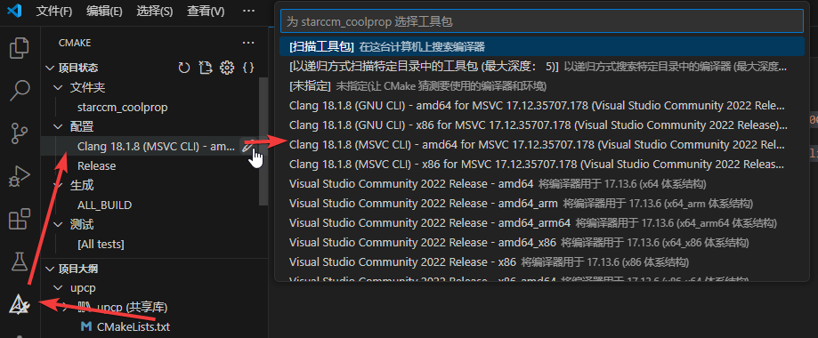

The CMake configuration information is displayed in the output window.
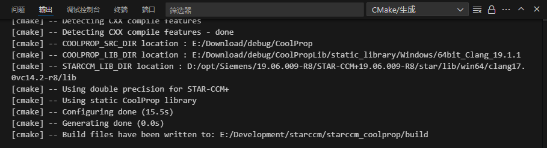

Use the `Ctrl+Shift+P` shortcut key to bring up the command panel and enter `CMake: Build` to generate the project.
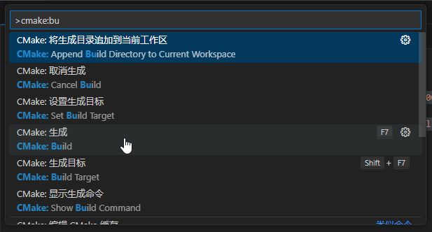

After the generation is completed, the output window displays the generated dynamic link library path.
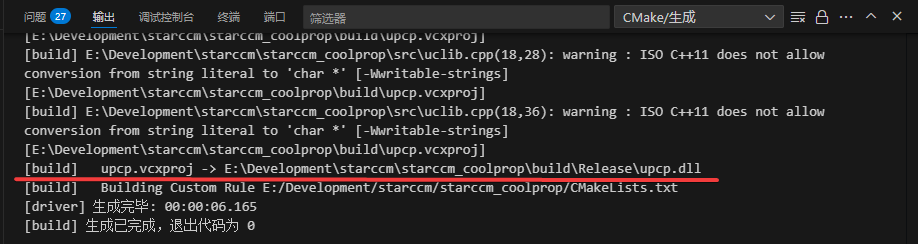

Copy it to the STAR-CCM+ project directory and load it through the graphical interface. After successful loading, you can see the dynamic link library information.
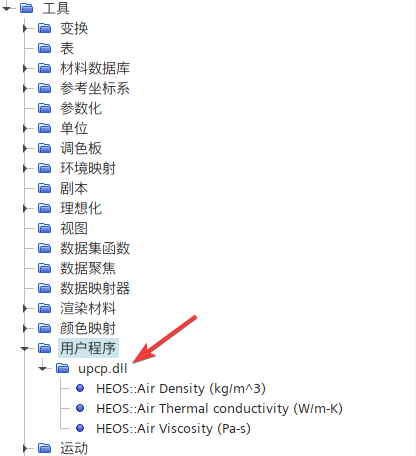

You can also see the generated custom field function in the field function.
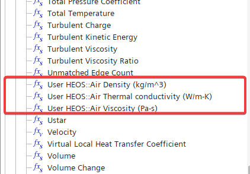

Call the custom field function to update the scalar field and display it.


### 3.2 Compile the project through CMake+ command line

Since STAR-CCM+ user library depend on the operating system platform, dynamic link libraries compiled for different operating systems cannot be used interchangeably. When a project file needs to be calculated on a supercomputer, the user library source code file needs to be uploaded to the supercomputer and recompiled. Different supercomputer platforms have different Linux distributions and system dependencies. It is recommended that you compile a dynamic link library specifically for the supercomputer platform before calculation, and then call the compiled dynamic link library on the platform to perform related calculations.

On Linux platform, compile the user library dynamic link library using the following command.
```bash
# Enter the project directory
cd starccm_coolprop
# Create a working directory
mkdir -p build && cd build
# Configure the compilation file and link to the CoolProp dynamic library
cmake .. -G "Ninja" -DUSE_DOUBLE_PRECISION=ON -DCOOLPROP_LIB_DIR=${HOME}/Share/code/CoolPropLib/static_library/Linux/64bit_GNU_13.3.0 -DCOOLPROP_SRC_DIR=${HOME}/Share/code/CoolProp -DSTARCCM_LIB_DIR=${HOME}/opt/Siemens/19.06.009-R8/STAR-CCM+19.06.009-R8/star/lib/linux-x86_64-2.28/gnu11.4-r8/lib
# Compile dynamic library
cmake --build . --config Release
# Install
cmake --install . --prefix $PWD/../../UserLib
```

After compilation is complete, a dynamic link library is output and loaded through the graphical interface.
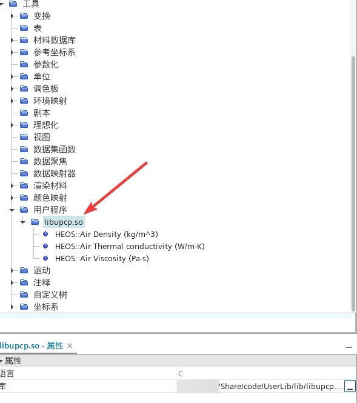

Automatically generated custom field functionss.
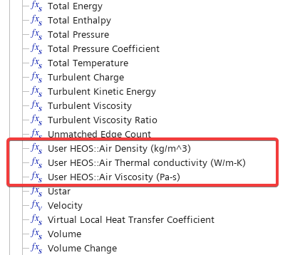

Update the cloud map using custom field functionss.
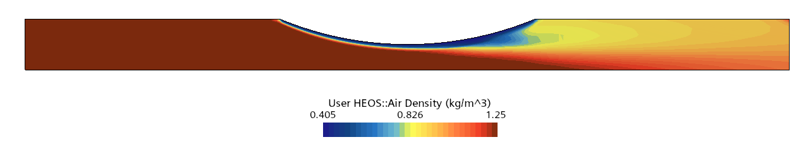

## 4. FAQ

### 4.1 Dynamic link library dependencies

If the compilation configuration uses the CoolProp dynamic library, the final output dynamic link library will depend on the CoolProp dynamic library file. You need to add the folder where `CoolProp.dll` (`libCoolProp.so.X` under Linux) is located to the system environment variable (`PATH` or `LD_LIBRARY_PATH`). In order to save this trouble, the CoolProp static library is used in this article. The compiled dynamic link library does not depend on the CoolProp dynamic library file, but it does not rule out that some projects still need to link to the CoolProp dynamic library.

Another common dependency problem is that when compiling with the GCC compiler (MinGW) on the Windows platform, regardless of whether CoolProp links to a static library or a dynamic library, the final output dynamic link library needs to be linked to the three files `libstdc++-6.dll`, `libgcc_s_seh-1.dll` and `libwinpthread-1.dll` that come with MinGW (different MinGW versions may differ). Therefore, it is best to add the MinGW runtime path to the system environment variables to ensure that STAR-CCM+ can search for all dependencies and call the functions in the dynamic link library normally.

If running on Linux and relying on other dynamic link libraries, add the `-ldlibpath` option to the command line when starting STAR-CCM+, and add the path to the dependent dynamic library file after this keyword.
```bash
starccm+ -ldlibpath [path-to--shared-file]
```

### 4.2 GLIBCXX versions

STAR-CCM+ comes with a set of C++ standard libraries. If the C++ standard library that comes with the user's Linux system is newer than the version that comes with STAR-CCM+, the compiled dynamic link library will output the following error message when loaded into STAR-CCM+:
```log
Loading user library /home/xxxx/Share/code/UserLib/lib/libupcp.so
Could not load user library /home/xxxx/Share/code/UserLib/lib/libupcp.so
/home/xxxx/opt/Siemens/19.06.009-R8/STAR-CCM+19.06.009-R8/star/lib/linux-x86_64-2.28/system/gnu11.4-64/libstdc++.so.6: version `GLIBCXX_3.4.32' not found (required by /home/xxxx/Share/code/UserLib/lib/libupcp.so)
```
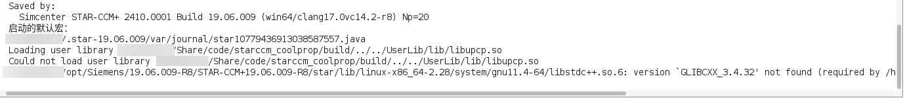

Because STAR-CCM+ comes with its own C++ standard link library, but its GLIBCXX version is lower than the version on the system.
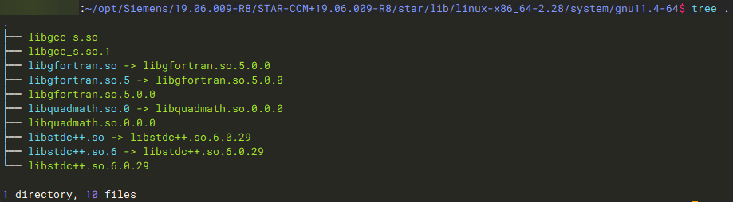

When compiling, if no special specification is made, the compiler will link the link library on the system by default.
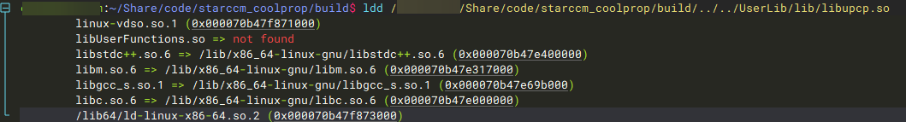
When loading STAR-CCM+, the loaded dynamic link library will be linked to the standard library that comes with STAR-CCM+, resulting in an error.

One solution is to explicitly specify the link library search path as the STAR-CCM+ built-in path through `LD_LIBRARY_PATH` during compilation.
```bash
export LD_LIBRARY_PATH=${HOME}/opt/Siemens/19.06.009-R8/STAR-CCM+19.06.009-R8/star/lib/linux-x86_64-2.28/system/gnu11.4-64:$LD_LIBRARY_PATH
```

However, this approach will cause problems in the system tool chain and compilation will not be able to proceed normally.
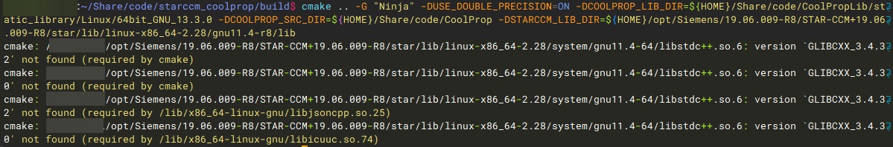

Another solution is to edit the `CMakeLists.txt` file, add the following content, and set the link library search path through the `link_directories` keyword.
```cmake
# Link with STARCCM CXX LIB
link_directories(
    "${HOME}/opt/Siemens/19.06.009-R8/STAR-CCM+19.06.009-R8/star/lib/linux-x86_64-2.28/system/gnu11.4-64"
)
```

Then compile normally according to the method [3.2](#32-compile-the-project-through-cmake-command-line). Check the compiled dynamic link library dependencies and link to the library that comes with STAR-CM+. The problem is solved.
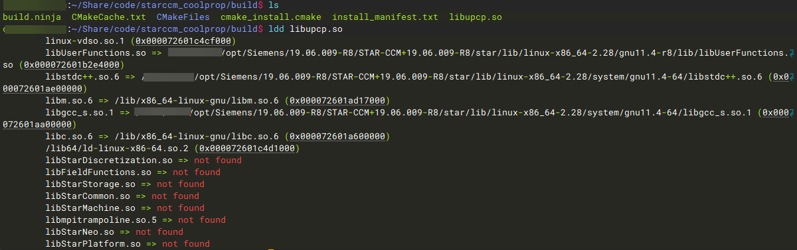

### 4.3 Computational efficiency

We establish a basic STAR-CCM+ model to illustrate the issue of computational efficiency.

Create a new sim file, a two-dimensional axisymmetric problem, to simulate the heating of air in the pipe.


The basic model state equation uses an ideal gas, the specific heat capacity is a constant, and the thermal conductivity and dynamic viscosity are based on `Sutherland’s Law`.
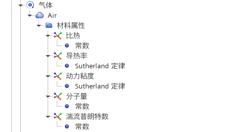

The grid size is 3629. Four cores solve the problem in parallel for 3000 steps, which takes 85 seconds.
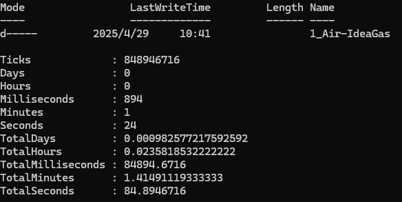
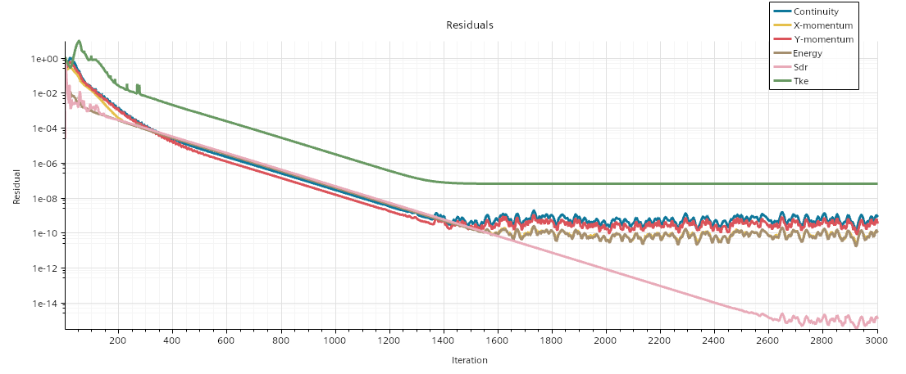

Then we replace the `ideal gas` in the physical model with `user-defined EOS`, load the compiled dynamic link library, and define the gas density, dynamic viscosity and thermal conductivity through the custom field functions generated by the dynamic link library. The specific heat capacity remains constant.
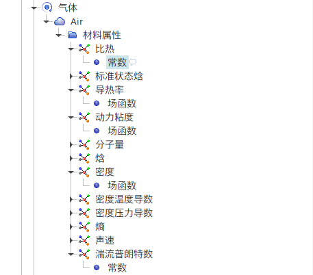

The mesh size remains unchanged. The same 4 cores solved 3000 steps in parallel, taking 235 seconds, nearly doubling the time.
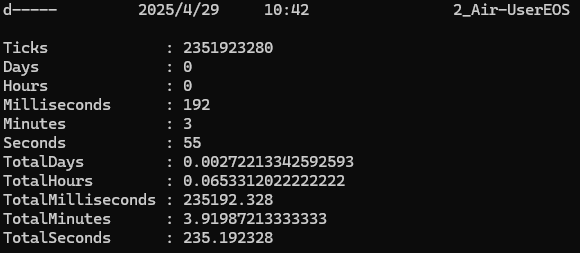
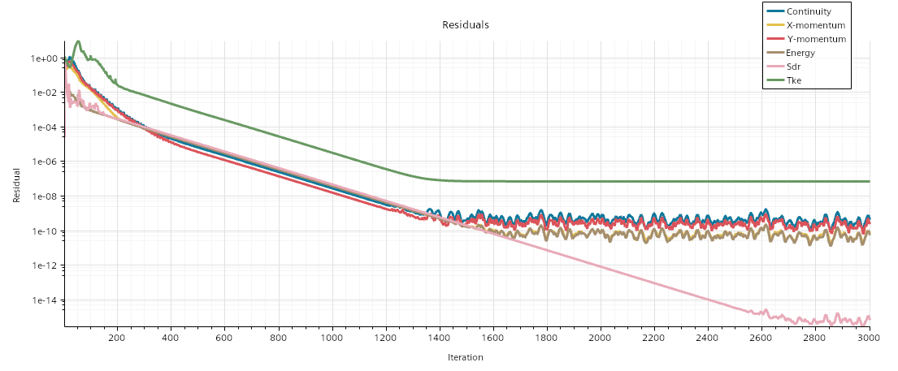

The problem is with the user function we registered. Because each function and each step of the calculation must call the function from CoolProp, traverse the grid cells to obtain the temperature and pressure values, and then calculate the output result through the CoolProp function. Each function executes the above operations in a loop. The loop operation is independent of the solver iterative calculation itself. The larger the grid size, the longer the loop execution time. Moreover, we have defined three functions with the same functionality, which is equivalent to executing three additional loop operations in addition to the solver iterative calculation.

For some larger models and projects that are sensitive to solution time, it is generally not recommended to define physical properties through user library with CoolProp. However, in terms of post-processing, it is still very useful to update the scalar scene and output the results by calling the CoolProp library.

[^1]: [使用用户程序](https://www.topcfd.cn/Ebook/STARCCMP/GUID-9665BF40-46BC-44F0-95F9-7E20766E8109.html)

[^2]: [Available Wrappers](http://www.coolprop.org/coolprop/wrappers/index.html#available-wrappers)

[^3]: [Static Library](http://www.coolprop.org/coolprop/wrappers/StaticLibrary/index.html#static-library)

[^4]: [C++ Sample Code](http://www.coolprop.org/coolprop/HighLevelAPI.html#c-sample-code)

[^5]: [类型定义(C)](https://www.topcfd.cn/Ebook/STARCCMP/GUID-2BC0F0B4-7A2D-4668-84B6-F3A0517B2427.html)

[^6]: [用户程序示例](https://www.topcfd.cn/Ebook/STARCCMP/GUID-8CE19E75-A897-4559-B1A6-E1C603FC91F2.html)