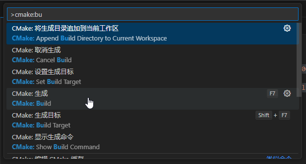
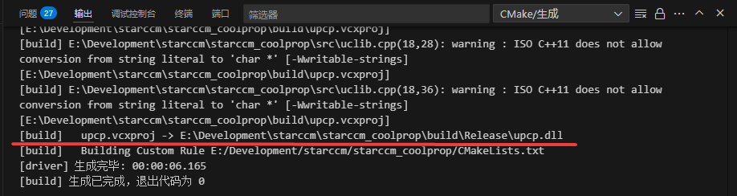
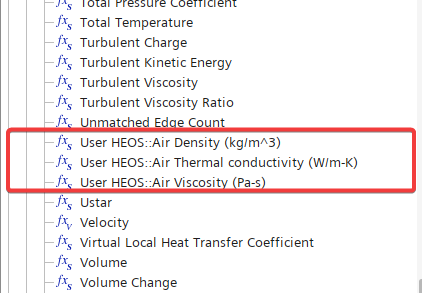
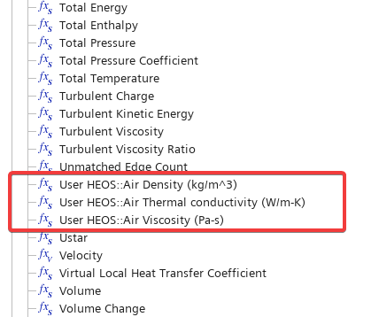
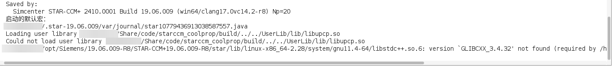
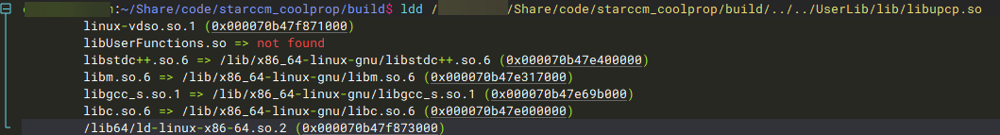
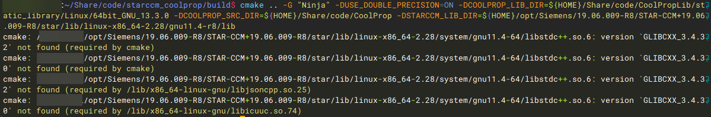
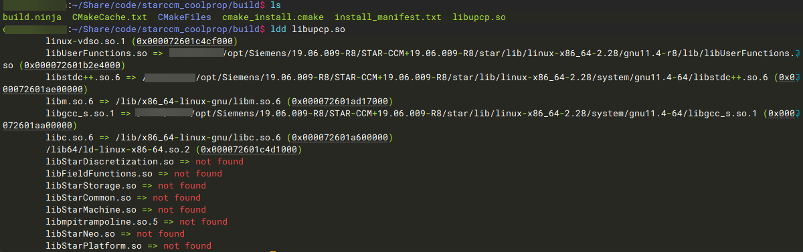
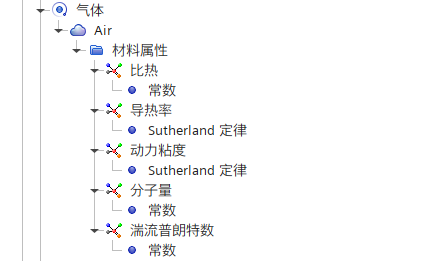
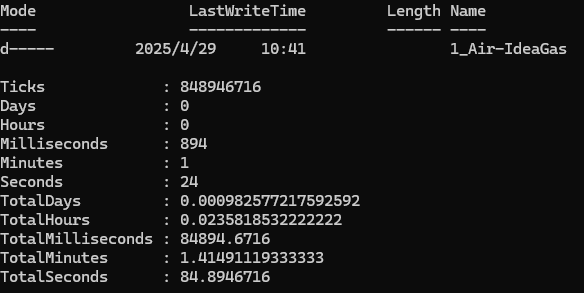

+++
author = "Andrew Moa"
title = "使用VSCode开发STAR-CCM+用户程序：通过CoolProp计算物性参数"
date = "2025-04-29"
description = ""
tags = [
    "c++",
    "star-ccm+",
]
categories = [
    "cfd",
]
series = [""]
aliases = [""]
image = "/images/starccm-bg.jpg"
+++

STAR-CCM+用户程序(用户库)[^1]是通过外部编译器(通常是C/C++，也支持Fortran)按一定的规则编译构建的动态链接库，将构建好的动态链接库注册到sim文件中，可以实现某些自定义功能。一个用户程序通常包含一个或多个用户自定义的函数，这些自定义函数一般用于实现特殊的配置或场函数。

用户程序需要先注册动态链接库才能调用，而动态链接库的格式往往与操作系统、硬件平台等密切相关，因此用户程序通常都是针对特定平台进行编译，无法实现跨平台运行。

本文尝试用VSCode编写STAR-CCM+动态链接库，利用开源的热力学库CoolProp为STAR-CCM+拓展物性参数计算功能；通过CMake构建用户程序，确保在不同平台下能正确生成动态链接库文件。

## 1. CoolProp介绍

[CoolProp](http://www.coolprop.org/)是一个开源跨平台的热力学库，定位上类似于NIST的REFPROP，包含各种流体物性参数，同时支持多种编程语言，也支持通过MATLAB、Excel甚至javascript调用进行物性参数计算[^2]。

Windows平台通过以下命令下载编译、安装CoolProp[^3]：
```powershell
# 推荐使用PowerShell，需要先安装cmake、git及clang-cl编译器
# 下载CoolProp源码及其依赖
git clone https://github.com/CoolProp/CoolProp --recursive
cd CoolProp
# 建立工作目录
mkdir build && cd build
# 配置静态库编译文件
cmake .. -DCOOLPROP_STATIC_LIBRARY=ON -G "Visual Studio 17 2022" -T ClangCL,host=x64 -A x64 
# 编译静态库
cmake --build . --config Release
# 安装静态库
cmake --install . --prefix $PWD/../../CoolPropLib
```

Linux平台通过以下命令编译、安装CoolProp：
```bash
# 需要先安装cmake、git及gcc编译器
# 下载CoolProp源码及其依赖
git clone https://github.com/CoolProp/CoolProp --recursive
cd CoolProp
# 建立工作目录
mkdir -p build && cd build
# 配置静态库编译文件，默认架构为64位
cmake .. -DCOOLPROP_STATIC_LIBRARY=ON -DCOOLPROP_FPIC=ON -G "Ninja"
# 编译静态库，使用32个核心加速编译
cmake --build . --config Release -- -j32
# 安装静态库
cmake --install . --prefix $PWD/../../CoolPropLib
```

得益于软件良好的封装，CoolProp相关函数的调用十分简单，以下是官方示例代码[^4]：
```cpp
#include "CoolProp.h"
#include <iostream>
#include <stdlib.h>
using namespace CoolProp;
int main() {
    // First type (slowest, due to most string processing, exposed in DLL)
    std::cout << PropsSI("Dmolar", "T", 298, "P", 1e5, "Propane[0.5]&Ethane[0.5]") << std::endl;  // Default backend is HEOS
    std::cout << PropsSI("Dmolar", "T", 298, "P", 1e5, "HEOS::Propane[0.5]&Ethane[0.5]") << std::endl;
    std::cout << PropsSI("Dmolar", "T", 298, "P", 1e5, "REFPROP::Propane[0.5]&Ethane[0.5]") << std::endl;
    // Vector example
    std::vector<double> z(2, 0.5);
    // Second type (C++ only, a bit faster, allows for vector inputs and outputs)
    std::vector<std::string> fluids;
    fluids.push_back("Propane");
    fluids.push_back("Ethane");
    std::vector<std::string> outputs;
    outputs.push_back("Dmolar");
    std::vector<double> T(1, 298), p(1, 1e5);
    std::cout << PropsSImulti(outputs, "T", T, "P", p, "", fluids, z)[0][0] << std::endl;  // Default backend is HEOS
    std::cout << PropsSImulti(outputs, "T", T, "P", p, "HEOS", fluids, z)[0][0] << std::endl;
    // Comment me out if REFPROP is not installed
    std::cout << PropsSImulti(outputs, "T", T, "P", p, "REFPROP", fluids, z)[0][0] << std::endl;
    // All done return
    return EXIT_SUCCESS;
}
```

正确情况下，以上示例代码的输出结果：
```bash
40.8269
40.8269
40.8269
40.8269
40.8269
40.8269
```

CoolProp还支持Python调用，可以作为计算器使用，方便地进行各种工质物性参数计算：
```jupyter
In [1]: from CoolProp.CoolProp import PropsSI

In [2]: PropsSI('T','P',101325,'Q',0,'Water')
Out[2]: 373.1242958476844

In [3]: H_V = PropsSI('H','P',101325,'Q',1,'Water')

In [4]: H_L = PropsSI('H','P',101325,'Q',0,'Water')

In [5]: H_V - H_L
Out[5]: 2256471.5924066794
```

## 2. 编写STAR-CCM+用户程序

首先新建一个VSCode工作目录，文件结构如下：
```powershell
starccm_coolprop	# 工作目录名称
│   CMakeLists.txt	# CMake配置文件
│   README.md	# 说明文件，帮助其他用户更好地了解项目，非必须
├───.vscode	# VSCode的配置文件目录
│      launch.json	# 启动调试模式时自动生成的文件，非必须
│      settings.json	# 定义CMake相关变量
├───include	# 头文件包含目录
│      heos.h	# CoolProp实现相关头文件
│      uclib.h	# STAR-CCM+用户程序定义头文件
└───src	# 源代码目录
        heos.cpp	# CoolProp实现相关源代码
        uclib.cpp	# STAR-CCM+用户程序链接源代码
```

为了方便跨平台，构建工具采用CMake，编辑CMake配置文件`CMakeLists.txt`内容如下：
```cmake
# 定义构建项目所需最小CMake版本
cmake_minimum_required(VERSION 3.10)

# 项目名称及开发语言
project(upcp LANGUAGES CXX)

# 编译器需满足C++17规范
set(CMAKE_CXX_STANDARD 17)

# 检查COOLPROP_SRC_DIR定义，用于搜索CoolProp源码文件
if(NOT DEFINED COOLPROP_SRC_DIR)
    message(FATAL_ERROR "COOLPROP_SRC_DIR is not defined. Please specify the path to the CoolProp source directory.")
else()
    message(STATUS "COOLPROP_SRC_DIR location : " ${COOLPROP_SRC_DIR})
endif()

# 检查COOLPROP_LIB_DIR定义，用于搜索预编译的CoolProp库文件
if(NOT DEFINED COOLPROP_LIB_DIR)
    message(FATAL_ERROR "COOLPROP_LIB_DIR is not defined. Please specify the path to the CoolProp library directory.")
    # For example: [CoolPropLib_Dir]/static_library/[platform]/[architecture]_[compiler]_[version]
else()
    message(STATUS "COOLPROP_LIB_DIR location : " ${COOLPROP_LIB_DIR})
endif()

# 检查STARCCM_LIB_DIR，用于链接到STAR-CCM+的UserFunctions库文件
if(NOT DEFINED STARCCM_LIB_DIR)
    message(FATAL_ERROR "STARCCM_LIB_DIR is not defined. Please specify the path to the STAR-CCM+ UserFunctions library directory.")
    # For example, in Windows : C:/Program Files/Siemens/19.06.009-R8/STAR-CCM+19.06.009-R8/star/lib/win64/clang17.0vc14.2-r8/lib
    # In Linux : /opt/Siemens/19.06.009-R8/STAR-CCM+19.06.009-R8/star/lib/linux-x86_64-2.28/gnu11.4-r8/lib"
else()
    message(STATUS "STARCCM_LIB_DIR location : " ${STARCCM_LIB_DIR})
endif()

# 定义STAR-CCM+软件精度
if(USE_DOUBLE_PRECISION)
    add_definitions(-DDOUBLE_PRECISION)
    message(STATUS "Using double precision for STAR-CCM+")
else()
    message(STATUS "Using float precision for STAR-CCM+")
endif()

# 使用CoolProp静态库还是动态库
if(USE_SHARED_COOLPROP)
    add_definitions(-DCOOLPROP_LIB)  
    message(STATUS "Using shared CoolProp library")
else()
    message(STATUS "Using static CoolProp library")
endif()

# 头文件包含目录
include_directories(${PROJECT_SOURCE_DIR}/include
    ${COOLPROP_SRC_DIR}/include
    ${COOLPROP_SRC_DIR}/externals/fmtlib/include
)

# 添加STAR-CCM+和CoolProp的库文件目录
link_directories(${STARCCM_LIB_DIR}
    ${COOLPROP_LIB_DIR}
)

# 生成动态链接库
add_library(${CMAKE_PROJECT_NAME} SHARED
    src/uclib.cpp
    src/heos.cpp
)

# 链接到STAR-CCM+和CoolProp的库文件
target_link_libraries(${CMAKE_PROJECT_NAME} UserFunctions CoolProp)

# 安装目标
install(TARGETS ${CMAKE_PROJECT_NAME}
    RUNTIME DESTINATION bin
    LIBRARY DESTINATION lib
    ARCHIVE DESTINATION lib/static
    )

```

`heos.h`定义了3个用户函数，分别是空气的密度、粘度和导热率函数，代码如下：
```hpp
#ifndef __HEOS_H__
#define __HEOS_H__
void USERFUNCTION_EXPORT
airDensity(CoordReal *, int, CoordReal *, CoordReal *);
void USERFUNCTION_EXPORT
airViscosity(CoordReal *, int, CoordReal *, CoordReal *);
void USERFUNCTION_EXPORT
airConductivity(CoordReal *, int, CoordReal *, CoordReal *);
#endif /* __HEOS_H__ */
```

`heos.cpp`是这3个用户函数的实现，通过输入压力和温度，调用CoolProp库计算输出空气的密度、粘度和导热率。
```cpp
#include "CoolProp.h"
#include "AbstractState.h"
#include "crossplatform_shared_ptr.h"
//以上3个头文件包含在CoolProp源代码的include目录里
#include "uclib.h"
#include "heos.h"
/* 通过输入压力和温度，调用CoolProp计算输出空气密度 */
void USERFUNCTION_EXPORT
airDensity(CoordReal *result, int size, CoordReal *P, CoordReal *T)
{
	/* 为了加快迭代速度，这里用到了CoolProp的低级接口，避免反复调用字符串处理函数 */
    /* 使用智能指针初始化流体参数 */
	shared_ptr<CoolProp::AbstractState> heos(CoolProp::AbstractState::factory("HEOS", "Air"));
	/* 遍历所有单元 */
    for (int i = 0; i != size; ++i)
    {
		/* 从STAR-CCM+获取的压力是表压，需要手动转换成绝对压力 */
        heos->update(CoolProp::PT_INPUTS, P[i] + 101325.0, T[i]);  // 默认为SI单位制
        result[i] = heos->rhomass(); // 单位：kg/m^3
    }
}
/* 通过输入压力和温度，调用CoolProp计算输出空气粘度 */
void USERFUNCTION_EXPORT
airViscosity(CoordReal *result, int size, CoordReal *P, CoordReal *T)
{
    shared_ptr<CoolProp::AbstractState> heos(CoolProp::AbstractState::factory("HEOS", "Air"));
    for (int i = 0; i != size; ++i)
    {
        heos->update(CoolProp::PT_INPUTS, P[i] + 101325.0, T[i]);
        result[i] = heos->viscosity(); // 单位：Pa-s
    }
}
/* 通过输入压力和温度，调用CoolProp计算输出空气导热率 */
void USERFUNCTION_EXPORT
airConductivity(CoordReal *result, int size, CoordReal *P, CoordReal *T)
{
    shared_ptr<CoolProp::AbstractState> heos(CoolProp::AbstractState::factory("HEOS", "Air"));
    for (int i = 0; i != size; ++i)
    {
        heos->update(CoolProp::PT_INPUTS, P[i] + 101325.0, T[i]);
        result[i] = heos->conductivity(); // 单位：W/m-K
    }
}
```

`uclib.h`头文件是STAR-CCM+链接库的头文件[^5]，定义了UserFunctions库所使用的变量和函数类型。该文件属于通用型头文件。
```hpp
#ifndef UCLIB_H
#define UCLIB_H
#ifdef DOUBLE_PRECISION
typedef double Real;
#else
typedef float Real;
#endif
typedef double CoordReal;
#ifdef __cplusplus
extern "C"
{
#endif
#if defined(WIN32) || defined(_WINDOWS) || defined(_WINNT)
#define USERFUNCTION_EXPORT __declspec(dllexport)
#define USERFUNCTION_IMPORT __declspec(dllimport)
#else
#define USERFUNCTION_EXPORT
#define USERFUNCTION_IMPORT
#endif
    extern void USERFUNCTION_IMPORT ucarg(void *, char *, char *, int);
    extern void USERFUNCTION_IMPORT ucfunc(void *, char *, char *);
    extern void USERFUNCTION_IMPORT ucfunction(void *, char *, char *, int, ...);
    void USERFUNCTION_EXPORT uclib();
#ifdef __cplusplus
}
#endif
#endif
```

`uclib.cpp`用于注册用户函数，使得STAR-CCM+能够正确识别动态链接库，并将其加载为用户程序。
```cpp
#include "uclib.h"
#include "heos.h"
void USERFUNCTION_EXPORT
uclib()
{
    /* 将airDensity注册为场函数 */
	/* 这里使用了reinterpret_cast<>关键字，用于提示C++强制类型转换，避免编译器报错 */
    ucfunc(reinterpret_cast<void*>(airDensity), "ScalarFieldFunction", "HEOS::Air Density (kg/m^3)"); // 自定义场函数默认无量纲，最好在名称后面加上单位
    ucarg(reinterpret_cast<void*>(airDensity), "Cell", "Pressure", sizeof(CoordReal));
    ucarg(reinterpret_cast<void*>(airDensity), "Cell", "Temperature", sizeof(CoordReal));
	/* 将airViscosity注册为场函数 */
    ucfunc(reinterpret_cast<void*>(airViscosity), "ScalarFieldFunction", "HEOS::Air Viscosity (Pa-s)");
    ucarg(reinterpret_cast<void*>(airViscosity), "Cell", "Pressure", sizeof(CoordReal));
    ucarg(reinterpret_cast<void*>(airViscosity), "Cell", "Temperature", sizeof(CoordReal));
	/* 将airConductivity注册为场函数 */
    ucfunc(reinterpret_cast<void*>(airConductivity), "ScalarFieldFunction", "HEOS::Air Thermal conductivity (W/m-K)");
    ucarg(reinterpret_cast<void*>(airConductivity), "Cell", "Pressure", sizeof(CoordReal));
    ucarg(reinterpret_cast<void*>(airConductivity), "Cell", "Temperature", sizeof(CoordReal));
}
```

这个项目新建了3个场函数，通过`ucfunc`函数将用户函数注册为STAR-CCM+的用户自定义场函数，再通过`ucarg`将STAR-CCM+的场函数(或变量)注册为用户函数的输入参数，这样调用用户自定义场函数时，就能自动调用压力和温度更新输出变量。

除了用户自定义场函数之外，用户程序还支持用户自定义的边界条件及区域配置，具体可以参考官方文档[^6]。

## 3. 编译动态链接库

### 3.1 通过VSCode+CMake编译项目

如果VSCode中安装了[CMake拓展](https://marketplace.visualstudio.com/items/?itemName=ms-vscode.cmake-tools)，可以直接调用CMake编译生成动态链接库文件。

首先要在settings.json文件中定义CMake调用STAR-CCM+和CoolProp相关库和头文件的搜索路径。
```json
{
    "cmake.configureArgs": [
        "-DSTARCCM_LIB_DIR=[starccm_install_dir]/STAR-CCM+19.06.009-R8/star/lib/win64/clang17.0vc14.2-r8/lib", 
        "-DCOOLPROP_SRC_DIR=E:/Development/starccm/CoolProp", 
        "-DCOOLPROP_LIB_DIR=E:/Development/starccm/CoolPropLib/static_library/Windows/64bit_Clang_19.1.1", 
        "-DUSE_DOUBLE_PRECISION=ON"
    ]
}
```

通过VSCode左侧的CMake按钮，调出CMake配置面板，选择构建工具链(这里选择clang-cl)和编译模式(Debug或Release)。


输出窗口当中显示CMake配置信息。


通过`Ctrl+Shift+P`快捷键调出命令面板，输入`CMake: Build`生成项目。


生成完毕，输出窗口显示生成的动态链接库路径。


将它拷贝到STAR-CCM+工程目录，通过图形界面加载，加载成功后可以看到动态链接库信息。


在场函数里也能看到生成的用户自定义场函数。


调用用户自定义场函数更新标量场并显示。


### 3.2 通过CMake+命令行编译项目

由于STAR-CCM+用户程序依赖于操作系统平台，不同操作系统编译的动态链接库不能通用。当工程文件需要用到超算进行计算时，需要将用户程序源码文件上传到超算上重新编译。不同的超算平台Linux发行版不一样，系统依赖也有所区别，建议计算前先在所使用的超算平台上编译一份专门在该平台上运行的动态链接库，后续再在该平台上调用编译的动态链接库进行相关计算。

Linux平台下，通过以下命令编译用户程序动态链接库。
```bash
# 进入项目目录
cd starccm_coolprop
# 建立工作目录
mkdir -p build && cd build
# 配置编译文件，链接到CoolProp动态库
cmake .. -G "Ninja" -DUSE_DOUBLE_PRECISION=ON \
    -DCOOLPROP_LIB_DIR=${HOME}/Share/code/CoolPropLib/static_library/Linux/64bit_GNU_13.3.0 \
    -DCOOLPROP_SRC_DIR=${HOME}/Share/code/CoolProp \
    -DSTARCCM_LIB_DIR=${HOME}/opt/Siemens/19.06.009-R8/STAR-CCM+19.06.009-R8/star/lib/linux-x86_64-2.28/gnu11.4-r8/lib
# 编译动态库
cmake --build . --config Release
# 安装
cmake --install . --prefix $PWD/../../UserLib
```

编译完成后输出动态链接库，通过图形界面加载。


自动生成的用户自定义场函数。


通过用户自定义场函数更新云图。


## 4. 常见问题

### 4.1 动态链接库的依赖问题

如果编译配置使用的是CoolProp动态库，最终输出的动态链接库会依赖CoolProp动态库文件，需要将`CoolProp.dll`(Linux下为`libCoolProp.so.X`)所在文件夹添加到系统环境变量(`PATH`或`LD_LIBRARY_PATH`)中。为了省掉这个麻烦，本文演示所采用的都是CoolProp静态库，编译出来的动态链接库不依赖CoolProp动态库文件，但是不排除某些工程仍然有需要链接到CoolProp动态库的。

另一个常见的依赖问题是，在Windows平台下使用GCC编译器(MinGW)进行编译时，不管CoolProp链接的是静态库还是动态库，最终输出的动态链接库都需要链接到MinGW自带的`libstdc++-6.dll`、`libgcc_s_seh-1.dll`和`libwinpthread-1.dll`这3个文件(不同的MinGW版本可能有所区别)。因此最好将MinGW的运行时路径添加到系统环境变量中，确保STAR-CCM+能搜索到所有依赖并正常调用动态链接库中的函数。

如果在Linux上运行依赖其他动态链接库，启动STAR-CCM+时要在命令行中加入`-ldlibpath`选项，将依赖的动态库文件所在路径添加到该关键字后面。
```bash
starccm+ -ldlibpath [path-to--shared-file]
```

### 4.2 GLIBCXX版本问题

STAR-CCM+自带了一套C++标准库，如果用户Linux系统自带的C++标准库比STAR-CCM+自带的版本新，那么编译输出的动态链接库在载入STAR-CCM+时会输出如下错误信息：
```log
Loading user library /home/xxxx/Share/code/UserLib/lib/libupcp.so
Could not load user library /home/xxxx/Share/code/UserLib/lib/libupcp.so
/home/xxxx/opt/Siemens/19.06.009-R8/STAR-CCM+19.06.009-R8/star/lib/linux-x86_64-2.28/system/gnu11.4-64/libstdc++.so.6: version `GLIBCXX_3.4.32' not found (required by /home/xxxx/Share/code/UserLib/lib/libupcp.so)
```


因为STAR-CCM+自带的C++标准链接库，GLIBCXX版本比系统上的版本低。


编译时，如果不作特别指定，编译器默认链接的时系统上的链接库。

而在载入STAR-CCM+时，载入动态链接库会和STAR-CCM+自带的标准库产生链接，从而报错。

一个解决办法是，编译时通过`LD_LIBRARY_PATH`显式指定链接库搜索路径为STAR-CCM+自带路径。
```bash
export LD_LIBRARY_PATH=${HOME}/opt/Siemens/19.06.009-R8/STAR-CCM+19.06.009-R8/star/lib/linux-x86_64-2.28/system/gnu11.4-64:$LD_LIBRARY_PATH
```

但这种做法会导致系统工具链出现问题，无法正常开展编译工作。


另一个解决办法是，编辑`CMakeLists.txt`文件，增加以下内容，通过`link_directories`关键字设置链接库搜索路径。
```cmake
# Link with STARCCM CXX LIB
link_directories(
    "${HOME}/opt/Siemens/19.06.009-R8/STAR-CCM+19.06.009-R8/star/lib/linux-x86_64-2.28/system/gnu11.4-64"
)
```

然后按照[3.2](#32-通过cmake命令行编译项目)的方法正常编译。查看编译的动态链接库依赖，链接到STAR-CM+自带的库，问题解决了。


### 4.3 计算效率问题

我们建立一个基础的STAR-CCM+模型，说明一下计算效率问题。

新建一个sim文件，二维轴对称问题，模拟空气在管路中加热情况。


基础模型状态方程采用理想气体，比热容为常数，导热率和动力粘度基于`Sutherland’s Law`。


网格量3629。4个核心并行求解3000步，耗时85秒。



然后我们把物理模型中的`理想气体`换成`用户定义的EOS`，加载编译好的动态链接库，通过动态链接库生成的用户定义场函数定义气体密度、动力粘度和导热率，比热容为常数保持不变。


网格量不变。同样4个核心并行求解3000步，耗时235秒，增加了近2倍时长。


问题出现在我们注册的用户函数上。因为每个函数每一步计算都要从CoolProp中调取函数、遍历网格单元获取温度和压力数值、再通过CoolProp函数计算输出结果。每个函数内部都通过循环执行以上操作，循环操作独立与求解器迭代计算本身，网格量越大，循环执行的时间就越长。况且我们还定义了3个相同功能的函数，相当于在求解器迭代计算之外又额外执行了3次循环操作。

对于某些较大的模型以及对求解时间比较敏感的项目，一般不建议通过用户程序+CoolProp的方式定义物性参数。但是后处理方面，通过调用CoolProp程序更新云图、输出结果，还是十分有用的。

[^1]: [使用用户程序](https://www.topcfd.cn/Ebook/STARCCMP/GUID-9665BF40-46BC-44F0-95F9-7E20766E8109.html)

[^2]: [Available Wrappers](http://www.coolprop.org/coolprop/wrappers/index.html#available-wrappers)

[^3]: [Static Library](http://www.coolprop.org/coolprop/wrappers/StaticLibrary/index.html#static-library)

[^4]: [C++ Sample Code](http://www.coolprop.org/coolprop/HighLevelAPI.html#c-sample-code)

[^5]: [类型定义(C)](https://www.topcfd.cn/Ebook/STARCCMP/GUID-2BC0F0B4-7A2D-4668-84B6-F3A0517B2427.html)

[^6]: [用户程序示例](https://www.topcfd.cn/Ebook/STARCCMP/GUID-8CE19E75-A897-4559-B1A6-E1C603FC91F2.html)