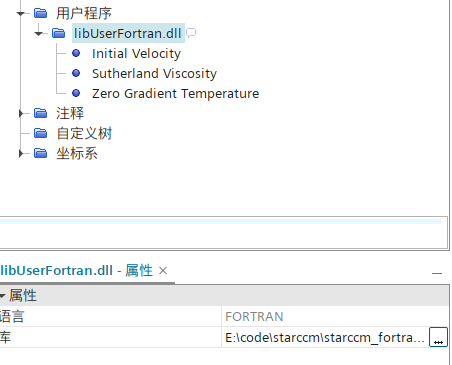
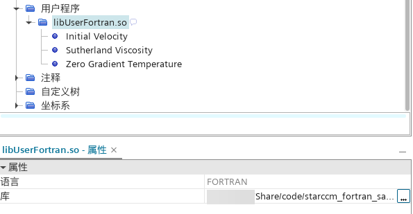
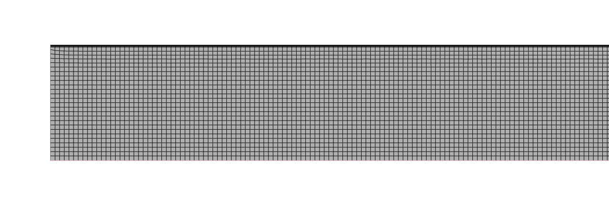
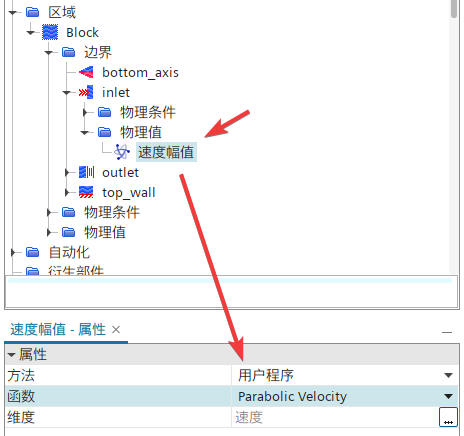
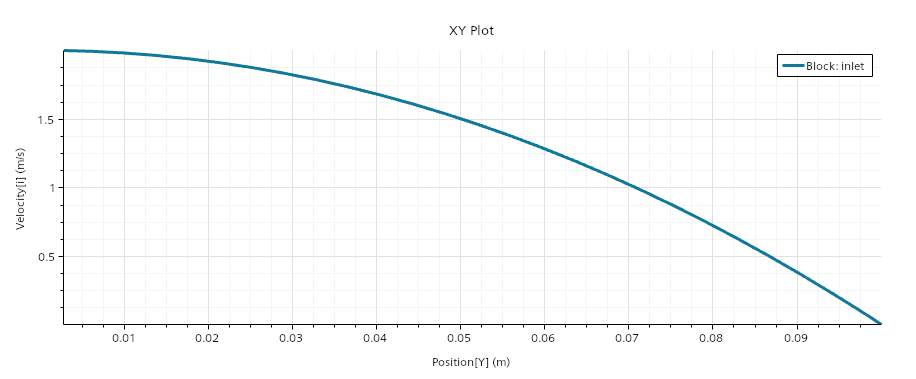

Although the official STAR-CCM+ documentation specifically states that FORTRAN is not supported under Windows[^1]. But in fact, as long as the compiler supports it, user library compiled using Fortran under Windows can be loaded and run normally in STAR-CCM+.

## 1. Build CMake Project

First, we refer to the tutorial case in the official documentation [^2] and build a CMake project. The project structure is as follows:
```powershell
STARCCM_FORTRAN_SAMPLE
│   CMakeLists.txt	# CMake Configuration File
│   README.md	# Description document, not required
├───.vscode
│      launch.json	# Automatically generated file when starting debug mode, not required
│      settings.json	# Define CMake related variables
└───src
        initVelocity.f
        StarReal.f.in
        sutherlandViscosity.f
        uflib.f
        zeroGradT.f
```

The main content of CMake configuration file `CMakeLists.txt` is as follows:
```CMake
cmake_minimum_required(VERSION 3.10)

# Project name
project(UserFortran LANGUAGES Fortran)

set(CMAKE_Fortran_STANDARD 2008)

# Check for STARCCM_USER_LIB_DIR
if(NOT DEFINED STARCCM_USER_LIB_DIR)
    message(FATAL_ERROR "STARCCM_USER_LIB_DIR is not defined. Please specify the path to the STAR-CCM+ UserFunctions library directory.")
    # For example, in Windows : C:/Program Files/Siemens/19.06.009-R8/STAR-CCM+19.06.009-R8/star/lib/win64/clang17.0vc14.2-r8/lib
    # In Linux : /opt/Siemens/19.06.009-R8/STAR-CCM+19.06.009-R8/star/lib/linux-x86_64-2.28/gnu11.4-r8/lib"
else()
    message(STATUS "STARCCM_USER_LIB_DIR location : " ${STARCCM_USER_LIB_DIR})
endif()

# Check for STARCCM_STD_LIB_DIR
if(NOT DEFINED STARCCM_STD_LIB_DIR)
    message(STATUS "STARCCM_STD_LIB_DIR undefined. using system standard library. ")
    # For example, in Linux : /opt/Siemens/19.06.009-R8/STAR-CCM+19.06.009-R8/star/lib/linux-x86_64-2.28/system/gnu11.4-64"
else()
    message(STATUS "STARCCM_STD_LIB_DIR location : " ${STARCCM_STD_LIB_DIR})
endif()

# STAR-CCM+ output precision
if(USE_DOUBLE_PRECISION)
    message(STATUS "Using double precision for STAR-CCM+")
    set(STAR_REAL "1D0")
else()
    message(STATUS "Using float precision for STAR-CCM+")
    set(STAR_REAL "1.0")
endif()

# generate the StarReal.f file
configure_file(src/StarReal.f.in ${CMAKE_BINARY_DIR}/StarReal.f @ONLY)

# Include directories
include_directories(${PROJECT_SOURCE_DIR}/include
)

# Link with STARCCM LIB directory
link_directories(${STARCCM_USER_LIB_DIR}
    ${STARCCM_STD_LIB_DIR}
)

# Specify the source files
set(SOURCES
    ${CMAKE_BINARY_DIR}/StarReal.f
    src/initVelocity.f
    src/sutherlandViscosity.f
    src/zeroGradT.f
    src/uflib.f
)

# Add library
add_library(${CMAKE_PROJECT_NAME} SHARED
    ${SOURCES}
)

# Link library
target_link_libraries(${CMAKE_PROJECT_NAME} UserFunctions)

# Install target
install(TARGETS ${CMAKE_PROJECT_NAME}
    RUNTIME DESTINATION bin
    LIBRARY DESTINATION lib
    ARCHIVE DESTINATION lib/static
    )

```
There are two key settings:
 - Specify the search path for the STAR-CCM+ library files through `STARCCM_USER_LIB_DIR` and `STARCCM_STD_LIB_DIR`. `STARCCM_STD_LIB_DIR` is optional and is used to specify the link to the STAR-CCM+ standard library files under Linux.
 - Specify the precision through `USE_DOUBLE_PRECISION`, generate `StarReal.f` based on the configuration file `StarReal.f.in`, and specify the StarReal type precision to the compiler

`StarReal.f.in` is the same as the official example's `StarReal.f`, except that the original value is changed to the `@STAR_REAL@` marker to tell CMake how to replace the character:
```fortran
      module StarRealMod
      integer, parameter :: StarInt = kind(1)
      integer, parameter :: StarReal = kind(@STAR_REAL@)
      integer, parameter :: CoordReal = kind(1D0)
      integer, parameter :: StarIntSize = StarInt
      integer, parameter :: StarRealSize = StarReal
      integer, parameter :: CoordRealSize = CoordReal
      end module StarRealMod
```

`zeroGradT.f` defines a boundary configuration function:
```fortran
C Set boundary temperature equal to cell temperature
      subroutine zeroGradT(result,size,fc,T)
      use StarRealMod
      implicit none
      integer, intent(in) :: size
      real(StarReal), intent(out) :: result(size)
      integer, intent(in) :: fc(2,*)
      real(StarReal), intent(in) :: T(*)
      integer i
C Loop through all entities applying T_boundary = T_cell
C fc(1,i) is the cell next to i
      do i = 1,size
        result(i) = T(fc(1,i))
      end do

      return
      end
```

`initVelocity.f` defines a region configuration function:
```fortran
C Initial velocity based on uniform swirl
      subroutine initVelocity(result,size,centroid)
      use StarRealMod
      implicit none
      integer, intent(in) :: size
      real(StarReal), intent(out) :: result(3,size)
      real(CoordReal), intent(in) :: centroid(3,*)
      integer i
      real(CoordReal) dr(3)
C Angular velocity and origin of rotation
      real(CoordReal), parameter :: omega(3) = (/0.0,0.0,100.0/)
      real(CoordReal), parameter :: origin(3) = (/0.0,0.0,0.0/)
C Loop through all entities applying u = omega x (centroid - origin)
      do i = 1,size
        dr(1) = centroid(1,i) - origin(1)
        dr(2) = centroid(2,i) - origin(2)
        dr(3) = centroid(3,i) - origin(3)
        result(1,i) = omega(2)*dr(3) - omega(3)*dr(2)
        result(2,i) = omega(3)*dr(1) - omega(1)*dr(3)
        result(3,i) = omega(1)*dr(2) - omega(2)*dr(1)
      end do
    
      return
      end
```

`sutherlandViscosity.f` defines a field function:
```fortran
C Dynamic viscosity based on Sutherland's law
      subroutine sutherlandViscosity(result,size,T)
      use StarRealMod
      implicit none
      integer, intent(in) :: size
      real(StarReal), intent(out) :: result(size)
      real(StarReal), intent(in) :: T(*)
      integer i
C Reference viscosity, Sutherland constant and reference temperature
      real(StarReal), parameter :: v0 = 1.716E-5
      real(StarReal), parameter :: Cs = 110.0
      real(StarReal), parameter :: T0 = 273.15

C Loop through all entities applying Sutherland's law
      do i = 1,size
        result(i) = v0 * (T(i)/T0)**1.5 * (T0 + Cs)/(T(i) + Cs)
      end do

      return
      end
```

`uflib.f` is used as an import function to register the user-defined function above:
```fortran
      subroutine uflib()
      use StarRealMod
      implicit none
C Register user functions here
      external zeroGradT,initVelocity,sutherlandViscosity
      call uffunc(zeroGradT, "BoundaryProfile", 
     &  "Zero Gradient Temperature")
      call ufarg (zeroGradT, "Face",
     &  "FaceCellIndex", 2*StarIntSize)
      call ufarg (zeroGradT, "Cell",
     &  "Temperature", StarRealSize)

      call uffunc(initVelocity, "RegionProfile",
     &  "Initial Velocity")
      call ufarg(initVelocity, "Cell",
     &  "Centroid", 3*CoordRealSize)

      call uffunc(sutherlandViscosity, "ScalarFieldFunction",
     &  "Sutherland Viscosity")
      call ufarg(sutherlandViscosity, "Cell",
     &  "Temperature", StarRealSize)
      return
      end
```

The Fortran codes that come with the official documents are all in a fixed format. I don’t know if it’s due to the formatting, but the first 6 spaces in the code are not displayed correctly. Be sure to pay attention when copying and pasting.

## 2. Compiling dynamic libraries under Windows

Compile under Windwos using clang64 toolchain of msys2, and the compiler is LLVM flang. If you do not find this option on VSCode, you can use the CMake extended scanning toolkit function to scan the clang64 directory of msys2 to find this option.


After compiling and outputting the dynamic library, use the `ldd` command under the clang64 toolchain to scan the dependencies of the dynamic library. Except for the dynamic library that comes with the system, no other third-party dynamic libraries are linked.


If you use mingw64 or ucrt64 toolchain to compile, the compiler is usually gfortran. It is best to scan the compiled dynamic library files with `ldd` to ensure that there are not a lot of third-party dynamic library dependencies.

When loaded using STAR-CCM+, it can be recognized normally and the compiled language is displayed as Fortran.


## 3. Compiling dynamic libraries under Linux

Compile the fortran dynamic link library under Linux using the following command:
```bash
# Enter the project directory
cd starccm_fortran_sample
# Create a working directory
mkdir -p build && cd build
# Configure the compilation file and link it to the STAR-CCM+ library
cmake .. -G "Ninja" -DUSE_DOUBLE_PRECISION=ON \
    -DSTARCCM_USER_LIB_DIR=${HOME}/opt/Siemens/19.06.009-R8/STAR-CCM+19.06.009-R8/star/lib/linux-x86_64-2.28/gnu11.4-r8/lib \
    -DSTARCCM_STD_LIB_DIR=${HOME}/opt/Siemens/19.06.009-R8/STAR-CCM+19.06.009-R8/star/lib/linux-x86_64-2.28/system/gnu11.4-64
# Compile dynamic library
cmake --build . --config Release
# Install
cmake --install . --prefix $PWD/../../UserLib
```

Use `ldd` to scan the generated dynamic library file, and there is no other third-party dynamic library dependency.


Use STAR-CCM+ to load and it can be recognized normally.


## 4. Calculation case

The following is a STAR-CCM+ case demonstration[^3] to see whether a user library written in Fortran can be loaded into STAR-CCM+ for normal calculation.

The fully developed laminar flow in a circular tube is simulated. The circular tube is 3 meters long and 0.2 meters in diameter, with an air inlet at one end and an outlet at the other end. The physical parameters and inlet conditions are as follows:
 - Density: 1.0 kg/m^3
 - Viscosity: 2×10^-3 N-s/m^2
 - The laminar flow inlet of the duct is fully developed to satisfy the following relationship:
<math xmlns="http://www.w3.org/1998/Math/MathML" display="block"><mfrac><mi>u</mi><msub><mi>u</mi><mrow><mi>m</mi></mrow></msub></mfrac><mo>=</mo><mn>2</mn><mrow data-mjx-texclass="INNER"><mo data-mjx-texclass="OPEN">[</mo><mn>1</mn><mo>−</mo><msup><mrow data-mjx-texclass="INNER"><mo data-mjx-texclass="OPEN">(</mo><mfrac><mi>r</mi><msub><mi>r</mi><mrow><mn>0</mn></mrow></msub></mfrac><mo data-mjx-texclass="CLOSE">)</mo></mrow><mrow><mn>2</mn></mrow></msup><mo data-mjx-texclass="CLOSE">]</mo></mrow></math>
   Where: `um` represents the average velocity at the inlet, `r0` represents the pipe diameter

Create a 2D axisymmetric model.


Create a new CMake project. The `CMakeLists.txt` file is basically the same as the previous one, with only the following parts changed:
```cmake
# Specify the source files
set(SOURCES
    ${CMAKE_BINARY_DIR}/StarReal.f
    src/parabolicVelocity.f90
    src/uflib.f90
)
```

There are only 3 source files, among which the content of `StarReal.f.in` is the same as the previous one. The implementation of the inlet velocity is in the `parabolicVelocity.f` file, and the content is as follows:
```fortran
C Initial velocity
      subroutine parabolicVelocity(result,size,centroid)
      use StarRealMod
      implicit none
      integer, intent(in) :: size
      real(StarReal), intent(out) :: result(size)
      real(CoordReal), intent(in) :: centroid(3,*)
      integer i
      real(CoordReal) radius
      real(CoordReal), parameter :: R = 0.1
      real(CoordReal), parameter :: origin(3) = (/0.0,0.0,0.0/)
C Loop through all entities applying uniform velocity
      do i = 1,size
        radius = sqrt((centroid(1,i)- origin(1))**2 + 
     &      (centroid(2,i) - origin(2))**2 + 
     &      (centroid(3,i) - origin(3))**2)

        result(i) = 2* (1-(radius/R)*(radius/R))
      end do
    
      return
      end
```

The contents of the `uflib.f` file where the registration function is located are as follows:
```fortran
      subroutine uflib()
      use StarRealMod
      implicit none
      external parabolicVelocity
C Register user functions here
      call uffunc(parabolicVelocity, "BoundaryProfile",
     &  "Parabolic Velocity")
      call ufarg(parabolicVelocity, "Face",
     &  "Centroid", 3*CoordRealSize)
      return
      end
```

Compile using the clang64 toolchain of msys2 under Windows and output dynamic link library files. Load the user library:


Select the user library as the entry condition and the function `parabolicVelocity` defined above as the function.


The calculation is completed and the scene is output.


Velocity plot at the inlet.


[^1]: [使用用户程序](https://www.topcfd.cn/Ebook/STARCCMP/GUID-9665BF40-46BC-44F0-95F9-7E20766E8109.html)

[^2]: [Fortran 用户接口参考](https://www.topcfd.cn/Ebook/STARCCMP/GUID-D7CE8E3A-522F-4966-BA1D-E96E7FB1E13C.html)

[^3]: [STAR-CCM+二次开发——User Code](https://www.cnblogs.com/liusuanyatong/p/12288458.html)