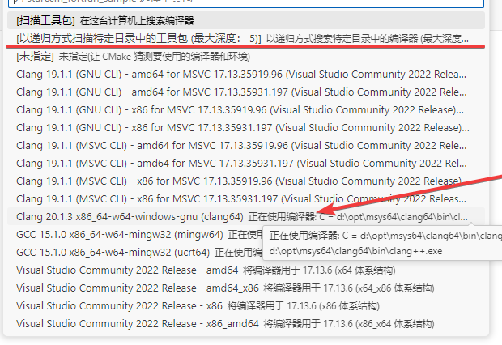
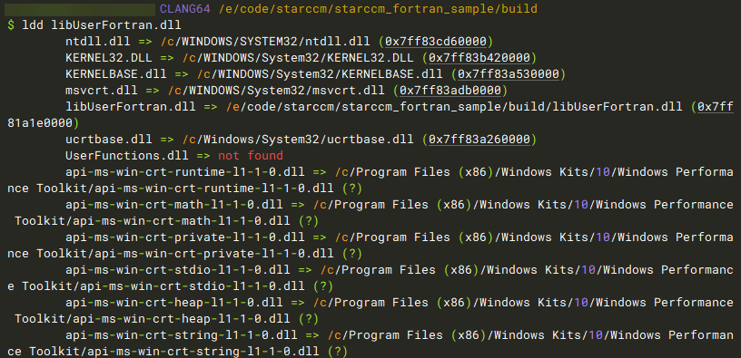
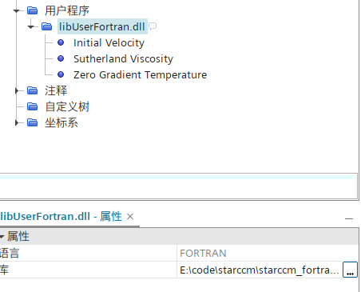
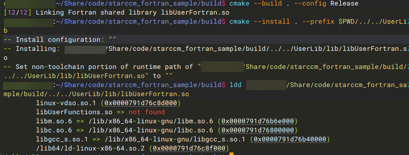
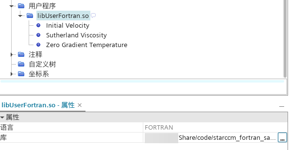
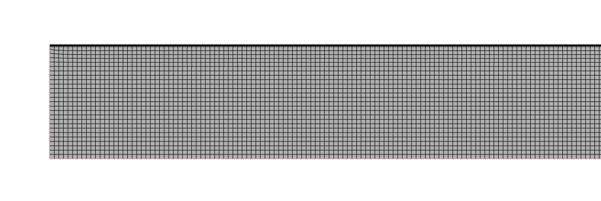
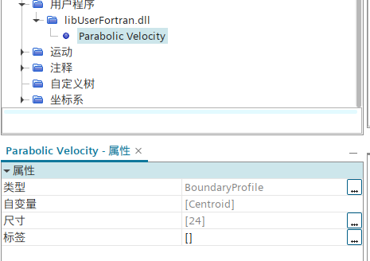
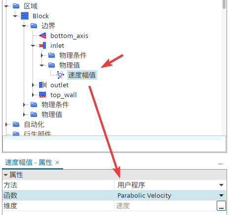
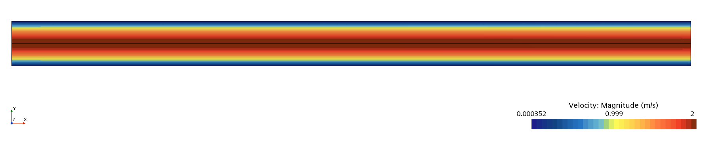
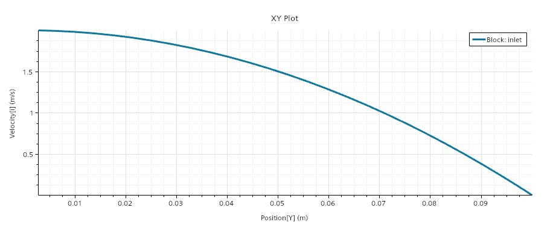

+++
author = "Andrew Moa"
title = "使用VSCode开发STAR-CCM+用户程序：通过Fortran构建动态库"
date = "2025-04-30"
description = ""
tags = [
    "fortran",
    "star-ccm+",
]
categories = [
    "cfd",
]
series = [""]
aliases = [""]
image = "/images/starccm-bg.jpg"
+++

虽然STAR-CCM+官方文档专门说明，Windows下不支持 FORTRAN[^1]。但实际上，只要编译器支持，在Windows下使用Fortran编译出来的用户程序一样能正常在STAR-CCM+中正常加载运行。

## 1. 构建CMake工程

首先我们参考官方文档当中的教程案例[^2]，编写CMake项目，项目结构如下：
```powershell
STARCCM_FORTRAN_SAMPLE
│   CMakeLists.txt	# CMake配置文件
│   README.md	# 说明文件，非必须
├───.vscode
│      launch.json	# 启动调试模式时自动生成的文件，非必须
│      settings.json	# 定义CMake相关变量
└───src
        initVelocity.f
        StarReal.f.in
        sutherlandViscosity.f
        uflib.f
        zeroGradT.f
```

CMake配置文件`CMakeLists.txt`主要内容如下：
```CMake
cmake_minimum_required(VERSION 3.10)

# Project name
project(UserFortran LANGUAGES Fortran)

set(CMAKE_Fortran_STANDARD 2008)

# Check for STARCCM_USER_LIB_DIR
if(NOT DEFINED STARCCM_USER_LIB_DIR)
    message(FATAL_ERROR "STARCCM_USER_LIB_DIR is not defined. Please specify the path to the STAR-CCM+ UserFunctions library directory.")
    # For example, in Windows : C:/Program Files/Siemens/19.06.009-R8/STAR-CCM+19.06.009-R8/star/lib/win64/clang17.0vc14.2-r8/lib
    # In Linux : /opt/Siemens/19.06.009-R8/STAR-CCM+19.06.009-R8/star/lib/linux-x86_64-2.28/gnu11.4-r8/lib"
else()
    message(STATUS "STARCCM_USER_LIB_DIR location : " ${STARCCM_USER_LIB_DIR})
endif()

# Check for STARCCM_STD_LIB_DIR
if(NOT DEFINED STARCCM_STD_LIB_DIR)
    message(STATUS "STARCCM_STD_LIB_DIR undefined. using system standard library. ")
    # For example, in Linux : /opt/Siemens/19.06.009-R8/STAR-CCM+19.06.009-R8/star/lib/linux-x86_64-2.28/system/gnu11.4-64"
else()
    message(STATUS "STARCCM_STD_LIB_DIR location : " ${STARCCM_STD_LIB_DIR})
endif()

# STAR-CCM+ output precision
if(USE_DOUBLE_PRECISION)
    message(STATUS "Using double precision for STAR-CCM+")
    set(STAR_REAL "1D0")
else()
    message(STATUS "Using float precision for STAR-CCM+")
    set(STAR_REAL "1.0")
endif()

# generate the StarReal.f file
configure_file(src/StarReal.f.in ${CMAKE_BINARY_DIR}/StarReal.f @ONLY)

# Include directories
include_directories(${PROJECT_SOURCE_DIR}/include
)

# Link with STARCCM LIB directory
link_directories(${STARCCM_USER_LIB_DIR}
    ${STARCCM_STD_LIB_DIR}
)

# Specify the source files
set(SOURCES
    ${CMAKE_BINARY_DIR}/StarReal.f
    src/initVelocity.f
    src/sutherlandViscosity.f
    src/zeroGradT.f
    src/uflib.f
)

# Add library
add_library(${CMAKE_PROJECT_NAME} SHARED
    ${SOURCES}
)

# Link library
target_link_libraries(${CMAKE_PROJECT_NAME} UserFunctions)

# Install target
install(TARGETS ${CMAKE_PROJECT_NAME}
    RUNTIME DESTINATION bin
    LIBRARY DESTINATION lib
    ARCHIVE DESTINATION lib/static
    )

```
其中有两个关键设置：
 - 通过`STARCCM_USER_LIB_DIR`和`STARCCM_STD_LIB_DIR`指定STAR-CCM+自带的库文件搜索路径，其中`STARCCM_STD_LIB_DIR`是非必须的，用于在Linux下指定链接到STAR-CCM+自带的标准库文件
 - 通过`USE_DOUBLE_PRECISION`指定精度，在配置文件`StarReal.f.in`基础上生成`StarReal.f`，给编译器指定StarReal类型精度

`StarReal.f.in`同官方案例的`StarReal.f`，只是将原来的数值改为了`@STAR_REAL@`标记，用来告诉CMake如何替换字符：
```fortran
      module StarRealMod
      integer, parameter :: StarInt = kind(1)
      integer, parameter :: StarReal = kind(@STAR_REAL@)
      integer, parameter :: CoordReal = kind(1D0)
      integer, parameter :: StarIntSize = StarInt
      integer, parameter :: StarRealSize = StarReal
      integer, parameter :: CoordRealSize = CoordReal
      end module StarRealMod
```

`zeroGradT.f`定义了一个边界配置函数：
```fortran
C Set boundary temperature equal to cell temperature
      subroutine zeroGradT(result,size,fc,T)
      use StarRealMod
      implicit none
      integer, intent(in) :: size
      real(StarReal), intent(out) :: result(size)
      integer, intent(in) :: fc(2,*)
      real(StarReal), intent(in) :: T(*)
      integer i
C Loop through all entities applying T_boundary = T_cell
C fc(1,i) is the cell next to i
      do i = 1,size
        result(i) = T(fc(1,i))
      end do

      return
      end
```

`initVelocity.f`定义了一个区域配置函数：
```fortran
C Initial velocity based on uniform swirl
      subroutine initVelocity(result,size,centroid)
      use StarRealMod
      implicit none
      integer, intent(in) :: size
      real(StarReal), intent(out) :: result(3,size)
      real(CoordReal), intent(in) :: centroid(3,*)
      integer i
      real(CoordReal) dr(3)
C Angular velocity and origin of rotation
      real(CoordReal), parameter :: omega(3) = (/0.0,0.0,100.0/)
      real(CoordReal), parameter :: origin(3) = (/0.0,0.0,0.0/)
C Loop through all entities applying u = omega x (centroid - origin)
      do i = 1,size
        dr(1) = centroid(1,i) - origin(1)
        dr(2) = centroid(2,i) - origin(2)
        dr(3) = centroid(3,i) - origin(3)
        result(1,i) = omega(2)*dr(3) - omega(3)*dr(2)
        result(2,i) = omega(3)*dr(1) - omega(1)*dr(3)
        result(3,i) = omega(1)*dr(2) - omega(2)*dr(1)
      end do
    
      return
      end
```

`sutherlandViscosity.f`定义了一个场函数：
```fortran
C Dynamic viscosity based on Sutherland's law
      subroutine sutherlandViscosity(result,size,T)
      use StarRealMod
      implicit none
      integer, intent(in) :: size
      real(StarReal), intent(out) :: result(size)
      real(StarReal), intent(in) :: T(*)
      integer i
C Reference viscosity, Sutherland constant and reference temperature
      real(StarReal), parameter :: v0 = 1.716E-5
      real(StarReal), parameter :: Cs = 110.0
      real(StarReal), parameter :: T0 = 273.15

C Loop through all entities applying Sutherland's law
      do i = 1,size
        result(i) = v0 * (T(i)/T0)**1.5 * (T0 + Cs)/(T(i) + Cs)
      end do

      return
      end
```

`uflib.f`作为导入函数，用于注册上面用户定义的函数：
```fortran
      subroutine uflib()
      use StarRealMod
      implicit none
C Register user functions here
      external zeroGradT,initVelocity,sutherlandViscosity
      call uffunc(zeroGradT, "BoundaryProfile", 
     &  "Zero Gradient Temperature")
      call ufarg (zeroGradT, "Face",
     &  "FaceCellIndex", 2*StarIntSize)
      call ufarg (zeroGradT, "Cell",
     &  "Temperature", StarRealSize)

      call uffunc(initVelocity, "RegionProfile",
     &  "Initial Velocity")
      call ufarg(initVelocity, "Cell",
     &  "Centroid", 3*CoordRealSize)

      call uffunc(sutherlandViscosity, "ScalarFieldFunction",
     &  "Sutherland Viscosity")
      call ufarg(sutherlandViscosity, "Cell",
     &  "Temperature", StarRealSize)
      return
      end
```

官方文档自带的Fortran代码都是固定格式，不知是不是排版的原因，代码前6个空格没有正确显示，复制粘贴的时候一定要注意。

## 2. Windows下编译动态库

Windwos下使用msys2的clang64工具链编译，编译器是LLVM flang。如果VSCode上没有找到该选项，可以使用CMake拓展的扫描工具包功能扫描msys2的clang64目录找到该选项。


编译输出动态库之后，在clang64工具链下用`ldd`命令扫描该动态库的依赖，除了系统自带的动态库之外，没有链接到其他第三方动态库。


如果用msys2的mingw64或者ucrt64工具链编译，编译器一般都是gfortran，编译出来的动态库文件最好用`ldd`扫描一遍，确保不会多出一堆第三方动态库依赖。

使用STAR-CCM+加载，可以正常识别，编译语言显示是Fortran。


## 3. Linux下编译动态库

Linux下通过以下命令编译fortran动态链接库：
```bash
# 进入项目目录
cd starccm_fortran_sample
# 建立工作目录
mkdir -p build && cd build
# 配置编译文件，链接STAR-CCM+库
cmake .. -G "Ninja" -DUSE_DOUBLE_PRECISION=ON \
    -DSTARCCM_USER_LIB_DIR=${HOME}/opt/Siemens/19.06.009-R8/STAR-CCM+19.06.009-R8/star/lib/linux-x86_64-2.28/gnu11.4-r8/lib \
    -DSTARCCM_STD_LIB_DIR=${HOME}/opt/Siemens/19.06.009-R8/STAR-CCM+19.06.009-R8/star/lib/linux-x86_64-2.28/system/gnu11.4-64
# 编译动态库
cmake --build . --config Release
# 安装
cmake --install . --prefix $PWD/../../UserLib
```

使用`ldd`扫描生成的动态库文件，没有其他第三方动态库依赖。


使用STAR-CCM+加载，可以正常识别。


## 4. 计算案例演示

接下来用一个STAR-CCM+案例演示[^3]下，看Fortran编写的用户程序能否载入STAR-CCM+正常计算。

模拟充分发展的圆管层流，圆管长3米、直径0.2米，一端为进气口，另一端为出口。物性参数和入口条件如下所示：
 - 密度：1.0 kg/m^3
 - 粘度：2×10^-3 N-s/m^2
 - 管道层流入口充分发展满足下面的关系：
<math xmlns="http://www.w3.org/1998/Math/MathML" display="block"><mfrac><mi>u</mi><msub><mi>u</mi><mrow><mi>m</mi></mrow></msub></mfrac><mo>=</mo><mn>2</mn><mrow data-mjx-texclass="INNER"><mo data-mjx-texclass="OPEN">[</mo><mn>1</mn><mo>−</mo><msup><mrow data-mjx-texclass="INNER"><mo data-mjx-texclass="OPEN">(</mo><mfrac><mi>r</mi><msub><mi>r</mi><mrow><mn>0</mn></mrow></msub></mfrac><mo data-mjx-texclass="CLOSE">)</mo></mrow><mrow><mn>2</mn></mrow></msup><mo data-mjx-texclass="CLOSE">]</mo></mrow></math>
   其中： *u<sub>m</sub>* 表示入口的平均速度， *r<sub>0</sub>* 表示管径

建立一个二维轴对称模型。


新建CMake项目，`CMakeLists.txt`文件基本和前面的内容一样，只改动下面部分：
```cmake
# Specify the source files
set(SOURCES
    ${CMAKE_BINARY_DIR}/StarReal.f
    src/parabolicVelocity.f
    src/uflib.f
)
```

源码文件只有3个，其中`StarReal.f.in`内容和前面的一样。入口速度的实现在`parabolicVelocity.f`文件中，内容如下所示：
```fortran
C Initial velocity
      subroutine parabolicVelocity(result,size,centroid)
      use StarRealMod
      implicit none
      integer, intent(in) :: size
      real(StarReal), intent(out) :: result(size)
      real(CoordReal), intent(in) :: centroid(3,*)
      integer i
      real(CoordReal) radius
      real(CoordReal), parameter :: R = 0.1
      real(CoordReal), parameter :: origin(3) = (/0.0,0.0,0.0/)
C Loop through all entities applying uniform velocity
      do i = 1,size
        radius = sqrt((centroid(1,i)- origin(1))**2 + 
     &      (centroid(2,i) - origin(2))**2 + 
     &      (centroid(3,i) - origin(3))**2)

        result(i) = 2* (1-(radius/R)*(radius/R))
      end do
    
      return
      end
```

注册函数所在的`uflib.f`文件内容如下所示：
```fortran
      subroutine uflib()
      use StarRealMod
      implicit none
      external parabolicVelocity
C Register user functions here
      call uffunc(parabolicVelocity, "BoundaryProfile",
     &  "Parabolic Velocity")
      call ufarg(parabolicVelocity, "Face",
     &  "Centroid", 3*CoordRealSize)
      return
      end
```

Windows下使用msys2的clang64工具链编译，输出动态链接库文件。载入用户程序：


入口条件选择用户程序，函数选择上面定义的函数`parabolicVelocity`。


计算完成输出云图。


入口处速度分布。


[^1]: [使用用户程序](https://www.topcfd.cn/Ebook/STARCCMP/GUID-9665BF40-46BC-44F0-95F9-7E20766E8109.html)

[^2]: [Fortran 用户接口参考](https://www.topcfd.cn/Ebook/STARCCMP/GUID-D7CE8E3A-522F-4966-BA1D-E96E7FB1E13C.html)

[^3]: [STAR-CCM+二次开发——User Code](https://www.cnblogs.com/liusuanyatong/p/12288458.html)