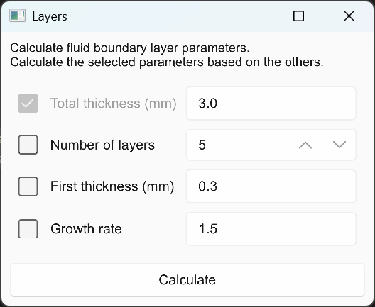
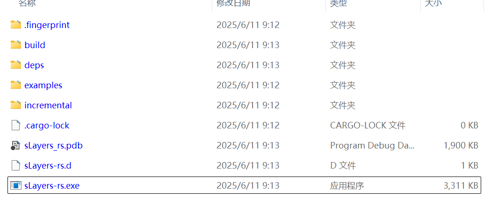
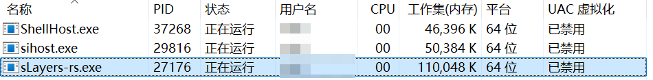
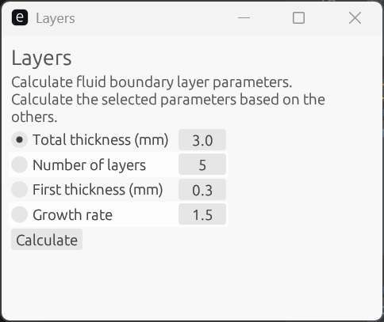
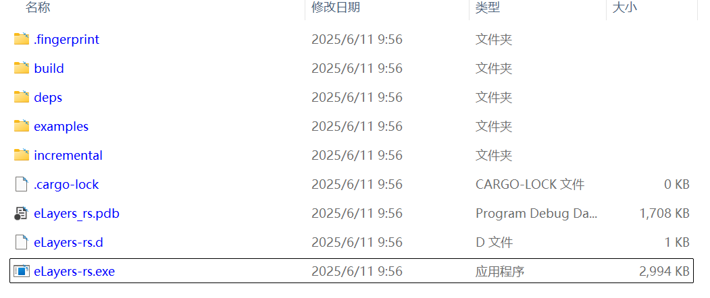
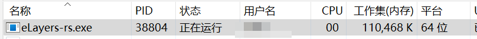
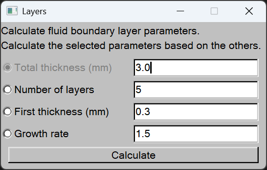
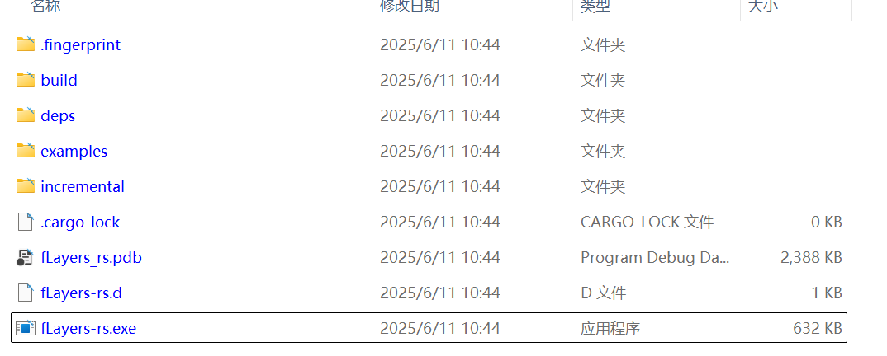
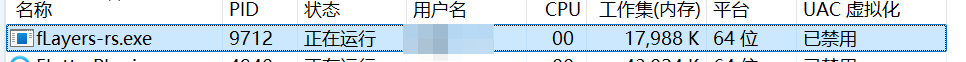

+++
author = "Andrew Moa"
title = "Exploring Rust Graphical Interface Libraries"
date = "2025-06-11"
description = ""
tags = [
    "rust",
]
categories = [
    "code",
]
series = [""]
aliases = [""]
image = "/images/code-bg.jpg"
+++

Recently, I plan to refactor the code I wrote previously using Rust, which involves the question of how to choose a GUI interface. Rust has only been officially released for ten years, and is not as good as the old C/C++ in GUI development. There are many well-known and time-tested GUI interface libraries such as wxWidgets, qt, gtk+, etc. This article selects several Rust GUI libraries and simply implements a boundary layer calculator for horizontal comparison.

## 1. slint

[slint](https://slint.dev/) has been promoting itself recently, claiming to be the next generation of GUI toolkit, which seems to be quite ambitious. Slint defines the UI interface through a custom declarative language, and can be previewed through the plugin in vscode or through the official [slintpad](https://slintpad.com/) website.

The cargo configuration is as follows. `slint-build` is used to translate the `.slint` file into a `.rs` file.
```toml
[package]
name = "sLayers-rs"
version = "0.1.0"
edition = "2024"

[dependencies]
slint = "1.8.0"

[build-dependencies]
slint-build = "1.8.0"

[profile.release]
strip = true
opt-level = "z"
lto = true
codegen-units = 1
panic = "abort"

```

The UI interface file `dialog.slint`. Slint can define the parameters to be called in the UI interface, and automatically and implicitly generate `set_` and `get_` methods to set the values ​​of these parameters in the RS file. Similarly, the callback function defined in the interface will also automatically and implicitly generate the `on_` method for calling in the RS file. It should be noted that when the parameters in the UI interface are updated in RS, the associated controls will not automatically update the display, and the control display needs to be updated manually.
```
import { Button, LineEdit, SpinBox, CheckBox, GridBox, VerticalBox } from "std-widgets.slint";

export component Dialog inherits Window {
    title: "Layers";
    in-out property <string> tt: "3.0";
    in-out property <int> nl: 5;
    in-out property <string> ft: "0.3";
    in-out property <string> gr: "1.5";
    callback calculate_first_thickness();
    callback calculate_num_layers();
    callback calculate_growth_rate();
    callback calculate_total_thickness();

    callback calculate_value();
    VerticalBox {
        Text {
            text: "Calculate fluid boundary layer parameters.\nCalculate the selected parameters based on the others.";
        }

        GridBox {
            Row {
                b_t := CheckBox {
                    text: "Total thickness (mm)";
                    checked: true;
                    enabled: !self.checked;
                    toggled() => {
                        if self.checked {
                            b_n.checked = false;
                            b_f.checked = false;
                            b_g.checked = false;
                        }
                    }
                }

                e_t := LineEdit {
                    text: root.tt;
                    input-type: decimal;
                    read-only: b_t.checked;
                }
            }

            Row {
                b_n := CheckBox {
                    text: "Number of layers";
                    checked: false;
                    enabled: !self.checked;
                    toggled() => {
                        if self.checked {
                            b_t.checked = false;
                            b_f.checked = false;
                            b_g.checked = false;
                        }
                    }
                }

                e_n := SpinBox {
                    value: root.nl;
                    minimum: 1;
                }
            }

            Row {
                b_f := CheckBox {
                    text: "First thickness (mm)";
                    checked: false;
                    enabled: !self.checked;
                    toggled() => {
                        if self.checked {
                            b_n.checked = false;
                            b_t.checked = false;
                            b_g.checked = false;
                        }
                    }
                }

                e_f := LineEdit {
                    text: root.ft;
                    input-type: decimal;
                    read-only: b_f.checked;
                }
            }

            Row {
                b_g := CheckBox {
                    text: "Growth rate";
                    checked: false;
                    enabled: !self.checked;
                    toggled() => {
                        if self.checked {
                            b_n.checked = false;
                            b_f.checked = false;
                            b_t.checked = false;
                        }
                    }
                }

                e_g := LineEdit {
                    text: root.gr;
                    input-type: decimal;
                    read-only: b_g.checked;
                }
            }
        }

        Button {
            text: "Calculate";
            clicked => {
                root.tt = e_t.text;
                root.nl = e_n.value;
                root.ft = e_f.text;
                root.gr = e_g.text;
                if b_t.checked {
                    root.calculate_total_thickness();
                } else if b_n.checked {
                    root.calculate_num_layers();
                } else if b_f.checked {
                    root.calculate_first_thickness();
                } else if b_g.checked {
                    root.calculate_growth_rate();
                }
                e_t.text = root.tt;
                e_g.text = root.gr;
                e_f.text = root.ft;
                e_n.value = root.nl;
            }
        }
    }
}

```

The `build.rs` build script calls `slint-build` to translate the `.slint` files into `.rs` files.
```rust
fn main() {
    slint_build::compile("ui/dialog.slint").expect("Slint build failed");
}

```

The `main.rs` file contains the algorithm implementation of boundary layer calculation and updates the UI interface parameters through callback functions.
```rust
// Prevent console window in addition to Slint window in Windows release builds when, e.g., starting the app via file manager. Ignored on other platforms.
#![cfg_attr(not(debug_assertions), windows_subsystem = "windows")]

use slint::SharedString;
use std::error::Error;

slint::include_modules!();

fn main() -> Result<(), Box<dyn Error>> {
    let ui = Dialog::new()?;

    ui.on_calculate_total_thickness({
        let ui_handle = ui.as_weak();
        move || {
            let ui = ui_handle.unwrap();
            let n = ui.get_nl();
            let f = ui.get_ft().to_string().parse::<f64>().unwrap();
            let g = ui.get_gr().to_string().parse::<f64>().unwrap();
            let mut v = 0.0;
            for i in 0..n {
                v = v + f * g.powi(i);
            }
            ui.set_tt(SharedString::from(v.to_string()));
        }
    });

    ui.on_calculate_first_thickness({
        let ui_handle = ui.as_weak();
        move || {
            let ui = ui_handle.unwrap();
            let n = ui.get_nl();
            let t = ui.get_tt().to_string().parse::<f64>().unwrap();
            let g = ui.get_gr().to_string().parse::<f64>().unwrap();
            let mut fi = t / (n as f64);
            loop {
                let mut v: f64 = 0.0;
                for i in 0..n {
                    v = v + fi * g.powi(i);
                }
                if (v - t).abs() < 1e-6 {
                    break;
                } else {
                    fi = fi - (v - t) * 0.01;
                }
            }
            ui.set_ft(SharedString::from(fi.to_string()));
        }
    });

    ui.on_calculate_growth_rate({
        let ui_handle = ui.as_weak();
        move || {
            let ui = ui_handle.unwrap();
            let n = ui.get_nl();
            let t = ui.get_tt().to_string().parse::<f64>().unwrap();
            let f = ui.get_ft().to_string().parse::<f64>().unwrap();
            let mut gi = f / t;
            let mut v = 0.0;
            while (v - t).abs() > 1e-6 {
                gi = gi - (v - t) * 0.01;
                v = 0.0;
                for i in 0..n {
                    v = v + f * gi.powi(i);
                }
            }
            ui.set_gr(SharedString::from(gi.to_string()));
        }
    });

    ui.on_calculate_num_layers({
        let ui_handle = ui.as_weak();
        move || {
            let ui = ui_handle.unwrap();
            let f: f64 = ui.get_ft().to_string().parse::<f64>().unwrap();
            let t = ui.get_tt().to_string().parse::<f64>().unwrap();
            let g = ui.get_gr().to_string().parse::<f64>().unwrap();
            let mut i = 1;
            let mut v = 0.0;
            loop {
                v = v + f * g.powi(i);
                if v > t {
                    break;
                }
                i = i + 1;
            }
            ui.set_nl(i + 1);
        }
    });

    ui.run()?;

    Ok(())
}

```

The final interface effect is as follows. The display interface color will change depending on the system theme color.


The size of the generated release binary package is about 3MB.


The running memory is around 110MB.


Advantages:
- Implement UI interface through declarative language, and even include some simple calculation logic in `.slint` file.
- Rust native interface, no unsafe operation.
- Support cross-platform and cross-device compilation, and also support mobile phone and embedded development.

Disadvantages:
- It does not support multiple windows and file drag-and-drop functions, nor does it support file dialog boxes and message dialog boxes.
- It cannot call window handles, and does not provide related operation methods.
- It does not support event control, and lacks more fine-grained support for window and control operations.

## 2. egui

[egui](https://crates.io/crates/egui) is a part of [eframe](https://crates.io/crates/eframe), which aims to create a simple, fast and easy-to-use GUI library. eframe is a cross-platform application development framework that supports multi-platform application development such as Windows, Linus, MacOS and Android. egui not only supports local application development, but can even compile code into wasm and run in the browser.

The cargo configuration is as follows, where the main dependency is `eframe`.
```toml
[package]
name = "eLayers-rs"
version = "0.1.0"
edition = "2024"

[dependencies]
eframe = "0.31.1"

[profile.release]
strip = true
opt-level = "z"
lto = true
codegen-units = 1
panic = "abort"

```

`main.rs` file, the UI entry is included in the app structure of eframe. The control assembly and button callback functions are implemented through closures. The advantage is that the control and parameter association are updated in real time, and there is no need to manually update the control display.
```rust
#![cfg_attr(not(debug_assertions), windows_subsystem = "windows")] // hide console window on Windows in release

use eframe::egui;

fn main() -> eframe::Result {
    let options = eframe::NativeOptions {
        viewport: egui::ViewportBuilder::default().with_inner_size([320.0, 240.0]),
        ..Default::default()
    };
    eframe::run_native(
        "Layers",
        options,
        Box::new(|_| {
            // This gives us image support:
            Ok(Box::<LayersApp>::default())
        }),
    )
}

#[derive(PartialEq)]
enum Flags {
    Total,
    First,
    Number,
    Growth,
}

struct LayersApp {
    tt: f64,
    ft: f64,
    gr: f64,
    nl: i32,
    checked: Flags,
}

impl Default for LayersApp {
    fn default() -> Self {
        Self {
            tt: 3.0,
            ft: 0.3,
            gr: 1.5,
            nl: 5,
            checked: Flags::Total,
        }
    }
}

impl eframe::App for LayersApp {
    fn update(&mut self, ctx: &egui::Context, _frame: &mut eframe::Frame) {
        egui::CentralPanel::default().show(ctx, |ui| {
            ui.heading("Layers");
            ui.label("Calculate fluid boundary layer parameters.\nCalculate the selected parameters based on the others.");
            ui.vertical(|ui| {
            egui::Grid::new("")
                .num_columns(2)
                .striped(true)
                .show(ui, |ui| {
                    ui.radio_value(&mut self.checked, Flags::Total, "Total thickness (mm)");
                    ui.add(egui::DragValue::new(&mut self.tt).max_decimals(6).speed(0.1));
                    ui.end_row();
                    ui.radio_value(&mut self.checked, Flags::Number, "Number of layers");
                    ui.add(egui::DragValue::new(&mut self.nl).speed(1));
                    ui.end_row();
                    ui.radio_value(&mut self.checked, Flags::First, "First thickness (mm)");
                    ui.add(egui::DragValue::new(&mut self.ft).max_decimals(6).speed(0.1));
                    ui.end_row();
                    ui.radio_value(&mut self.checked, Flags::Growth, "Growth rate");
                    ui.add(egui::DragValue::new(&mut self.gr).max_decimals(6).speed(0.1));
                    ui.end_row();
                });
            });
            if ui.button("Calculate").clicked() {
                match self.checked {
                    Flags::Total => {
                        let mut v = 0.0;
                        for i in 0..self.nl {
                            v = v + self.ft * self.gr.powi(i);
                        }
                        self.tt = v;
                    }
                    Flags::Number => {
                        let mut i = 1;
                        let mut v = 0.0;
                        loop {
                            v = v + self.ft * self.gr.powi(i);
                            if v > self.tt {
                                break;
                            }
                            i = i + 1;
                        }
                        self.nl = i + 1;
                    }
                    Flags::First => {
                        let mut f = self.tt / (self.nl as f64);
                        loop {
                            let mut v: f64 = 0.0;
                            for i in 0..self.nl {
                                v = v + f * self.gr.powi(i);
                            }
                            if (v - self.tt).abs() < 1e-6 {
                                break;
                            } else {
                                f = f - (v - self.tt) * 0.01;
                            }
                        }
                        self.ft = f;
                    }
                    Flags::Growth => {
                        let mut g = self.ft / self.tt;
                        let mut v = 0.0;
                        while (v - self.tt).abs() > 1e-6 {
                            g = g - (v - self.tt) * 0.01;
                            v = 0.0;
                            for i in 0..self.nl {
                                v = v + self.ft * g.powi(i);
                            }
                        }
                        self.gr = g;
                    }
                }
            }
        });
    }
}

```

The interface effect is shown in the figure below. Compared with the traditional UI interface, the style presented by EGUI is more similar to the web front end. The screenshot here shows that the system is a light theme. If the system is a dark theme, the interface background color will be displayed in dark. The interface occasionally flickers because the control display is related to the parameters, which may be related to the high refresh frequency of the interface.


The generated release binary package size is less than 3MB.


The running memory is also around 110MB.


Advantages:
- Supports Web and Native application development.
- Rust native, no unsafe operations.
- Supports cross-platform.

Disadvantages:
- No UI tools, no quick preview of UI interface, no separation of interface and implementation methods.
- Cannot call window handles, and does not support event control.
- Under development, the API is not stable yet, and major adjustments may occur at any time.

## 3. fltk-rs

[fltk](https://www.fltk.org/) was originally a lightweight GUI library developed in C++. [fltk-rs](https://fltk-rs.github.io/fltk-rs/) is the rust binding of fltk, and the underlying implementation is still implemented in C++. The interface implementation of fltk is very simple, and the assembly of controls is operated through relatively primitive coordinates, and it does not support automatic arrangement and combination. Although it provides a wealth of controls, the native theme effects are similar to the minimalist style of [Motif](https://en.wikipedia.org/wiki/Motif_%28software%29), which is far from the modern UI interface. Fortunately, [fltk-theme](https://crates.io/crates/fltk-theme) provides a wealth of interface themes for beautification, and users can customize their own theme styles based on this.

The cargo configuration file is as follows. Here, fltk downloads the compiled lib file through the `"fltk-bundled"` feature to avoid recompiling fltk and reporting errors. fltk-rs can use the interface tool `fluid` provided by fltk for rapid development and preview of the UI interface. In rust, `fl2rust` is used to translate the `.fl` file generated by `fluid` into a `.rs` file.
```toml
[package]
name = "fLayers-rs"
version = "0.1.0"
edition = "2024"

[dependencies]
fltk = { version = "1.5.9", features = ["fltk-bundled"] }

[build-dependencies]
fl2rust = "0.7.0"

[profile.release]
strip = true
opt-level = "z"
lto = true
codegen-units = 1
panic = "abort"

```

The ui file `widget.fl` is generated by `fluid`, so try to avoid manual editing.
```
# data file for the Fltk User Interface Designer (fluid)
version 1.0403
header_name {.h}
code_name {.cxx}
class Widget {open
} {
  Function {make_window()} {open
  } {
    Fl_Window window {
      label Layers open
      xywh {668 341 360 200} type Double visible
    } {
      Fl_Group {} {
        label {Calculate fluid boundary layer parameters.} open
        xywh {0 20 360 5} align 5
      } {}
      Fl_Group {} {
        label {Calculate the selected parameters based on the others.} open
        xywh {0 40 360 5} align 5
      } {}
      Fl_Round_Button rb_tt {
        label {Total thickness (mm)}
        xywh {0 50 170 25} down_box ROUND_DOWN_BOX value 1
      }
      Fl_Value_Input vi_tt {
        xywh {180 50 170 25} maximum 1e+06 step 0.1 value 3
      }
      Fl_Round_Button rb_nl {
        label {Number of layers}
        xywh {0 80 170 25} down_box ROUND_DOWN_BOX
      }
      Fl_Value_Input vi_nl {
        xywh {180 80 170 25} maximum 1e+06 step 1 value 5
      }
      Fl_Round_Button rb_ft {
        label {First thickness (mm)}
        xywh {0 110 170 25} down_box ROUND_DOWN_BOX
      }
      Fl_Value_Input vi_ft {
        xywh {180 110 170 25} maximum 1e+06 step 0.1 value 0.3
      }
      Fl_Round_Button rb_gr {
        label {Growth rate}
        xywh {0 140 170 25} down_box ROUND_DOWN_BOX
      }
      Fl_Value_Input vi_gr {selected
        xywh {180 140 170 25} maximum 1e+06 step 0.1 value 1.5
      }
      Fl_Button bn_calc {
        label Calculate
        xywh {10 170 340 22}
      }
    }
  }
}

```

`build.rs` build script tells `fl2rust` how to translate the UI interface into an RS file.
```rust
// build.rs

fn main() {
    use std::env;
    use std::path::PathBuf;
    println!("cargo:rerun-if-changed=ui/widget.fl");
    let g = fl2rust::Generator::default();
    let out_path = PathBuf::from(env::var("OUT_DIR").unwrap());
    g.in_out("ui/widget.fl", out_path.join("widget.rs").to_str().unwrap())
        .expect("Failed to generate rust from fl file!");
}

```

`main.rs` file, which implements control refresh and button functions through closures.
```rust
// src/main.rs
// Prevent console window
#![cfg_attr(not(debug_assertions), windows_subsystem = "windows")]
#![allow(unused_variables)]
#![allow(unused_mut)]
#![allow(unused_imports)]
#![allow(clippy::needless_update)]

use fltk::{prelude::*, *};

include!(concat!(env!("OUT_DIR"), "/widget.rs"));

fn main() {
    let app = app::App::default();
    show_window();
    app.run().unwrap();
}

fn show_window() {
    let mut win = Widget::make_window();
    win.rb_tt.deactivate();

    let mut ui = win.clone();
    win.rb_tt.set_callback(move |_| {
        if ui.rb_tt.value() {
            ui.rb_tt.deactivate();
            ui.rb_ft.activate();
            ui.rb_ft.set_value(false);
            ui.rb_nl.activate();
            ui.rb_nl.set_value(false);
            ui.rb_gr.activate();
            ui.rb_gr.set_value(false);
        }
    });

    let mut ui = win.clone();
    win.rb_ft.set_callback(move |_| {
        if ui.rb_ft.value() {
            ui.rb_ft.deactivate();
            ui.rb_tt.activate();
            ui.rb_tt.set_value(false);
            ui.rb_nl.activate();
            ui.rb_nl.set_value(false);
            ui.rb_gr.activate();
            ui.rb_gr.set_value(false);
        }
    });

    let mut ui = win.clone();
    win.rb_nl.set_callback(move |_| {
        if ui.rb_nl.value() {
            ui.rb_nl.deactivate();
            ui.rb_tt.activate();
            ui.rb_tt.set_value(false);
            ui.rb_ft.activate();
            ui.rb_ft.set_value(false);
            ui.rb_gr.activate();
            ui.rb_gr.set_value(false);
        }
    });

    let mut ui = win.clone();
    win.rb_gr.set_callback(move |_| {
        if ui.rb_gr.value() {
            ui.rb_gr.deactivate();
            ui.rb_tt.activate();
            ui.rb_tt.set_value(false);
            ui.rb_ft.activate();
            ui.rb_ft.set_value(false);
            ui.rb_nl.activate();
            ui.rb_nl.set_value(false);
        }
    });

    win.vi_tt.set_precision(6);
    win.vi_ft.set_precision(6);
    win.vi_nl.set_precision(0);
    win.vi_gr.set_precision(6);

    let mut ui = win.clone();
    win.bn_calc.set_callback(move |_| {
        let tt = ui.vi_tt.value();
        let ft = ui.vi_ft.value();
        let nl = ui.vi_nl.value() as i32;
        let gr = ui.vi_gr.value();
        if ui.rb_tt.value() {
            let mut v = 0.0;
            for i in 0..nl {
                v = v + ft * gr.powi(i);
            }
            ui.vi_tt.set_value(v);
        } else if ui.rb_ft.value() {
            let mut f = tt / (nl as f64);
            loop {
                let mut v: f64 = 0.0;
                for i in 0..nl {
                    v = v + f * gr.powi(i);
                }
                if (v - tt).abs() < 1e-6 {
                    break;
                } else {
                    f = f - (v - tt) * 0.01;
                }
            }
            ui.vi_ft.set_value(f);
        } else if ui.rb_nl.value() {
            let mut i = 1;
            let mut v = 0.0;
            loop {
                v = v + ft * gr.powi(i);
                if v > tt {
                    break;
                }
                i = i + 1;
            }
            ui.vi_nl.set_value(i as f64 + 1.0);
        } else {
            let mut gi = ft / tt;
            let mut v = 0.0;
            while (v - tt).abs() > 1e-6 {
                gi = gi - (v - tt) * 0.01;
                v = 0.0;
                for i in 0..nl {
                    v = v + ft * gi.powi(i);
                }
            }
            ui.vi_gr.set_value(gi);
        }
    })
}

```

The interface effect is as follows. The interface color is fixed and will not change with the system theme.


The generated release binary package is only over 600 KB in size.


The running memory is less than 20MB.


Advantages:
- The API is relatively mature, provides simple event control functions, and supports extracting window handles.
- It provides UI tools that can quickly develop and preview interfaces, and supports the separation of interfaces and implementations.
- It supports cross-platform.

Disadvantages:
- The native interface theme style is too old and not suitable for modern UI styles.
- The underlying layer is implemented in C++, which is not native to Rust and contains many unsafe operations.
- The control arrangement and combination method is relatively primitive, and there is no assembler that automatically arranges controls.

## 4. Comparison and Conclusion

Slint and egui can basically be regarded as rust native GUIs. The memory consumption and binary package size of the two are basically at the same level, but the UI implementation methods and interface effects of the two are very different. In terms of ecology, slint is more complete than egui, with UI tools and support for separation of interface and implementation. The cost is that slint has more dependencies and the build process takes longer. Compared with traditional C++ interface libraries, the common problem of both is that there are too few new functions and no support for fine-grained control of displayed content. For example, window handles and file drag and drop, although there are many ways to bypass the functional limitations of UI libraries to achieve them, it also increases the learning cost and adds an extra burden to developers.

fltk-rs is better than the previous two in memory consumption and binary release package size, but the underlying layer depends on C++, and it is inevitable that many unsafe operations will be used. The development history of fltk is much earlier than the previous two, so the API function is more complete, which is a good choice for developers who have just switched from C/C++ to rust. It is precisely because fltk has a long history and the native interface style is relatively old, which is not in line with the modern aesthetic style. Moreover, the arrangement and combination of fltk's controls are relatively primitive, but fortunately, with the support of ui tools, the development efficiency is not too bad.

In short:
- If you want to refactor from C/C++ code to rust and do not pursue gorgeous and modern interface effects, fltk-rs is suitable
- If you have more requirements for application window and event control and are sensitive to application resource control, fltk-rs is suitable
- If you need to take into account both Web and Native application development, egui is suitable
- If you want to develop completely from scratch with rust and pursue cross-platform and embedded functions, slint is suitable

As for other rust interface libraries, such as Tauri, gtk-rs, CXX-qt, etc., I can't think of any special advantages for the time being, so I can only say that we will meet again if we are destined to.

---
