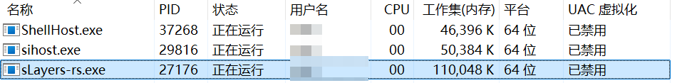
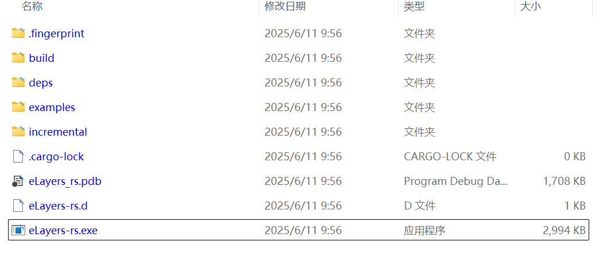
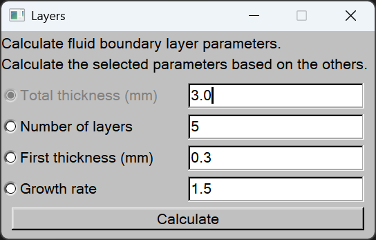
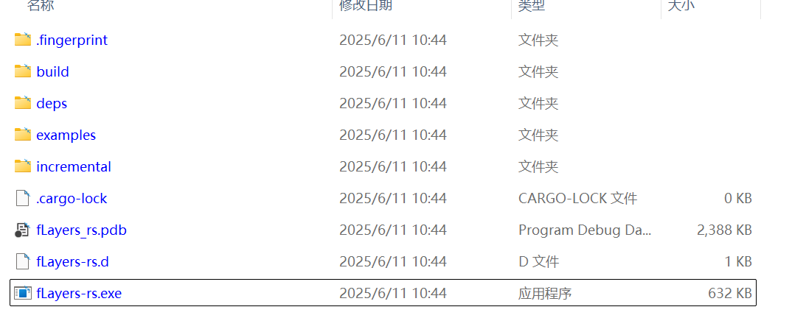

+++
author = "Andrew Moa"
title = "Rust图形界面库初探"
date = "2025-06-11"
description = ""
tags = [
    "rust",
]
categories = [
    "code",
]
series = [""]
aliases = [""]
image = "/images/code-bg.jpg"
+++

最近打算用rust把以前写的代码重构一下，涉及到GUI界面怎么选择的问题。rust正式发布不过十年光景，在GUI开发这方面还不如老牌的C/C++，有诸如wxWidgets、qt、gtk+等众多知名又久经考验的GUI界面库。本文选取几款rust的GUI库，简单实现一个边界层计算器，做个横向对比。

## 1. slint

[slint](https://slint.dev/)近期的宣传不可谓不卖力，号称要打造成下一代gui工具包，看来野心不小。slint通过自定义的声明式语言定义ui界面，在vscode下编程可以通过插件预览，也可以通过官方的[slintpad](https://slintpad.com/)网站预览。

cargo配置文件如下，`slint-build`用于将`.slint`界面文件翻译成`.rs`文件。
```toml
[package]
name = "sLayers-rs"
version = "0.1.0"
edition = "2024"

[dependencies]
slint = "1.8.0"

[build-dependencies]
slint-build = "1.8.0"

[profile.release]
strip = true
opt-level = "z"
lto = true
codegen-units = 1
panic = "abort"

```

ui界面文件`dialog.slint`。slint可以把需要调用的参数定义到ui界面中，并自动隐式生成`set_`和`get_`方法用于在rs文件中设置这些参数的值。同样的，界面中定义的回调函数也会自动隐式生成`on_`方法，用于在rs文件中调用。需要注意的是，在rs中更新了ui界面中的参数，关联的控件并不会自动更新显示，需要手动更新控件显示。
```
import { Button, LineEdit, SpinBox, CheckBox, GridBox, VerticalBox } from "std-widgets.slint";

export component Dialog inherits Window {
    title: "Layers";
    in-out property <string> tt: "3.0";
    in-out property <int> nl: 5;
    in-out property <string> ft: "0.3";
    in-out property <string> gr: "1.5";
    callback calculate_first_thickness();
    callback calculate_num_layers();
    callback calculate_growth_rate();
    callback calculate_total_thickness();

    callback calculate_value();
    VerticalBox {
        Text {
            text: "Calculate fluid boundary layer parameters.\nCalculate the selected parameters based on the others.";
        }

        GridBox {
            Row {
                b_t := CheckBox {
                    text: "Total thickness (mm)";
                    checked: true;
                    enabled: !self.checked;
                    toggled() => {
                        if self.checked {
                            b_n.checked = false;
                            b_f.checked = false;
                            b_g.checked = false;
                        }
                    }
                }

                e_t := LineEdit {
                    text: root.tt;
                    input-type: decimal;
                    read-only: b_t.checked;
                }
            }

            Row {
                b_n := CheckBox {
                    text: "Number of layers";
                    checked: false;
                    enabled: !self.checked;
                    toggled() => {
                        if self.checked {
                            b_t.checked = false;
                            b_f.checked = false;
                            b_g.checked = false;
                        }
                    }
                }

                e_n := SpinBox {
                    value: root.nl;
                    minimum: 1;
                }
            }

            Row {
                b_f := CheckBox {
                    text: "First thickness (mm)";
                    checked: false;
                    enabled: !self.checked;
                    toggled() => {
                        if self.checked {
                            b_n.checked = false;
                            b_t.checked = false;
                            b_g.checked = false;
                        }
                    }
                }

                e_f := LineEdit {
                    text: root.ft;
                    input-type: decimal;
                    read-only: b_f.checked;
                }
            }

            Row {
                b_g := CheckBox {
                    text: "Growth rate";
                    checked: false;
                    enabled: !self.checked;
                    toggled() => {
                        if self.checked {
                            b_n.checked = false;
                            b_f.checked = false;
                            b_t.checked = false;
                        }
                    }
                }

                e_g := LineEdit {
                    text: root.gr;
                    input-type: decimal;
                    read-only: b_g.checked;
                }
            }
        }

        Button {
            text: "Calculate";
            clicked => {
                root.tt = e_t.text;
                root.nl = e_n.value;
                root.ft = e_f.text;
                root.gr = e_g.text;
                if b_t.checked {
                    root.calculate_total_thickness();
                } else if b_n.checked {
                    root.calculate_num_layers();
                } else if b_f.checked {
                    root.calculate_first_thickness();
                } else if b_g.checked {
                    root.calculate_growth_rate();
                }
                e_t.text = root.tt;
                e_g.text = root.gr;
                e_f.text = root.ft;
                e_n.value = root.nl;
            }
        }
    }
}

```

`build.rs`构建脚本调用`slint-build`将`.slint`文件翻译成`.rs`文件。
```rust
fn main() {
    slint_build::compile("ui/dialog.slint").expect("Slint build failed");
}

```

`main.rs`文件，包含边界层计算的算法实现，通过回调函数更新ui界面参数。
```rust
// Prevent console window in addition to Slint window in Windows release builds when, e.g., starting the app via file manager. Ignored on other platforms.
#![cfg_attr(not(debug_assertions), windows_subsystem = "windows")]

use slint::SharedString;
use std::error::Error;

slint::include_modules!();

fn main() -> Result<(), Box<dyn Error>> {
    let ui = Dialog::new()?;

    ui.on_calculate_total_thickness({
        let ui_handle = ui.as_weak();
        move || {
            let ui = ui_handle.unwrap();
            let n = ui.get_nl();
            let f = ui.get_ft().to_string().parse::<f64>().unwrap();
            let g = ui.get_gr().to_string().parse::<f64>().unwrap();
            let mut v = 0.0;
            for i in 0..n {
                v = v + f * g.powi(i);
            }
            ui.set_tt(SharedString::from(v.to_string()));
        }
    });

    ui.on_calculate_first_thickness({
        let ui_handle = ui.as_weak();
        move || {
            let ui = ui_handle.unwrap();
            let n = ui.get_nl();
            let t = ui.get_tt().to_string().parse::<f64>().unwrap();
            let g = ui.get_gr().to_string().parse::<f64>().unwrap();
            let mut fi = t / (n as f64);
            loop {
                let mut v: f64 = 0.0;
                for i in 0..n {
                    v = v + fi * g.powi(i);
                }
                if (v - t).abs() < 1e-6 {
                    break;
                } else {
                    fi = fi - (v - t) * 0.01;
                }
            }
            ui.set_ft(SharedString::from(fi.to_string()));
        }
    });

    ui.on_calculate_growth_rate({
        let ui_handle = ui.as_weak();
        move || {
            let ui = ui_handle.unwrap();
            let n = ui.get_nl();
            let t = ui.get_tt().to_string().parse::<f64>().unwrap();
            let f = ui.get_ft().to_string().parse::<f64>().unwrap();
            let mut gi = f / t;
            let mut v = 0.0;
            while (v - t).abs() > 1e-6 {
                gi = gi - (v - t) * 0.01;
                v = 0.0;
                for i in 0..n {
                    v = v + f * gi.powi(i);
                }
            }
            ui.set_gr(SharedString::from(gi.to_string()));
        }
    });

    ui.on_calculate_num_layers({
        let ui_handle = ui.as_weak();
        move || {
            let ui = ui_handle.unwrap();
            let f: f64 = ui.get_ft().to_string().parse::<f64>().unwrap();
            let t = ui.get_tt().to_string().parse::<f64>().unwrap();
            let g = ui.get_gr().to_string().parse::<f64>().unwrap();
            let mut i = 1;
            let mut v = 0.0;
            loop {
                v = v + f * g.powi(i);
                if v > t {
                    break;
                }
                i = i + 1;
            }
            ui.set_nl(i + 1);
        }
    });

    ui.run()?;

    Ok(())
}

```

最终界面效果如下。根据系统主题颜色不同，显示界面颜色也会有所改变。


生成的release二进制包大小3MB左右。


运行内存在110MB左右。


优点：
 - 通过声明式语言实现ui界面，甚至可以把一些简单的计算逻辑包含在`.slint`文件中。
 - rust原生界面，没有unsafe操作。
 - 支持跨平台跨设备编译，也支持手机和嵌入式开发。

缺点：
 - 不支持多窗口和文件拖放功能，也不支持文件对话框和消息对话框。
 - 不能调用窗口句柄，也没有提供相关操作方法。
 - 不支持事件控制，对窗口和控件的操作缺乏更细粒度的支持。

## 2. egui

[egui](https://crates.io/crates/egui)属于[eframe](https://crates.io/crates/eframe)的一部分，目标是打造简单快速又易用的GUI库。eframe是一个跨平台的应用开发框架，支持Windows、Linus、MacOS及Android等多平台应用开发。egui不光支持本地应用开发，甚至可以将代码编译成wasm在浏览器中运行。

cargo配置文件如下，这里的依赖主要是`eframe`。
```toml
[package]
name = "eLayers-rs"
version = "0.1.0"
edition = "2024"

[dependencies]
eframe = "0.31.1"

[profile.release]
strip = true
opt-level = "z"
lto = true
codegen-units = 1
panic = "abort"

```

`main.rs`文件，ui入口包含在eframe的app结构体中。控件组装和按钮的回调函数都是通过闭包实现的。好处是控件和参数关联实时更新，不需要手动更新控件显示。
```rust
#![cfg_attr(not(debug_assertions), windows_subsystem = "windows")] // hide console window on Windows in release

use eframe::egui;

fn main() -> eframe::Result {
    let options = eframe::NativeOptions {
        viewport: egui::ViewportBuilder::default().with_inner_size([320.0, 240.0]),
        ..Default::default()
    };
    eframe::run_native(
        "Layers",
        options,
        Box::new(|_| {
            // This gives us image support:
            Ok(Box::<LayersApp>::default())
        }),
    )
}

#[derive(PartialEq)]
enum Flags {
    Total,
    First,
    Number,
    Growth,
}

struct LayersApp {
    tt: f64,
    ft: f64,
    gr: f64,
    nl: i32,
    checked: Flags,
}

impl Default for LayersApp {
    fn default() -> Self {
        Self {
            tt: 3.0,
            ft: 0.3,
            gr: 1.5,
            nl: 5,
            checked: Flags::Total,
        }
    }
}

impl eframe::App for LayersApp {
    fn update(&mut self, ctx: &egui::Context, _frame: &mut eframe::Frame) {
        egui::CentralPanel::default().show(ctx, |ui| {
            ui.heading("Layers");
            ui.label("Calculate fluid boundary layer parameters.\nCalculate the selected parameters based on the others.");
            ui.vertical(|ui| {
            egui::Grid::new("")
                .num_columns(2)
                .striped(true)
                .show(ui, |ui| {
                    ui.radio_value(&mut self.checked, Flags::Total, "Total thickness (mm)");
                    ui.add(egui::DragValue::new(&mut self.tt).max_decimals(6).speed(0.1));
                    ui.end_row();
                    ui.radio_value(&mut self.checked, Flags::Number, "Number of layers");
                    ui.add(egui::DragValue::new(&mut self.nl).speed(1));
                    ui.end_row();
                    ui.radio_value(&mut self.checked, Flags::First, "First thickness (mm)");
                    ui.add(egui::DragValue::new(&mut self.ft).max_decimals(6).speed(0.1));
                    ui.end_row();
                    ui.radio_value(&mut self.checked, Flags::Growth, "Growth rate");
                    ui.add(egui::DragValue::new(&mut self.gr).max_decimals(6).speed(0.1));
                    ui.end_row();
                });
            });
            if ui.button("Calculate").clicked() {
                match self.checked {
                    Flags::Total => {
                        let mut v = 0.0;
                        for i in 0..self.nl {
                            v = v + self.ft * self.gr.powi(i);
                        }
                        self.tt = v;
                    }
                    Flags::Number => {
                        let mut i = 1;
                        let mut v = 0.0;
                        loop {
                            v = v + self.ft * self.gr.powi(i);
                            if v > self.tt {
                                break;
                            }
                            i = i + 1;
                        }
                        self.nl = i + 1;
                    }
                    Flags::First => {
                        let mut f = self.tt / (self.nl as f64);
                        loop {
                            let mut v: f64 = 0.0;
                            for i in 0..self.nl {
                                v = v + f * self.gr.powi(i);
                            }
                            if (v - self.tt).abs() < 1e-6 {
                                break;
                            } else {
                                f = f - (v - self.tt) * 0.01;
                            }
                        }
                        self.ft = f;
                    }
                    Flags::Growth => {
                        let mut g = self.ft / self.tt;
                        let mut v = 0.0;
                        while (v - self.tt).abs() > 1e-6 {
                            g = g - (v - self.tt) * 0.01;
                            v = 0.0;
                            for i in 0..self.nl {
                                v = v + self.ft * g.powi(i);
                            }
                        }
                        self.gr = g;
                    }
                }
            }
        });
    }
}

```

界面效果如下，和传统的ui界面相比，egui所呈现的风格更类似于网页前端。这里截图显示的系统是浅色主题，如果系统是深色主题，界面背景色会以深色显示。界面偶尔会出现闪烁的情况，因为控件显示和参数关联，可能和界面刷新频率太高有关。


生成的release二进制包大小不到3MB。


运行内存在110MB左右。


优点：
 - 支持Web和Native应用开发。
 - rust原生，没有unsafe操作。
 - 支持跨平台。

缺点：
 - 没有ui工具，无法快速预览ui界面，没有实现界面和实现方法的分离。
 - 不能调用窗口句柄，也不支持事件控制。
 - 开发中，api还不稳定，随时都有可能出现重大调整。

## 3. fltk-rs

[fltk](https://www.fltk.org/)原本是C++开发的一个轻量级的GUI库，[fltk-rs](https://fltk-rs.github.io/fltk-rs/)是fltk的rust绑定，底层还是通过C++实现的。fltk的界面实现十分简陋，控件组装都是通过较为原始的坐标进行操作，不支持自动排列组合。虽然提供了丰富的控件，但原生主题效果都是类似于[Motif](https://en.wikipedia.org/wiki/Motif_%28software%29)的极简风，和现代ui界面差距甚远。不过好在[fltk-theme](https://crates.io/crates/fltk-theme)提供了丰富的界面主题用于美化，用户可以在此基础上定制自己的主题风格。

cargo配置文件如下。这里fltk通过`"fltk-bundled"`特征下载编译好的lib文件，避免重新编译fltk报错。fltk-rs可以使用fltk提供的界面工具`fluid`进行ui界面的快速开发和预览，rust下通过`fl2rust`将`fluid`生成的`.fl`文件翻译成`.rs`文件。
```toml
[package]
name = "fLayers-rs"
version = "0.1.0"
edition = "2024"

[dependencies]
fltk = { version = "1.5.9", features = ["fltk-bundled"] }

[build-dependencies]
fl2rust = "0.7.0"

[profile.release]
strip = true
opt-level = "z"
lto = true
codegen-units = 1
panic = "abort"

```

ui文件`widget.fl`，通过`fluid`生成的，尽量避免手动编辑。
```
# data file for the Fltk User Interface Designer (fluid)
version 1.0403
header_name {.h}
code_name {.cxx}
class Widget {open
} {
  Function {make_window()} {open
  } {
    Fl_Window window {
      label Layers open
      xywh {668 341 360 200} type Double visible
    } {
      Fl_Group {} {
        label {Calculate fluid boundary layer parameters.} open
        xywh {0 20 360 5} align 5
      } {}
      Fl_Group {} {
        label {Calculate the selected parameters based on the others.} open
        xywh {0 40 360 5} align 5
      } {}
      Fl_Round_Button rb_tt {
        label {Total thickness (mm)}
        xywh {0 50 170 25} down_box ROUND_DOWN_BOX value 1
      }
      Fl_Value_Input vi_tt {
        xywh {180 50 170 25} maximum 1e+06 step 0.1 value 3
      }
      Fl_Round_Button rb_nl {
        label {Number of layers}
        xywh {0 80 170 25} down_box ROUND_DOWN_BOX
      }
      Fl_Value_Input vi_nl {
        xywh {180 80 170 25} maximum 1e+06 step 1 value 5
      }
      Fl_Round_Button rb_ft {
        label {First thickness (mm)}
        xywh {0 110 170 25} down_box ROUND_DOWN_BOX
      }
      Fl_Value_Input vi_ft {
        xywh {180 110 170 25} maximum 1e+06 step 0.1 value 0.3
      }
      Fl_Round_Button rb_gr {
        label {Growth rate}
        xywh {0 140 170 25} down_box ROUND_DOWN_BOX
      }
      Fl_Value_Input vi_gr {selected
        xywh {180 140 170 25} maximum 1e+06 step 0.1 value 1.5
      }
      Fl_Button bn_calc {
        label Calculate
        xywh {10 170 340 22}
      }
    }
  }
}

```

`build.rs`构建脚本，告诉`fl2rust`怎么把ui界面翻译成rs文件。
```rust
// build.rs

fn main() {
    use std::env;
    use std::path::PathBuf;
    println!("cargo:rerun-if-changed=ui/widget.fl");
    let g = fl2rust::Generator::default();
    let out_path = PathBuf::from(env::var("OUT_DIR").unwrap());
    g.in_out("ui/widget.fl", out_path.join("widget.rs").to_str().unwrap())
        .expect("Failed to generate rust from fl file!");
}

```

`main.rs`文件，通过闭包实现控件刷新及按钮功能。
```rust
// src/main.rs
// Prevent console window
#![cfg_attr(not(debug_assertions), windows_subsystem = "windows")]
#![allow(unused_variables)]
#![allow(unused_mut)]
#![allow(unused_imports)]
#![allow(clippy::needless_update)]

use fltk::{prelude::*, *};

include!(concat!(env!("OUT_DIR"), "/widget.rs"));

fn main() {
    let app = app::App::default();
    show_window();
    app.run().unwrap();
}

fn show_window() {
    let mut win = Widget::make_window();
    win.rb_tt.deactivate();

    let mut ui = win.clone();
    win.rb_tt.set_callback(move |_| {
        if ui.rb_tt.value() {
            ui.rb_tt.deactivate();
            ui.rb_ft.activate();
            ui.rb_ft.set_value(false);
            ui.rb_nl.activate();
            ui.rb_nl.set_value(false);
            ui.rb_gr.activate();
            ui.rb_gr.set_value(false);
        }
    });

    let mut ui = win.clone();
    win.rb_ft.set_callback(move |_| {
        if ui.rb_ft.value() {
            ui.rb_ft.deactivate();
            ui.rb_tt.activate();
            ui.rb_tt.set_value(false);
            ui.rb_nl.activate();
            ui.rb_nl.set_value(false);
            ui.rb_gr.activate();
            ui.rb_gr.set_value(false);
        }
    });

    let mut ui = win.clone();
    win.rb_nl.set_callback(move |_| {
        if ui.rb_nl.value() {
            ui.rb_nl.deactivate();
            ui.rb_tt.activate();
            ui.rb_tt.set_value(false);
            ui.rb_ft.activate();
            ui.rb_ft.set_value(false);
            ui.rb_gr.activate();
            ui.rb_gr.set_value(false);
        }
    });

    let mut ui = win.clone();
    win.rb_gr.set_callback(move |_| {
        if ui.rb_gr.value() {
            ui.rb_gr.deactivate();
            ui.rb_tt.activate();
            ui.rb_tt.set_value(false);
            ui.rb_ft.activate();
            ui.rb_ft.set_value(false);
            ui.rb_nl.activate();
            ui.rb_nl.set_value(false);
        }
    });

    win.vi_tt.set_precision(6);
    win.vi_ft.set_precision(6);
    win.vi_nl.set_precision(0);
    win.vi_gr.set_precision(6);

    let mut ui = win.clone();
    win.bn_calc.set_callback(move |_| {
        let tt = ui.vi_tt.value();
        let ft = ui.vi_ft.value();
        let nl = ui.vi_nl.value() as i32;
        let gr = ui.vi_gr.value();
        if ui.rb_tt.value() {
            let mut v = 0.0;
            for i in 0..nl {
                v = v + ft * gr.powi(i);
            }
            ui.vi_tt.set_value(v);
        } else if ui.rb_ft.value() {
            let mut f = tt / (nl as f64);
            loop {
                let mut v: f64 = 0.0;
                for i in 0..nl {
                    v = v + f * gr.powi(i);
                }
                if (v - tt).abs() < 1e-6 {
                    break;
                } else {
                    f = f - (v - tt) * 0.01;
                }
            }
            ui.vi_ft.set_value(f);
        } else if ui.rb_nl.value() {
            let mut i = 1;
            let mut v = 0.0;
            loop {
                v = v + ft * gr.powi(i);
                if v > tt {
                    break;
                }
                i = i + 1;
            }
            ui.vi_nl.set_value(i as f64 + 1.0);
        } else {
            let mut gi = ft / tt;
            let mut v = 0.0;
            while (v - tt).abs() > 1e-6 {
                gi = gi - (v - tt) * 0.01;
                v = 0.0;
                for i in 0..nl {
                    v = v + ft * gi.powi(i);
                }
            }
            ui.vi_gr.set_value(gi);
        }
    })
}

```

界面效果如下。界面配色是固定的，不会随着系统主题变化而改变。


生成的release二进制包只有600多KB大小。


运行内存不到20MB。


优点：
 - api较为成熟，提供了简单的事件控制功能，支持提取窗口句柄。
 - 提供了ui工具，可以快速开发和预览界面，支持界面和实现分离。
 - 支持跨平台。

缺点：
 - 原生界面主题风格太老，不适合现代ui风格。
 - 底层通过C++实现，非rust原生，包含许多unsafe操作。
 - 控件排列组合方式较为原始，没有自动排列控件的组装器。

## 4. 对比和总结

slint和egui基本可以算得上rust原生GUI，两者内存消耗、生成的二进制包大小基本在同一量级，不过两者ui实现方式和界面效果大相径庭。生态上slint要比egui完善，有ui工具，而且支持界面和实现分离，代价是slint的依赖也更多，构建过程耗时也更长。和传统的C++界面库相比，两者共同的问题是太新功能太少，不支持对显示内容进行更细粒度的控制。像窗口句柄和文件拖放等，虽然有很多办法可以绕开ui库的功能限制来实现，但无形中也增加了学习成本，对开发者来说增加了额外的负担。

fltk-rs在内存消耗和二进制发布包大小上优于前两者，但底层依赖于C++，不可避免地会用到很多unsafe操作。fltk的发展历程远早于前两者，因此api功能更加完善，对于刚从C/C++转到rust的开发者来说不失为一个好的选择。正是由于fltk的历史比较久远，原生界面风格比较古老，不太符合现代审美风格。而且fltk的控件排列组合方式较为原始，好在有ui工具加持，开发效率算不上太糟糕。

简而言之：
 - 从C/C++代码转向rust重构，不追求华丽和现代的界面效果，适合采用fltk-rs
 - 对应用窗口和事件控制有更多要求的，对应用程序资源控制敏感的，适合采用fltk-rs
 - 需要兼顾Web和Native应用开发，适合采用egui
 - 完全采用rust从头开发，追求跨平台和嵌入式功能的，适合采用slint

至于其他rust的界面库，像Tauri、gtk-rs、CXX-qt等，暂时想不出有什么特别的优势，只能说有缘再会吧。

---
