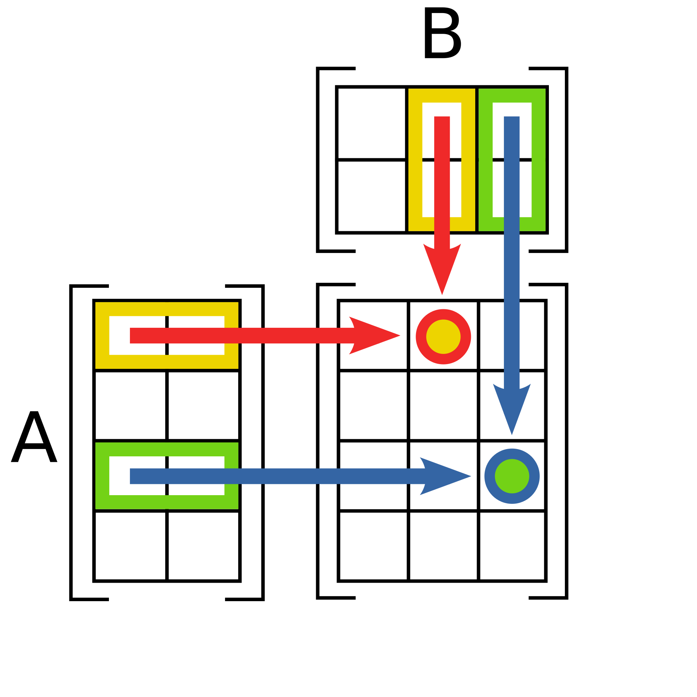
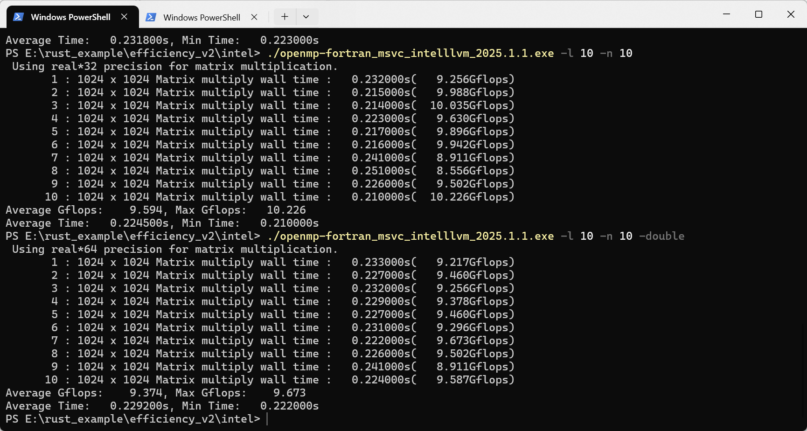
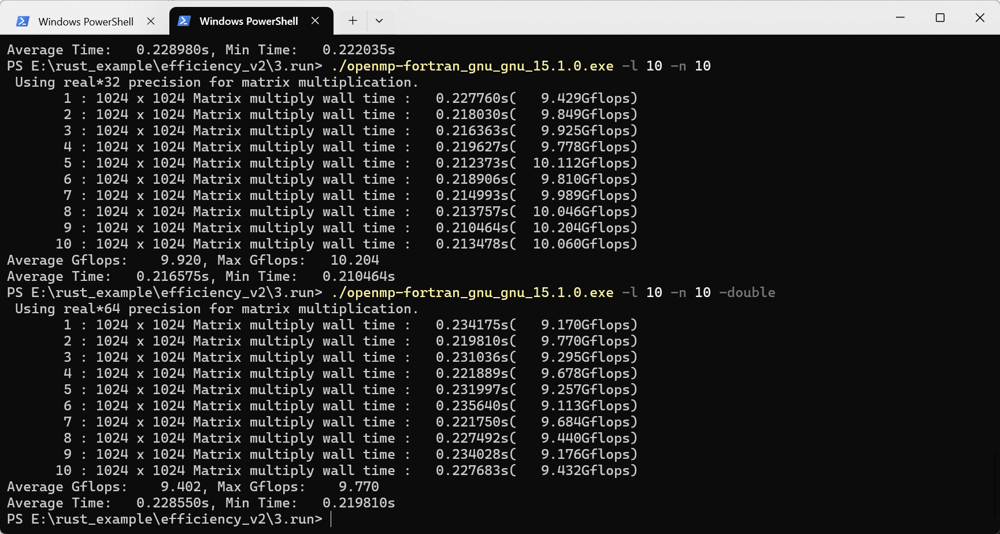

+++
author = "Andrew Moa"
title = "Matrix multiplication operation (I) - using OpenMP to speed up loop calculation"
date = "2025-06-23"
description = ""
tags = [
    "c++",
    "fortran",
    "rust",

]
categories = [
    "code",
]
series = [""]
aliases = [""]
image = "/images/code-bg.jpg"
+++

Speaking of matrices, anyone who studies science and engineering will think of the fear of being dominated by linear algebra classes. Matrix multiplication operations are indispensable for various industrial and scientific research numerical calculations, and are also used in various benchmarking software. The time consumption of matrix multiplication operations is also an important indicator for judging the floating-point operation performance of computers. The purpose of this article is to verify the performance differences of various implementation methods through matrix multiplication operations, and compare the performance differences of different computing platforms to provide a reference for high-performance computing development.

## 1. Matrix multiplication algorithm

Matrix multiplication is also called matrix dot multiplication, which can be represented by the following figure [^1]. It is usually formed by multiplying and accumulating the elements of the corresponding rows of matrix A and the corresponding columns of matrix B to form the values of the corresponding rows and columns of matrix C. The number of columns of matrix A must be equal to the number of rows of matrix B, and the size of matrix C is equal to the number of rows of matrix B × the number of columns of matrix A.


Using C language to represent an M×N matrix dot multiplication with an N×T matrix, it is generally written in the form of 3 layers of nested loops.
```C
...
	for (int i = 0; i < M; i++)
	{
		for (int j = 0; j < T; j++)
		{
			C[i,j] = 0.0;
			for (int k = 0; k < N; k++)
			{
				C[i,j] += A[i,k] * B[k,j];
			}
		}
	}
...
```

It is generally believed that the number of multiplications of an N×N dimensional matrix is ​​N to the power of 3, and the computational complexity is expressed as O(n<sup>3</sup>). There are also some algorithms that convert some of the multiplication operations into additions, reducing the number of multiplication operations. For example, the Strassen algorithm[^2] has a theoretical computational complexity of only O(n<sup>2.807</sup>), which reduces the time spent on multiplying large matrices. Newer algorithms such as the Coppersmith-Winograd method are said to have a computational complexity of only O(n<sup>2.3727</sup>). This difference in algorithms is not discussed in this article.

## 2. Parallelization of nested loops

Modern computer processors are generally multi-core. To fully utilize the processor performance, it is a good option to use parallel libraries such as OpenMP to parallelize the calculation program. It is meaningless to use a single core to solve the nested loop. I will not demonstrate it here. If you are interested, you can remove the parallel library from the following code and compile and calculate it.

### 2.1 C Implementation

The C implementation is very simple, using three layers of nested loops to implement the matrix multiplication algorithm. Here, openmp is used to merge the first two layers of loops and assign them to different threads for calculation [^3], so as to fully utilize the performance of multi-core processors. The following is the sample code of `openmp.c`.
```C
#include <omp.h>

void matrix_multiply_float(int n, float A[], float B[], float C[])
{
#pragma omp parallel for collapse(2) shared(A, B, C)
	for (int i = 0; i < n; i++)
	{
		for (int j = 0; j < n; j++)
		{
			C[i * n + j] = 0;
			for (int k = 0; k < n; k++)
			{
				C[i * n + j] += A[i * n + k] * B[k * n + j];
			}
		}
	}
}

void matrix_multiply_double(int n, double A[], double B[], double C[])
{
#pragma omp parallel for collapse(2) shared(A, B, C)
	for (int i = 0; i < n; i++)
	{
		for (int j = 0; j < n; j++)
		{
			C[i * n + j] = 0;
			for (int k = 0; k < n; k++)
			{
				C[i * n + j] += A[i * n + k] * B[k * n + j];
			}
		}
	}
}

```

In `main.c`, some command line switches are defined, and users can customize matrix size, number of loops, calculation accuracy, etc. A performance parameter, GFLOPs, is defined here to measure the ability to perform floating-point operations per unit time. 1 GFLOPs is equivalent to performing 10<sup>9</sup> floating-point operations in 1 second.
```C
#include <stdio.h>
#include <stdlib.h>
#include <string.h>
#include <time.h>
#include <math.h>

#define MAX(a, b) ((a) > (b) ? (a) : (b))
#define MIN(a, b) ((a) < (b) ? (a) : (b))

extern void matrix_multiply_float(int n, float A[], float B[], float C[]);
extern void matrix_multiply_double(int n, double A[], double B[], double C[]);

// Initialize matrix
void initialize_matrix_float(int n, float matrix[])
{
	srand((unsigned)time(NULL));
	for (int i = 0; i < n; i++)
	{
		for (int j = 0; j < n; j++)
		{
			matrix[i * n + j] = rand() / (float)(RAND_MAX);
		}
	}
}

void initialize_matrix_double(int n, double matrix[])
{
	srand((unsigned)time(NULL));
	for (int i = 0; i < n; i++)
	{
		for (int j = 0; j < n; j++)
		{
			matrix[i * n + j] = rand() / (double)(RAND_MAX);
		}
	}
}

// Execute matrix multiply and print results
int execute_float(int dim, int loop_num, double *ave_gflops, double *max_gflops, double *ave_time, double *min_time)
{
	// Use volatile to prevent compiler optimizations
	volatile float *a, *b, *c;
	struct timespec start_ns, end_ns;
	double cpu_time;

	for (int i = 0; i < loop_num; i++)
	{ 
		a = (float *)malloc(dim * dim * sizeof(float));
		b = (float *)malloc(dim * dim * sizeof(float));
		c = (float *)malloc(dim * dim * sizeof(float));
		if (a == NULL || b == NULL || c == NULL)
		{
			fprintf(stderr, "Memory allocation failed\n");
			return 0;
		}

		initialize_matrix_float(dim, a);
		initialize_matrix_float(dim, b);

		timespec_get(&start_ns, TIME_UTC);
		matrix_multiply_float(dim, a, b, c);
		timespec_get(&end_ns, TIME_UTC);
		cpu_time = (end_ns.tv_sec - start_ns.tv_sec) + (end_ns.tv_nsec - start_ns.tv_nsec) / 1e9;
		double gflops = 1e-9 * dim * dim * dim * 2 / cpu_time;
		printf("%d\t: %d x %d Matrix multiply wall time : %.6fs(%.3fGflops)\n", i + 1, dim, dim, cpu_time, gflops);

		free(a);
		free(b);
		free(c);
		*ave_gflops += gflops;
		*max_gflops = MAX(*max_gflops, gflops);
		*ave_time += cpu_time;
		*min_time = MIN(*min_time, cpu_time);
	}
	*ave_gflops /= loop_num;
	*ave_time /= loop_num;
	return 1;
}

int execute_double(int dim, int loop_num, double *ave_gflops, double *max_gflops, double *ave_time, double *min_time)
{
	// Use volatile to prevent compiler optimizations
	volatile double *a, *b, *c;
	struct timespec start_ns, end_ns;
	double cpu_time;

	for (int i = 0; i < loop_num; i++)
	{ 
		a = (double *)malloc(dim * dim * sizeof(double));
		b = (double *)malloc(dim * dim * sizeof(double));
		c = (double *)malloc(dim * dim * sizeof(double));
		if (a == NULL || b == NULL || c == NULL)
		{
			fprintf(stderr, "Memory allocation failed\n");
			return 0;
		}

		initialize_matrix_double(dim, a);
		initialize_matrix_double(dim, b);

		timespec_get(&start_ns, TIME_UTC);
		matrix_multiply_double(dim, a, b, c);
		timespec_get(&end_ns, TIME_UTC);
		cpu_time = (end_ns.tv_sec - start_ns.tv_sec) + (end_ns.tv_nsec - start_ns.tv_nsec) / 1e9;
		double gflops = 1e-9 * dim * dim * dim * 2 / cpu_time;
		printf("%d\t: %d x %d Matrix multiply wall time : %.6fs(%.3fGflops)\n", i + 1, dim, dim, cpu_time, gflops);

		free(a);
		free(b);
		free(c);
		*ave_gflops += gflops;
		*max_gflops = MAX(*max_gflops, gflops);
		*ave_time += cpu_time;
		*min_time = MIN(*min_time, cpu_time);
	}
	*ave_gflops /= loop_num;
	*ave_time /= loop_num;
	return 1;
}

int main(int argc, char *argv[])
{
	int n = 10;								   // Default matrix size exponent
	int loop_num = 5;						   // Number of iterations for averaging
	double ave_gflops = 0.0, max_gflops = 0.0; // Average and maximum Gflops
	double ave_time = 0.0, min_time = 1e9;	   // Average and minimum time
	int use_double = 0;						   // Default to float precision

	// Help message
	if (argc == 1 || (argc == 2 && (strcmp(argv[1], "-h") == 0 || strcmp(argv[1], "--help") == 0)))
	{
		printf("Usage: %s [-n SIZE] [-l LOOP_NUM] [-float|-double]\n", argv[0]);
		printf("  -n SIZE      Specify matrix size, like 2^SIZE (default: 10)\n");
		printf("  -l LOOP_NUM  Specify number of iterations (default: 5)\n");
		printf("  -float       Use float precision (default)\n");
		printf("  -double      Use double precision\n");
		printf("  -h, --help   Show this help message\n");
		return 0;
	}

	// Parse -n, -l, -float, -double options
	int double_flag = 0, float_flag = 0;
	for (int argi = 1; argi < argc; ++argi)
	{
		if (strcmp(argv[argi], "-n") == 0 && argi + 1 < argc)
		{
			n = atoi(argv[argi + 1]);
			argi++;
		}
		else if (strcmp(argv[argi], "-l") == 0 && argi + 1 < argc)
		{
			loop_num = atoi(argv[argi + 1]);
			argi++;
		}
		else if (strcmp(argv[argi], "-double") == 0)
		{
			double_flag = 1;
		}
		else if (strcmp(argv[argi], "-float") == 0)
		{
			float_flag = 1;
		}
	}
	if (double_flag && float_flag)
	{
		fprintf(stderr, "Error: Cannot specify both -double and -float options.\n");
		return 1;
	}
	use_double = double_flag ? 1 : 0;

	int dim = (int)pow(2, n);

	if (use_double)
	{
		printf("Using double precision for matrix multiplication.\n");
		execute_double(dim, loop_num, &ave_gflops, &max_gflops, &ave_time, &min_time);
	}
	else
	{
		printf("Using float precision for matrix multiplication.\n");
		execute_float(dim, loop_num, &ave_gflops, &max_gflops, &ave_time, &min_time);
	}
	printf("Average Gflops: %.3f, Max Gflops: %.3f\n", ave_gflops, max_gflops);
	printf("Average Time: %.6fs, Min Time: %.6fs\n", ave_time, min_time);

	return 0;
}

```

CMake is used here, and `CMakeLists.txt` tells the compiler how to include the openmp header file and link to it.
```cmake
cmake_minimum_required(VERSION 3.13)
project(openmp LANGUAGES C)
set(CMAKE_C_STANDARD 11)

set(EXECUTE_FILE_NAME ${PROJECT_NAME}_${CMAKE_C_COMPILER_FRONTEND_VARIANT}_${CMAKE_C_COMPILER_ID}_${CMAKE_C_COMPILER_VERSION})
string(TOLOWER ${EXECUTE_FILE_NAME} EXECUTE_FILE_NAME)

find_package(OpenMP REQUIRED)

set(SRC_LIST
    src/main.c
    src/openmp.c
)

add_executable(${EXECUTE_FILE_NAME} ${SRC_LIST})

target_link_libraries(${EXECUTE_FILE_NAME} PRIVATE
    OpenMP::OpenMP_C
)
```

The Release program compiled by clang-cl of vs2022 on Windows platform has the following execution effect:
```powershell
PS D:\example\efficiency_v3\c\openmp\build\Release> ."D:/example/efficiency_v3/c/openmp/build/Release/openmp_msvc_clang_19.1.5.exe" -l 10 -n 10
Using float precision for matrix multiplication.
1       : 1024 x 1024 Matrix multiply wall time : 0.362688s(5.921Gflops)
2       : 1024 x 1024 Matrix multiply wall time : 0.304758s(7.047Gflops)
3       : 1024 x 1024 Matrix multiply wall time : 0.314348s(6.832Gflops)
4       : 1024 x 1024 Matrix multiply wall time : 0.294248s(7.298Gflops)
5       : 1024 x 1024 Matrix multiply wall time : 0.294496s(7.292Gflops)
6       : 1024 x 1024 Matrix multiply wall time : 0.306986s(6.995Gflops)
7       : 1024 x 1024 Matrix multiply wall time : 0.320405s(6.702Gflops)
8       : 1024 x 1024 Matrix multiply wall time : 0.278521s(7.710Gflops)
9       : 1024 x 1024 Matrix multiply wall time : 0.294080s(7.302Gflops)
10      : 1024 x 1024 Matrix multiply wall time : 0.338626s(6.342Gflops)
Average Gflops: 6.944, Max Gflops: 7.710
Average Time: 0.310916s, Min Time: 0.278521s
PS D:\example\efficiency_v3\c\openmp\build\Release> ."D:/example/efficiency_v3/c/openmp/build/Release/openmp_msvc_clang_19.1.5.exe" -l 10 -n 10 -double
Using double precision for matrix multiplication.
1       : 1024 x 1024 Matrix multiply wall time : 0.353909s(6.068Gflops)
2       : 1024 x 1024 Matrix multiply wall time : 0.319001s(6.732Gflops)
3       : 1024 x 1024 Matrix multiply wall time : 0.329514s(6.517Gflops)
4       : 1024 x 1024 Matrix multiply wall time : 0.381114s(5.635Gflops)
5       : 1024 x 1024 Matrix multiply wall time : 0.349447s(6.145Gflops)
6       : 1024 x 1024 Matrix multiply wall time : 0.370087s(5.803Gflops)
7       : 1024 x 1024 Matrix multiply wall time : 0.349626s(6.142Gflops)
8       : 1024 x 1024 Matrix multiply wall time : 0.370023s(5.804Gflops)
9       : 1024 x 1024 Matrix multiply wall time : 0.364005s(5.900Gflops)
10      : 1024 x 1024 Matrix multiply wall time : 0.344441s(6.235Gflops)
Average Gflops: 6.098, Max Gflops: 6.732
Average Time: 0.353117s, Min Time: 0.319001s
```

Compiled using MSYS2's clang64 toolchain, the Release program execution results are as follows:
```powershell
PS D:\example\efficiency_v3\c\openmp\build> ."D:/example/efficiency_v3/c/openmp/build/openmp_gnu_clang_20.1.7.exe" -l 10 -n 10
Using float precision for matrix multiplication.
1       : 1024 x 1024 Matrix multiply wall time : 0.344437s(6.235Gflops)
2       : 1024 x 1024 Matrix multiply wall time : 0.327010s(6.567Gflops)
3       : 1024 x 1024 Matrix multiply wall time : 0.367141s(5.849Gflops)
4       : 1024 x 1024 Matrix multiply wall time : 0.358603s(5.988Gflops)
5       : 1024 x 1024 Matrix multiply wall time : 0.362182s(5.929Gflops)
6       : 1024 x 1024 Matrix multiply wall time : 0.338947s(6.336Gflops)
7       : 1024 x 1024 Matrix multiply wall time : 0.334758s(6.415Gflops)
8       : 1024 x 1024 Matrix multiply wall time : 0.331219s(6.484Gflops)
9       : 1024 x 1024 Matrix multiply wall time : 0.343316s(6.255Gflops)
10      : 1024 x 1024 Matrix multiply wall time : 0.324451s(6.619Gflops)
Average Gflops: 6.268, Max Gflops: 6.619
Average Time: 0.343206s, Min Time: 0.324451s
PS D:\example\efficiency_v3\c\openmp\build> ."D:/example/efficiency_v3/c/openmp/build/openmp_gnu_clang_20.1.7.exe" -l 10 -n 10 -double
Using double precision for matrix multiplication.
1       : 1024 x 1024 Matrix multiply wall time : 0.447118s(4.803Gflops)
2       : 1024 x 1024 Matrix multiply wall time : 0.423630s(5.069Gflops)
3       : 1024 x 1024 Matrix multiply wall time : 0.365229s(5.880Gflops)
4       : 1024 x 1024 Matrix multiply wall time : 0.355163s(6.046Gflops)
5       : 1024 x 1024 Matrix multiply wall time : 0.443296s(4.844Gflops)
6       : 1024 x 1024 Matrix multiply wall time : 0.310319s(6.920Gflops)
7       : 1024 x 1024 Matrix multiply wall time : 0.366405s(5.861Gflops)
8       : 1024 x 1024 Matrix multiply wall time : 0.369704s(5.809Gflops)
9       : 1024 x 1024 Matrix multiply wall time : 0.382898s(5.608Gflops)
10      : 1024 x 1024 Matrix multiply wall time : 0.367266s(5.847Gflops)
Average Gflops: 5.669, Max Gflops: 6.920
Average Time: 0.383103s, Min Time: 0.310319s
```

Switch to MSYS2's ucrt64 toolchain to compile, and the Release program execution effect is as follows:
```powershell
PS D:\example\efficiency_v3\c\openmp\build> ."D:/example/efficiency_v3/c/openmp/build/openmp_gnu_gnu_15.1.0.exe" -l 10 -n 10        
Using float precision for matrix multiplication.
1       : 1024 x 1024 Matrix multiply wall time : 0.308967s(6.951Gflops)
2       : 1024 x 1024 Matrix multiply wall time : 0.267709s(8.022Gflops)
3       : 1024 x 1024 Matrix multiply wall time : 0.278587s(7.708Gflops)
4       : 1024 x 1024 Matrix multiply wall time : 0.263047s(8.164Gflops)
5       : 1024 x 1024 Matrix multiply wall time : 0.262595s(8.178Gflops)
6       : 1024 x 1024 Matrix multiply wall time : 0.264196s(8.128Gflops)
7       : 1024 x 1024 Matrix multiply wall time : 0.273148s(7.862Gflops)
8       : 1024 x 1024 Matrix multiply wall time : 0.262910s(8.168Gflops)
9       : 1024 x 1024 Matrix multiply wall time : 0.277290s(7.745Gflops)
10      : 1024 x 1024 Matrix multiply wall time : 0.274961s(7.810Gflops)
Average Gflops: 7.874, Max Gflops: 8.178
Average Time: 0.273341s, Min Time: 0.262595s
PS D:\example\efficiency_v3\c\openmp\build> ."D:/example/efficiency_v3/c/openmp/build/openmp_gnu_gnu_15.1.0.exe" -l 10 -n 10 -double
Using double precision for matrix multiplication.
1       : 1024 x 1024 Matrix multiply wall time : 0.314685s(6.824Gflops)
2       : 1024 x 1024 Matrix multiply wall time : 0.290665s(7.388Gflops)
3       : 1024 x 1024 Matrix multiply wall time : 0.304162s(7.060Gflops)
4       : 1024 x 1024 Matrix multiply wall time : 0.315041s(6.817Gflops)
5       : 1024 x 1024 Matrix multiply wall time : 0.306290s(7.011Gflops)
6       : 1024 x 1024 Matrix multiply wall time : 0.356495s(6.024Gflops)
7       : 1024 x 1024 Matrix multiply wall time : 0.310081s(6.926Gflops)
8       : 1024 x 1024 Matrix multiply wall time : 0.301022s(7.134Gflops)
9       : 1024 x 1024 Matrix multiply wall time : 0.317229s(6.769Gflops)
10      : 1024 x 1024 Matrix multiply wall time : 0.307106s(6.993Gflops)
Average Gflops: 6.895, Max Gflops: 7.388
Average Time: 0.312278s, Min Time: 0.290665s
```

The performance of the gcc compiler on the Windows platform is slightly better. The computing performance of the three is basically at the same level, and the difference is small and can be ignored.

The above are all calculated results on the AMD AI 9 365w processor, and all cores and hyperthreads are basically fully utilized during the calculation process. The calculation results shown in this article, unless otherwise specified, are the results output by running on this processor.

### 2.2 Fortran Implementation

Fortran has a built-in matrix operation function matmul. We will not consider the algorithm optimization of built-in functions here. The three-layer loop nesting implemented in C is implemented in Fortran, and then accelerated by openmp.

The function implemented by `main.f90` is the same as that of `main.c` implemented in C.
```fortran
program main
    implicit none
    external matrix_multiply_float, matrix_multiply_double
    integer :: n = 10         
    integer :: loop_num = 5   
    real :: ave_gflops = 0.0, max_gflops = 0.0 
    real :: ave_time = 0.0, min_time = 1e9    
    logical :: use_double = .false.  

    integer :: argi, i, dim
    character(len=100) :: arg

    logical :: double_set = .false., float_set = .false.  

    if (command_argument_count() == 0) then
        call print_help()
        stop
    end if

    argi = 1
    do while (argi <= command_argument_count())
        call get_command_argument(argi, arg)
        if (trim(arg) == '-n' .and. argi + 1 <= command_argument_count()) then
            argi = argi + 1
            call get_command_argument(argi, arg)
            read(arg, *) n
        else if (trim(arg) == '-l' .and. argi + 1 <= command_argument_count()) then
            argi = argi + 1
            call get_command_argument(argi, arg)
            read(arg, *) loop_num
        else if (trim(arg) == '-double') then
            double_set = .true.
            use_double = .true.
        else if (trim(arg) == '-float') then
            float_set = .true.
            use_double = .false.
        else if (trim(arg) == '-h' .or. trim(arg) == '--help') then
            call print_help()
            stop
        end if

        if (double_set .and. float_set) then
            print *, "Error: Cannot specify both -double and -float options."
            stop
        end if

        argi = argi + 1
    end do

    dim = 2**n

    if (use_double) then
        call perform_double(dim, loop_num, ave_gflops, max_gflops, ave_time, min_time)
    else
        call perform_float(dim, loop_num, ave_gflops, max_gflops, ave_time, min_time)
    end if

    ave_gflops = ave_gflops / loop_num
    ave_time = ave_time / loop_num
    print '(A, F8.3, A, F8.3)', 'Average Gflops: ', ave_gflops, ', Max Gflops: ', max_gflops
    print '(A, F10.6, A, F10.6, A)', 'Average Time: ', ave_time, 's, Min Time: ', min_time, 's'

contains

    subroutine print_help()
        print *, 'Usage: program_name [-n SIZE] [-l LOOP_NUM] [-float|-double]'
        print *, '  -n SIZE      Specify matrix size, like 2^SIZE (default: 10)'
        print *, '  -l LOOP_NUM  Specify number of iterations (default: 5)'
        print *, '  -float       Use real*32 precision (default)'
        print *, '  -double      Use real*64 precision'
        print *, '  -h, --help   Show this help message'
    end subroutine print_help

    subroutine initialize_matrix_float(n, matrix)
        integer, intent(in) :: n
        real, intent(out) :: matrix(n, n)  
        integer :: i, j
        real :: rand

        call random_seed()
        do i = 1, n
            do j = 1, n
                call random_number(rand)  
                matrix(i, j) = rand
            end do
        end do
    end subroutine initialize_matrix_float

    subroutine initialize_matrix_double(n, matrix)
        integer, intent(in) :: n
        real*8, intent(out) :: matrix(n, n)  
        integer :: i, j
        real*8 :: rand

        call random_seed()
        do i = 1, n
            do j = 1, n
                call random_number(rand)  
                matrix(i, j) = rand
            end do
        end do
    end subroutine initialize_matrix_double

    subroutine perform_double(dim, loop_num, ave_gflops, max_gflops, ave_time, min_time)
        integer, intent(in) :: dim, loop_num
        real, intent(inout) :: ave_gflops, max_gflops, ave_time
        real, intent(inout) :: min_time
        real*8, allocatable :: a_double(:, :), b_double(:, :), c_double(:, :) 
        real :: gflops
        integer*8 :: i, start_count(1), end_count(1), count_rate(1)
        real :: elapsed_time

        print *, 'Using real*64 precision for matrix multiplication.'
        allocate(a_double(dim, dim), b_double(dim, dim), c_double(dim, dim)) 
        do i = 1, loop_num
            call initialize_matrix_double(dim, a_double)
            call initialize_matrix_double(dim, b_double)

            call system_clock(count=start_count(1), count_rate=count_rate(1))
            call matrix_multiply_double(dim, a_double, b_double, c_double)
            call system_clock(count=end_count(1))

            elapsed_time = real(end_count(1) - start_count(1)) / real(count_rate(1))
            gflops = 1e-9 * dim * dim * dim * 2 / elapsed_time
            print '(I8, A, I0, A, I0, A, F10.6, A, F8.3, A)', i, ' : ', dim, ' x ', dim, ' Matrix multiply wall time : ', elapsed_time, 's(', gflops, 'Gflops)'

            ave_gflops = ave_gflops + gflops
            max_gflops = max(max_gflops, gflops)
            ave_time = ave_time + elapsed_time
            min_time = min(min_time, elapsed_time)
        end do
        deallocate(a_double, b_double, c_double)
    end subroutine perform_double

    subroutine perform_float(dim, loop_num, ave_gflops, max_gflops, ave_time, min_time)
        integer, intent(in) :: dim, loop_num
        real, intent(inout) :: ave_gflops, max_gflops, ave_time
        real, intent(inout) :: min_time
        real*4, allocatable :: a_float(:, :), b_float(:, :), c_float(:, :)  
        real :: gflops
        integer*8 :: i, start_count(1), end_count(1), count_rate(1)
        real :: elapsed_time

        print *, 'Using real*32 precision for matrix multiplication.'
        allocate(a_float(dim, dim), b_float(dim, dim), c_float(dim, dim))  
        do i = 1, loop_num
            call initialize_matrix_float(dim, a_float)
            call initialize_matrix_float(dim, b_float)

            call system_clock(count=start_count(1), count_rate=count_rate(1))
            call matrix_multiply_float(dim, a_float, b_float, c_float)
            call system_clock(count=end_count(1))

            elapsed_time = real(end_count(1) - start_count(1)) / real(count_rate(1))
            gflops = 1e-9 * dim * dim * dim * 2 / elapsed_time
            print '(I8, A, I0, A, I0, A, F10.6, A, F8.3, A)', i, ' : ', dim, ' x ', dim, ' Matrix multiply wall time : ', elapsed_time, 's(', gflops, 'Gflops)'

            ave_gflops = ave_gflops + gflops
            max_gflops = max(max_gflops, gflops)
            ave_time = ave_time + elapsed_time
            min_time = min(min_time, elapsed_time)
        end do
        deallocate(a_float, b_float, c_float)
    end subroutine perform_float

end program main

```

`omp.f90` is a concrete implementation of the three-layer loop algorithm, and also uses OpenMP to expand the first two layers of loops to achieve parallelization.
```fortran
subroutine matrix_multiply_float(n, a, b, c)
   implicit none
   integer, intent(in) :: n
   real*4, intent(in) :: a(n, n), b(n, n)
   real*4, intent(out) :: c(n, n)
   integer :: i, j, k
   c = 0.0
   !$omp parallel do private(i, j, k) shared(a, b, c, n) collapse(2)
   do i = 1, n
      do j = 1, n
         do k = 1, n
            c(i, j) = c(i, j) + a(i, k) * b(k, j)
         end do
      end do
   end do
   !$omp end parallel do
end subroutine matrix_multiply_float

subroutine matrix_multiply_double(n, a, b, c)
   implicit none
   integer, intent(in) :: n
   real*8, intent(in) :: a(n, n), b(n, n)
   real*8, intent(out) :: c(n, n)
   integer :: i, j, k
   c = 0.0d0
   !$omp parallel do private(i, j, k) shared(a, b, c, n) collapse(2)
   do i = 1, n
      do j = 1, n
         do k = 1, n
            c(i, j) = c(i, j) + a(i, k) * b(k, j)
         end do
      end do
   end do
   !$omp end parallel do
end subroutine matrix_multiply_double
```

The contents of the `CMakeLists.txt` file are shown below:
```cmake
cmake_minimum_required(VERSION 3.13)
project(openmp-fortran LANGUAGES Fortran)
set(CMAKE_Fortran_STANDARD 2008)

set(EXECUTE_FILE_NAME ${PROJECT_NAME}_${CMAKE_Fortran_COMPILER_FRONTEND_VARIANT}_${CMAKE_Fortran_COMPILER_ID}_${CMAKE_Fortran_COMPILER_VERSION})
string(TOLOWER ${EXECUTE_FILE_NAME} EXECUTE_FILE_NAME)

# Enable OpenMP
find_package(OpenMP REQUIRED)

set(SRC_LIST
    src/main.f90
    src/omp.f90
)
add_executable(${EXECUTE_FILE_NAME} ${SRC_LIST})

target_link_libraries(${EXECUTE_FILE_NAME} PRIVATE
    OpenMP::OpenMP_Fortran
)
```

Compile using Intel oneAPI ifx, and the Release program execution effect is as follows:
```powershell
PS D:\example\efficiency_v3\fortran\openmp-fortran\build\Release> ."D:/example/efficiency_v3/fortran/openmp-fortran/build/Release/openmp-fortran_msvc_intelllvm_2025.1.1.exe" -l 10 -n 10
 Using real*32 precision for matrix multiplication.
       1 : 1024 x 1024 Matrix multiply wall time :   0.299000s(   7.182Gflops)
       2 : 1024 x 1024 Matrix multiply wall time :   0.284000s(   7.562Gflops)
       3 : 1024 x 1024 Matrix multiply wall time :   0.337000s(   6.372Gflops)
       4 : 1024 x 1024 Matrix multiply wall time :   0.310000s(   6.927Gflops)
       5 : 1024 x 1024 Matrix multiply wall time :   0.321000s(   6.690Gflops)
       6 : 1024 x 1024 Matrix multiply wall time :   0.358000s(   5.999Gflops)
       7 : 1024 x 1024 Matrix multiply wall time :   0.290000s(   7.405Gflops)
       8 : 1024 x 1024 Matrix multiply wall time :   0.312000s(   6.883Gflops)
       9 : 1024 x 1024 Matrix multiply wall time :   0.301000s(   7.134Gflops)
      10 : 1024 x 1024 Matrix multiply wall time :   0.290000s(   7.405Gflops)
Average Gflops:    6.956, Max Gflops:    7.562
Average Time:   0.310200s, Min Time:   0.284000s
PS D:\example\efficiency_v3\fortran\openmp-fortran\build\Release> ."D:/example/efficiency_v3/fortran/openmp-fortran/build/Release/openmp-fortran_msvc_intelllvm_2025.1.1.exe" -l 10 -n 10 -double
 Using real*64 precision for matrix multiplication.
       1 : 1024 x 1024 Matrix multiply wall time :   0.391000s(   5.492Gflops)
       2 : 1024 x 1024 Matrix multiply wall time :   0.362000s(   5.932Gflops)
       3 : 1024 x 1024 Matrix multiply wall time :   0.334000s(   6.430Gflops)
       4 : 1024 x 1024 Matrix multiply wall time :   0.393000s(   5.464Gflops)
       5 : 1024 x 1024 Matrix multiply wall time :   0.331000s(   6.488Gflops)
       6 : 1024 x 1024 Matrix multiply wall time :   0.357000s(   6.015Gflops)
       7 : 1024 x 1024 Matrix multiply wall time :   0.366000s(   5.867Gflops)
       8 : 1024 x 1024 Matrix multiply wall time :   0.345000s(   6.225Gflops)
       9 : 1024 x 1024 Matrix multiply wall time :   0.341000s(   6.298Gflops)
      10 : 1024 x 1024 Matrix multiply wall time :   0.359000s(   5.982Gflops)
Average Gflops:    6.019, Max Gflops:    6.488
Average Time:   0.357900s, Min Time:   0.331000s
```

Compiled using MSYS2's ucrt64 toolchain, the Release program execution results are as follows:
```powershell
PS D:\example\efficiency_v3\fortran\openmp-fortran\build> ."D:/example/efficiency_v3/fortran/openmp-fortran/build/openmp-fortran_gnu_gnu_15.1.0.exe" -l 10 -n 10        
 Using real*32 precision for matrix multiplication.
       1 : 1024 x 1024 Matrix multiply wall time :   0.224624s(   9.560Gflops)
       2 : 1024 x 1024 Matrix multiply wall time :   0.224959s(   9.546Gflops)
       3 : 1024 x 1024 Matrix multiply wall time :   0.228968s(   9.379Gflops)
       4 : 1024 x 1024 Matrix multiply wall time :   0.238853s(   8.991Gflops)
       5 : 1024 x 1024 Matrix multiply wall time :   0.216879s(   9.902Gflops)
       6 : 1024 x 1024 Matrix multiply wall time :   0.212407s(  10.110Gflops)
       7 : 1024 x 1024 Matrix multiply wall time :   0.233809s(   9.185Gflops)
       8 : 1024 x 1024 Matrix multiply wall time :   0.240426s(   8.932Gflops)
       9 : 1024 x 1024 Matrix multiply wall time :   0.241291s(   8.900Gflops)
      10 : 1024 x 1024 Matrix multiply wall time :   0.222414s(   9.655Gflops)
Average Gflops:    9.416, Max Gflops:   10.110
Average Time:   0.228463s, Min Time:   0.212407s
PS D:\example\efficiency_v3\fortran\openmp-fortran\build> ."D:/example/efficiency_v3/fortran/openmp-fortran/build/openmp-fortran_gnu_gnu_15.1.0.exe" -l 10 -n 10 -double
 Using real*64 precision for matrix multiplication.
       1 : 1024 x 1024 Matrix multiply wall time :   0.258885s(   8.295Gflops)
       2 : 1024 x 1024 Matrix multiply wall time :   0.299699s(   7.165Gflops)
       3 : 1024 x 1024 Matrix multiply wall time :   0.298025s(   7.206Gflops)
       4 : 1024 x 1024 Matrix multiply wall time :   0.291631s(   7.364Gflops)
       5 : 1024 x 1024 Matrix multiply wall time :   0.271050s(   7.923Gflops)
       6 : 1024 x 1024 Matrix multiply wall time :   0.330989s(   6.488Gflops)
       7 : 1024 x 1024 Matrix multiply wall time :   0.278846s(   7.701Gflops)
       8 : 1024 x 1024 Matrix multiply wall time :   0.281121s(   7.639Gflops)
       9 : 1024 x 1024 Matrix multiply wall time :   0.288999s(   7.431Gflops)
      10 : 1024 x 1024 Matrix multiply wall time :   0.318669s(   6.739Gflops)
Average Gflops:    7.395, Max Gflops:    8.295
Average Time:   0.291792s, Min Time:   0.258885s
```

The result of running on AMD processor shows that Intel ifx version is slower than gcc version, and this is also true for multiple attempts.

The generated program is copied to Intel workstation (Xeon Gold 6226R) and the running time of both versions is basically the same. It is doubtful whether Intel compiler has made some negative optimization for AMD platform.



### 2.3 Rust implementation

There is no native implementation of openmp in rust, but there is a parallel library rayon with similar functions. Here, rust+rayon is used to implement a three-layer loop nesting algorithm.

`main.rs` implements the same function as `main.c`.
```rust
mod matmul;
use matmul::{matrix_multiply_double, matrix_multiply_float};

use clap::{Arg, ArgAction, Command};
use rand::prelude::*;
use std::time::Instant;

fn initialize_matrix_float(n: usize, matrix: &mut [f32]) {
    let mut rng = rand::rng();
    for i in 0..n * n {
        matrix[i] = rng.random::<f32>();
    }
}

fn initialize_matrix_double(n: usize, matrix: &mut [f64]) {
    let mut rng = rand::rng();
    for i in 0..n * n {
        matrix[i] = rng.random::<f64>();
    }
}

fn execute_float(dim: usize, loop_num: usize) -> (f64, f64, f64, f64) {
    let mut ave_gflops: f64 = 0.0;
    let mut max_gflops: f64 = 0.0;
    let mut ave_time: f64 = 0.0;
    let mut min_time = f64::MAX;

    for i in 0..loop_num {
        let mut a = vec![0.0; dim * dim];
        let mut b = vec![0.0; dim * dim];
        let mut c = vec![0.0; dim * dim];

        initialize_matrix_float(dim, &mut a);
        initialize_matrix_float(dim, &mut b);

        let start = Instant::now();
        matrix_multiply_float(dim, &a, &b, &mut c);
        let cpu_time = start.elapsed().as_secs_f64();

        let gflops = 2.0 * (dim * dim * dim) as f64 / cpu_time / 1e9;
        println!(
            "{}\t: {} x {} Matrix multiply wall time : {:.6}s({:.3}Gflops)",
            i + 1,
            dim,
            dim,
            cpu_time,
            gflops
        );

        ave_gflops += gflops;
        max_gflops = max_gflops.max(gflops);
        ave_time += cpu_time;
        min_time = min_time.min(cpu_time);
    }

    ave_gflops /= loop_num as f64;
    ave_time /= loop_num as f64;
    (ave_gflops, max_gflops, ave_time, min_time)
}

fn execute_double(dim: usize, loop_num: usize) -> (f64, f64, f64, f64) {
    let mut ave_gflops: f64 = 0.0;
    let mut max_gflops: f64 = 0.0;
    let mut ave_time: f64 = 0.0;
    let mut min_time = f64::MAX;

    for i in 0..loop_num {
        let mut a = vec![0.0; dim * dim];
        let mut b = vec![0.0; dim * dim];
        let mut c = vec![0.0; dim * dim];

        initialize_matrix_double(dim, &mut a);
        initialize_matrix_double(dim, &mut b);

        let start = Instant::now();
        matrix_multiply_double(dim, &a, &b, &mut c);
        let cpu_time = start.elapsed().as_secs_f64();

        let gflops = 2.0 * (dim * dim * dim) as f64 / cpu_time / 1e9;
        println!(
            "{}\t: {} x {} Matrix multiply wall time : {:.6}s({:.3}Gflops)",
            i + 1,
            dim,
            dim,
            cpu_time,
            gflops
        );

        ave_gflops += gflops;
        max_gflops = max_gflops.max(gflops);
        ave_time += cpu_time;
        min_time = min_time.min(cpu_time);
    }

    ave_gflops /= loop_num as f64;
    ave_time /= loop_num as f64;
    (ave_gflops, max_gflops, ave_time, min_time)
}

fn main() {
    let matches = Command::new("rayon-rs")
        .version("0.1.0")
        .author("AndrewMoa")
        .about("Matrix multiplication benchmark")
        .arg(
            Arg::new("size")
                .short('n')
                .long("size")
                .help("Matrix size exponent (size = 2^n)")
                .default_value("10"),
        )
        .arg(
            Arg::new("loops")
                .short('l')
                .long("loops")
                .help("Number of iterations")
                .default_value("5"),
        )
        .arg(
            Arg::new("f64")
                .short('d')
                .long("f64")
                .help("Use float64 precision")
                .action(ArgAction::SetTrue),
        )
        .arg(
            Arg::new("f32")
                .short('f')
                .long("f32")
                .help("Use float32 precision (default)")
                .action(ArgAction::SetTrue),
        )
        .get_matches();

    let n: usize = matches
        .get_one::<String>("size")
        .unwrap()
        .parse()
        .expect("Invalid size exponent");
    let loop_num: usize = matches
        .get_one::<String>("loops")
        .unwrap()
        .parse()
        .expect("Invalid loop count");
    let use_double = matches.get_flag("f64");
    let use_float = matches.get_flag("f32");

    if use_double && use_float {
        eprintln!("Error: Cannot specify both --f64 and --f32");
        std::process::exit(1);
    }

    let dim = 2usize.pow(n as u32);

    if use_double {
        println!("Using f64 precision for matrix multiplication.");
        let (ave_gflops, max_gflops, ave_time, min_time) = execute_double(dim, loop_num);
        println!(
            "Average Gflops: {:.3}, Max Gflops: {:.3}",
            ave_gflops, max_gflops
        );
        println!("Average Time: {:.6}s, Min Time: {:.6}s", ave_time, min_time);
    } else {
        println!("Using f32 precision for matrix multiplication.");
        let (ave_gflops, max_gflops, ave_time, min_time) = execute_float(dim, loop_num);
        println!(
            "Average Gflops: {:.3}, Max Gflops: {:.3}",
            ave_gflops, max_gflops
        );
        println!("Average Time: {:.6}s, Min Time: {:.6}s", ave_time, min_time);
    }
}
```

The specific algorithm is implemented in the `matmul.rs` file. Here, a two-layer loop is used instead of a three-layer loop, and then the outermost loop is expanded through rayon to achieve parallelization. The actual effect is similar to openmp.
```rust
use rayon::prelude::*;

pub fn matrix_multiply_float(n: usize, a: &[f32], b: &[f32], c: &mut [f32]) {
    c.par_iter_mut().enumerate().for_each(|(idx, c_ij)| {
        let i = idx / n;
        let j = idx % n;
        *c_ij = 0.0;
        for k in 0..n {
            *c_ij += a[i * n + k] * b[k * n + j];
        }
    });
}

pub fn matrix_multiply_double(n: usize, a: &[f64], b: &[f64], c: &mut [f64]) {
    c.par_iter_mut().enumerate().for_each(|(idx, c_ij)| {
        let i = idx / n;
        let j = idx % n;
        *c_ij = 0.0;
        for k in 0..n {
            *c_ij += a[i * n + k] * b[k * n + j];
        }
    });
}

```

The configuration file `Cargo.toml` file is as follows:
```toml
[package]
name = "rayon-rs"
version = "0.1.0"
edition = "2024"

[dependencies]
clap = { version = "4.5.40", features = ["derive"] }
rand = "0.9.1"
rayon = "1.10.0"

```

Compiled using the msvc toolchain on the Windows platform, the Release program has the following effects:
```powershell
PS D:\example\efficiency_v3\rust\rayon-rs> cargo run --release -- -l 10 -n 10   
    Finished `release` profile [optimized] target(s) in 0.04s
     Running `target\release\rayon-rs.exe -l 10 -n 10`
Using f32 precision for matrix multiplication.
1       : 1024 x 1024 Matrix multiply wall time : 0.183645s(11.694Gflops)
2       : 1024 x 1024 Matrix multiply wall time : 0.189942s(11.306Gflops)
3       : 1024 x 1024 Matrix multiply wall time : 0.186613s(11.508Gflops)
4       : 1024 x 1024 Matrix multiply wall time : 0.190823s(11.254Gflops)
5       : 1024 x 1024 Matrix multiply wall time : 0.197830s(10.855Gflops)
6       : 1024 x 1024 Matrix multiply wall time : 0.194282s(11.053Gflops)
7       : 1024 x 1024 Matrix multiply wall time : 0.199380s(10.771Gflops)
8       : 1024 x 1024 Matrix multiply wall time : 0.198576s(10.814Gflops)
9       : 1024 x 1024 Matrix multiply wall time : 0.190201s(11.291Gflops)
10      : 1024 x 1024 Matrix multiply wall time : 0.195518s(10.984Gflops)
Average Gflops: 11.153, Max Gflops: 11.694
Average Time: 0.192681s, Min Time: 0.183645s
PS D:\example\efficiency_v3\rust\rayon-rs> cargo run --release -- -l 10 -n 10 -d
    Finished `release` profile [optimized] target(s) in 0.04s
     Running `target\release\rayon-rs.exe -l 10 -n 10 -d`
Using f64 precision for matrix multiplication.
1       : 1024 x 1024 Matrix multiply wall time : 0.188721s(11.379Gflops)
2       : 1024 x 1024 Matrix multiply wall time : 0.186753s(11.499Gflops)
3       : 1024 x 1024 Matrix multiply wall time : 0.206919s(10.378Gflops)
4       : 1024 x 1024 Matrix multiply wall time : 0.197388s(10.879Gflops)
5       : 1024 x 1024 Matrix multiply wall time : 0.196899s(10.907Gflops)
6       : 1024 x 1024 Matrix multiply wall time : 0.206537s(10.398Gflops)
7       : 1024 x 1024 Matrix multiply wall time : 0.200781s(10.696Gflops)
8       : 1024 x 1024 Matrix multiply wall time : 0.191448s(11.217Gflops)
9       : 1024 x 1024 Matrix multiply wall time : 0.192770s(11.140Gflops)
10      : 1024 x 1024 Matrix multiply wall time : 0.178019s(12.063Gflops)
Average Gflops: 11.056, Max Gflops: 12.063
Average Time: 0.194624s, Min Time: 0.178019s
```

## 3. 3. Matrix Block Parallelization

When directly solving a large matrix, in order to improve the solving efficiency, the large matrix can be divided into small blocks for solving. This can improve the cache hit rate and improve the computing performance to a certain extent.

### 3.1 Matrix block C implementation

Based on the implementation in 2.1, change the contents of the `openmp.c` file as follows, and keep the contents of other files unchanged.
```C
#include <omp.h>
#include <math.h>

//Block size, adjusted according to cache size
#define BLOCK_SIZE 8

void matrix_multiply_float(int n, float A[], float B[], float C[])
{
    #pragma omp parallel for collapse(2) shared(A, B, C)
    for (int i_block = 0; i_block < n; i_block += BLOCK_SIZE) {
        for (int j_block = 0; j_block < n; j_block += BLOCK_SIZE) {
            for (int k_block = 0; k_block < n; k_block += BLOCK_SIZE) {
                int i_end = fmin(i_block + BLOCK_SIZE, n);
                int j_end = fmin(j_block + BLOCK_SIZE, n);
                int k_end = fmin(k_block + BLOCK_SIZE, n);
                for (int i = i_block; i < i_end; i++) {
                    for (int j = j_block; j < j_end; j++) {
                        for (int k = k_block; k < k_end; k++) {
                            C[i * n + j] += A[i * n + k] * B[k * n + j];
                        }
                    }
                }
            }
        }
    }
}

void matrix_multiply_double(int n, double A[], double B[], double C[])
{
    #pragma omp parallel for collapse(2) shared(A, B, C)
    for (int i_block = 0; i_block < n; i_block += BLOCK_SIZE) {
        for (int j_block = 0; j_block < n; j_block += BLOCK_SIZE) {
            for (int k_block = 0; k_block < n; k_block += BLOCK_SIZE) {
                int i_end = fmin(i_block + BLOCK_SIZE, n);
                int j_end = fmin(j_block + BLOCK_SIZE, n);
                int k_end = fmin(k_block + BLOCK_SIZE, n);
                for (int i = i_block; i < i_end; i++) {
                    for (int j = j_block; j < j_end; j++) {
                        for (int k = k_block; k < k_end; k++) {
                            C[i * n + j] += A[i * n + k] * B[k * n + j];
                        }
                    }
                }
            }
        }
    }
}
```

Compiled using MSYS2's ucrt64 toolchain on Windows, the Release program execution results are as follows:
```powershell
PS D:\example\efficiency_v3\c\openmp\build> ."D:/example/efficiency_v3/c/openmp/build/openmp_gnu_gnu_15.1.0.exe" -l 10 -n 10
Using float precision for matrix multiplication.
1       : 1024 x 1024 Matrix multiply wall time : 0.058133s(36.941Gflops)
2       : 1024 x 1024 Matrix multiply wall time : 0.060944s(35.237Gflops)
3       : 1024 x 1024 Matrix multiply wall time : 0.060845s(35.294Gflops)
4       : 1024 x 1024 Matrix multiply wall time : 0.060216s(35.663Gflops)
5       : 1024 x 1024 Matrix multiply wall time : 0.061135s(35.127Gflops)
6       : 1024 x 1024 Matrix multiply wall time : 0.060427s(35.539Gflops)
7       : 1024 x 1024 Matrix multiply wall time : 0.059523s(36.078Gflops)
8       : 1024 x 1024 Matrix multiply wall time : 0.060110s(35.726Gflops)
9       : 1024 x 1024 Matrix multiply wall time : 0.062199s(34.526Gflops)
10      : 1024 x 1024 Matrix multiply wall time : 0.059708s(35.966Gflops)
Average Gflops: 35.610, Max Gflops: 36.941
Average Time: 0.060324s, Min Time: 0.058133s
PS D:\example\efficiency_v3\c\openmp\build> ."D:/example/efficiency_v3/c/openmp/build/openmp_gnu_gnu_15.1.0.exe" -l 10 -n 10 -double
Using double precision for matrix multiplication.
1       : 1024 x 1024 Matrix multiply wall time : 0.065988s(32.544Gflops)
2       : 1024 x 1024 Matrix multiply wall time : 0.056852s(37.773Gflops)
3       : 1024 x 1024 Matrix multiply wall time : 0.059504s(36.090Gflops)
4       : 1024 x 1024 Matrix multiply wall time : 0.053153s(40.402Gflops)
5       : 1024 x 1024 Matrix multiply wall time : 0.057459s(37.374Gflops)
6       : 1024 x 1024 Matrix multiply wall time : 0.053974s(39.787Gflops)
7       : 1024 x 1024 Matrix multiply wall time : 0.055030s(39.024Gflops)
8       : 1024 x 1024 Matrix multiply wall time : 0.053222s(40.349Gflops)
9       : 1024 x 1024 Matrix multiply wall time : 0.054025s(39.750Gflops)
10      : 1024 x 1024 Matrix multiply wall time : 0.053405s(40.211Gflops)
Average Gflops: 38.330, Max Gflops: 40.402
Average Time: 0.056261s, Min Time: 0.053153s
```
Compared with the loop nesting algorithm, the performance is greatly improved after the block division. The block size is related to the hardware platform, which directly affects the cache hit rate and thus affects the computing performance. A lot of tests are needed to determine the most appropriate block size.

### 3.2 Matrix block fortran implementation

Based on the content of 2.2, only the `omp.f90` file is changed and the matrix blocking algorithm is added.
```fortran
subroutine matrix_multiply_float(n, a, b, c)
   implicit none
   integer, intent(in) :: n
   real*4, intent(in) :: a(n, n), b(n, n)
   real*4, intent(out) :: c(n, n)
   integer :: i, j, k, bi, bj, bk, block_size
   real*4 :: temp

   ! Define block size, adjust according to cache situation
   block_size = 8

   c = 0.0
   !$omp parallel do private(bi, bj, bk, i, j, k, temp) shared(a, b, c, n, block_size)
   do bi = 1, n, block_size
      do bj = 1, n, block_size
         do bk = 1, n, block_size
            do i = bi, min(bi + block_size - 1, n)
               do j = bj, min(bj + block_size - 1, n)
                  temp = c(i, j)
                  do k = bk, min(bk + block_size - 1, n)
                     temp = temp + a(i, k) * b(k, j)
                  end do
                  c(i, j) = temp
               end do
            end do
         end do
      end do
   end do
   !$omp end parallel do
end subroutine matrix_multiply_float

subroutine matrix_multiply_double(n, a, b, c)
   implicit none
   integer, intent(in) :: n
   real*8, intent(in) :: a(n, n), b(n, n)
   real*8, intent(out) :: c(n, n)
   integer :: i, j, k, bi, bj, bk, block_size
   real*8 :: temp

   block_size = 8

   c = 0.0d0
   !$omp parallel do private(bi, bj, bk, i, j, k, temp) shared(a, b, c, n, block_size)
   do bi = 1, n, block_size
      do bj = 1, n, block_size
         do bk = 1, n, block_size
            do i = bi, min(bi + block_size - 1, n)
               do j = bj, min(bj + block_size - 1, n)
                  temp = c(i, j)
                  do k = bk, min(bk + block_size - 1, n)
                     temp = temp + a(i, k) * b(k, j)
                  end do
                  c(i, j) = temp
               end do
            end do
         end do
      end do
   end do
   !$omp end parallel do
end subroutine matrix_multiply_double
```

Compiled using MSYS2's ucrt64 toolchain on Windows, the Release program execution results are as follows:
```powershell
PS D:\example\efficiency_v3\fortran\openmp-fortran\build> ."D:/example/efficiency_v3/fortran/openmp-fortran/build/openmp-fortran_gnu_gnu_15.1.0.exe" -l 10 -n 10
 Using real*32 precision for matrix multiplication.
       1 : 1024 x 1024 Matrix multiply wall time :   0.091248s(  23.535Gflops)
       2 : 1024 x 1024 Matrix multiply wall time :   0.082953s(  25.888Gflops)
       3 : 1024 x 1024 Matrix multiply wall time :   0.080934s(  26.534Gflops)
       4 : 1024 x 1024 Matrix multiply wall time :   0.078231s(  27.451Gflops)
       5 : 1024 x 1024 Matrix multiply wall time :   0.076461s(  28.086Gflops)
       6 : 1024 x 1024 Matrix multiply wall time :   0.078698s(  27.288Gflops)
       7 : 1024 x 1024 Matrix multiply wall time :   0.077900s(  27.567Gflops)
       8 : 1024 x 1024 Matrix multiply wall time :   0.079131s(  27.138Gflops)
       9 : 1024 x 1024 Matrix multiply wall time :   0.083838s(  25.615Gflops)
      10 : 1024 x 1024 Matrix multiply wall time :   0.078336s(  27.414Gflops)
Average Gflops:   26.651, Max Gflops:   28.086
Average Time:   0.080773s, Min Time:   0.076461s
PS D:\example\efficiency_v3\fortran\openmp-fortran\build> ."D:/example/efficiency_v3/fortran/openmp-fortran/build/openmp-fortran_gnu_gnu_15.1.0.exe" -l 10 -n 10 -double
 Using real*64 precision for matrix multiplication.
       1 : 1024 x 1024 Matrix multiply wall time :   0.087275s(  24.606Gflops)
       2 : 1024 x 1024 Matrix multiply wall time :   0.080483s(  26.682Gflops)
       3 : 1024 x 1024 Matrix multiply wall time :   0.079304s(  27.079Gflops)
       4 : 1024 x 1024 Matrix multiply wall time :   0.080373s(  26.719Gflops)
       5 : 1024 x 1024 Matrix multiply wall time :   0.076651s(  28.016Gflops)
       6 : 1024 x 1024 Matrix multiply wall time :   0.080497s(  26.678Gflops)
       7 : 1024 x 1024 Matrix multiply wall time :   0.097153s(  22.104Gflops)
       8 : 1024 x 1024 Matrix multiply wall time :   0.085253s(  25.190Gflops)
       9 : 1024 x 1024 Matrix multiply wall time :   0.085751s(  25.043Gflops)
      10 : 1024 x 1024 Matrix multiply wall time :   0.098205s(  21.867Gflops)
Average Gflops:   25.399, Max Gflops:   28.016
Average Time:   0.085094s, Min Time:   0.076651s
```
The performance improvement depends on the block size. You can adjust the block size to slowly find the most suitable parameters.

### 3.3 Matrix block rust implementation

Similarly, based on 2.3, only the `matmul.rs` file is changed here.
```rust
use rayon::prelude::*;

// Defining the block size
const BLOCK_SIZE: usize = 8;

pub fn matrix_multiply_float(n: usize, a: &[f32], b: &[f32], c: &mut [f32]) {
    c.par_chunks_mut(n).enumerate().for_each(|(i, c_row)| {
        for bj in (0..n).step_by(BLOCK_SIZE) {
            for bk in (0..n).step_by(BLOCK_SIZE) {
                for j in bj..(bj + BLOCK_SIZE).min(n) {
                    for k in bk..(bk + BLOCK_SIZE).min(n) {
                        c_row[j] += a[i * n + k] * b[k * n + j];
                    }
                }
            }
        }
    });
}

pub fn matrix_multiply_double(n: usize, a: &[f64], b: &[f64], c: &mut [f64]) {
    c.par_chunks_mut(n).enumerate().for_each(|(i, c_row)| {
        for bj in (0..n).step_by(BLOCK_SIZE) {
            for bk in (0..n).step_by(BLOCK_SIZE) {
                for j in bj..(bj + BLOCK_SIZE).min(n) {
                    for k in bk..(bk + BLOCK_SIZE).min(n) {
                        c_row[j] += a[i * n + k] * b[k * n + j];
                    }
                }
            }
        }
    });
}
```

Compiled using the msvc toolchain under Windows, the Release program has the following effects:
```powershell
PS D:\example\efficiency_v3\rust\rayon-rs> cargo run --release -- -l 10 -n 10   
    Finished `release` profile [optimized] target(s) in 0.03s
     Running `target\release\rayon-rs.exe -l 10 -n 10`
Using f32 precision for matrix multiplication.
1       : 1024 x 1024 Matrix multiply wall time : 0.113868s(18.859Gflops)
2       : 1024 x 1024 Matrix multiply wall time : 0.116698s(18.402Gflops)
3       : 1024 x 1024 Matrix multiply wall time : 0.125060s(17.172Gflops)
4       : 1024 x 1024 Matrix multiply wall time : 0.125669s(17.088Gflops)
5       : 1024 x 1024 Matrix multiply wall time : 0.116527s(18.429Gflops)
6       : 1024 x 1024 Matrix multiply wall time : 0.114784s(18.709Gflops)
7       : 1024 x 1024 Matrix multiply wall time : 0.117369s(18.297Gflops)
8       : 1024 x 1024 Matrix multiply wall time : 0.114227s(18.800Gflops)
9       : 1024 x 1024 Matrix multiply wall time : 0.118140s(18.177Gflops)
10      : 1024 x 1024 Matrix multiply wall time : 0.115756s(18.552Gflops)
Average Gflops: 18.249, Max Gflops: 18.859
Average Time: 0.117810s, Min Time: 0.113868s
PS D:\example\efficiency_v3\rust\rayon-rs> cargo run --release -- -l 10 -n 10 -d
    Finished `release` profile [optimized] target(s) in 0.03s
     Running `target\release\rayon-rs.exe -l 10 -n 10 -d`
Using f64 precision for matrix multiplication.
1       : 1024 x 1024 Matrix multiply wall time : 0.120614s(17.805Gflops)
2       : 1024 x 1024 Matrix multiply wall time : 0.128292s(16.739Gflops)
3       : 1024 x 1024 Matrix multiply wall time : 0.122600s(17.516Gflops)
4       : 1024 x 1024 Matrix multiply wall time : 0.118252s(18.160Gflops)
5       : 1024 x 1024 Matrix multiply wall time : 0.127342s(16.864Gflops)
6       : 1024 x 1024 Matrix multiply wall time : 0.121794s(17.632Gflops)
7       : 1024 x 1024 Matrix multiply wall time : 0.130288s(16.483Gflops)
8       : 1024 x 1024 Matrix multiply wall time : 0.137106s(15.663Gflops)
9       : 1024 x 1024 Matrix multiply wall time : 0.130548s(16.450Gflops)
10      : 1024 x 1024 Matrix multiply wall time : 0.138826s(15.469Gflops)
Average Gflops: 16.878, Max Gflops: 18.160
Average Time: 0.127566s, Min Time: 0.118252s
```
The performance improvement is limited compared to C and Fortran, and it takes time to adjust the block size and try out the most appropriate parameters.

## 4. The Black Magic of Compilers

In the previous section, we have discussed the algorithm implementation using a simple loop and used some parallel libraries to accelerate the calculation. Now, we will not use parallel libraries but use the Fortran matmul function and the Rust ndarray and mathru libraries to implement matrix multiplication operations, to illustrate the importance of compiler optimization.

### 4.1 Fortran built-in function matmul

The content of `main.f90` is consistent with that in 2.2. The content of the specific implementation file `matmul.f90` is as follows.
```fortran
subroutine matrix_multiply_float(n, a, b, c)
   implicit none
   integer :: n
   real*4, intent(in) :: a(n, n), b(n, n)
   real*4, intent(out) :: c(n, n)
   c = matmul(a, b)
end subroutine matrix_multiply_float

subroutine matrix_multiply_double(n, a, b, c)
   implicit none
   integer :: n
   real*8, intent(in) :: a(n, n), b(n, n)
   real*8, intent(out) :: c(n, n)
   c = matmul(a, b)
end subroutine matrix_multiply_double
```

`CMakeLists.txt` removed openmp related code.
```cmake
cmake_minimum_required(VERSION 3.13)
project(matmul-fortran LANGUAGES Fortran)
set(CMAKE_Fortran_STANDARD 2008)

set(EXECUTE_FILE_NAME ${PROJECT_NAME}_${CMAKE_Fortran_COMPILER_FRONTEND_VARIANT}_${CMAKE_Fortran_COMPILER_ID}_${CMAKE_Fortran_COMPILER_VERSION})
string(TOLOWER ${EXECUTE_FILE_NAME} EXECUTE_FILE_NAME)

set(SRC_LIST
    src/main.f90
    src/matmul.f90
)
add_executable(${EXECUTE_FILE_NAME} ${SRC_LIST})

target_link_libraries(${EXECUTE_FILE_NAME} PRIVATE
)
```

Compiled using MSYS2's ucrt64 toolchain under Windows, the Release program execution results are as follows:
```powershell
PS D:\example\efficiency_v3\fortran\matmul-fortran\build> ."D:/example/efficiency_v3/fortran/matmul-fortran/build/matmul-fortran_gnu_gnu_15.1.0.exe" -l 10 -n 10        
 Using real*32 precision for matrix multiplication.
       1 : 1024 x 1024 Matrix multiply wall time :   0.049251s(  43.603Gflops)
       2 : 1024 x 1024 Matrix multiply wall time :   0.048811s(  43.996Gflops)
       3 : 1024 x 1024 Matrix multiply wall time :   0.048778s(  44.026Gflops)
       4 : 1024 x 1024 Matrix multiply wall time :   0.048698s(  44.098Gflops)
       5 : 1024 x 1024 Matrix multiply wall time :   0.046176s(  46.506Gflops)
       6 : 1024 x 1024 Matrix multiply wall time :   0.046269s(  46.413Gflops)
       7 : 1024 x 1024 Matrix multiply wall time :   0.046297s(  46.385Gflops)
       8 : 1024 x 1024 Matrix multiply wall time :   0.046634s(  46.049Gflops)
       9 : 1024 x 1024 Matrix multiply wall time :   0.046198s(  46.484Gflops)
      10 : 1024 x 1024 Matrix multiply wall time :   0.046255s(  46.428Gflops)
Average Gflops:   45.399, Max Gflops:   46.506
Average Time:   0.047337s, Min Time:   0.046176s
PS D:\example\efficiency_v3\fortran\matmul-fortran\build> ."D:/example/efficiency_v3/fortran/matmul-fortran/build/matmul-fortran_gnu_gnu_15.1.0.exe" -l 10 -n 10 -double
 Using real*64 precision for matrix multiplication.
       1 : 1024 x 1024 Matrix multiply wall time :   0.094482s(  22.729Gflops)
       2 : 1024 x 1024 Matrix multiply wall time :   0.093445s(  22.981Gflops)
       3 : 1024 x 1024 Matrix multiply wall time :   0.090847s(  23.638Gflops)
       4 : 1024 x 1024 Matrix multiply wall time :   0.089272s(  24.055Gflops)
       5 : 1024 x 1024 Matrix multiply wall time :   0.088472s(  24.273Gflops)
       6 : 1024 x 1024 Matrix multiply wall time :   0.088759s(  24.195Gflops)
       7 : 1024 x 1024 Matrix multiply wall time :   0.088489s(  24.268Gflops)
       8 : 1024 x 1024 Matrix multiply wall time :   0.088787s(  24.187Gflops)
       9 : 1024 x 1024 Matrix multiply wall time :   0.089572s(  23.975Gflops)
      10 : 1024 x 1024 Matrix multiply wall time :   0.088757s(  24.195Gflops)
Average Gflops:   23.850, Max Gflops:   24.273
Average Time:   0.090088s, Min Time:   0.088472s
```

Hyperthreading is not used, but it beats the combination of previous loop nesting and openmp methods. This may explain why C has been popular for decades but still cannot replace Fortran.

### 4.2 Rust implemented through the ndarray library

ndarray is a library used by Rust to process arrays, with a built-in matrix transposition function. Unlike the matrix stored in a one-dimensional array implemented in 2.3, using the ndarray library requires converting the one-dimensional array into a two-dimensional one.

The `main.rs` file is the same as in 2.3, and the `matmul.rs` file is as follows.
```rust
use ndarray::{Array2, ArrayView2};

pub fn matrix_multiply_float(n: usize, a: &[f32], b: &[f32], c: &mut [f32]) {
    let a = ArrayView2::from_shape((n, n), a).unwrap();
    let b = ArrayView2::from_shape((n, n), b).unwrap();
    let mut c_mat = Array2::<f32>::zeros((n, n));
    c_mat.assign(&a.dot(&b));
    c.copy_from_slice(c_mat.as_slice().unwrap());
}

pub fn matrix_multiply_double(n: usize, a: &[f64], b: &[f64], c: &mut [f64]) {
    let a = ArrayView2::from_shape((n, n), a).unwrap();
    let b = ArrayView2::from_shape((n, n), b).unwrap();
    let mut c_mat = Array2::<f64>::zeros((n, n));
    c_mat.assign(&a.dot(&b));
    c.copy_from_slice(c_mat.as_slice().unwrap());
}

```

The content of the `Cargo.toml` file is as follows.
```toml
[package]
name = "ndarray-rs"
version = "0.1.0"
edition = "2024"

[dependencies]
clap = { version = "4.5.40", features = ["derive"] }
ndarray = "0.16.1"
rand = "0.9.1"

```

Compiled using the msvc toolchain under Windows, the Release program has the following effects:
```powershell
PS D:\example\efficiency_v3\rust\ndarray-rs> cargo run --release -- -l 10 -n 10
    Finished `release` profile [optimized] target(s) in 0.04s
     Running `target\release\ndarray-rs.exe -l 10 -n 10`
Using f32 precision for matrix multiplication.
1       : 1024 x 1024 Matrix multiply wall time : 0.019414s(110.617Gflops)
2       : 1024 x 1024 Matrix multiply wall time : 0.020280s(105.891Gflops)
3       : 1024 x 1024 Matrix multiply wall time : 0.019639s(109.346Gflops)
4       : 1024 x 1024 Matrix multiply wall time : 0.020076s(106.966Gflops)
5       : 1024 x 1024 Matrix multiply wall time : 0.019702s(109.000Gflops)
6       : 1024 x 1024 Matrix multiply wall time : 0.019438s(110.479Gflops)
7       : 1024 x 1024 Matrix multiply wall time : 0.019336s(111.061Gflops)
8       : 1024 x 1024 Matrix multiply wall time : 0.018605s(115.426Gflops)
9       : 1024 x 1024 Matrix multiply wall time : 0.018340s(117.096Gflops)
10      : 1024 x 1024 Matrix multiply wall time : 0.019040s(112.787Gflops)
Average Gflops: 110.867, Max Gflops: 117.096
Average Time: 0.019387s, Min Time: 0.018340s
PS D:\example\efficiency_v3\rust\ndarray-rs> cargo run --release -- -l 10 -n 10 -d
    Finished `release` profile [optimized] target(s) in 0.04s
     Running `target\release\ndarray-rs.exe -l 10 -n 10 -d`
Using f64 precision for matrix multiplication.
1       : 1024 x 1024 Matrix multiply wall time : 0.041449s(51.811Gflops)
2       : 1024 x 1024 Matrix multiply wall time : 0.039612s(54.213Gflops)
3       : 1024 x 1024 Matrix multiply wall time : 0.039634s(54.183Gflops)
4       : 1024 x 1024 Matrix multiply wall time : 0.040022s(53.657Gflops)
5       : 1024 x 1024 Matrix multiply wall time : 0.038563s(55.687Gflops)
6       : 1024 x 1024 Matrix multiply wall time : 0.037992s(56.524Gflops)
7       : 1024 x 1024 Matrix multiply wall time : 0.038128s(56.324Gflops)
8       : 1024 x 1024 Matrix multiply wall time : 0.038157s(56.280Gflops)
9       : 1024 x 1024 Matrix multiply wall time : 0.038750s(55.419Gflops)
10      : 1024 x 1024 Matrix multiply wall time : 0.038102s(56.361Gflops)
Average Gflops: 55.046, Max Gflops: 56.524
Average Time: 0.039041s, Min Time: 0.037992s
```

It also does not use hyperthreading, and it beats the previous loop nesting and rayon implementation combination. If the time difference caused by the conversion between one-dimensional arrays and two-dimensional arrays is not taken into account, the actual computing performance will actually be higher.

### 4.3 Rust implemented through the mathru library

Mathru is another Rust math library that provides many commonly used linear algebra calculation functions. The underlying algorithm can be implemented using Intel MKL or OpenBLAS.

Similarly, `main.rs` is not shown, and only the `matmul.rs` file is changed, as shown below.
```rust
use mathru::algebra::linear::matrix::General;

pub fn matrix_multiply_float(n: usize, a: &[f32], b: &[f32], c: &mut [f32]) {
    let a_mat = General::new(n, n, a.to_vec());
    let b_mat = General::new(n, n, b.to_vec());
    let c_mat = &a_mat * &b_mat;
    c.copy_from_slice(&c_mat.convert_to_vec());
}

pub fn matrix_multiply_double(n: usize, a: &[f64], b: &[f64], c: &mut [f64]) {
    let a_mat = General::new(n, n, a.to_vec());
    let b_mat = General::new(n, n, b.to_vec());
    let c_mat = a_mat * b_mat;
    c.copy_from_slice(&c_mat.convert_to_vec());
}

```

The `Cargo.toml` file is as follows. The default implementation of mathru is used here, and Intel mkl or openblas is not used.
```toml
[package]
name = "mathru-rs"
version = "0.1.0"
edition = "2024"

[dependencies]
clap = { version = "4.5.40", features = ["derive"] }
mathru = "0.15.5"
rand = "0.9.1"

```

Compiled using the msvc tool chain under Windows, the Release program execution effect is as follows:
```powershell
PS D:\example\efficiency_v3\rust\mathru-rs> cargo run --release -- -l 10 -n 10
    Finished `release` profile [optimized] target(s) in 0.05s
     Running `target\release\mathru-rs.exe -l 10 -n 10`
Using f32 precision for matrix multiplication.
1       : 1024 x 1024 Matrix multiply wall time : 0.009277s(231.472Gflops)
2       : 1024 x 1024 Matrix multiply wall time : 0.007753s(277.002Gflops)
3       : 1024 x 1024 Matrix multiply wall time : 0.009030s(237.817Gflops)
4       : 1024 x 1024 Matrix multiply wall time : 0.007585s(283.111Gflops)
5       : 1024 x 1024 Matrix multiply wall time : 0.008559s(250.904Gflops)
6       : 1024 x 1024 Matrix multiply wall time : 0.009235s(232.530Gflops)
7       : 1024 x 1024 Matrix multiply wall time : 0.008425s(254.900Gflops)
8       : 1024 x 1024 Matrix multiply wall time : 0.007451s(288.214Gflops)
9       : 1024 x 1024 Matrix multiply wall time : 0.007609s(282.237Gflops)
10      : 1024 x 1024 Matrix multiply wall time : 0.008545s(251.318Gflops)
Average Gflops: 258.950, Max Gflops: 288.214
Average Time: 0.008347s, Min Time: 0.007451s
PS D:\example\efficiency_v3\rust\mathru-rs> cargo run --release -- -l 10 -n 10 -d
    Finished `release` profile [optimized] target(s) in 0.05s
     Running `target\release\mathru-rs.exe -l 10 -n 10 -d`
Using f64 precision for matrix multiplication.
1       : 1024 x 1024 Matrix multiply wall time : 0.016261s(132.063Gflops)
2       : 1024 x 1024 Matrix multiply wall time : 0.016281s(131.904Gflops)
3       : 1024 x 1024 Matrix multiply wall time : 0.015308s(140.282Gflops)
4       : 1024 x 1024 Matrix multiply wall time : 0.016065s(133.672Gflops)
5       : 1024 x 1024 Matrix multiply wall time : 0.016702s(128.578Gflops)
6       : 1024 x 1024 Matrix multiply wall time : 0.014126s(152.019Gflops)
7       : 1024 x 1024 Matrix multiply wall time : 0.017731s(121.116Gflops)
8       : 1024 x 1024 Matrix multiply wall time : 0.020181s(106.409Gflops)
9       : 1024 x 1024 Matrix multiply wall time : 0.015631s(137.388Gflops)
10      : 1024 x 1024 Matrix multiply wall time : 0.015181s(141.459Gflops)
Average Gflops: 132.489, Max Gflops: 152.019
Average Time: 0.016347s, Min Time: 0.014126s
```

Without using multithreading, it is much faster than ndarray, which seems to indicate that some optimizations are done at the bottom layer. Similarly, if we do not consider the conversion between one-dimensional and two-dimensional arrays, the actual computing performance should be higher.

## 5. Summarize

C, Fortran and Rust matrix multiplication programs accelerated by parallel libraries such as OpenMP and Rayon use the same algorithm. The performance of matrix multiplication will be slightly different according to the implementation of different platforms and compilers, but generally they are in the same order of magnitude. This simple loop parallel acceleration calculation method is suitable for occasions with small matrix size. As the matrix size increases, the overall computing performance shows a decreasing trend.

Even if the block matrix + parallel library method is used to improve the cache hit rate, the performance improvement is still limited. Moreover, the matrix block size is related to the cache size of the computing platform, and a lot of tests are required to call out the appropriate block parameters.

The matrix multiplication function implemented using Fortran's Matmul and Rust's mathematical library, even without parallel acceleration, still leads the implementation of simple loop parallel acceleration in matrix multiplication performance. This just shows the importance of optimizing the underlying algorithm.

In the field of high-performance computing, in addition to the OpenMP parallel acceleration method, there are also BLAS, CUDA, MPI, etc., which will be further demonstrated in future articles.

[^1]: [Matrix multiplication](https://en.wikipedia.org/wiki/Matrix_multiplication)

[^2]: [矩阵乘法的Strassen算法详解](https://www.cnblogs.com/hdk1993/p/4552534.html)

[^3]: [矩阵乘法并行化（使用OpenMP）](https://zhuanlan.zhihu.com/p/667189867)