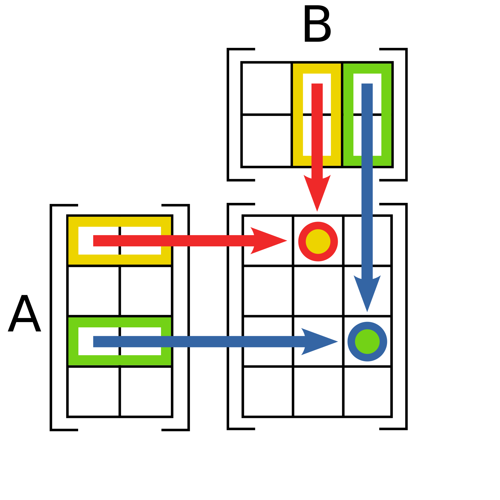
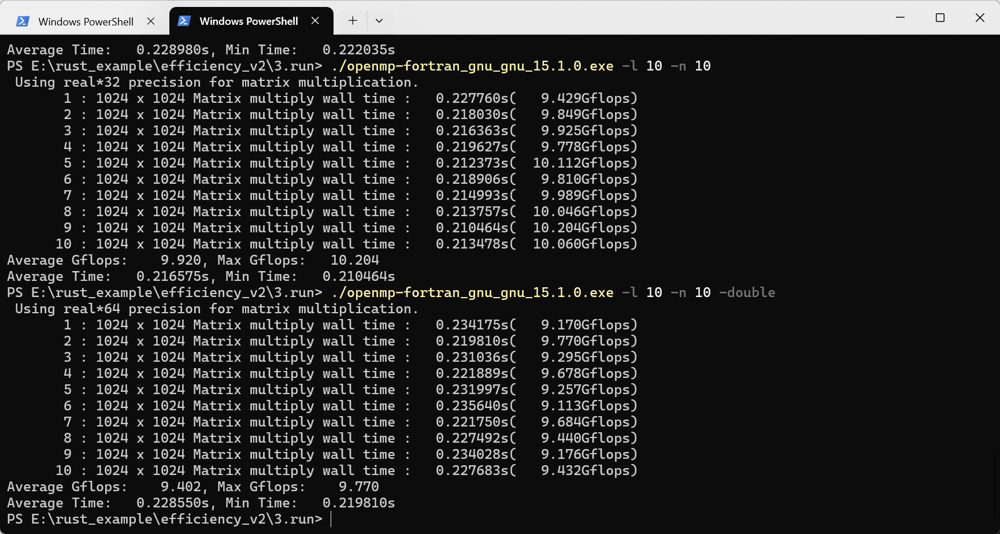

+++
author = "Andrew Moa"
title = "矩阵乘法运算(一)-使用OpenMP加速循环计算"
date = "2025-06-23"
description = ""
tags = [
    "c++",
    "fortran",
    "rust",

]
categories = [
    "code",
]
series = [""]
aliases = [""]
image = "/images/code-bg.jpg"
+++

说到矩阵，只要是理工科都会想到被线性代数课支配的恐惧。矩阵乘法运算，往大了说各种工业和科研数值计算离不开它，往小了说各种跑分软件也会用到它，矩阵乘法运算的耗时也是评判计算机浮点运算性能的重要指标。本文的目的是通过矩阵乘法运算验证各种实现方式的性能差异，并对比不同计算平台的性能差异，为高性能计算开发提供参考。

## 1. 矩阵乘法算法

矩阵乘法运算也成为矩阵点乘，可以用下图表示[^1]，通常由A矩阵对应行和B矩阵对应列的元素相乘并累加，形成C矩阵对应行列的值。要求A矩阵的列数要与B矩阵的行数相等，C矩阵的尺寸则相当于B矩阵的行数×A矩阵的列数。


用C语言表示一个M×N矩阵点乘一个N×T矩阵，一般写成3层循环嵌套的形式。
```C
...
	for (int i = 0; i < M; i++)
	{
		for (int j = 0; j < T; j++)
		{
			C[i,j] = 0.0;
			for (int k = 0; k < N; k++)
			{
				C[i,j] += A[i,k] * B[k,j];
			}
		}
	}
...
```

通常认为一个N×N维矩阵的乘法次数为N的3次方，用O(n<sup>3</sup>)表示计算复杂度。也有一些算法，将其中某些乘法运算转化成加法，减少了乘法运算次数。比如Strassen算法[^2]，理论上计算复杂度只有O(n<sup>2.807</sup>)，降低了大矩阵相乘的耗时。更新的算法比如Coppersmith-Winograd方法，计算复杂度更是号称只有O(n<sup>2.3727</sup>)。这种算法上的差异不在本文讨论之列。

## 2. 循环嵌套并行化

现代计算机处理器一般都为多核心，为充分利用处理器性能，使用openmp等并行库对计算程序进行并行优化不失为一个好的选项。使用单核心进行循环嵌套求解没有实际意义，这里不做演示，有兴趣的可以在下面的代码中单独去掉并行库后进行编译计算。

### 2.1 C实现

C实现很简单，通过三层循环嵌套实现矩阵相乘算法。这里通过openmp将前两层循环合并分配到不同线程中展开计算[^3]，以充分利用多核心处理器的性能。以下是`openmp.c`的示例代码。
```C
#include <omp.h>

void matrix_multiply_float(int n, float A[], float B[], float C[])
{
#pragma omp parallel for collapse(2) shared(A, B, C)
	for (int i = 0; i < n; i++)
	{
		for (int j = 0; j < n; j++)
		{
			C[i * n + j] = 0;
			for (int k = 0; k < n; k++)
			{
				C[i * n + j] += A[i * n + k] * B[k * n + j];
			}
		}
	}
}

void matrix_multiply_double(int n, double A[], double B[], double C[])
{
#pragma omp parallel for collapse(2) shared(A, B, C)
	for (int i = 0; i < n; i++)
	{
		for (int j = 0; j < n; j++)
		{
			C[i * n + j] = 0;
			for (int k = 0; k < n; k++)
			{
				C[i * n + j] += A[i * n + k] * B[k * n + j];
			}
		}
	}
}

```

在`main.c`中定义一些命令行开关，用户可以自定义矩阵尺寸、循环次数、计算精度等。这里定义了一个性能参数，GFLOPs，用来衡量单位时间内执行浮点运算的能力，1GFLOPs相当于1秒内执行10<sup>9</sup>次浮点运算。
```C
#include <stdio.h>
#include <stdlib.h>
#include <string.h>
#include <time.h>
#include <math.h>

#define MAX(a, b) ((a) > (b) ? (a) : (b))
#define MIN(a, b) ((a) < (b) ? (a) : (b))

extern void matrix_multiply_float(int n, float A[], float B[], float C[]);
extern void matrix_multiply_double(int n, double A[], double B[], double C[]);

// Initialize matrix
void initialize_matrix_float(int n, float matrix[])
{
	srand((unsigned)time(NULL));
	for (int i = 0; i < n; i++)
	{
		for (int j = 0; j < n; j++)
		{
			matrix[i * n + j] = rand() / (float)(RAND_MAX);
		}
	}
}

void initialize_matrix_double(int n, double matrix[])
{
	srand((unsigned)time(NULL));
	for (int i = 0; i < n; i++)
	{
		for (int j = 0; j < n; j++)
		{
			matrix[i * n + j] = rand() / (double)(RAND_MAX);
		}
	}
}

// Execute matrix multiply and print results
int execute_float(int dim, int loop_num, double *ave_gflops, double *max_gflops, double *ave_time, double *min_time)
{
	// Use volatile to prevent compiler optimizations
	volatile float *a, *b, *c;
	struct timespec start_ns, end_ns;
	double cpu_time;

	for (int i = 0; i < loop_num; i++)
	{ 
		a = (float *)malloc(dim * dim * sizeof(float));
		b = (float *)malloc(dim * dim * sizeof(float));
		c = (float *)malloc(dim * dim * sizeof(float));
		if (a == NULL || b == NULL || c == NULL)
		{
			fprintf(stderr, "Memory allocation failed\n");
			return 0;
		}

		initialize_matrix_float(dim, a);
		initialize_matrix_float(dim, b);

		timespec_get(&start_ns, TIME_UTC);
		matrix_multiply_float(dim, a, b, c);
		timespec_get(&end_ns, TIME_UTC);
		cpu_time = (end_ns.tv_sec - start_ns.tv_sec) + (end_ns.tv_nsec - start_ns.tv_nsec) / 1e9;
		double gflops = 1e-9 * dim * dim * dim * 2 / cpu_time;
		printf("%d\t: %d x %d Matrix multiply wall time : %.6fs(%.3fGflops)\n", i + 1, dim, dim, cpu_time, gflops);

		free(a);
		free(b);
		free(c);
		*ave_gflops += gflops;
		*max_gflops = MAX(*max_gflops, gflops);
		*ave_time += cpu_time;
		*min_time = MIN(*min_time, cpu_time);
	}
	*ave_gflops /= loop_num;
	*ave_time /= loop_num;
	return 1;
}

int execute_double(int dim, int loop_num, double *ave_gflops, double *max_gflops, double *ave_time, double *min_time)
{
	// Use volatile to prevent compiler optimizations
	volatile double *a, *b, *c;
	struct timespec start_ns, end_ns;
	double cpu_time;

	for (int i = 0; i < loop_num; i++)
	{ 
		a = (double *)malloc(dim * dim * sizeof(double));
		b = (double *)malloc(dim * dim * sizeof(double));
		c = (double *)malloc(dim * dim * sizeof(double));
		if (a == NULL || b == NULL || c == NULL)
		{
			fprintf(stderr, "Memory allocation failed\n");
			return 0;
		}

		initialize_matrix_double(dim, a);
		initialize_matrix_double(dim, b);

		timespec_get(&start_ns, TIME_UTC);
		matrix_multiply_double(dim, a, b, c);
		timespec_get(&end_ns, TIME_UTC);
		cpu_time = (end_ns.tv_sec - start_ns.tv_sec) + (end_ns.tv_nsec - start_ns.tv_nsec) / 1e9;
		double gflops = 1e-9 * dim * dim * dim * 2 / cpu_time;
		printf("%d\t: %d x %d Matrix multiply wall time : %.6fs(%.3fGflops)\n", i + 1, dim, dim, cpu_time, gflops);

		free(a);
		free(b);
		free(c);
		*ave_gflops += gflops;
		*max_gflops = MAX(*max_gflops, gflops);
		*ave_time += cpu_time;
		*min_time = MIN(*min_time, cpu_time);
	}
	*ave_gflops /= loop_num;
	*ave_time /= loop_num;
	return 1;
}

int main(int argc, char *argv[])
{
	int n = 10;								   // Default matrix size exponent
	int loop_num = 5;						   // Number of iterations for averaging
	double ave_gflops = 0.0, max_gflops = 0.0; // Average and maximum Gflops
	double ave_time = 0.0, min_time = 1e9;	   // Average and minimum time
	int use_double = 0;						   // Default to float precision

	// Help message
	if (argc == 1 || (argc == 2 && (strcmp(argv[1], "-h") == 0 || strcmp(argv[1], "--help") == 0)))
	{
		printf("Usage: %s [-n SIZE] [-l LOOP_NUM] [-float|-double]\n", argv[0]);
		printf("  -n SIZE      Specify matrix size, like 2^SIZE (default: 10)\n");
		printf("  -l LOOP_NUM  Specify number of iterations (default: 5)\n");
		printf("  -float       Use float precision (default)\n");
		printf("  -double      Use double precision\n");
		printf("  -h, --help   Show this help message\n");
		return 0;
	}

	// Parse -n, -l, -float, -double options
	int double_flag = 0, float_flag = 0;
	for (int argi = 1; argi < argc; ++argi)
	{
		if (strcmp(argv[argi], "-n") == 0 && argi + 1 < argc)
		{
			n = atoi(argv[argi + 1]);
			argi++;
		}
		else if (strcmp(argv[argi], "-l") == 0 && argi + 1 < argc)
		{
			loop_num = atoi(argv[argi + 1]);
			argi++;
		}
		else if (strcmp(argv[argi], "-double") == 0)
		{
			double_flag = 1;
		}
		else if (strcmp(argv[argi], "-float") == 0)
		{
			float_flag = 1;
		}
	}
	if (double_flag && float_flag)
	{
		fprintf(stderr, "Error: Cannot specify both -double and -float options.\n");
		return 1;
	}
	use_double = double_flag ? 1 : 0;

	int dim = (int)pow(2, n);

	if (use_double)
	{
		printf("Using double precision for matrix multiplication.\n");
		execute_double(dim, loop_num, &ave_gflops, &max_gflops, &ave_time, &min_time);
	}
	else
	{
		printf("Using float precision for matrix multiplication.\n");
		execute_float(dim, loop_num, &ave_gflops, &max_gflops, &ave_time, &min_time);
	}
	printf("Average Gflops: %.3f, Max Gflops: %.3f\n", ave_gflops, max_gflops);
	printf("Average Time: %.6fs, Min Time: %.6fs\n", ave_time, min_time);

	return 0;
}

```

这里用到了cmake，`CMakeLists.txt`告诉编译器怎么包含openmp的头文件并链接到它。
```cmake
cmake_minimum_required(VERSION 3.13)
project(openmp LANGUAGES C)
set(CMAKE_C_STANDARD 11)

set(EXECUTE_FILE_NAME ${PROJECT_NAME}_${CMAKE_C_COMPILER_FRONTEND_VARIANT}_${CMAKE_C_COMPILER_ID}_${CMAKE_C_COMPILER_VERSION})
string(TOLOWER ${EXECUTE_FILE_NAME} EXECUTE_FILE_NAME)

find_package(OpenMP REQUIRED)

set(SRC_LIST
    src/main.c
    src/openmp.c
)

add_executable(${EXECUTE_FILE_NAME} ${SRC_LIST})

target_link_libraries(${EXECUTE_FILE_NAME} PRIVATE
    OpenMP::OpenMP_C
)
```

Windows下使用vs2022的clang-cl编译出来的Release程序，执行效果如下：
```powershell
PS D:\example\efficiency_v3\c\openmp\build\Release> ."D:/example/efficiency_v3/c/openmp/build/Release/openmp_msvc_clang_19.1.5.exe" -l 10 -n 10
Using float precision for matrix multiplication.
1       : 1024 x 1024 Matrix multiply wall time : 0.362688s(5.921Gflops)
2       : 1024 x 1024 Matrix multiply wall time : 0.304758s(7.047Gflops)
3       : 1024 x 1024 Matrix multiply wall time : 0.314348s(6.832Gflops)
4       : 1024 x 1024 Matrix multiply wall time : 0.294248s(7.298Gflops)
5       : 1024 x 1024 Matrix multiply wall time : 0.294496s(7.292Gflops)
6       : 1024 x 1024 Matrix multiply wall time : 0.306986s(6.995Gflops)
7       : 1024 x 1024 Matrix multiply wall time : 0.320405s(6.702Gflops)
8       : 1024 x 1024 Matrix multiply wall time : 0.278521s(7.710Gflops)
9       : 1024 x 1024 Matrix multiply wall time : 0.294080s(7.302Gflops)
10      : 1024 x 1024 Matrix multiply wall time : 0.338626s(6.342Gflops)
Average Gflops: 6.944, Max Gflops: 7.710
Average Time: 0.310916s, Min Time: 0.278521s
PS D:\example\efficiency_v3\c\openmp\build\Release> ."D:/example/efficiency_v3/c/openmp/build/Release/openmp_msvc_clang_19.1.5.exe" -l 10 -n 10 -double
Using double precision for matrix multiplication.
1       : 1024 x 1024 Matrix multiply wall time : 0.353909s(6.068Gflops)
2       : 1024 x 1024 Matrix multiply wall time : 0.319001s(6.732Gflops)
3       : 1024 x 1024 Matrix multiply wall time : 0.329514s(6.517Gflops)
4       : 1024 x 1024 Matrix multiply wall time : 0.381114s(5.635Gflops)
5       : 1024 x 1024 Matrix multiply wall time : 0.349447s(6.145Gflops)
6       : 1024 x 1024 Matrix multiply wall time : 0.370087s(5.803Gflops)
7       : 1024 x 1024 Matrix multiply wall time : 0.349626s(6.142Gflops)
8       : 1024 x 1024 Matrix multiply wall time : 0.370023s(5.804Gflops)
9       : 1024 x 1024 Matrix multiply wall time : 0.364005s(5.900Gflops)
10      : 1024 x 1024 Matrix multiply wall time : 0.344441s(6.235Gflops)
Average Gflops: 6.098, Max Gflops: 6.732
Average Time: 0.353117s, Min Time: 0.319001s
```

使用MSYS2的clang64工具链编译，Release程序执行效果如下：
```powershell
PS D:\example\efficiency_v3\c\openmp\build> ."D:/example/efficiency_v3/c/openmp/build/openmp_gnu_clang_20.1.7.exe" -l 10 -n 10
Using float precision for matrix multiplication.
1       : 1024 x 1024 Matrix multiply wall time : 0.344437s(6.235Gflops)
2       : 1024 x 1024 Matrix multiply wall time : 0.327010s(6.567Gflops)
3       : 1024 x 1024 Matrix multiply wall time : 0.367141s(5.849Gflops)
4       : 1024 x 1024 Matrix multiply wall time : 0.358603s(5.988Gflops)
5       : 1024 x 1024 Matrix multiply wall time : 0.362182s(5.929Gflops)
6       : 1024 x 1024 Matrix multiply wall time : 0.338947s(6.336Gflops)
7       : 1024 x 1024 Matrix multiply wall time : 0.334758s(6.415Gflops)
8       : 1024 x 1024 Matrix multiply wall time : 0.331219s(6.484Gflops)
9       : 1024 x 1024 Matrix multiply wall time : 0.343316s(6.255Gflops)
10      : 1024 x 1024 Matrix multiply wall time : 0.324451s(6.619Gflops)
Average Gflops: 6.268, Max Gflops: 6.619
Average Time: 0.343206s, Min Time: 0.324451s
PS D:\example\efficiency_v3\c\openmp\build> ."D:/example/efficiency_v3/c/openmp/build/openmp_gnu_clang_20.1.7.exe" -l 10 -n 10 -double
Using double precision for matrix multiplication.
1       : 1024 x 1024 Matrix multiply wall time : 0.447118s(4.803Gflops)
2       : 1024 x 1024 Matrix multiply wall time : 0.423630s(5.069Gflops)
3       : 1024 x 1024 Matrix multiply wall time : 0.365229s(5.880Gflops)
4       : 1024 x 1024 Matrix multiply wall time : 0.355163s(6.046Gflops)
5       : 1024 x 1024 Matrix multiply wall time : 0.443296s(4.844Gflops)
6       : 1024 x 1024 Matrix multiply wall time : 0.310319s(6.920Gflops)
7       : 1024 x 1024 Matrix multiply wall time : 0.366405s(5.861Gflops)
8       : 1024 x 1024 Matrix multiply wall time : 0.369704s(5.809Gflops)
9       : 1024 x 1024 Matrix multiply wall time : 0.382898s(5.608Gflops)
10      : 1024 x 1024 Matrix multiply wall time : 0.367266s(5.847Gflops)
Average Gflops: 5.669, Max Gflops: 6.920
Average Time: 0.383103s, Min Time: 0.310319s
```

切换成MSYS2的ucrt64工具链编译，Release程序执行效果如下：
```powershell
PS D:\example\efficiency_v3\c\openmp\build> ."D:/example/efficiency_v3/c/openmp/build/openmp_gnu_gnu_15.1.0.exe" -l 10 -n 10        
Using float precision for matrix multiplication.
1       : 1024 x 1024 Matrix multiply wall time : 0.308967s(6.951Gflops)
2       : 1024 x 1024 Matrix multiply wall time : 0.267709s(8.022Gflops)
3       : 1024 x 1024 Matrix multiply wall time : 0.278587s(7.708Gflops)
4       : 1024 x 1024 Matrix multiply wall time : 0.263047s(8.164Gflops)
5       : 1024 x 1024 Matrix multiply wall time : 0.262595s(8.178Gflops)
6       : 1024 x 1024 Matrix multiply wall time : 0.264196s(8.128Gflops)
7       : 1024 x 1024 Matrix multiply wall time : 0.273148s(7.862Gflops)
8       : 1024 x 1024 Matrix multiply wall time : 0.262910s(8.168Gflops)
9       : 1024 x 1024 Matrix multiply wall time : 0.277290s(7.745Gflops)
10      : 1024 x 1024 Matrix multiply wall time : 0.274961s(7.810Gflops)
Average Gflops: 7.874, Max Gflops: 8.178
Average Time: 0.273341s, Min Time: 0.262595s
PS D:\example\efficiency_v3\c\openmp\build> ."D:/example/efficiency_v3/c/openmp/build/openmp_gnu_gnu_15.1.0.exe" -l 10 -n 10 -double
Using double precision for matrix multiplication.
1       : 1024 x 1024 Matrix multiply wall time : 0.314685s(6.824Gflops)
2       : 1024 x 1024 Matrix multiply wall time : 0.290665s(7.388Gflops)
3       : 1024 x 1024 Matrix multiply wall time : 0.304162s(7.060Gflops)
4       : 1024 x 1024 Matrix multiply wall time : 0.315041s(6.817Gflops)
5       : 1024 x 1024 Matrix multiply wall time : 0.306290s(7.011Gflops)
6       : 1024 x 1024 Matrix multiply wall time : 0.356495s(6.024Gflops)
7       : 1024 x 1024 Matrix multiply wall time : 0.310081s(6.926Gflops)
8       : 1024 x 1024 Matrix multiply wall time : 0.301022s(7.134Gflops)
9       : 1024 x 1024 Matrix multiply wall time : 0.317229s(6.769Gflops)
10      : 1024 x 1024 Matrix multiply wall time : 0.307106s(6.993Gflops)
Average Gflops: 6.895, Max Gflops: 7.388
Average Time: 0.312278s, Min Time: 0.290665s
```

Windows下gcc编译器的表现要好一点，三者运算性能基本都在同一量级，差异比较小可以忽略不记。

以上均是在AMD AI 9 365w处理器计算的结果，计算过程中基本跑满了所有核心和超线程。本文展示的计算结果，如果没有特殊说明，都是在该处理器上运行输出的结果。

### 2.2 fortran实现

fortran有内置的矩阵运算函数matmul，这里先不考虑内置函数的算法优化。将C实现的3层循环嵌套用Fortran实现，再通过openmp加速。

`main.f90`实现功能和C实现的`main.c`一致。
```fortran
program main
    implicit none
    external matrix_multiply_float, matrix_multiply_double
    integer :: n = 10         
    integer :: loop_num = 5   
    real :: ave_gflops = 0.0, max_gflops = 0.0 
    real :: ave_time = 0.0, min_time = 1e9    
    logical :: use_double = .false.  

    integer :: argi, i, dim
    character(len=100) :: arg

    logical :: double_set = .false., float_set = .false.  

    if (command_argument_count() == 0) then
        call print_help()
        stop
    end if

    argi = 1
    do while (argi <= command_argument_count())
        call get_command_argument(argi, arg)
        if (trim(arg) == '-n' .and. argi + 1 <= command_argument_count()) then
            argi = argi + 1
            call get_command_argument(argi, arg)
            read(arg, *) n
        else if (trim(arg) == '-l' .and. argi + 1 <= command_argument_count()) then
            argi = argi + 1
            call get_command_argument(argi, arg)
            read(arg, *) loop_num
        else if (trim(arg) == '-double') then
            double_set = .true.
            use_double = .true.
        else if (trim(arg) == '-float') then
            float_set = .true.
            use_double = .false.
        else if (trim(arg) == '-h' .or. trim(arg) == '--help') then
            call print_help()
            stop
        end if

        if (double_set .and. float_set) then
            print *, "Error: Cannot specify both -double and -float options."
            stop
        end if

        argi = argi + 1
    end do

    dim = 2**n

    if (use_double) then
        call perform_double(dim, loop_num, ave_gflops, max_gflops, ave_time, min_time)
    else
        call perform_float(dim, loop_num, ave_gflops, max_gflops, ave_time, min_time)
    end if

    ave_gflops = ave_gflops / loop_num
    ave_time = ave_time / loop_num
    print '(A, F8.3, A, F8.3)', 'Average Gflops: ', ave_gflops, ', Max Gflops: ', max_gflops
    print '(A, F10.6, A, F10.6, A)', 'Average Time: ', ave_time, 's, Min Time: ', min_time, 's'

contains

    subroutine print_help()
        print *, 'Usage: program_name [-n SIZE] [-l LOOP_NUM] [-float|-double]'
        print *, '  -n SIZE      Specify matrix size, like 2^SIZE (default: 10)'
        print *, '  -l LOOP_NUM  Specify number of iterations (default: 5)'
        print *, '  -float       Use real*32 precision (default)'
        print *, '  -double      Use real*64 precision'
        print *, '  -h, --help   Show this help message'
    end subroutine print_help

    subroutine initialize_matrix_float(n, matrix)
        integer, intent(in) :: n
        real, intent(out) :: matrix(n, n)  
        integer :: i, j
        real :: rand

        call random_seed()
        do i = 1, n
            do j = 1, n
                call random_number(rand)  
                matrix(i, j) = rand
            end do
        end do
    end subroutine initialize_matrix_float

    subroutine initialize_matrix_double(n, matrix)
        integer, intent(in) :: n
        real*8, intent(out) :: matrix(n, n)  
        integer :: i, j
        real*8 :: rand

        call random_seed()
        do i = 1, n
            do j = 1, n
                call random_number(rand)  
                matrix(i, j) = rand
            end do
        end do
    end subroutine initialize_matrix_double

    subroutine perform_double(dim, loop_num, ave_gflops, max_gflops, ave_time, min_time)
        integer, intent(in) :: dim, loop_num
        real, intent(inout) :: ave_gflops, max_gflops, ave_time
        real, intent(inout) :: min_time
        real*8, allocatable :: a_double(:, :), b_double(:, :), c_double(:, :) 
        real :: gflops
        integer*8 :: i, start_count(1), end_count(1), count_rate(1)
        real :: elapsed_time

        print *, 'Using real*64 precision for matrix multiplication.'
        allocate(a_double(dim, dim), b_double(dim, dim), c_double(dim, dim)) 
        do i = 1, loop_num
            call initialize_matrix_double(dim, a_double)
            call initialize_matrix_double(dim, b_double)

            call system_clock(count=start_count(1), count_rate=count_rate(1))
            call matrix_multiply_double(dim, a_double, b_double, c_double)
            call system_clock(count=end_count(1))

            elapsed_time = real(end_count(1) - start_count(1)) / real(count_rate(1))
            gflops = 1e-9 * dim * dim * dim * 2 / elapsed_time
            print '(I8, A, I0, A, I0, A, F10.6, A, F8.3, A)', i, ' : ', dim, ' x ', dim, ' Matrix multiply wall time : ', elapsed_time, 's(', gflops, 'Gflops)'

            ave_gflops = ave_gflops + gflops
            max_gflops = max(max_gflops, gflops)
            ave_time = ave_time + elapsed_time
            min_time = min(min_time, elapsed_time)
        end do
        deallocate(a_double, b_double, c_double)
    end subroutine perform_double

    subroutine perform_float(dim, loop_num, ave_gflops, max_gflops, ave_time, min_time)
        integer, intent(in) :: dim, loop_num
        real, intent(inout) :: ave_gflops, max_gflops, ave_time
        real, intent(inout) :: min_time
        real*4, allocatable :: a_float(:, :), b_float(:, :), c_float(:, :)  
        real :: gflops
        integer*8 :: i, start_count(1), end_count(1), count_rate(1)
        real :: elapsed_time

        print *, 'Using real*32 precision for matrix multiplication.'
        allocate(a_float(dim, dim), b_float(dim, dim), c_float(dim, dim))  
        do i = 1, loop_num
            call initialize_matrix_float(dim, a_float)
            call initialize_matrix_float(dim, b_float)

            call system_clock(count=start_count(1), count_rate=count_rate(1))
            call matrix_multiply_float(dim, a_float, b_float, c_float)
            call system_clock(count=end_count(1))

            elapsed_time = real(end_count(1) - start_count(1)) / real(count_rate(1))
            gflops = 1e-9 * dim * dim * dim * 2 / elapsed_time
            print '(I8, A, I0, A, I0, A, F10.6, A, F8.3, A)', i, ' : ', dim, ' x ', dim, ' Matrix multiply wall time : ', elapsed_time, 's(', gflops, 'Gflops)'

            ave_gflops = ave_gflops + gflops
            max_gflops = max(max_gflops, gflops)
            ave_time = ave_time + elapsed_time
            min_time = min(min_time, elapsed_time)
        end do
        deallocate(a_float, b_float, c_float)
    end subroutine perform_float

end program main

```

`omp.f90`是3层循环算法的具体实现，同样用openmp展开前两层循环实现并行化。
```fortran
subroutine matrix_multiply_float(n, a, b, c)
   implicit none
   integer, intent(in) :: n
   real*4, intent(in) :: a(n, n), b(n, n)
   real*4, intent(out) :: c(n, n)
   integer :: i, j, k
   c = 0.0
   !$omp parallel do private(i, j, k) shared(a, b, c, n) collapse(2)
   do i = 1, n
      do j = 1, n
         do k = 1, n
            c(i, j) = c(i, j) + a(i, k) * b(k, j)
         end do
      end do
   end do
   !$omp end parallel do
end subroutine matrix_multiply_float

subroutine matrix_multiply_double(n, a, b, c)
   implicit none
   integer, intent(in) :: n
   real*8, intent(in) :: a(n, n), b(n, n)
   real*8, intent(out) :: c(n, n)
   integer :: i, j, k
   c = 0.0d0
   !$omp parallel do private(i, j, k) shared(a, b, c, n) collapse(2)
   do i = 1, n
      do j = 1, n
         do k = 1, n
            c(i, j) = c(i, j) + a(i, k) * b(k, j)
         end do
      end do
   end do
   !$omp end parallel do
end subroutine matrix_multiply_double
```

`CMakeLists.txt`文件如下：
```cmake
cmake_minimum_required(VERSION 3.13)
project(openmp-fortran LANGUAGES Fortran)
set(CMAKE_Fortran_STANDARD 2008)

set(EXECUTE_FILE_NAME ${PROJECT_NAME}_${CMAKE_Fortran_COMPILER_FRONTEND_VARIANT}_${CMAKE_Fortran_COMPILER_ID}_${CMAKE_Fortran_COMPILER_VERSION})
string(TOLOWER ${EXECUTE_FILE_NAME} EXECUTE_FILE_NAME)

# Enable OpenMP
find_package(OpenMP REQUIRED)

set(SRC_LIST
    src/main.f90
    src/omp.f90
)
add_executable(${EXECUTE_FILE_NAME} ${SRC_LIST})

target_link_libraries(${EXECUTE_FILE_NAME} PRIVATE
    OpenMP::OpenMP_Fortran
)
```

使用Intel oneAPI的ifx编译，Release程序执行效果如下：
```powershell
PS D:\example\efficiency_v3\fortran\openmp-fortran\build\Release> ."D:/example/efficiency_v3/fortran/openmp-fortran/build/Release/openmp-fortran_msvc_intelllvm_2025.1.1.exe" -l 10 -n 10
 Using real*32 precision for matrix multiplication.
       1 : 1024 x 1024 Matrix multiply wall time :   0.299000s(   7.182Gflops)
       2 : 1024 x 1024 Matrix multiply wall time :   0.284000s(   7.562Gflops)
       3 : 1024 x 1024 Matrix multiply wall time :   0.337000s(   6.372Gflops)
       4 : 1024 x 1024 Matrix multiply wall time :   0.310000s(   6.927Gflops)
       5 : 1024 x 1024 Matrix multiply wall time :   0.321000s(   6.690Gflops)
       6 : 1024 x 1024 Matrix multiply wall time :   0.358000s(   5.999Gflops)
       7 : 1024 x 1024 Matrix multiply wall time :   0.290000s(   7.405Gflops)
       8 : 1024 x 1024 Matrix multiply wall time :   0.312000s(   6.883Gflops)
       9 : 1024 x 1024 Matrix multiply wall time :   0.301000s(   7.134Gflops)
      10 : 1024 x 1024 Matrix multiply wall time :   0.290000s(   7.405Gflops)
Average Gflops:    6.956, Max Gflops:    7.562
Average Time:   0.310200s, Min Time:   0.284000s
PS D:\example\efficiency_v3\fortran\openmp-fortran\build\Release> ."D:/example/efficiency_v3/fortran/openmp-fortran/build/Release/openmp-fortran_msvc_intelllvm_2025.1.1.exe" -l 10 -n 10 -double
 Using real*64 precision for matrix multiplication.
       1 : 1024 x 1024 Matrix multiply wall time :   0.391000s(   5.492Gflops)
       2 : 1024 x 1024 Matrix multiply wall time :   0.362000s(   5.932Gflops)
       3 : 1024 x 1024 Matrix multiply wall time :   0.334000s(   6.430Gflops)
       4 : 1024 x 1024 Matrix multiply wall time :   0.393000s(   5.464Gflops)
       5 : 1024 x 1024 Matrix multiply wall time :   0.331000s(   6.488Gflops)
       6 : 1024 x 1024 Matrix multiply wall time :   0.357000s(   6.015Gflops)
       7 : 1024 x 1024 Matrix multiply wall time :   0.366000s(   5.867Gflops)
       8 : 1024 x 1024 Matrix multiply wall time :   0.345000s(   6.225Gflops)
       9 : 1024 x 1024 Matrix multiply wall time :   0.341000s(   6.298Gflops)
      10 : 1024 x 1024 Matrix multiply wall time :   0.359000s(   5.982Gflops)
Average Gflops:    6.019, Max Gflops:    6.488
Average Time:   0.357900s, Min Time:   0.331000s
```

使用MSYS2的ucrt64工具链编译，Release程序执行效果如下：
```powershell
PS D:\example\efficiency_v3\fortran\openmp-fortran\build> ."D:/example/efficiency_v3/fortran/openmp-fortran/build/openmp-fortran_gnu_gnu_15.1.0.exe" -l 10 -n 10        
 Using real*32 precision for matrix multiplication.
       1 : 1024 x 1024 Matrix multiply wall time :   0.224624s(   9.560Gflops)
       2 : 1024 x 1024 Matrix multiply wall time :   0.224959s(   9.546Gflops)
       3 : 1024 x 1024 Matrix multiply wall time :   0.228968s(   9.379Gflops)
       4 : 1024 x 1024 Matrix multiply wall time :   0.238853s(   8.991Gflops)
       5 : 1024 x 1024 Matrix multiply wall time :   0.216879s(   9.902Gflops)
       6 : 1024 x 1024 Matrix multiply wall time :   0.212407s(  10.110Gflops)
       7 : 1024 x 1024 Matrix multiply wall time :   0.233809s(   9.185Gflops)
       8 : 1024 x 1024 Matrix multiply wall time :   0.240426s(   8.932Gflops)
       9 : 1024 x 1024 Matrix multiply wall time :   0.241291s(   8.900Gflops)
      10 : 1024 x 1024 Matrix multiply wall time :   0.222414s(   9.655Gflops)
Average Gflops:    9.416, Max Gflops:   10.110
Average Time:   0.228463s, Min Time:   0.212407s
PS D:\example\efficiency_v3\fortran\openmp-fortran\build> ."D:/example/efficiency_v3/fortran/openmp-fortran/build/openmp-fortran_gnu_gnu_15.1.0.exe" -l 10 -n 10 -double
 Using real*64 precision for matrix multiplication.
       1 : 1024 x 1024 Matrix multiply wall time :   0.258885s(   8.295Gflops)
       2 : 1024 x 1024 Matrix multiply wall time :   0.299699s(   7.165Gflops)
       3 : 1024 x 1024 Matrix multiply wall time :   0.298025s(   7.206Gflops)
       4 : 1024 x 1024 Matrix multiply wall time :   0.291631s(   7.364Gflops)
       5 : 1024 x 1024 Matrix multiply wall time :   0.271050s(   7.923Gflops)
       6 : 1024 x 1024 Matrix multiply wall time :   0.330989s(   6.488Gflops)
       7 : 1024 x 1024 Matrix multiply wall time :   0.278846s(   7.701Gflops)
       8 : 1024 x 1024 Matrix multiply wall time :   0.281121s(   7.639Gflops)
       9 : 1024 x 1024 Matrix multiply wall time :   0.288999s(   7.431Gflops)
      10 : 1024 x 1024 Matrix multiply wall time :   0.318669s(   6.739Gflops)
Average Gflops:    7.395, Max Gflops:    8.295
Average Time:   0.291792s, Min Time:   0.258885s
```

在AMD处理器上运行的结果，Intel ifx版本比gcc版本要慢一些，多次尝试也是如此。

将生成的程序拷贝到Intel工作站(Xeon Gold 6226R)上运行，两者运行时间基本相同。很令人怀疑是不是Intel的编译器针对AMD平台做了某些负优化。



### 2.3 rust实现

rust下没有openmp原生实现，但有类似功能的并行库rayon，这里用rust+rayon实现3层循环嵌套算法。

`main.rs`实现和`main.c`相同的功能。
```rust
mod matmul;
use matmul::{matrix_multiply_double, matrix_multiply_float};

use clap::{Arg, ArgAction, Command};
use rand::prelude::*;
use std::time::Instant;

fn initialize_matrix_float(n: usize, matrix: &mut [f32]) {
    let mut rng = rand::rng();
    for i in 0..n * n {
        matrix[i] = rng.random::<f32>();
    }
}

fn initialize_matrix_double(n: usize, matrix: &mut [f64]) {
    let mut rng = rand::rng();
    for i in 0..n * n {
        matrix[i] = rng.random::<f64>();
    }
}

fn execute_float(dim: usize, loop_num: usize) -> (f64, f64, f64, f64) {
    let mut ave_gflops: f64 = 0.0;
    let mut max_gflops: f64 = 0.0;
    let mut ave_time: f64 = 0.0;
    let mut min_time = f64::MAX;

    for i in 0..loop_num {
        let mut a = vec![0.0; dim * dim];
        let mut b = vec![0.0; dim * dim];
        let mut c = vec![0.0; dim * dim];

        initialize_matrix_float(dim, &mut a);
        initialize_matrix_float(dim, &mut b);

        let start = Instant::now();
        matrix_multiply_float(dim, &a, &b, &mut c);
        let cpu_time = start.elapsed().as_secs_f64();

        let gflops = 2.0 * (dim * dim * dim) as f64 / cpu_time / 1e9;
        println!(
            "{}\t: {} x {} Matrix multiply wall time : {:.6}s({:.3}Gflops)",
            i + 1,
            dim,
            dim,
            cpu_time,
            gflops
        );

        ave_gflops += gflops;
        max_gflops = max_gflops.max(gflops);
        ave_time += cpu_time;
        min_time = min_time.min(cpu_time);
    }

    ave_gflops /= loop_num as f64;
    ave_time /= loop_num as f64;
    (ave_gflops, max_gflops, ave_time, min_time)
}

fn execute_double(dim: usize, loop_num: usize) -> (f64, f64, f64, f64) {
    let mut ave_gflops: f64 = 0.0;
    let mut max_gflops: f64 = 0.0;
    let mut ave_time: f64 = 0.0;
    let mut min_time = f64::MAX;

    for i in 0..loop_num {
        let mut a = vec![0.0; dim * dim];
        let mut b = vec![0.0; dim * dim];
        let mut c = vec![0.0; dim * dim];

        initialize_matrix_double(dim, &mut a);
        initialize_matrix_double(dim, &mut b);

        let start = Instant::now();
        matrix_multiply_double(dim, &a, &b, &mut c);
        let cpu_time = start.elapsed().as_secs_f64();

        let gflops = 2.0 * (dim * dim * dim) as f64 / cpu_time / 1e9;
        println!(
            "{}\t: {} x {} Matrix multiply wall time : {:.6}s({:.3}Gflops)",
            i + 1,
            dim,
            dim,
            cpu_time,
            gflops
        );

        ave_gflops += gflops;
        max_gflops = max_gflops.max(gflops);
        ave_time += cpu_time;
        min_time = min_time.min(cpu_time);
    }

    ave_gflops /= loop_num as f64;
    ave_time /= loop_num as f64;
    (ave_gflops, max_gflops, ave_time, min_time)
}

fn main() {
    let matches = Command::new("rayon-rs")
        .version("0.1.0")
        .author("AndrewMoa")
        .about("Matrix multiplication benchmark")
        .arg(
            Arg::new("size")
                .short('n')
                .long("size")
                .help("Matrix size exponent (size = 2^n)")
                .default_value("10"),
        )
        .arg(
            Arg::new("loops")
                .short('l')
                .long("loops")
                .help("Number of iterations")
                .default_value("5"),
        )
        .arg(
            Arg::new("f64")
                .short('d')
                .long("f64")
                .help("Use float64 precision")
                .action(ArgAction::SetTrue),
        )
        .arg(
            Arg::new("f32")
                .short('f')
                .long("f32")
                .help("Use float32 precision (default)")
                .action(ArgAction::SetTrue),
        )
        .get_matches();

    let n: usize = matches
        .get_one::<String>("size")
        .unwrap()
        .parse()
        .expect("Invalid size exponent");
    let loop_num: usize = matches
        .get_one::<String>("loops")
        .unwrap()
        .parse()
        .expect("Invalid loop count");
    let use_double = matches.get_flag("f64");
    let use_float = matches.get_flag("f32");

    if use_double && use_float {
        eprintln!("Error: Cannot specify both --f64 and --f32");
        std::process::exit(1);
    }

    let dim = 2usize.pow(n as u32);

    if use_double {
        println!("Using f64 precision for matrix multiplication.");
        let (ave_gflops, max_gflops, ave_time, min_time) = execute_double(dim, loop_num);
        println!(
            "Average Gflops: {:.3}, Max Gflops: {:.3}",
            ave_gflops, max_gflops
        );
        println!("Average Time: {:.6}s, Min Time: {:.6}s", ave_time, min_time);
    } else {
        println!("Using f32 precision for matrix multiplication.");
        let (ave_gflops, max_gflops, ave_time, min_time) = execute_float(dim, loop_num);
        println!(
            "Average Gflops: {:.3}, Max Gflops: {:.3}",
            ave_gflops, max_gflops
        );
        println!("Average Time: {:.6}s, Min Time: {:.6}s", ave_time, min_time);
    }
}
```

`matmul.rs`实现具体算法，这里用2层循环代替了3层循环，再通过rayon展开最外层循环实现并行化，实际效果和openmp是类似的。
```rust
use rayon::prelude::*;

pub fn matrix_multiply_float(n: usize, a: &[f32], b: &[f32], c: &mut [f32]) {
    c.par_iter_mut().enumerate().for_each(|(idx, c_ij)| {
        let i = idx / n;
        let j = idx % n;
        *c_ij = 0.0;
        for k in 0..n {
            *c_ij += a[i * n + k] * b[k * n + j];
        }
    });
}

pub fn matrix_multiply_double(n: usize, a: &[f64], b: &[f64], c: &mut [f64]) {
    c.par_iter_mut().enumerate().for_each(|(idx, c_ij)| {
        let i = idx / n;
        let j = idx % n;
        *c_ij = 0.0;
        for k in 0..n {
            *c_ij += a[i * n + k] * b[k * n + j];
        }
    });
}

```

`Cargo.toml`文件如下所示。
```toml
[package]
name = "rayon-rs"
version = "0.1.0"
edition = "2024"

[dependencies]
clap = { version = "4.5.40", features = ["derive"] }
rand = "0.9.1"
rayon = "1.10.0"

```

Windows下使用msvc工具链编译，Release程序效果如下：
```powershell
PS D:\example\efficiency_v3\rust\rayon-rs> cargo run --release -- -l 10 -n 10   
    Finished `release` profile [optimized] target(s) in 0.04s
     Running `target\release\rayon-rs.exe -l 10 -n 10`
Using f32 precision for matrix multiplication.
1       : 1024 x 1024 Matrix multiply wall time : 0.183645s(11.694Gflops)
2       : 1024 x 1024 Matrix multiply wall time : 0.189942s(11.306Gflops)
3       : 1024 x 1024 Matrix multiply wall time : 0.186613s(11.508Gflops)
4       : 1024 x 1024 Matrix multiply wall time : 0.190823s(11.254Gflops)
5       : 1024 x 1024 Matrix multiply wall time : 0.197830s(10.855Gflops)
6       : 1024 x 1024 Matrix multiply wall time : 0.194282s(11.053Gflops)
7       : 1024 x 1024 Matrix multiply wall time : 0.199380s(10.771Gflops)
8       : 1024 x 1024 Matrix multiply wall time : 0.198576s(10.814Gflops)
9       : 1024 x 1024 Matrix multiply wall time : 0.190201s(11.291Gflops)
10      : 1024 x 1024 Matrix multiply wall time : 0.195518s(10.984Gflops)
Average Gflops: 11.153, Max Gflops: 11.694
Average Time: 0.192681s, Min Time: 0.183645s
PS D:\example\efficiency_v3\rust\rayon-rs> cargo run --release -- -l 10 -n 10 -d
    Finished `release` profile [optimized] target(s) in 0.04s
     Running `target\release\rayon-rs.exe -l 10 -n 10 -d`
Using f64 precision for matrix multiplication.
1       : 1024 x 1024 Matrix multiply wall time : 0.188721s(11.379Gflops)
2       : 1024 x 1024 Matrix multiply wall time : 0.186753s(11.499Gflops)
3       : 1024 x 1024 Matrix multiply wall time : 0.206919s(10.378Gflops)
4       : 1024 x 1024 Matrix multiply wall time : 0.197388s(10.879Gflops)
5       : 1024 x 1024 Matrix multiply wall time : 0.196899s(10.907Gflops)
6       : 1024 x 1024 Matrix multiply wall time : 0.206537s(10.398Gflops)
7       : 1024 x 1024 Matrix multiply wall time : 0.200781s(10.696Gflops)
8       : 1024 x 1024 Matrix multiply wall time : 0.191448s(11.217Gflops)
9       : 1024 x 1024 Matrix multiply wall time : 0.192770s(11.140Gflops)
10      : 1024 x 1024 Matrix multiply wall time : 0.178019s(12.063Gflops)
Average Gflops: 11.056, Max Gflops: 12.063
Average Time: 0.194624s, Min Time: 0.178019s
```

## 3. 分块矩阵并行化

直接求解大矩阵时，为提高求解效率，可以将大矩阵分割为小块进行求解，这样可以提高缓存命中率，一定程度上可以提高计算性能。

### 3.1 分块矩阵C实现

在2.1实现的基础上更改`openmp.c`文件内容如下，其他文件内容保持不变。
```C
#include <omp.h>
#include <math.h>

// 分块大小，根据缓存大小调整
#define BLOCK_SIZE 8

void matrix_multiply_float(int n, float A[], float B[], float C[])
{
    #pragma omp parallel for collapse(2) shared(A, B, C)
    for (int i_block = 0; i_block < n; i_block += BLOCK_SIZE) {
        for (int j_block = 0; j_block < n; j_block += BLOCK_SIZE) {
            for (int k_block = 0; k_block < n; k_block += BLOCK_SIZE) {
                int i_end = fmin(i_block + BLOCK_SIZE, n);
                int j_end = fmin(j_block + BLOCK_SIZE, n);
                int k_end = fmin(k_block + BLOCK_SIZE, n);
                for (int i = i_block; i < i_end; i++) {
                    for (int j = j_block; j < j_end; j++) {
                        for (int k = k_block; k < k_end; k++) {
                            C[i * n + j] += A[i * n + k] * B[k * n + j];
                        }
                    }
                }
            }
        }
    }
}

void matrix_multiply_double(int n, double A[], double B[], double C[])
{
    #pragma omp parallel for collapse(2) shared(A, B, C)
    for (int i_block = 0; i_block < n; i_block += BLOCK_SIZE) {
        for (int j_block = 0; j_block < n; j_block += BLOCK_SIZE) {
            for (int k_block = 0; k_block < n; k_block += BLOCK_SIZE) {
                int i_end = fmin(i_block + BLOCK_SIZE, n);
                int j_end = fmin(j_block + BLOCK_SIZE, n);
                int k_end = fmin(k_block + BLOCK_SIZE, n);
                for (int i = i_block; i < i_end; i++) {
                    for (int j = j_block; j < j_end; j++) {
                        for (int k = k_block; k < k_end; k++) {
                            C[i * n + j] += A[i * n + k] * B[k * n + j];
                        }
                    }
                }
            }
        }
    }
}
```

Windows下使用MSYS2的ucrt64工具链编译，Release程序执行效果如下：
```powershell
PS D:\example\efficiency_v3\c\openmp\build> ."D:/example/efficiency_v3/c/openmp/build/openmp_gnu_gnu_15.1.0.exe" -l 10 -n 10
Using float precision for matrix multiplication.
1       : 1024 x 1024 Matrix multiply wall time : 0.058133s(36.941Gflops)
2       : 1024 x 1024 Matrix multiply wall time : 0.060944s(35.237Gflops)
3       : 1024 x 1024 Matrix multiply wall time : 0.060845s(35.294Gflops)
4       : 1024 x 1024 Matrix multiply wall time : 0.060216s(35.663Gflops)
5       : 1024 x 1024 Matrix multiply wall time : 0.061135s(35.127Gflops)
6       : 1024 x 1024 Matrix multiply wall time : 0.060427s(35.539Gflops)
7       : 1024 x 1024 Matrix multiply wall time : 0.059523s(36.078Gflops)
8       : 1024 x 1024 Matrix multiply wall time : 0.060110s(35.726Gflops)
9       : 1024 x 1024 Matrix multiply wall time : 0.062199s(34.526Gflops)
10      : 1024 x 1024 Matrix multiply wall time : 0.059708s(35.966Gflops)
Average Gflops: 35.610, Max Gflops: 36.941
Average Time: 0.060324s, Min Time: 0.058133s
PS D:\example\efficiency_v3\c\openmp\build> ."D:/example/efficiency_v3/c/openmp/build/openmp_gnu_gnu_15.1.0.exe" -l 10 -n 10 -double
Using double precision for matrix multiplication.
1       : 1024 x 1024 Matrix multiply wall time : 0.065988s(32.544Gflops)
2       : 1024 x 1024 Matrix multiply wall time : 0.056852s(37.773Gflops)
3       : 1024 x 1024 Matrix multiply wall time : 0.059504s(36.090Gflops)
4       : 1024 x 1024 Matrix multiply wall time : 0.053153s(40.402Gflops)
5       : 1024 x 1024 Matrix multiply wall time : 0.057459s(37.374Gflops)
6       : 1024 x 1024 Matrix multiply wall time : 0.053974s(39.787Gflops)
7       : 1024 x 1024 Matrix multiply wall time : 0.055030s(39.024Gflops)
8       : 1024 x 1024 Matrix multiply wall time : 0.053222s(40.349Gflops)
9       : 1024 x 1024 Matrix multiply wall time : 0.054025s(39.750Gflops)
10      : 1024 x 1024 Matrix multiply wall time : 0.053405s(40.211Gflops)
Average Gflops: 38.330, Max Gflops: 40.402
Average Time: 0.056261s, Min Time: 0.053153s
```
相比于循环嵌套算法，分块之后性能有了很大的提升。分块大小和硬件平台有关，直接影响缓存命中率，进而影响计算性能，需要通过大量测试才能确定分块大小在多少最为合适。

### 3.2 分块矩阵fortran实现

在2.2内容的基础上，仅仅变更`omp.f90`文件，增加分块矩阵算法。
```fortran
subroutine matrix_multiply_float(n, a, b, c)
   implicit none
   integer, intent(in) :: n
   real*4, intent(in) :: a(n, n), b(n, n)
   real*4, intent(out) :: c(n, n)
   integer :: i, j, k, bi, bj, bk, block_size
   real*4 :: temp

   ! 定义块大小，根据缓存情况调整
   block_size = 8

   c = 0.0
   !$omp parallel do private(bi, bj, bk, i, j, k, temp) shared(a, b, c, n, block_size)
   do bi = 1, n, block_size
      do bj = 1, n, block_size
         do bk = 1, n, block_size
            do i = bi, min(bi + block_size - 1, n)
               do j = bj, min(bj + block_size - 1, n)
                  temp = c(i, j)
                  do k = bk, min(bk + block_size - 1, n)
                     temp = temp + a(i, k) * b(k, j)
                  end do
                  c(i, j) = temp
               end do
            end do
         end do
      end do
   end do
   !$omp end parallel do
end subroutine matrix_multiply_float

subroutine matrix_multiply_double(n, a, b, c)
   implicit none
   integer, intent(in) :: n
   real*8, intent(in) :: a(n, n), b(n, n)
   real*8, intent(out) :: c(n, n)
   integer :: i, j, k, bi, bj, bk, block_size
   real*8 :: temp

   block_size = 8

   c = 0.0d0
   !$omp parallel do private(bi, bj, bk, i, j, k, temp) shared(a, b, c, n, block_size)
   do bi = 1, n, block_size
      do bj = 1, n, block_size
         do bk = 1, n, block_size
            do i = bi, min(bi + block_size - 1, n)
               do j = bj, min(bj + block_size - 1, n)
                  temp = c(i, j)
                  do k = bk, min(bk + block_size - 1, n)
                     temp = temp + a(i, k) * b(k, j)
                  end do
                  c(i, j) = temp
               end do
            end do
         end do
      end do
   end do
   !$omp end parallel do
end subroutine matrix_multiply_double
```

Windows下使用MSYS2的ucrt64工具链编译，Release程序执行效果如下：
```powershell
PS D:\example\efficiency_v3\fortran\openmp-fortran\build> ."D:/example/efficiency_v3/fortran/openmp-fortran/build/openmp-fortran_gnu_gnu_15.1.0.exe" -l 10 -n 10
 Using real*32 precision for matrix multiplication.
       1 : 1024 x 1024 Matrix multiply wall time :   0.091248s(  23.535Gflops)
       2 : 1024 x 1024 Matrix multiply wall time :   0.082953s(  25.888Gflops)
       3 : 1024 x 1024 Matrix multiply wall time :   0.080934s(  26.534Gflops)
       4 : 1024 x 1024 Matrix multiply wall time :   0.078231s(  27.451Gflops)
       5 : 1024 x 1024 Matrix multiply wall time :   0.076461s(  28.086Gflops)
       6 : 1024 x 1024 Matrix multiply wall time :   0.078698s(  27.288Gflops)
       7 : 1024 x 1024 Matrix multiply wall time :   0.077900s(  27.567Gflops)
       8 : 1024 x 1024 Matrix multiply wall time :   0.079131s(  27.138Gflops)
       9 : 1024 x 1024 Matrix multiply wall time :   0.083838s(  25.615Gflops)
      10 : 1024 x 1024 Matrix multiply wall time :   0.078336s(  27.414Gflops)
Average Gflops:   26.651, Max Gflops:   28.086
Average Time:   0.080773s, Min Time:   0.076461s
PS D:\example\efficiency_v3\fortran\openmp-fortran\build> ."D:/example/efficiency_v3/fortran/openmp-fortran/build/openmp-fortran_gnu_gnu_15.1.0.exe" -l 10 -n 10 -double
 Using real*64 precision for matrix multiplication.
       1 : 1024 x 1024 Matrix multiply wall time :   0.087275s(  24.606Gflops)
       2 : 1024 x 1024 Matrix multiply wall time :   0.080483s(  26.682Gflops)
       3 : 1024 x 1024 Matrix multiply wall time :   0.079304s(  27.079Gflops)
       4 : 1024 x 1024 Matrix multiply wall time :   0.080373s(  26.719Gflops)
       5 : 1024 x 1024 Matrix multiply wall time :   0.076651s(  28.016Gflops)
       6 : 1024 x 1024 Matrix multiply wall time :   0.080497s(  26.678Gflops)
       7 : 1024 x 1024 Matrix multiply wall time :   0.097153s(  22.104Gflops)
       8 : 1024 x 1024 Matrix multiply wall time :   0.085253s(  25.190Gflops)
       9 : 1024 x 1024 Matrix multiply wall time :   0.085751s(  25.043Gflops)
      10 : 1024 x 1024 Matrix multiply wall time :   0.098205s(  21.867Gflops)
Average Gflops:   25.399, Max Gflops:   28.016
Average Time:   0.085094s, Min Time:   0.076651s
```
性能提升取决于分块大小，可以通过调整分块大小慢慢试出最合适的参数。

### 3.3 分块矩阵rust实现

同样地，在2.3的基础上，这里仅仅改动`matmul.rs`文件。
```rust
use rayon::prelude::*;

// 定义分块大小
const BLOCK_SIZE: usize = 8;

pub fn matrix_multiply_float(n: usize, a: &[f32], b: &[f32], c: &mut [f32]) {
    c.par_chunks_mut(n).enumerate().for_each(|(i, c_row)| {
        for bj in (0..n).step_by(BLOCK_SIZE) {
            for bk in (0..n).step_by(BLOCK_SIZE) {
                for j in bj..(bj + BLOCK_SIZE).min(n) {
                    for k in bk..(bk + BLOCK_SIZE).min(n) {
                        c_row[j] += a[i * n + k] * b[k * n + j];
                    }
                }
            }
        }
    });
}

pub fn matrix_multiply_double(n: usize, a: &[f64], b: &[f64], c: &mut [f64]) {
    c.par_chunks_mut(n).enumerate().for_each(|(i, c_row)| {
        for bj in (0..n).step_by(BLOCK_SIZE) {
            for bk in (0..n).step_by(BLOCK_SIZE) {
                for j in bj..(bj + BLOCK_SIZE).min(n) {
                    for k in bk..(bk + BLOCK_SIZE).min(n) {
                        c_row[j] += a[i * n + k] * b[k * n + j];
                    }
                }
            }
        }
    });
}
```

Windows下使用msvc工具链编译，Release程序效果如下：
```powershell
PS D:\example\efficiency_v3\rust\rayon-rs> cargo run --release -- -l 10 -n 10   
    Finished `release` profile [optimized] target(s) in 0.03s
     Running `target\release\rayon-rs.exe -l 10 -n 10`
Using f32 precision for matrix multiplication.
1       : 1024 x 1024 Matrix multiply wall time : 0.113868s(18.859Gflops)
2       : 1024 x 1024 Matrix multiply wall time : 0.116698s(18.402Gflops)
3       : 1024 x 1024 Matrix multiply wall time : 0.125060s(17.172Gflops)
4       : 1024 x 1024 Matrix multiply wall time : 0.125669s(17.088Gflops)
5       : 1024 x 1024 Matrix multiply wall time : 0.116527s(18.429Gflops)
6       : 1024 x 1024 Matrix multiply wall time : 0.114784s(18.709Gflops)
7       : 1024 x 1024 Matrix multiply wall time : 0.117369s(18.297Gflops)
8       : 1024 x 1024 Matrix multiply wall time : 0.114227s(18.800Gflops)
9       : 1024 x 1024 Matrix multiply wall time : 0.118140s(18.177Gflops)
10      : 1024 x 1024 Matrix multiply wall time : 0.115756s(18.552Gflops)
Average Gflops: 18.249, Max Gflops: 18.859
Average Time: 0.117810s, Min Time: 0.113868s
PS D:\example\efficiency_v3\rust\rayon-rs> cargo run --release -- -l 10 -n 10 -d
    Finished `release` profile [optimized] target(s) in 0.03s
     Running `target\release\rayon-rs.exe -l 10 -n 10 -d`
Using f64 precision for matrix multiplication.
1       : 1024 x 1024 Matrix multiply wall time : 0.120614s(17.805Gflops)
2       : 1024 x 1024 Matrix multiply wall time : 0.128292s(16.739Gflops)
3       : 1024 x 1024 Matrix multiply wall time : 0.122600s(17.516Gflops)
4       : 1024 x 1024 Matrix multiply wall time : 0.118252s(18.160Gflops)
5       : 1024 x 1024 Matrix multiply wall time : 0.127342s(16.864Gflops)
6       : 1024 x 1024 Matrix multiply wall time : 0.121794s(17.632Gflops)
7       : 1024 x 1024 Matrix multiply wall time : 0.130288s(16.483Gflops)
8       : 1024 x 1024 Matrix multiply wall time : 0.137106s(15.663Gflops)
9       : 1024 x 1024 Matrix multiply wall time : 0.130548s(16.450Gflops)
10      : 1024 x 1024 Matrix multiply wall time : 0.138826s(15.469Gflops)
Average Gflops: 16.878, Max Gflops: 18.160
Average Time: 0.127566s, Min Time: 0.118252s
```
提升幅度相比C和fortran比较有限，需要时间调整分块大小试出最合适的参数。

## 4. 编译器黑魔法

前面讲了简单的循环实现算法，并且用了一些并行库实现计算加速。下面不使用并行库，改用fortran的matmul函数、以及rust的ndarray库和mathru库实现矩阵乘法运算，说明编译器优化的重要性。

### 4.1 fortran内置函数matmul

`main.f90`和2.2中的内容一致，具体实现的`matmul.f90`文件内容如下。
```fortran
subroutine matrix_multiply_float(n, a, b, c)
   implicit none
   integer :: n
   real*4, intent(in) :: a(n, n), b(n, n)
   real*4, intent(out) :: c(n, n)
   c = matmul(a, b)
end subroutine matrix_multiply_float

subroutine matrix_multiply_double(n, a, b, c)
   implicit none
   integer :: n
   real*8, intent(in) :: a(n, n), b(n, n)
   real*8, intent(out) :: c(n, n)
   c = matmul(a, b)
end subroutine matrix_multiply_double
```

`CMakeLists.txt`移除了openmp相关代码。
```cmake
cmake_minimum_required(VERSION 3.13)
project(matmul-fortran LANGUAGES Fortran)
set(CMAKE_Fortran_STANDARD 2008)

set(EXECUTE_FILE_NAME ${PROJECT_NAME}_${CMAKE_Fortran_COMPILER_FRONTEND_VARIANT}_${CMAKE_Fortran_COMPILER_ID}_${CMAKE_Fortran_COMPILER_VERSION})
string(TOLOWER ${EXECUTE_FILE_NAME} EXECUTE_FILE_NAME)

set(SRC_LIST
    src/main.f90
    src/matmul.f90
)
add_executable(${EXECUTE_FILE_NAME} ${SRC_LIST})

target_link_libraries(${EXECUTE_FILE_NAME} PRIVATE
)
```

Windows下使用MSYS2的ucrt64工具链编译，Release程序执行效果如下：
```powershell
PS D:\example\efficiency_v3\fortran\matmul-fortran\build> ."D:/example/efficiency_v3/fortran/matmul-fortran/build/matmul-fortran_gnu_gnu_15.1.0.exe" -l 10 -n 10        
 Using real*32 precision for matrix multiplication.
       1 : 1024 x 1024 Matrix multiply wall time :   0.049251s(  43.603Gflops)
       2 : 1024 x 1024 Matrix multiply wall time :   0.048811s(  43.996Gflops)
       3 : 1024 x 1024 Matrix multiply wall time :   0.048778s(  44.026Gflops)
       4 : 1024 x 1024 Matrix multiply wall time :   0.048698s(  44.098Gflops)
       5 : 1024 x 1024 Matrix multiply wall time :   0.046176s(  46.506Gflops)
       6 : 1024 x 1024 Matrix multiply wall time :   0.046269s(  46.413Gflops)
       7 : 1024 x 1024 Matrix multiply wall time :   0.046297s(  46.385Gflops)
       8 : 1024 x 1024 Matrix multiply wall time :   0.046634s(  46.049Gflops)
       9 : 1024 x 1024 Matrix multiply wall time :   0.046198s(  46.484Gflops)
      10 : 1024 x 1024 Matrix multiply wall time :   0.046255s(  46.428Gflops)
Average Gflops:   45.399, Max Gflops:   46.506
Average Time:   0.047337s, Min Time:   0.046176s
PS D:\example\efficiency_v3\fortran\matmul-fortran\build> ."D:/example/efficiency_v3/fortran/matmul-fortran/build/matmul-fortran_gnu_gnu_15.1.0.exe" -l 10 -n 10 -double
 Using real*64 precision for matrix multiplication.
       1 : 1024 x 1024 Matrix multiply wall time :   0.094482s(  22.729Gflops)
       2 : 1024 x 1024 Matrix multiply wall time :   0.093445s(  22.981Gflops)
       3 : 1024 x 1024 Matrix multiply wall time :   0.090847s(  23.638Gflops)
       4 : 1024 x 1024 Matrix multiply wall time :   0.089272s(  24.055Gflops)
       5 : 1024 x 1024 Matrix multiply wall time :   0.088472s(  24.273Gflops)
       6 : 1024 x 1024 Matrix multiply wall time :   0.088759s(  24.195Gflops)
       7 : 1024 x 1024 Matrix multiply wall time :   0.088489s(  24.268Gflops)
       8 : 1024 x 1024 Matrix multiply wall time :   0.088787s(  24.187Gflops)
       9 : 1024 x 1024 Matrix multiply wall time :   0.089572s(  23.975Gflops)
      10 : 1024 x 1024 Matrix multiply wall time :   0.088757s(  24.195Gflops)
Average Gflops:   23.850, Max Gflops:   24.273
Average Time:   0.090088s, Min Time:   0.088472s
```

没有用到超线程，但吊打前面的循环嵌套+openmp方法，这也许能解释为什么C火了几十年但仍旧取代不了fortran。

### 4.2 rust通过ndarray库实现

ndarray是rust用于处理数组的库，内置了矩阵转置函数。与2.3中实现的通过一维数组存储的矩阵不同，使用ndarray库需要将一维数组转换成二维。

`main.rs`文件同2.3中的一致，`matmul.rs`文件如下所示。
```rust
use ndarray::{Array2, ArrayView2};

pub fn matrix_multiply_float(n: usize, a: &[f32], b: &[f32], c: &mut [f32]) {
    let a = ArrayView2::from_shape((n, n), a).unwrap();
    let b = ArrayView2::from_shape((n, n), b).unwrap();
    let mut c_mat = Array2::<f32>::zeros((n, n));
    c_mat.assign(&a.dot(&b));
    c.copy_from_slice(c_mat.as_slice().unwrap());
}

pub fn matrix_multiply_double(n: usize, a: &[f64], b: &[f64], c: &mut [f64]) {
    let a = ArrayView2::from_shape((n, n), a).unwrap();
    let b = ArrayView2::from_shape((n, n), b).unwrap();
    let mut c_mat = Array2::<f64>::zeros((n, n));
    c_mat.assign(&a.dot(&b));
    c.copy_from_slice(c_mat.as_slice().unwrap());
}

```

`Cargo.toml`文件如下所示。
```toml
[package]
name = "ndarray-rs"
version = "0.1.0"
edition = "2024"

[dependencies]
clap = { version = "4.5.40", features = ["derive"] }
ndarray = "0.16.1"
rand = "0.9.1"

```

Windows下使用msvc工具链编译，Release程序效果如下：
```powershell
PS D:\example\efficiency_v3\rust\ndarray-rs> cargo run --release -- -l 10 -n 10
    Finished `release` profile [optimized] target(s) in 0.04s
     Running `target\release\ndarray-rs.exe -l 10 -n 10`
Using f32 precision for matrix multiplication.
1       : 1024 x 1024 Matrix multiply wall time : 0.019414s(110.617Gflops)
2       : 1024 x 1024 Matrix multiply wall time : 0.020280s(105.891Gflops)
3       : 1024 x 1024 Matrix multiply wall time : 0.019639s(109.346Gflops)
4       : 1024 x 1024 Matrix multiply wall time : 0.020076s(106.966Gflops)
5       : 1024 x 1024 Matrix multiply wall time : 0.019702s(109.000Gflops)
6       : 1024 x 1024 Matrix multiply wall time : 0.019438s(110.479Gflops)
7       : 1024 x 1024 Matrix multiply wall time : 0.019336s(111.061Gflops)
8       : 1024 x 1024 Matrix multiply wall time : 0.018605s(115.426Gflops)
9       : 1024 x 1024 Matrix multiply wall time : 0.018340s(117.096Gflops)
10      : 1024 x 1024 Matrix multiply wall time : 0.019040s(112.787Gflops)
Average Gflops: 110.867, Max Gflops: 117.096
Average Time: 0.019387s, Min Time: 0.018340s
PS D:\example\efficiency_v3\rust\ndarray-rs> cargo run --release -- -l 10 -n 10 -d
    Finished `release` profile [optimized] target(s) in 0.04s
     Running `target\release\ndarray-rs.exe -l 10 -n 10 -d`
Using f64 precision for matrix multiplication.
1       : 1024 x 1024 Matrix multiply wall time : 0.041449s(51.811Gflops)
2       : 1024 x 1024 Matrix multiply wall time : 0.039612s(54.213Gflops)
3       : 1024 x 1024 Matrix multiply wall time : 0.039634s(54.183Gflops)
4       : 1024 x 1024 Matrix multiply wall time : 0.040022s(53.657Gflops)
5       : 1024 x 1024 Matrix multiply wall time : 0.038563s(55.687Gflops)
6       : 1024 x 1024 Matrix multiply wall time : 0.037992s(56.524Gflops)
7       : 1024 x 1024 Matrix multiply wall time : 0.038128s(56.324Gflops)
8       : 1024 x 1024 Matrix multiply wall time : 0.038157s(56.280Gflops)
9       : 1024 x 1024 Matrix multiply wall time : 0.038750s(55.419Gflops)
10      : 1024 x 1024 Matrix multiply wall time : 0.038102s(56.361Gflops)
Average Gflops: 55.046, Max Gflops: 56.524
Average Time: 0.039041s, Min Time: 0.037992s
```

同样没有用到超线程，吊打前面的循环嵌套+rayon实现。如果不考虑一维数组和二维数组之间转换所带来的时间差，实际计算性能其实只会更高。

### 4.3 rust通过mathru库实现

mathru是另一个rust数学库，提供了很多常用的线性代数计算函数，底层算法可以选择采用intel mkl或者openblas实现。

同样地`main.rs`不表，只更改`matmul.rs`文件，如下所示。
```rust
use mathru::algebra::linear::matrix::General;

pub fn matrix_multiply_float(n: usize, a: &[f32], b: &[f32], c: &mut [f32]) {
    let a_mat = General::new(n, n, a.to_vec());
    let b_mat = General::new(n, n, b.to_vec());
    let c_mat = &a_mat * &b_mat;
    c.copy_from_slice(&c_mat.convert_to_vec());
}

pub fn matrix_multiply_double(n: usize, a: &[f64], b: &[f64], c: &mut [f64]) {
    let a_mat = General::new(n, n, a.to_vec());
    let b_mat = General::new(n, n, b.to_vec());
    let c_mat = a_mat * b_mat;
    c.copy_from_slice(&c_mat.convert_to_vec());
}

```

`Cargo.toml`文件如下所示，这里使用mathru的默认实现，没有使用intel mkl或者openblas。
```toml
[package]
name = "mathru-rs"
version = "0.1.0"
edition = "2024"

[dependencies]
clap = { version = "4.5.40", features = ["derive"] }
mathru = "0.15.5"
rand = "0.9.1"

```

Windows下使用msvc工具链编译，Release程序执行效果如下：
```powershell
PS D:\example\efficiency_v3\rust\mathru-rs> cargo run --release -- -l 10 -n 10
    Finished `release` profile [optimized] target(s) in 0.05s
     Running `target\release\mathru-rs.exe -l 10 -n 10`
Using f32 precision for matrix multiplication.
1       : 1024 x 1024 Matrix multiply wall time : 0.009277s(231.472Gflops)
2       : 1024 x 1024 Matrix multiply wall time : 0.007753s(277.002Gflops)
3       : 1024 x 1024 Matrix multiply wall time : 0.009030s(237.817Gflops)
4       : 1024 x 1024 Matrix multiply wall time : 0.007585s(283.111Gflops)
5       : 1024 x 1024 Matrix multiply wall time : 0.008559s(250.904Gflops)
6       : 1024 x 1024 Matrix multiply wall time : 0.009235s(232.530Gflops)
7       : 1024 x 1024 Matrix multiply wall time : 0.008425s(254.900Gflops)
8       : 1024 x 1024 Matrix multiply wall time : 0.007451s(288.214Gflops)
9       : 1024 x 1024 Matrix multiply wall time : 0.007609s(282.237Gflops)
10      : 1024 x 1024 Matrix multiply wall time : 0.008545s(251.318Gflops)
Average Gflops: 258.950, Max Gflops: 288.214
Average Time: 0.008347s, Min Time: 0.007451s
PS D:\example\efficiency_v3\rust\mathru-rs> cargo run --release -- -l 10 -n 10 -d
    Finished `release` profile [optimized] target(s) in 0.05s
     Running `target\release\mathru-rs.exe -l 10 -n 10 -d`
Using f64 precision for matrix multiplication.
1       : 1024 x 1024 Matrix multiply wall time : 0.016261s(132.063Gflops)
2       : 1024 x 1024 Matrix multiply wall time : 0.016281s(131.904Gflops)
3       : 1024 x 1024 Matrix multiply wall time : 0.015308s(140.282Gflops)
4       : 1024 x 1024 Matrix multiply wall time : 0.016065s(133.672Gflops)
5       : 1024 x 1024 Matrix multiply wall time : 0.016702s(128.578Gflops)
6       : 1024 x 1024 Matrix multiply wall time : 0.014126s(152.019Gflops)
7       : 1024 x 1024 Matrix multiply wall time : 0.017731s(121.116Gflops)
8       : 1024 x 1024 Matrix multiply wall time : 0.020181s(106.409Gflops)
9       : 1024 x 1024 Matrix multiply wall time : 0.015631s(137.388Gflops)
10      : 1024 x 1024 Matrix multiply wall time : 0.015181s(141.459Gflops)
Average Gflops: 132.489, Max Gflops: 152.019
Average Time: 0.016347s, Min Time: 0.014126s
```

没有用到多线程，比ndarray快了不少，看来底层是进行了某些优化的。同样地，如果不考虑一维和二维数组之间的转换，实际计算性能应该会更高。

## 5. 总结

使用openmp、rayon等并行库加速的的C、fortran和rust矩阵乘法程序在使用相同算法的前提下，根据不同平台、编译器的实现，矩阵乘法的性能会有所些许区别，但总体上都在同一数量级。这种简单循环并行加速的计算方法适合矩阵规模较小的场合，随着矩阵规模的增加，整体计算性能愈发呈现下降的趋势。

即使采用分块矩阵+并行库的方法提高缓存命中率，性能提升依旧有限。而且矩阵分块大小与计算平台缓存大小有关，需要大量测试才能调出合适的分块参数。

使用fortran的matmul和rust的数学库实现的矩阵乘法功能，即使没有采用并行加速，其矩阵乘法性能依旧领先于简单循环并行加速的实现。这恰恰说明了底层算法优化的重要性。

在高性能计算领域除了openmp并行加速方法之外，还有blas、cuda、mpi等，将在以后的文章进一步演示。

[^1]: [Matrix multiplication](https://en.wikipedia.org/wiki/Matrix_multiplication)

[^2]: [矩阵乘法的Strassen算法详解](https://www.cnblogs.com/hdk1993/p/4552534.html)

[^3]: [矩阵乘法并行化（使用OpenMP）](https://zhuanlan.zhihu.com/p/667189867)