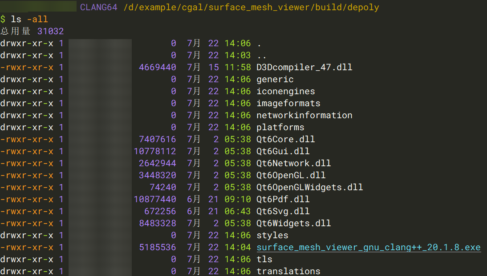
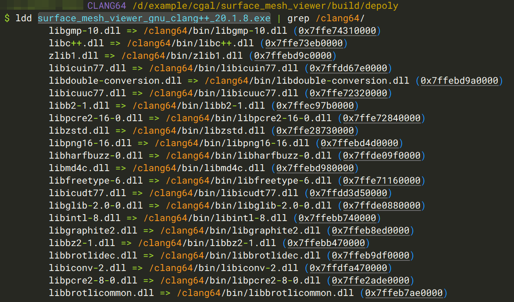
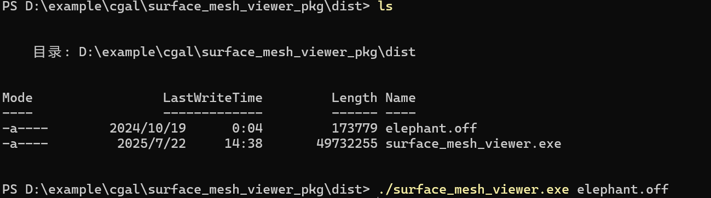
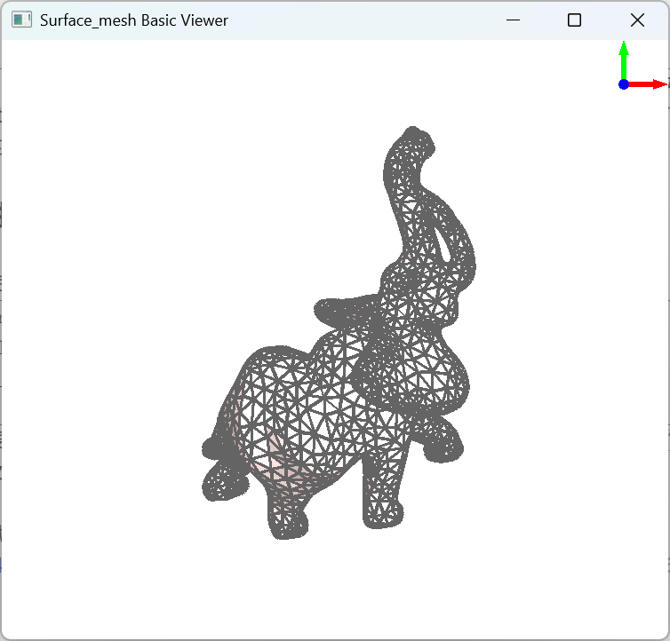

+++
author = "Andrew Moa"
title = "Use pyinstaller to package Windows executable files"
date = "2025-07-22"
description = ""
tags = [
    "python",
    "qt",

]
categories = [
    "code",
]
series = [""]
aliases = [""]
image = "/images/code-bg.jpg"
+++

The executable program compiled using the Qt dynamic link library will rely on a large number of dynamic link library files. If you want to publish the program written on your local computer to other people's computers, you need to package and publish the dependent dynamic link library files together with the executable program. There are many ways to package and publish, and the principle is the same. The executable program and the dependent files are packaged and compressed into a separate executable file through a compression program. When the user executes the executable file, it is automatically decompressed and run.

Common packaging solutions include WinRAR[^1], 7-Zip[^2], etc., which use the self-extraction module of the compression software to create a self-extraction program with a script, but these solutions have a common disadvantage, which is that they cannot pass command line parameters. This article provides a new idea to realize Qt program packaging through the pyinstaller packaging function, and realize command line parameter passing through python.

## 1. Sample Program

Write a CGAL program that calls qt to display the surface mesh. The following code refers to the CGAL documentation [^3] and has been adjusted. When the program starts, a dialog box is opened to receive file input, and the mesh file can also be passed in through the command line.
```c++
#include <CGAL/Simple_cartesian.h>
#include <CGAL/Surface_mesh.h>
#include <CGAL/draw_surface_mesh.h>
#include <fstream>
#include <QApplication>
#include <QFileDialog>

typedef CGAL::Simple_cartesian<double> Kernel;
typedef Kernel::Point_3 Point;
typedef CGAL::Surface_mesh<Point> Mesh;

int main(int argc, char *argv[])
{
  QApplication app(argc, argv);
  const std::string filename = (argc > 1) ? argv[1] : QFileDialog::getOpenFileName(nullptr, "Open a mesh file", "", "Supported formats (*.off *.stl *.obj *.ply);;OFF format (*.off);;STL format (*.stl);;OBJ format (*.obj);;PLY format (*.ply)").toStdString();
  if (filename.empty())
    return EXIT_FAILURE;

  Mesh sm;
  if (!CGAL::IO::read_polygon_mesh(filename, sm))
  {
    if (filename.substr(filename.find_last_of(".") + 1) == "stl")
      std::cerr << "Invalid STL file: " << filename << std::endl;
    else if (filename.substr(filename.find_last_of(".") + 1) == "obj")
      std::cerr << "Invalid OBJ file: " << filename << std::endl;
    else if (filename.substr(filename.find_last_of(".") + 1) == "ply")
      std::cerr << "Invalid PLY file: " << filename << std::endl;
    else if (filename.substr(filename.find_last_of(".") + 1) == "off")
      std::cerr << "Invalid OFF file: " << filename << std::endl;
    else
      std::cerr << "Invalid file: " << filename << "(Unknown file format.)" << std::endl;
    return EXIT_FAILURE;
  }

  // Internal color property maps are used if they exist and are called
  // "v:color", "e:color" and "f:color".
  auto vcm =
      sm.add_property_map<Mesh::Vertex_index, CGAL::IO::Color>("v:color").first;
  auto ecm =
      sm.add_property_map<Mesh::Edge_index, CGAL::IO::Color>("e:color").first;
  auto fcm = sm.add_property_map<Mesh::Face_index>(
                   "f:color", CGAL::IO::white() /*default*/)
                 .first;

  for (auto v : vertices(sm))
  {
    if (v.idx() % 2)
    {
      put(vcm, v, CGAL::IO::black());
    }
    else
    {
      put(vcm, v, CGAL::IO::blue());
    }
  }

  for (auto e : edges(sm))
  {
    put(ecm, e, CGAL::IO::gray());
  }

  put(fcm, *(sm.faces().begin()), CGAL::IO::red());

  // Draw!
  CGAL::draw(sm);

  return EXIT_SUCCESS;
}
```

The cmake configuration file `CMakeLists.txt` is written as follows. The output executable file name contains the folder name, tool chain name, compiler name and version, etc.
```cmake
cmake_minimum_required(VERSION 3.13)
get_filename_component(CURRENT_DIR ${CMAKE_CURRENT_LIST_FILE} DIRECTORY)
get_filename_component(FOLDER_NAME ${CURRENT_DIR} NAME)
message(STATUS "FOLDER_NAME: ${FOLDER_NAME}")
project(${FOLDER_NAME} LANGUAGES CXX)
message(STATUS "PROJECT_NAME: ${PROJECT_NAME}")
set(CMAKE_CXX_STANDARD 17)

get_filename_component(FILE_NAME ${CMAKE_CXX_COMPILER} NAME)
string(REGEX REPLACE ".exe" "" COMPILER_TMP "${FILE_NAME}")
string(REGEX REPLACE "-" "" COMPILER "${COMPILER_TMP}")
message(STATUS "COMPILER: ${COMPILER}")
set(EXECUTE_FILE_NAME ${PROJECT_NAME}_${CMAKE_CXX_COMPILER_FRONTEND_VARIANT}_${COMPILER}_${CMAKE_CXX_COMPILER_VERSION})
string(TOLOWER ${EXECUTE_FILE_NAME} EXECUTE_FILE_NAME)
message(STATUS "EXECUTE_FILE_NAME: ${EXECUTE_FILE_NAME}")

# CGAL_Qt6 is needed for the drawing.
find_package(CGAL REQUIRED OPTIONAL_COMPONENTS Qt6)
add_executable(${EXECUTE_FILE_NAME} draw_surface_mesh.cpp)

if(CGAL_Qt6_FOUND)
  # link it with the required CGAL libraries
  target_link_libraries(${EXECUTE_FILE_NAME} PUBLIC CGAL::CGAL_Basic_viewer)
endif()

# set installation directories
install(TARGETS ${EXECUTE_FILE_NAME}
  RUNTIME DESTINATION bin
  LIBRARY DESTINATION lib
  ARCHIVE DESTINATION lib
)

```

Under msys2 and vcpkg toolchains, static compilation using qt failed. Using msys2's clang64 toolchain with qt6 dynamic link library, the generated executable program name is `surface_mesh_viewer_gnu_clang++_20.1.8.exe` (the project folder name is `surface_mesh_viewer`).

## 2. Deploy Qt application

Open the clang64 command line terminal of msys2 and use the following command to deploy the Qt program.
```bash
# Into the build folder
cd `cygpath -u 'D:\example\cgal\surface_mesh_viewer\build'`
# Create depoly folder
mkdir depoly && cd depoly
cp ../surface_mesh_viewer_gnu_clang++_20.1.8.exe .
# Deploy Qt application
windeployqt6 surface_mesh_viewer_gnu_clang++_20.1.8.exe
```
vcpkg's `windeployqt6` is in the folder `[vcpkg-install-dir]\installed\x64-windows\tools\Qt6\bin`. If you use vcpkg to compile, you must first add this path to `PATH` and then execute the `windeployqt6` command.

After execution, you can see that the qt dynamic library dependency files are automatically generated in the folder.


Scanning with `ldd` found that some dependent dll files were not copied to the folder correctly.


Use the following command to copy the remaining dll files to the folder.
```bash
deplist=$( ldd surface_mesh_viewer_gnu_clang++_20.1.8.exe | awk '{if (match($3,"/")){ if (!match($3,"/c/")){ print $3}}}' )
cp -L -n $deplist .
```
The above command can only be used under the msys2 tool chain. If you use vcpkg, you can only copy and paste it manually.

Finally, enter the `depoly` folder and double-click the exe program to run normally, indicating that the qt program is deployed successfully. The following command packages the `depoly` folder into a tar.xz compressed package for backup (you can also use 7-Zip to create a tar.xz compressed file. You need to package the folder into tar first and then compress it into xz. The actual test shows that the compressed package generated by 7-Zip is smaller than that generated by the xz command line).
```bash
cd ..
tar cvJf depoly.tar.xz depoly
```

## 3. Python Scripts

Create a new project folder and copy the generated `depoly.tar.xz` to it. Create and write a startup script `launch.py` in the project folder to create a temporary folder, decompress the tar.xz compressed package, pass command line parameters and start the application.
```python
from pathlib import Path
import subprocess
import sys
import os
import tempfile
import tarfile

# Setup the names of the package, directory, and program
archive_file_name = "depoly.tar.xz"
sub_directory_name = "depoly"
run_file_name = "surface_mesh_viewer_gnu_clang++_20.1.8.exe"


# Function to extract the tar file
def extract_xz(file_path, output_path):
    with tarfile.open(file_path, mode="r:xz") as z:
        z.extractall(path=output_path)


def main():
    # Create a temporary directory
    with tempfile.TemporaryDirectory() as tmpdirname:
        # Get the current working directory path
        pwd = Path(tmpdirname)
        # Extract the tar.xz archive to the temporary directory
        extract_xz(
            str(Path.absolute(Path(__file__)).parent / archive_file_name),
            tmpdirname,
        )
        # Define the executable file path
        run = str(pwd / sub_directory_name / run_file_name)
        # Modify the environment variable
        env = os.environ.copy()
        env["PATH"] += ";" + str(pwd / sub_directory_name)
        # Add command-line parameters to the list
        for i in sys.argv[1:]:
            run += " " + i
        # Use subprocess.Popen creates a child process
        process = subprocess.Popen(run, env=env)
        # Wait for the process to complete
        process.wait()


if __name__ == "__main__":
    main()

```
In the script, `archive_file_name` corresponds to the name of the tar.xz compressed package output above, `sub_directory_name` corresponds to the folder name where the Qt program is packaged and deployed, and `run_file_name` is the name of the Qt program to be executed. These three variables can be adjusted according to your needs.

## 4. Release test

Next, run the following command to package the Python script and the tar file into a single executable file and publish it. Note that the `depoly.tar.xz` in the `--add-data=depoly.tar.xz:.` switch corresponds to the name of the compressed file above, and the `:.` at the end cannot be omitted.
```powershell
pyinstaller --onefile --windowed --add-data=depoly.tar.xz:. --name surface_mesh_viewer.exe launch.py
```
If you need to add an icon to the packaged program, you can add `--icon "app.ico"` to the command line above to pass the icon file, and `app.ico` corresponds to the icon file name.

Finally, test the packaged program. Passing parameters through the command line can be recognized and started normally.



## 5. Summarize

This method is suitable for publishing smaller applications such as tools. Each time you run it, you need to unzip it to a temporary folder, and then pass the command line parameters through the python script to start the program. After the program is finished running, the python script automatically cleans up the temporary folder.

If the packaged and published program is large, or needs to be started and run repeatedly, it is obviously not appropriate to unzip it directly to a temporary folder. In this case, it is recommended to re-plan the decompression path. It is best to make it in the form of an installation package. Unzip it to a fixed folder when starting for the first time, and start it directly from this folder to reduce the startup waiting time.

The sample code above has been tested on the Windows platform. As for other platforms such as Linux, I personally think it is not necessary. If you have similar needs, consider AppImage.

[^1]: [利用 WinRAR 自解压功能制作独立 exe 程序](https://www.jianshu.com/p/564058646398)

[^2]: [7z制作自解压安装包](https://www.cnblogs.com/sparkdev/p/5635612.html)

[^3]: [Minimal Example Using Qt6](https://doc.cgal.org/latest/Manual/devman_create_and_use_a_cmakelist.html)