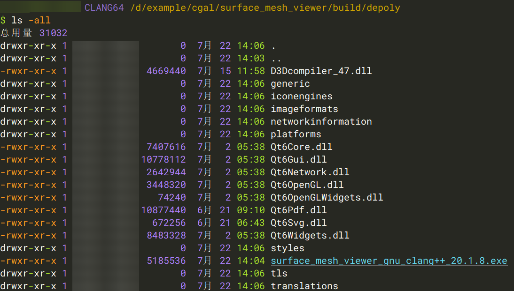
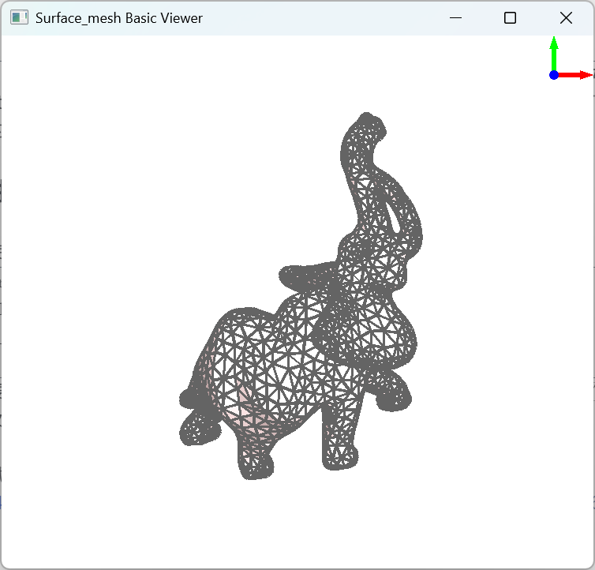

+++
author = "Andrew Moa"
title = "使用pyinstaller打包exe程序"
date = "2025-07-22"
description = ""
tags = [
    "python",
    "qt",

]
categories = [
    "code",
]
series = [""]
aliases = [""]
image = "/images/code-bg.jpg"
+++

使用qt动态链接库编译出来的可执行程序会依赖一大堆动态链接库文件，想要将本机上编写的程序发布到其他人的计算机上，就需要将依赖的动态链接库文件和可执行程序一起打包发布。打包发布的方法有很多，原理都是一样的，通过压缩程序将可执行程序和依赖文件一起打包压缩成单独的可执行文件，用户执行该可执行文件时自动解压并运行。

常见的打包方案有WinRAR[^1]、7-Zip[^2]等，通过压缩软件的自解压模块制作带脚本的自解压程序，但这些方案有一个共同的缺点，没办法传递命令行参数。本文提供新的思路，通过pyinstaller打包功能，实现qt程序打包，并且通过python实现命令行参数传递。

## 1. 示例程序

编写一个CGAL程序，调用qt显示面网格。下面的代码参考CGAL文档[^3]并做了一些调整，在程序启动时开启对话框接收文件输入，也可以通过命令行传入网格文件。
```c++
#include <CGAL/Simple_cartesian.h>
#include <CGAL/Surface_mesh.h>
#include <CGAL/draw_surface_mesh.h>
#include <fstream>
#include <QApplication>
#include <QFileDialog>

typedef CGAL::Simple_cartesian<double> Kernel;
typedef Kernel::Point_3 Point;
typedef CGAL::Surface_mesh<Point> Mesh;

int main(int argc, char *argv[])
{
  QApplication app(argc, argv);
  const std::string filename = (argc > 1) ? argv[1] : QFileDialog::getOpenFileName(nullptr, "Open a mesh file", "", "Supported formats (*.off *.stl *.obj *.ply);;OFF format (*.off);;STL format (*.stl);;OBJ format (*.obj);;PLY format (*.ply)").toStdString();
  if (filename.empty())
    return EXIT_FAILURE;

  Mesh sm;
  if (!CGAL::IO::read_polygon_mesh(filename, sm))
  {
    if (filename.substr(filename.find_last_of(".") + 1) == "stl")
      std::cerr << "Invalid STL file: " << filename << std::endl;
    else if (filename.substr(filename.find_last_of(".") + 1) == "obj")
      std::cerr << "Invalid OBJ file: " << filename << std::endl;
    else if (filename.substr(filename.find_last_of(".") + 1) == "ply")
      std::cerr << "Invalid PLY file: " << filename << std::endl;
    else if (filename.substr(filename.find_last_of(".") + 1) == "off")
      std::cerr << "Invalid OFF file: " << filename << std::endl;
    else
      std::cerr << "Invalid file: " << filename << "(Unknown file format.)" << std::endl;
    return EXIT_FAILURE;
  }

  // Internal color property maps are used if they exist and are called
  // "v:color", "e:color" and "f:color".
  auto vcm =
      sm.add_property_map<Mesh::Vertex_index, CGAL::IO::Color>("v:color").first;
  auto ecm =
      sm.add_property_map<Mesh::Edge_index, CGAL::IO::Color>("e:color").first;
  auto fcm = sm.add_property_map<Mesh::Face_index>(
                   "f:color", CGAL::IO::white() /*default*/)
                 .first;

  for (auto v : vertices(sm))
  {
    if (v.idx() % 2)
    {
      put(vcm, v, CGAL::IO::black());
    }
    else
    {
      put(vcm, v, CGAL::IO::blue());
    }
  }

  for (auto e : edges(sm))
  {
    put(ecm, e, CGAL::IO::gray());
  }

  put(fcm, *(sm.faces().begin()), CGAL::IO::red());

  // Draw!
  CGAL::draw(sm);

  return EXIT_SUCCESS;
}
```

cmake配置文件`CMakeLists.txt`编写如下，输出的可执行文件名称包含文件夹名、工具链名称、编译器命名和版本等。
```
cmake_minimum_required(VERSION 3.13)
get_filename_component(CURRENT_DIR ${CMAKE_CURRENT_LIST_FILE} DIRECTORY)
get_filename_component(FOLDER_NAME ${CURRENT_DIR} NAME)
message(STATUS "FOLDER_NAME: ${FOLDER_NAME}")
project(${FOLDER_NAME} LANGUAGES CXX)
message(STATUS "PROJECT_NAME: ${PROJECT_NAME}")
set(CMAKE_CXX_STANDARD 17)

get_filename_component(FILE_NAME ${CMAKE_CXX_COMPILER} NAME)
string(REGEX REPLACE ".exe" "" COMPILER_TMP "${FILE_NAME}")
string(REGEX REPLACE "-" "" COMPILER "${COMPILER_TMP}")
message(STATUS "COMPILER: ${COMPILER}")
set(EXECUTE_FILE_NAME ${PROJECT_NAME}_${CMAKE_CXX_COMPILER_FRONTEND_VARIANT}_${COMPILER}_${CMAKE_CXX_COMPILER_VERSION})
string(TOLOWER ${EXECUTE_FILE_NAME} EXECUTE_FILE_NAME)
message(STATUS "EXECUTE_FILE_NAME: ${EXECUTE_FILE_NAME}")

# CGAL_Qt6 is needed for the drawing.
find_package(CGAL REQUIRED OPTIONAL_COMPONENTS Qt6)
add_executable(${EXECUTE_FILE_NAME} draw_surface_mesh.cpp)

if(CGAL_Qt6_FOUND)
  # link it with the required CGAL libraries
  target_link_libraries(${EXECUTE_FILE_NAME} PUBLIC CGAL::CGAL_Basic_viewer)
endif()

# set installation directories
install(TARGETS ${EXECUTE_FILE_NAME}
  RUNTIME DESTINATION bin
  LIBRARY DESTINATION lib
  ARCHIVE DESTINATION lib
)

```

在msys2和vcpkg工具链下，使用qt静态编译均不成功。使用msys2的clang64工具链搭配qt6动态链接库，生成的可执行程序名称为`surface_mesh_viewer_gnu_clang++_20.1.8.exe`(项目文件夹名称为`surface_mesh_viewer`)。

## 2. 部署Qt程序

打开msys2的clang64命令行终端，使用以下命令部署qt程序。
```bash
# 进入项目的构建文件夹
cd `cygpath -u 'D:\example\cgal\surface_mesh_viewer\build'`
# 新建depoly文件夹
mkdir depoly && cd depoly
cp ../surface_mesh_viewer_gnu_clang++_20.1.8.exe .
# 部署qt程序
windeployqt6 surface_mesh_viewer_gnu_clang++_20.1.8.exe
```
vcpkg的`windeployqt6`在文件夹`[vcpkg-install-dir]\installed\x64-windows\tools\Qt6\bin`下，使用vcpkg编译的话要先将这个路径加入PATH，再执行`windeployqt6`命令。

执行完后可以看到文件夹下自动生成了qt的动态库依赖文件。


用`ldd`扫描，发现还有一些依赖的dll文件没有正确拷贝到文件夹中。


使用以下命令将剩下的dll文件拷贝到文件夹中。
```bash
deplist=$( ldd surface_mesh_viewer_gnu_clang++_20.1.8.exe | awk '{if (match($3,"/")){ if (!match($3,"/c/")){ print $3}}}' )
cp -L -n $deplist .
```
上面的命令只能在msys2工具链下使用，如果使用的是vcpkg那就只能自己手动复制粘贴了。

最后进入`depoly`文件夹，双击exe程序可以正常运行，表示qt程序部署成功。以下命令将`depoly`文件夹打包成tar.xz压缩包备用(也可以通过7-Zip创建tar.xz压缩文件，需要先将文件夹打包成tar再压缩成xz，实测7-Zip生成的压缩包体积比xz命令行生成的小)。
```bash
cd ..
tar cvJf depoly.tar.xz depoly
```

## 3. 编写python脚本

建立一个新项目文件夹，将上面生成的`depoly.tar.xz`拷贝到其中。在该项目文件夹中新建并编写启动脚本`launch.py`，用于创建临时文件夹、解压tar.xz压缩包、传递命令行参数和启动应用程序。
```python
from pathlib import Path
import subprocess
import sys
import os
import tempfile
import tarfile

# Setup the names of the package, directory, and program
archive_file_name = "depoly.tar.xz"
sub_directory_name = "depoly"
run_file_name = "surface_mesh_viewer_gnu_clang++_20.1.8.exe"


# Function to extract the tar file
def extract_xz(file_path, output_path):
    with tarfile.open(file_path, mode="r:xz") as z:
        z.extractall(path=output_path)


def main():
    # Create a temporary directory
    with tempfile.TemporaryDirectory() as tmpdirname:
        # Get the current working directory path
        pwd = Path(tmpdirname)
        # Extract the tar.xz archive to the temporary directory
        extract_xz(
            str(Path.absolute(Path(__file__)).parent / archive_file_name),
            tmpdirname,
        )
        # Define the executable file path
        run = str(pwd / sub_directory_name / run_file_name)
        # Modify the environment variable
        env = os.environ.copy()
        env["PATH"] += ";" + str(pwd / sub_directory_name)
        # Add command-line parameters to the list
        for i in sys.argv[1:]:
            run += " " + i
        # Use subprocess.Popen creates a child process
        process = subprocess.Popen(run, env=env)
        # Wait for the process to complete
        process.wait()


if __name__ == "__main__":
    main()

```
脚本中，`archive_file_name`对应前面输出的tar.xz压缩包的名称，`sub_directory_name`对应打包部署qt程序的文件夹名称，`run_file_name`是要执行的qt程序名称。这三个变量可以根据自己的需要调整。

## 4. 打包发布测试

接下来运行下面的命令，将python脚本和tar文件打包成单独的可执行文件并发布。注意`--add-data=depoly.tar.xz:.`开关中的`depoly.tar.xz`对应上面压缩包的名称，而且后面的`:.`不能省略。
```powershell
pyinstaller --onefile --windowed --add-data=depoly.tar.xz:. --name surface_mesh_viewer.exe launch.py
```
如果需要给打包发布的程序添加图标，可以在上面的命令行中附加`--icon "app.ico"`传递图标文件，`app.ico`对应图标文件名称。

最后测试下打包发布的程序。通过命令行传递参数，可以正常识别并启动。



## 5. 总结

这个方法适合发布工具类的较小的应用程序，每次运行都要解压到临时文件夹，再通过python脚本传递命令行参数启动程序，程序运行完后python脚本自动清理临时文件夹。

如果打包发布的程序体积较大，或者需要反复启动运行，直接解压到临时文件夹显然不合适。这种情况建议重新规划解压路径，最好是做成类似安装包的形式，第一次启动时解压到固定的文件夹，后续直接从该文件夹启动，减少启动等待时间。

上面的示例代码在Windows平台下通过测试，至于其他平台比如Linux，个人觉得没啥必要性。如果有类似的需求，还是考虑AppImage吧。

[^1]: [利用 WinRAR 自解压功能制作独立 exe 程序](https://www.jianshu.com/p/564058646398)

[^2]: [7z制作自解压安装包](https://www.cnblogs.com/sparkdev/p/5635612.html)

[^3]: [Minimal Example Using Qt6](https://doc.cgal.org/latest/Manual/devman_create_and_use_a_cmakelist.html)