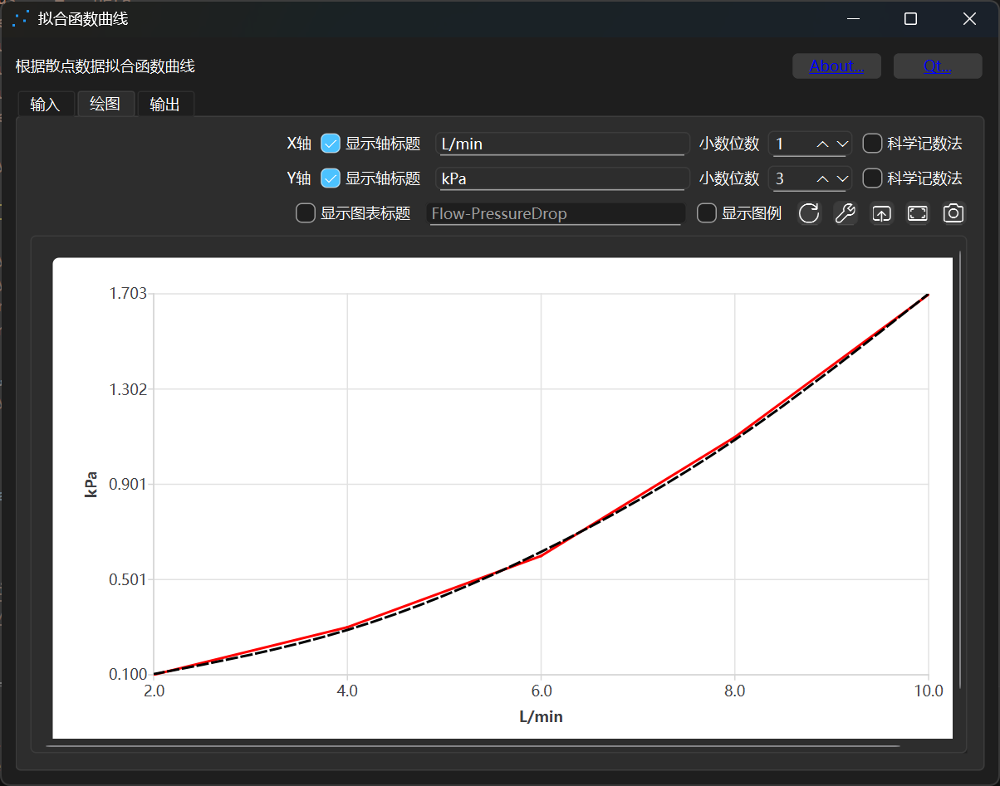
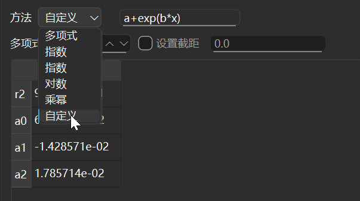
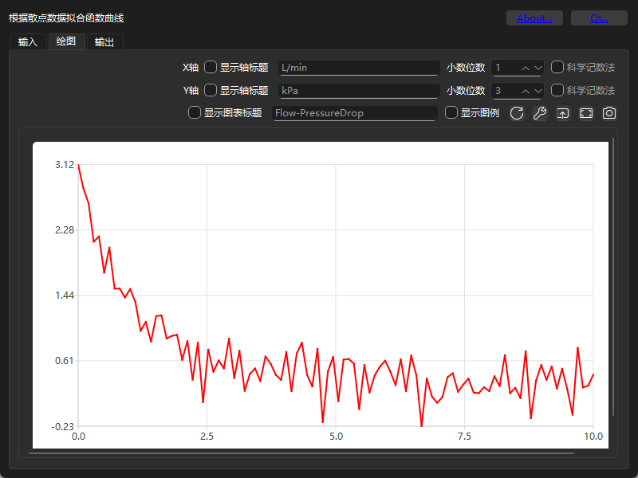
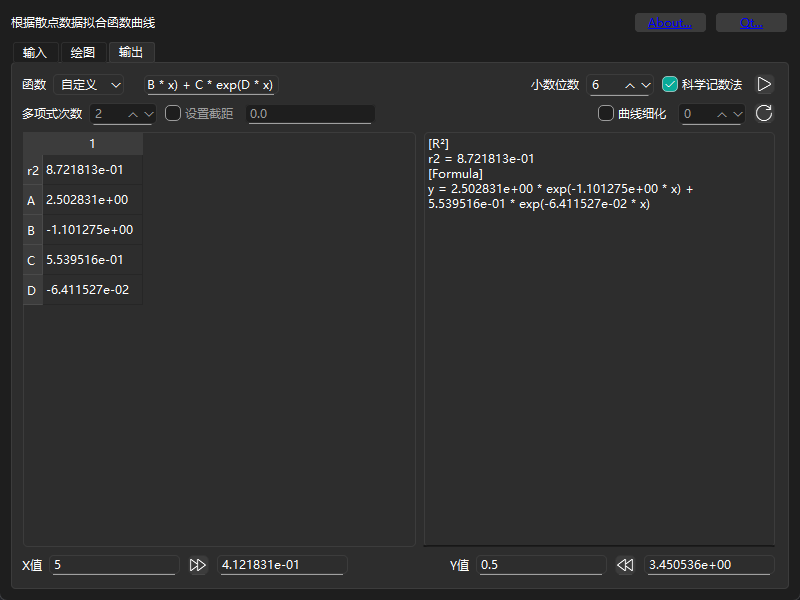
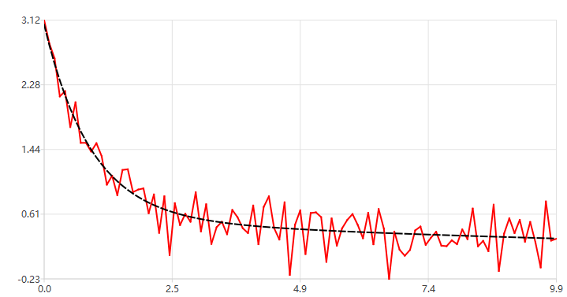

+++
author = "Andrew Moa"
title = "PyCFF - a Python-based curve fitting tool"
date = "2025-08-25"
description = ""
tags = [
    "python",
    "qt",

]
categories = [
    "tech",
]
series = [""]
aliases = [""]
image = "/images/code-bg.jpg"
+++

Lately, I've frequently encountered situations in my work where I need to fit function curves to scattered data. Typical examples include fitting porous media parameters using the pressure drop of a heat exchanger and fitting polynomial density to a fluid medium. While these tasks can be performed using Excel, Origin, and other tools, they are cumbersome and support limited function types. Here, I've developed a simple toolkit in Python that implements function fitting using numpy and scipy. The user interface is written in PySide, allowing for the entire process from input data to output fitting function parameters. The tool also supports data prediction and custom functions.

## 1. Introduction

Repository：[PyCFF](https://github.com/AndrewMoa2005/PyCFF/)

### 1.1 User Interface

Below is the software's startup interface. The software interface is implemented using PySide (Qt). It supports function drawing, allowing users to customize drawing content and save output images.


The image below shows the software's input interface. Input data is presented in a table format, and users select the independent variable (x) and dependent variable (y) to be fitted by specifying columns. Users can enter data manually in the table, paste data from spreadsheet software like Excel, and quickly enter large amounts of data using the **Paste Replace Columns** feature.


The image below shows the software's output interface. The software pre-defines some common functions. Clicking an operation displays the function parameters in the table on the left and the complete function expression in the text box. Users can customize the precision of the output parameters and whether to use scientific notation. The default setting is scientific notation with six decimal places, which meets the needs of most engineering calculations.


### 1.2 Custom Functions

The software includes predefined functions such as polynomials, exponentials, logarithms, and power functions. In addition to these predefined functions, the software also supports user-defined functions. Custom functions such as `a+b*x**1+c*x**2` and `-omega-alpha * exp(x)` automatically extract their parameters and fit them to the input data. Custom functions support not only the four arithmetic operations (+, -, *, /) and power operations (** or ^), but also common functions. See the table below for specific functions and their descriptions.



| Function | Usage | Description |
|---|---|---|
| exp | exp(a) | Calculates the exponential value of a |
| pow | pow(a, b) | Calculates a raised to the power of b |
| abs | abs(a) | Calculates the absolute value of a |
| sqrt | sqrt(a) | Calculates the square root of a |
| cbrt | cbrt(a) | Calculates the cube root of a |
| log | log(a) | Calculates the base e logarithm of a |
| log10 | log10(a) | Calculates the base 10 logarithm of a |
| log2 | log2(a) | Calculates the base 2 logarithm of a |
| min | min(a) | Calculates the minimum value of a |
| max | max(a) | Calculates the maximum value of a |
| sin | sin(a) | Calculates the sine of a |
| cos | cos(a) | Find the cosine of a |
| tan | tan(a) | Find the tangent of a |
| asin | asin(a) | Find the inverse sine of a |
| acos | acos(a) | Find the inverse cosine of a |
| atan | atan(a) | Find the inverse tangent of a |
| sinh | sinh(a) | Find the hyperbolic sine of a |
| cosh | cosh(a) | Find the hyperbolic cosine of a |
| tanh | tanh(a) | Find the hyperbolic tangent of a |
| asinh | asinh(a) | Find the inverse hyperbolic sine of a |
| acosh | acosh(a) | Find the inverse hyperbolic cosine of a |
| atanh | atanh(a) | Find the inverse hyperbolic tangent of a |
| pi | pi() | Pi |
| e | e() | base of natural logarithms |

## 2. Build

### 2.1 Build Environment

The source code provides a `build.py` script for quick and easy building. Users should create a virtual environment before building:
```bash
python -m venv myvenv # myvenv is the name of the virtual environment, which can be defined as needed
```

On Windows, use the following command to activate the virtual environment:
```powershell
./myvenv/Scripts/activate # in windows, it is recommended to run under posershell
```

On Linux, use the following command to activate the virtual environment:
```bash
source ./myvenv/bin/activate # in posix
```

After activating the virtual environment, the `(myvenv)` character will be displayed at the beginning of the command line, indicating that Python under the command line is running in the virtual environment `myvenv`. Install the dependencies using the following command:
```bash
pip install -r requirements.txt
```

After the build is complete, exit the virtual environment by deactivating it:
```bash
deactivate # The same command is used under windows and posix
```

### 2.2 Build Script

Run the following command to display help information for the build script:
```
python build.py -h
```


 - The `-h`/`--help` switch displays command-line help.
 - The `-c`/`--copy` switch copies the source code to a specified directory for debugging purposes.
 - The `-b`/`--build` switch runs `pyinstaller` to package the source code into an executable file. `dir` packages the source code into a directory (the default), and `one` packages the source code into a single executable file.
 - The `-u`/`--update` switch compiles `.ui` and `.qrc` files in the source code into `.py` files for debugging purposes.
 - The `-t`/`--translate` switch allows for multi-language translation. `up` updates `.ts` files in the source code, `gui` launches the `linguistgui` interface and opens `.ts` files, and `gen` compiles `.ts` files into `.qm` files. This switch is typically used for debugging purposes only.
 - The `-p`/`--pyd` switch compiles the `.py` file into `.pyd`/`.so`, then runs `pyinstaller` to package it into an executable file. `dir` packages the file into a directory (the default), and `one` packages the file into a single executable file.
 - The `-g`/`--genwhl` switch generates a whl distribution package.

In general, you can quickly build an executable program using the following command:
```bash
python build.py -p
```
The generated executable file/folder is located in the `[source_dir]/build/pycff/dist` directory.

You can quickly build the whl distribution package using the following command:
```bash
python build.py -g
```
The generated whl file is in the `[source_dir]/build/dist` path. You can install the release package through `pip install pycff-{version}-py3-none-{platform}.whl`. After the release package is installed, you can start the main program through `pycff` or `python -m pycff`.

## 3. Quick Start

### 3.1 Input

Perform data input operations in the `Input` tag.

 - The program initially displays a 2×5 table. You can resize the table using the top input bar and the "Insert" and "Delete" options on the right-click menu.
 - You can copy and paste Excel spreadsheets to access data, or load and save data by reading and writing files (currently only CSV files are supported).
 - You can define row and column headers to distinguish data.
 - You can use the "Paste Replace Column" option on the right-click menu to quickly load data from the clipboard into a specified column. The data is automatically split by non-numeric characters, making it easy to quickly read large amounts of data.
 - After entering data, select the columns corresponding to the independent variable (x) and dependent variable (y) using the checkboxes on the right, then click the "Refresh" button to load the table data.


### 3.2 Plot

Perform simple plotting operations in the Plot tab.

 - The initial plot displays the scatter plot data (red solid lines) and the fitted curve (black smooth dashed line) from the previous 5×2 table.
 - Click the Refresh button in this tab to draw the scatter plot using the input data.
 - You can customize the plot title, axis labels, and number format, as well as curve labels, colors, line types, and thickness.
 - You can save plots, currently supporting SVG and PNG formats.


### 3.3 Output

Perform function fitting in the "Output" tab.

 - Select the function type from the checkbox at the top left: a predefined function or a custom function.
 - Click the "Calculate" button at the top right. The calculated function parameters and R<sup>2</sup> value will be displayed in the table on the left, and the complete function expression will be displayed in the text box on the right.
 - You can customize the numeric format of the displayed parameters using the checkbox at the top right.
 - After calculating the function parameters, click the "Refresh" button to plot a scatter plot and function curve in the "Plot" tab. You can customize the level of detail of the function curve.
 - In the two sets of input boxes at the bottom, you can calculate the Y value of the function by entering an X value, or predict the X value given a Y value for data prediction.



## 4. Plan

Currently, the program implements basic functions such as table input and output, plotting, and function fitting. Future plans include the following features:

 - Formula calculation in tables
 - Reading and writing Excel files
 - Copying plotted data to the clipboard
 - Other user concerns...

For further comments and suggestions, please submit [Issues](https://github.com/AndrewMoa2005/PyCFF/issues).
