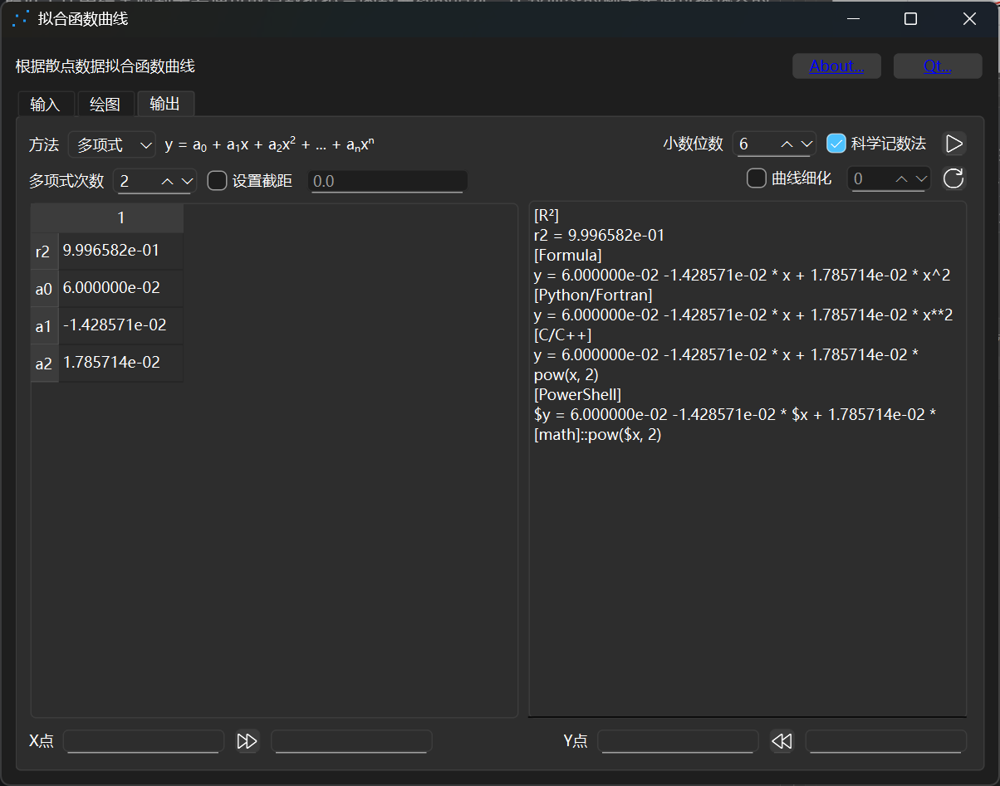

+++
author = "Andrew Moa"
title = "PyCFF——一款基于Python的曲线拟合工具"
date = "2025-08-25"
description = ""
tags = [
    "python",
    "qt",

]
categories = [
    "code",
]
series = [""]
aliases = [""]
image = "/images/code-bg.jpg"
+++

最近工作中经常遇到需要通过散点数据拟合函数曲线的情况，比较典型的例子是通过换热器的压降拟合多孔介质参数，以及拟合流体介质的多项式密度。虽然相关的工作可以通过Excel、Origin等实现，但是操作繁琐而且支持的函数类型有限。这里使用Python编写了一个简单的工具包，通过numpy和scipy实现函数拟合功能，用PySide编写了用户界面，实现了从输入数据到输出拟合函数参数的功能，并且支持数据预测和自定义函数功能。

## 1. 软件简介

源码地址：[PyCFF](https://github.com/AndrewMoa2005/PyCFF/)

### 1.1 用户界面

下面是软件的启动界面。软件界面通过PySide(Qt)实现。支持函数绘图功能，用户可以自定义绘图内容及输出保存图片。


下面是软件的输入界面。输入数据通过表格的方式展示，用户通过指定列来选择要拟合函数的自变量(x)和因变量(y)。用户不仅可以在表格中手动输入数据，也可以通过Excel等表格软件粘贴输入，还可以通过**粘贴替换列**的方式快速输入大量数据。


下面是软件的输出界面。软件预定义了一些常用函数，用户点击运算后在左侧表格中输出函数参数，并且在文本框中输出函数的完整表达式。用户可以自定义输出参数的精度和是否采用科学计数法，输出参数默认采用的是6位小数的科学计数法表示，满足大部分工程计算的需求。


### 1.2 自定义函数说明

软件的预定义函数包括多项式、指数函数、对数函数及幂函数等，除了以上预定义函数也支持用户自定义函数。类似`a+b*x**1+c*x**2`、`-omega-alpha * exp(x)`等自定义函数，会自动提取其中的参数并通过输入数据进行拟合。自定义函数除了四则运算(+、-、*、/)和幂运算(**或^)，还支持常用的函数运算，具体函数和相关说明见下表。


| 函数名 | 用法 | 说明 | 
|---|---|---|
| exp | exp(a) | 求a的指数值 |
| pow | pow(a, b) | 求a的b次幂 |
| abs | abs(a) | 求a的绝对值 |
| sqrt | sqrt(a) | 求a的平方根 |
| cbrt | cbrt(a) | 求a的立方根 |
| log | log(a) | 求a的对数(以e为底) |
| log10 | log10(a) | 求a的对数(以10为底) |
| log2 | log2(a) | 求a的对数(以2为底) |
| min | min(a) | 求a的最小值 |
| max | max(a) | 求a的最大值 |
| sin | sin(a) | 求a的正弦值 |
| cos | cos(a) | 求a的余弦值 |
| tan | tan(a) | 求a的正切值 |
| asin | asin(a) | 求a的反正弦 |
| acos | acos(a) | 求a的反余弦 |
| atan | atan(a) | 求a的反正切 |
| sinh | sinh(a) | 求a的双曲正弦值 |
| cosh | cosh(a) | 求a的双曲余弦值 |
| tanh | tanh(a) | 求a的双曲正切值 |
| asinh | asinh(a) | 求a的反双曲正弦 |
| acosh | acosh(a) | 求a的反双曲余弦 |
| atanh | atanh(a) | 求a的反双曲正切 |
| pi | pi() | 圆周率 |
| e | e() | 自然对数的底数 |

## 2. 构建说明

### 2.1 构建环境

源代码提供了`build.py`脚本方便快速构建，用户构建前应先建立虚拟环境：
```bash
python -m venv myvenv # myvenv 为虚拟环境名称，根据需要自己定义
```

Windows平台下通过以下命令激活虚拟环境：
```powershell
./myvenv/Scripts/activate # win环境下激活虚拟环境，建议在posershell中运行
```

Linux平台下通过以下命令激活虚拟环境：
```bash
source ./myvenv/bin/activate # posix环境下激活虚拟环境
```

激活虚拟环境之后会在命令行开头显示`(myvenv)`字符，表明此时命令行下的python运行在虚拟环境`myvenv`中。通过以下命令安装依赖：
```bash
pip install -r requirements.txt
```

构建完成后通过deactivate退出虚拟环境：
```bash
deactivate # win、posix都是同一个命令
```

### 2.2 构建脚本

运行以下命令显示构建脚本的帮助信息：
```
python build.py -h
```


 - 开关`-h`/`--help`显示命令行帮助信息
 - 开关`-c`/`--copy`将源文件复制到指定目录，用于调试
 - 开关`-b`/`--build`运行`pyinstaller`将源码打包成可执行文件，`dir`表示打包成目录(默认情况)，`one`表示打包成单独的可执行文件
 - 开关`-u`/`--update`将源文件中的`.ui`和`.qrc`编译成`.py`文件，用于调试
 - 开关`-t`/`--translate`用于多语言翻译，`up`表示更新源码中的`.ts`文件，`gui`表示启动`linguistgui`界面并打开`.ts`文件，`gen`表示将`.ts`文件编译成`.qm`文件，此开关一般单独用于调试
 - 开关`-p`/`--pyd`，先将`.py`文件编译成`.pyd`/`.so`，再运行`pyinstaller`打包成可执行文件，`dir`表示打包成目录(默认情况)，`one`表示打包成单独的可执行文件
 - 开关`-g`/`--genwhl`，生成whl发布包

一般情况下，使用以下命令即可快速构建可执行程序：
```bash
python build.py -p
```
生成的可执行文件/文件夹在`[source_dir]/build/pycff/dist`路径下。

使用以下命令即可快速构建whl发布包：
```bash
python build.py -g
```
生成的whl文件在`[source_dir]/build/dist`路径下，通过`pip install pycff-{version}-py3-none-{platform}.whl`安装该发布包。发布包安装后，可以通过`pycff`或者`python -m pycff`启动主程序。
